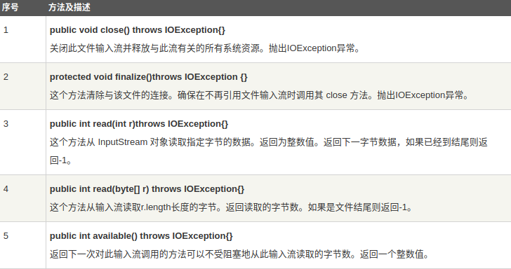
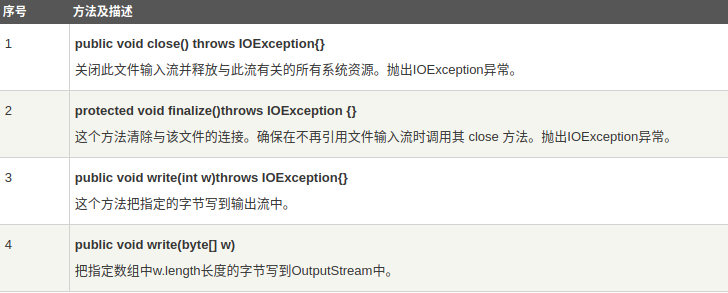
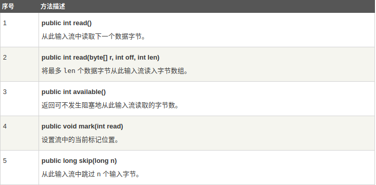
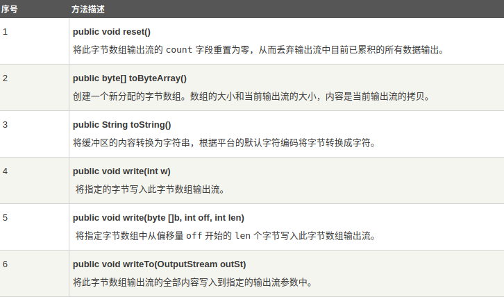
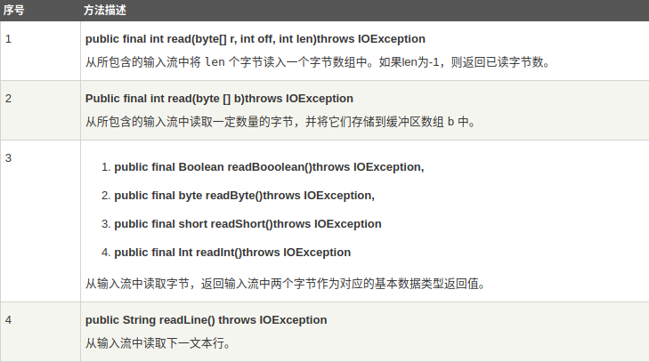
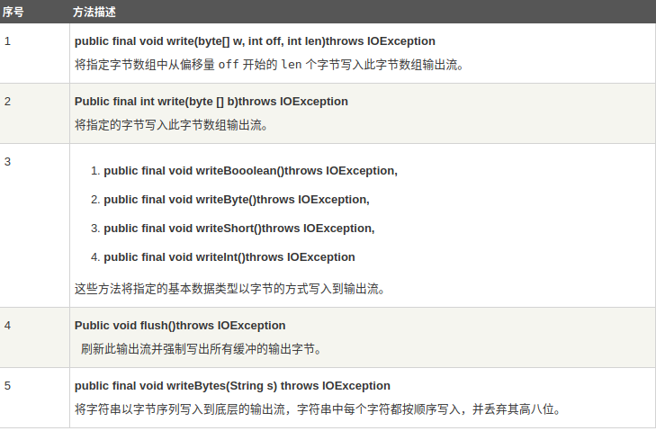
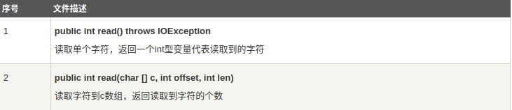
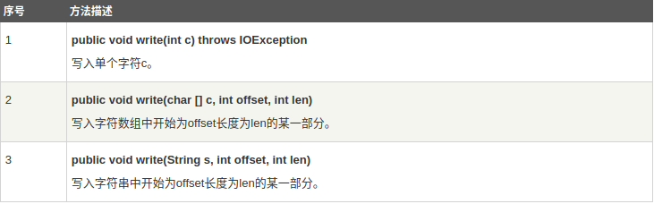

Java.io 包几乎包含了所有操作输入、输出需要的类。所有这些流类代表了输入源和输出目标。Java.io 包中的流支持很多种格式，比如：基本类型、对象、本地化字符集等等。一个流可以理解为一个数据的序列。输入流表示从一个源读取数据，输出流表示向一个目标写数据。Java 为 I/O 提供了强大的而灵活的支持，使其更广泛地应用到文件传输和网络编程中。本节讲述最基本的和流与 I/O 相关的功能。  
先上一个**Java IO流类层次图**，如前所述，一个流被定义为一个数据序列。输入流用于从源读取数据，输出流用于向目标写数据： 
  
是不是被吓到了？没关系，我们将通过一个个例子来学习这些功能。  
### 读取控制台输入  
在Java中，从控制台输入有三种方法：  
#### 1.使用标准输入流对象System.in  
System.in是System中内置的InputStream类对象，它的read方法一次只读入**一个字节**数据，返回0 ~ 255的一个int字节值,一般用来读取一个字符，需要强制类型转换为char类型，而我们通常要取得一个字符串或一组数字，故这种方法不常用。下面给出这种方法的一个例子：  
```java
public class CharTest{
public static void main(String[] args) {
		 try{   
		 System.out.print("Enter a Char:");   
		 char i = (char)System.in.read();   
		 System.out.println("Yout Enter Char is:" + i);  		  }   
		 catch(IOException e){   
		    e.printStackTrace();   
		 }   
	}
}
```
**使用这种方法必须提供try-catch块或者在main方法首部声明IOException异常**  
#### 2.使用Scanner类  
Scanner类功能十分强大，可以读入字符串、整数、浮点数、布尔类型值等等。下面是例子：  
```java
public class ScannerTest{
public static void main(String[] args){
    Scanner sc = new Scanner(System.in);   
    System.out.println("ScannerTest, Please Enter Name:");   
    String name = sc.nextLine();  //读取字符串型输入   
    System.out.println("ScannerTest, Please Enter Age:");   
    int age = sc.nextInt();    //读取整型输入   
    System.out.println("ScannerTest, Please Enter Salary:");   
    float salary = sc.nextFloat(); //读取float型输入   
    System.out.println("Your Information is as below:");   
    System.out.println("Name:" + name +"\n" + "Age:"+age 
    + "\n"+"Salary:"+salary);   
    }
 }   
```
**注意：**  
1.用nextXXX()读入XXX类型的数据，XXX可以是除了char外的所有基本数据类型，还可以是BigInteger或BigDecimal，其中凡是整型类型的数据还可以指定radix(进制)，可以用next()和nextLine()读取一个字符串或一行字符  
2.next()和nextLine()的区别：  
next()
* 一定要读取到有效字符后才可以结束输入。
* 对输入有效字符之前遇到的空白，next() 方法会自动将其去掉。
* 只有输入有效字符后才将其后面输入的空白作为分隔符或者结束符。
* next() 不能得到带有空格的字符串。  

nextLine()
* 以Enter为结束符,也就是说 nextLine()方法返回的是输入回车之前的所有字符。
* 可以获得空白。

3.可以用循环配合hasNextXXX方法判断输入是否继续  
4.Scanner类没有直接提供读取一个字符的方法，如果要读取一个字符，有三种方法，一是**读入一个字符串后取字符串的第一个字符**，二是使用**System.in的read方法**，三是使用**字符流**读入

#### 3.使用BufferedReader对象  
可以把 System.in 包装在一个 BufferedReader 对象中来创建一个**字符流**。
下面是创建 BufferedReader 的基本语法：  
```java
BufferedReader br = new BufferedReader(new 
                      InputStreamReader(System.in));
```
BufferedReader 对象创建后，我们便可以使用 read() 方法从控制台读取一个字符(读入一个用0~65535之间的整数表示的字符，需要强制类型转换为char类型，如果已到达流末尾，则返回 -1)，或者用 readLine() 方法读取一个字符串。下面是例子：  
```java
public static void main(String[] args){
//必须要处理java.io.IOException异常
  BufferedReader br = new BufferedReader(new InputStreamReader
  (System.in ));
  //java.io.InputStreamReader继承了Reader类
  String read = null;
  System.out.print("输入数据：");
  try {
   read = br.readLine();
  } catch (IOException e) {
   e.printStackTrace();
  }
  System.out.println("输入数据："+read);
 }
```
下面的程序示范了用 read() 方法从控制台不断读取字符直到用户输入 "q"。
```java
// 使用 BufferedReader 在控制台读取字符
 
import java.io.*;
 
public class BRRead {
  public static void main(String args[]) throws IOException
  {
    char c;
    // 使用 System.in 创建 BufferedReader 
    BufferedReader br = new BufferedReader(new 
                       InputStreamReader(System.in));
    System.out.println("输入字符, 按下 'q' 键退出。");
    // 读取字符
    do {
       c = (char) br.read();
       System.out.println(c);
    } while(c != 'q');
  }
}
```
下面的程序读取和显示字符行直到你输入了单词"end"。
```java
// 使用 BufferedReader 在控制台读取字符
import java.io.*;
public class BRReadLines {
  public static void main(String args[]) throws IOException
  {
    // 使用 System.in 创建 BufferedReader 
    BufferedReader br = new BufferedReader(new
                            InputStreamReader(System.in));
    String str;
    System.out.println("Enter lines of text.");
    System.out.println("Enter 'end' to quit.");
    do {
       str = br.readLine();
       System.out.println(str);
    } while(!str.equals("end"));
  }
}
```
**在ACM等算法竞赛中，我们常常也会使用Java，在输入数据时有以下几点注意：**  
1.hasXXX等价于C++中读到文件末尾(EOF)  
2.使用BufferedReader输入会比Scanner输入快十倍左右!
### 控制台输出
控制台的输出由 print() 和 println() 完成。这些方法都由类 PrintStream 定义，System.out 是该类的一个对象。
PrintStream 继承了 OutputStream类，并且实现了方法 write()。这样，write() 也可以用来往控制台写操作。
PrintStream 定义 write() 的最简单格式如下所示：
`void write(int byteval)`该方法将 byteval 的低八位字节写到流中,即System.out的write方法一次只能写一个字节(类比System.in的read方法一次只能读取一个字节)。
下面的例子用 write() 把字符 "A" 和紧跟着的换行符输出到屏幕：  
```java
import java.io.*;
 
// 演示 System.out.write().
public class WriteDemo {
   public static void main(String args[]) {
      int b; 
      b = 'A';//向上类型转换
      System.out.write(b);
      System.out.write('\n');
   }
}
```
**注意：write() 方法不经常使用，因为 print() 和 println() 方法用起来更为方便。**
### 读写文件  
下面将要讨论的两个重要的流是 FileInputStream 和 FileOutputStream：
**FileInputStream**  
该流用于从文件读取数据，它的对象可以用关键字 new 来创建。  
有多种构造方法可用来创建对象。  
可以使用字符串类型的文件名来创建一个输入流对象来读取文件：  
```java
InputStream f = new FileInputStream("C:/java/hello");
```
也可以使用一个文件对象来创建一个输入流对象来读取文件。我们首先得使用 File() 方法来创建一个文件对象：  
```java
File f = new File("C:/java/hello");
InputStream out = new FileInputStream(f);
```
创建了InputStream对象，就可以使用下面的方法来读取流或者进行其他的流操作。

下面是一个例子：
```java
public static void main(String[] args) throws IOException{
	InputStream f  = new FileInputStream
	("/home/xiejunyu/桌面/test.txt");
	int c;
	while((c =  f.read()) != -1)
	System.out.println((char)c);
}
```
**注意:** 每调用一次read方法,当前读取在文件中的位置就会向后移动一个字节，已经到文件末尾会返回-1，可以通过read方法返回-1判断是否读到文件末尾，也可以使用available方法返回下一次可以不受阻塞读取的字节数来读取。**FileInputStream不支持mark和reset方法进行重复读取。**  

**FileOutputStream**  
该类用来创建一个文件并向文件中写数据。  
**如果该流在打开文件进行输出前，目标文件不存在，那么该流会创建该文件。**  
有两个构造方法可以用来创建 FileOutputStream 对象。  
使用字符串类型的文件名来创建一个输出流对象：  
```java
OutputStream f = new FileOutputStream("C:/java/hello")
```
也可以使用一个文件对象来创建一个输出流来写文件。我们首先得使用File()方法来创建一个文件对象：  
```java
File f = new File("C:/java/hello");
OutputStream f = new FileOutputStream(f);
```
创建OutputStream 对象完成后，就可以使用下面的方法来写入流或者进行其他的流操作。  

下面是一个演示 InputStream 和 OutputStream 用法的例子： 
```java
import java.io.*;
 
public class FileStreamTest{
  public static void main(String args[]){
    try{
      byte bWrite [] = {'A','B','C'};
      OutputStream os = new FileOutputStream("/home/xiejunyu/桌面/test.txt");
      for(int x=0; x < bWrite.length ; x++){
      os.write(bWrite[x] ); // writes the bytes
    }
    os.close();
 
    InputStream is = new FileInputStream("/home/xiejunyu/桌面/test.txt");
    int size = is.available();
 
    for(int i=0; i< size; i++){
      System.out.print((char)is.read() + "  ");
    }
      is.close();
    }catch(IOException e){
      System.out.print("Exception");
    }  
  }
}
```
上面的程序首先创建文件test.txt，并把给定的数字以二进制形式写进该文件，同时输出到控制台上。  
以上代码由于是二进制写入，可能存在乱码，你可以使用以下代码实例来解决乱码问题：
```java
import java.io.*;
 
public class fileStreamTest2{
  public static void main(String[] args) throws IOException {
    
    File f = new File("a.txt");
    FileOutputStream fop = new FileOutputStream(f);
    // 构建FileOutputStream对象,文件不存在会自动新建
    
    OutputStreamWriter writer = new OutputStreamWriter(fop, "UTF-8");
    // 构建OutputStreamWriter对象,参数可以指定编码,默认为操作系统默认编码,windows上是gbk
    
    writer.append("中文输入");
    // 写入到缓冲区
    
    writer.append("\r\n");
    //换行
    
    writer.append("English");
    // 刷新缓冲区,写入到文件,如果下面已经没有写入的内容了,直接close也会写入
    
    writer.close();
    //关闭写入流,同时会把缓冲区内容写入文件,所以上面的注释掉
    
    fop.close();
    // 关闭输出流,释放系统资源
 
    FileInputStream fip = new FileInputStream(f);
    // 构建FileInputStream对象
    
    InputStreamReader reader = new InputStreamReader(fip, "UTF-8");
    // 构建InputStreamReader对象,编码与写入相同
 
    StringBuffer sb = new StringBuffer();
    while (reader.ready()) {
      sb.append((char) reader.read());
      // 转成char加到StringBuffer对象中
    }
    System.out.println(sb.toString());
    reader.close();
    // 关闭读取流
    
    fip.close();
    // 关闭输入流,释放系统资源
 
  }
}
```
除了FileInputStream和FileOutputStream外，还有一些其他的输入输出流：  
**ByteArrayInputStream**  
字节数组输入流在内存中创建一个字节数组缓冲区，从输入流读取的数据保存在该字节数组缓冲区中。创建字节数组输入流对象有以下几种方式。  
接收字节数组作为参数创建：  
```java
ByteArrayInputStream bArray = 
new ByteArrayInputStream(byte [] a);
```
另一种创建方式是接收一个字节数组，和两个整型变量 off、len，off表示第一个读取的字节，len表示读取字节的长度,**即将字节数组中从off开始的len个字节读入该输入流**。
```java
ByteArrayInputStream bArray = new
ByteArrayInputStream(byte []a,int off,int len)
```
成功创建字节数组输入流对象后，可以参见以下列表中的方法，对流进行读操作或其他操作。  
  
**ByteArrayOutputStream** 
字节数组输出流在内存中创建一个字节数组缓冲区，所有发送到输出流的数据保存在该字节数组缓冲区中。创建字节数组输出流对象有以下几种方式。  
下面的构造方法创建一个32字节（默认大小）的缓冲区。
```java
OutputStream bOut = new ByteArrayOutputStream();
```
另一个构造方法创建一个大小为n字节的缓冲区。
```java
OutputStream bOut = new ByteArrayOutputStream(int a)
```
成功创建字节数组输出流对象后，可以参见以下列表中的方法，对流进行写操作或其他操作。  
   
下面的例子演示了ByteArrayInputStream 和 ByteArrayOutputStream的使用：  
```java
import java.io.*;
public class ByteStreamTest {
   public static void main(String args[])throws IOException {
      ByteArrayOutputStream bOutput = new ByteArrayOutputStream(12);
      while( bOutput.size()!= 10 ) {
         // 获取用户输入
         bOutput.write(System.in.read()); 
      }
      byte b [] = bOutput.toByteArray();
      System.out.println("Print the content");
      for(int x= 0 ; x < b.length; x++) {
         // 打印字符
         System.out.print((char)b[x]  + "   "); 
      }
      System.out.println("   ");
      int c;
      ByteArrayInputStream bInput = new ByteArrayInputStream(b);
      System.out.println("Converting characters to Upper case " );
      for(int y = 0 ; y < 1; y++ ) {
         while(( c= bInput.read())!= -1) {
            System.out.println(Character.toUpperCase((char)c));
         }
         bInput.reset(); 
      }
   }
}
```
**DataInputStream**  
数据输入流允许应用程序以与机器无关方式从底层输入流中读取基本 Java 数据类型。
下面的构造方法用来创建数据输入流对象。  
```java
DataInputStream dis = new DataInputStream(InputStream in);
```
另一种创建方式是接收一个字节数组，和两个整形变量 off、len，off表示第一个读取的字节，len表示读取字节的长度。  
```java
DataInputStream dis = new DataInputStream(byte[] a,int off,int len);
```

**DataOutputStream**  
数据输出流允许应用程序以与机器无关方式将Java基本数据类型写到底层输出流。
下面的构造方法用来创建数据输出流对象。
```java
DataOutputStream out = new DataOutputStream(OutputStream  out);
```
创建对象成功后，可以参照以下列表给出的方法，对流进行写操作或者其他操作。  
  
下面的例子演示了DataInputStream和DataOutputStream的使用，该例从文本文件test.txt中读取5行，并转换成大写字母，最后保存在另一个文件test1.txt中。
```java
import java.io.*;

public class Test{
   public static void main(String args[])throws IOException{

      DataInputStream d = new DataInputStream(new
                               FileInputStream("test.txt"));

      DataOutputStream out = new DataOutputStream(new
                               FileOutputStream("test1.txt"));

      String count;
      while((count = d.readLine()) != null){
          String u = count.toUpperCase();
          System.out.println(u);
          out.writeBytes(u + "  ,");
      }
      d.close();
      out.close();
   }
}
```
还有一些关于文件和I/O的类，我们也需要知道：
**File**  
Java文件类以抽象的方式代表文件名和目录路径名。该类主要用于文件和目录的创建、文件的查找和文件的删除等(注意File类不涉及文件内容的变化)。
File对象代表磁盘中实际存在的文件和目录。创建一个File对象不等于创建了文件本身，如果文件不存在，也可以创建一个File对象，使用对象的createNewFile可以真正创建不存在的文件。通过以下构造方法创建一个File对象。  
通过给定的父抽象路径名和子路径名字符串创建一个新的File实例。
```java
File(File parent, String child);
```
通过将给定路径名字符串转换成抽象路径名来创建一个新 File 实例。
```java
File(String pathname); 
```
根据 parent 路径名字符串和 child 路径名字符串创建一个新 File 实例。
```java
File(String parent, String child) 
```
通过将给定的 file: URI 转换成一个抽象路径名来创建一个新的 File 实例。
```java
File(URI uri) 
```
创建File对象成功后，可以使用以下列表中的方法操作文件。  
序号	方法描述
1	public String getName()
返回由此抽象路径名表示的文件或目录的名称。  
2	public String getParent()、
 返回此抽象路径名的父路径名的路径名字符串，如果此路径名没有指定父目录，则返回 null。  
3	public File getParentFile()
返回此抽象路径名的父路径名的抽象路径名，如果此路径名没有指定父目录，则返回 null。  
4	public String getPath()
将此抽象路径名转换为一个路径名字符串。  
5	public boolean isAbsolute()
测试此抽象路径名是否为绝对路径名。  
6	public String getAbsolutePath()
返回抽象路径名的绝对路径名字符串。  
7	public boolean canRead()
测试应用程序是否可以读取此抽象路径名表示的文件。  
8	public boolean canWrite()
测试应用程序是否可以修改此抽象路径名表示的文件。  
9	public boolean exists()
测试此抽象路径名表示的文件或目录是否存在。  
10	public boolean isDirectory()
测试此抽象路径名表示的文件是否是一个目录。  
11	public boolean isFile()
测试此抽象路径名表示的文件是否是一个标准文件。  
12	public long lastModified()
返回此抽象路径名表示的文件最后一次被修改的时间。  
13	public long length()
返回由此抽象路径名表示的文件的长度。  
14	public boolean createNewFile() throws IOException
当且仅当不存在具有此抽象路径名指定的名称的文件时，原子地创建由此抽象路径名指定的一个新的空文件。  
15	public boolean delete()
 删除此抽象路径名表示的文件或目录。  
 16	public void deleteOnExit()
在虚拟机终止时，请求删除此抽象路径名表示的文件或目录。  
17	public String[] list()
返回由此抽象路径名所表示的目录中的文件和目录的名称所组成字符串数组。  
18	public String[] list(FilenameFilter filter)
返回由包含在目录中的文件和目录的名称所组成的字符串数组，这一目录是通过满足指定过滤器的抽象路径名来表示的。  
19	public File[] listFiles()
  返回一个抽象路径名数组，这些路径名表示此抽象路径名所表示目录中的文件。  
20	public File[] listFiles(FileFilter filter)
返回表示此抽象路径名所表示目录中的文件和目录的抽象路径名数组，这些路径名满足特定过滤器。  
21	public boolean mkdir()
创建此抽象路径名指定的目录。  
22	public boolean mkdirs()
创建此抽象路径名指定的目录，包括创建必需但不存在的父目录。  
23	public boolean renameTo(File dest)
 重新命名此抽象路径名表示的文件。  
 24	public boolean setLastModified(long time)
设置由此抽象路径名所指定的文件或目录的最后一次修改时间。  
25	public boolean setReadOnly()
标记此抽象路径名指定的文件或目录，以便只可对其进行读操作。  
26	public static File createTempFile(String prefix, String suffix, File directory) throws IOException
在指定目录中创建一个新的空文件，使用给定的前缀和后缀字符串生成其名称。  
27	public static File createTempFile(String prefix, String suffix) throws IOException
在默认临时文件目录中创建一个空文件，使用给定前缀和后缀生成其名称。  
28	public int compareTo(File pathname)
按字母顺序比较两个抽象路径名。  
29	public int compareTo(Object o)
按字母顺序比较抽象路径名与给定对象。  
30	public boolean equals(Object obj)
测试此抽象路径名与给定对象是否相等。  
31	public String toString()
 返回此抽象路径名的路径名字符串。  

下面的实例演示了File对象的使用：
```java
import java.io.File;
public class DirList {
   public static void main(String args[]) {
      String dirname = "/java";
      File f1 = new File(dirname);
      if (f1.isDirectory()) {
         System.out.println( "Directory of " + dirname);
         String s[] = f1.list();
         for (int i=0; i < s.length; i++) {
            File f = new File(dirname + "/" + s[i]);
            if (f.isDirectory()) {
               System.out.println(s[i] + " is a directory");
            } else {
               System.out.println(s[i] + " is a file");
            }
         }
      } else {
         System.out.println(dirname + " is not a directory");
    }
  }
}
```
**FileReader**  
FileReader类从InputStreamReader类继承而来。该类按字符读取流中数据。可以通过以下几种构造方法创建需要的对象。  
在给定从中读取数据的 File 的情况下创建一个新 FileReader。
```java
FileReader(File file)
```
在给定从中读取数据的 FileDescriptor 的情况下创建一个新 FileReader。  
```java
FileReader(FileDescriptor fd) 
```
在给定从中读取数据的文件名的情况下创建一个新 FileReader。  
```java
FileReader(String fileName) 
```
创建FIleReader对象成功后，可以参照以下列表里的方法操作文件。  
  
**FileWriter**  
FileWriter 类从 OutputStreamWriter 类继承而来。该类按字符向流中写入数据。可以通过以下几种构造方法创建需要的对象。  
在给出 File 对象的情况下构造一个 FileWriter 对象。  
```java
FileWriter(File file)
```
在给出 File 对象的情况下构造一个 FileWriter 对象。
```java
 FileWriter(File file, boolean append)
```
构造与某个文件描述符相关联的 FileWriter 对象。
```java
FileWriter(FileDescriptor fd)
```
在给出文件名的情况下构造 FileWriter 对象，它具有指示是否挂起写入数据的 boolean 值。  
```java
FileWriter(String fileName, boolean append)
```
创建FileWriter对象成功后，可以参照以下列表里的方法操作文件。
  
下面的例子演示了FileReader和FileWriter的使用  
```java
import java.io.*;
public class FileRead{
   public static void main(String args[])throws IOException{
      File file = new File("Hello1.txt");
      // 创建文件
      file.createNewFile();
      // creates a FileWriter Object
      FileWriter writer = new FileWriter(file); 
      // 向文件写入内容
      writer.write("This\n is\n an\n example\n"); 
      writer.flush();
      writer.close();
      //创建 FileReader 对象
      FileReader fr = new FileReader(file); 
      char [] a = new char[50];
      fr.read(a); // 从数组中读取内容
      for(char c : a)
          System.out.print(c); // 一个个打印字符
      fr.close();
   }
}
```
### Java中的目录  
**创建目录：**  
File类中有两个方法可以用来创建文件夹：
* mkdir( )方法创建一个文件夹，成功则返回true，失败则返回false。失败表明File对象指定的路径已经存在，或者由于整个路径还不存在，该文件夹不能被创建。
* mkdirs()方法创建一个文件夹和它的所有父文件夹。
下面的例子创建 "/tmp/user/java/bin"文件夹：  

```java
import java.io.File;
 
public class CreateDir {
  public static void main(String args[]) {
    String dirname = "/tmp/user/java/bin";
    File d = new File(dirname);
    // 现在创建目录
    d.mkdirs();
  }
}
```
**mkdirs是递归创建文件夹，允许在创建某文件夹时其父文件夹不存在,从而一同创建;mkdir必须满足路径上的父文件夹全都存在**  
**注意：** Java 在 UNIX 和 Windows 自动按约定分辨文件路径分隔符。如果你在 Windows 版本的 Java 中使用分隔符 (/) ，路径依然能够被正确解析。  
**读取目录：**  
一个目录其实就是一个 File 对象，它包含其他文件和文件夹。  
如果创建一个 File 对象并且它是一个目录，那么调用 isDirectory() 方法会返回 true。  
可以通过调用该对象上的 list() 方法，来提取它包含的文件和文件夹的列表。
下面展示的例子说明如何使用 list() 方法来检查一个文件夹中包含的内容：

```java
import java.io.File;
 
public class DirList {
  public static void main(String args[]) {
    String dirname = "/tmp";
    File f1 = new File(dirname);
    if (f1.isDirectory()) {
      System.out.println( "目录 " + dirname);
      String s[] = f1.list();
      for (int i=0; i < s.length; i++) {
        File f = new File(dirname + "/" + s[i]);
        if (f.isDirectory()) {
          System.out.println(s[i] + " 是一个目录");
        } else {
          System.out.println(s[i] + " 是一个文件");
        }
      }
    } else {
      System.out.println(dirname + " 不是一个目录");
    }
  }
}
```
**删除目录或文件：**  
删除文件可以使用 java.io.File.delete() 方法。
以下代码会删除目录/tmp/java/，即便目录不为空。
测试目录结构：  
```java
/tmp/java/
|-- 1.log
|-- test
```
deleteFolder是一个递归函数，类似于DFS思想
```java
import java.io.File;
 
public class DeleteFileDemo {
  public static void main(String args[]) {
      // 这里修改为自己的测试目录
    File folder = new File("/tmp/java/");
    deleteFolder(folder);
  }
 
  //删除文件及目录
  public static void deleteFolder(File folder) {
    File[] files = folder.listFiles();
        if(files!=null) { 
            for(File f: files) {
                if(f.isDirectory()) {
                    deleteFolder(f);
                } else {
                    f.delete();
                }
            }
        }
        folder.delete();
    }
}
```
