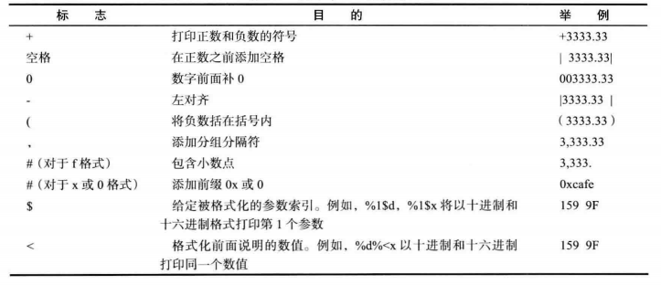

### 数据类型  
Java是一种**强类型**语言，即意味着必须为每一个变量声明一种类型。在Java中一共有8种基本数据类型，其中有4种整型、2种浮点类型、1种用于表示Unicode编码的字符单元的字符类型char和一种用于表示真值的boolean类型。  
#### 1) 整型  
整型用于表示没有小数部分的值，它允许是负数，Java提供了4种整型：  
类型　　　　存储需求　　　　　　　　取值范围  
byte　　　　 1字节　　　　　　　　　-2<sup>7</sup> ~ 2<sup>7</sup>-1  
short　　　　2字节　　　　　　　　　-2<sup>15</sup> ~ 2<sup>15</sup>-1  
int　　　　　4字节　　　　　　　　　-2<sup>31</sup> ~ 2<sup>31</sup>-1  
long　　　　 8字节　　　　　　　　　-2<sup>63</sup> ~ 2<sup>63</sup>-1  

在通常情况下,int类型最常用。如果要表示星球上居住的人数，就需要使用long类型了。byte和short类型用于特定的应用场合，比如底层的文件处理或者需要控制占用存储空间量的大数组。  
整型的直接量默认是int，即2表示int类型的2，为了表示一个long型的整型直接量，在其后追加字母L或l即可(建议使用L,以免和数字1混淆)。语句`byte b = 128`会造成编译错误，因为128是整型直接量且超过了byte的取值范围。  
默认情况下，整型直接量是一个十进制整数。要表示一个二进制整数直接量，使用0b或0B开头;表示一个八进制整数直接量，使用0开头;表示一个十六进制整数直接量，使用0x或0X开头。  
为了提高可读性,Java允许在数值直接量的两个数字之间使用下划线,例如`long ssn = 232_45_4519`  
**Java没有任何无符号(unsigned)形式的int、long、short或byte类型**
#### 2）浮点类型  
浮点类型用于表示有小数部分的数值，Java提供了2种浮点类型：  
类型　　　　存储需求　　　　　　　　取值范围  
float　　　　 4字节　　负数范围：-3.4028235E+38 ~ -1.4E-45     
　　　　　　　　　　　正数范围：  1.4E-45 ~ 3.4028235E+38  
           　　　　　　　　　　　　　　　　(有效位数为6~7位)  
double 　　　8字节　　负数范围：-1.7976931348623157E+308 　　　　　　　　　　　　　　　　~ -4.9E-324　　　
　   
      　　　　　　　　　　　正数范围： 4.9E-324 ~   
 　　　　　　　　　　　　　　　　1.7976931348623157E+308
　　　　　　　　　　　　　　　　(有效位数为15位)  
double表示这种类型的数值精度是float的两倍,float称为单精度型,double称为双精度型。通常情况下,应该使用double型,因为它比float型更精确。  
可以以E或e为指数用科学计数法表示浮点数,例如1.2345E+2,在十六进制中,则使用p表示指数而不是e，且尾数采用十六进制时指数的基数是2而不是10  
浮点数直接量是double型,即5.0被认为是double型的,可以通过追加f或F表示float型直接量,当然也可以在浮点数值后面添加后缀D或d表示double型(虽然没有必要多此一举)  
常量**Double.POSITIVE_INFINITY、Double.NEGATIVE_INFINITY和Double.NaN**(以及相应的Float类型的常量)分别表示正无穷大、负无穷大和不是一个数。例如，一个正整数除以0的结果为正无穷大。计算0/0或者负数的平方根结果为NaN。  
不能用如下的方式检测一个特定的值是否等于Double.NaN:  
```java
if(x == Double.NaN) // is never true
```
应该改成  
```java
if(Double.isNaN(x)) // check whether x is "not a number"
```
浮点数在运算时会产生一定误差,如果对精度有极高要求，应该使用BigDecimal类
#### 3）Unicode和char类型  
char类型原本用于表示单个字符。不过，现在情况已经有所变化。如今，有些Unicode字符可以用一个char值描述，另外一些则需要两个char值。  
char类型的字面量值要用单引号括起来。例如：'A'是编码值为65所对应的字符常量。它与"A"不同，"A"是包含一个字符A的字符串。char类型可以表示为十六进制值，范围从'\u0000'到'\uFFFF'  
有一些用于表示特殊字符的**转义序列**,如下：  
  
       
 **注释中的\u也会起转义作用,如下：**  
 ```java
 // \u00A0 is a newline 
   (\u00A0会被替换成换行符)
 
 // Look inside c:\users 
   (会产生编译错误,因为\u后面未跟着4个十六进制数)
 ```
#### 4) boolean类型  
boolean类型有两个值：false和true，用来判定逻辑条件。**不同于C/C++中0代表false，非0代表true，Java中整型值和布尔值之间不能进行相互转换。**  
比如,下面的语句在C/C++中是允许的,表示一个无限循环：  
```C++
while(1){
	do something
}
```
但是在Java中不允许这么做,可以改为：  
```java
while(true){
	do something
}
```
可以打印boolean类型的变量或者布尔表达式，会呈现true或者false  
### 数据类型转换 
将一个小范围类型变量转化为大范围类型的变量称为**拓宽类型**，反之称为**缩窄类型**。把小范围类型变量赋值给大范围类型的变量或小范围类型变量和大范围类型变量共同参与运算,Java会自动拓宽类型。而如果要缩窄类型，必须显式完成。  
**注意：  
1.类型转换不改变被转换的变量，例如，下面的代码中的d在类型转换之后值不变：**
```java
double d = 4.5;
int i = (int)d; // i becomes 4, but d is still 4.5
```
**2.x1 op= x2形式的增强赋值表达式的执行为x1 = (T)(x1 op x2),T是x1的类型。因此，下面代码是正确的：**  
```java
int sum = 0;
sum += 4.5;// 等价于sum = (int)(sum + 4.5)
```
**3.将一个int型变量赋值给short型或byte型的变量，必须显式地使用类型转换，如下面的语句会产生编译错误：**  
```java
int i = 1;
byte b = i; // Error because explicit casting is required
```
然而如果整型直接量在目标变量允许的范围内，那么将整型直接量赋给short型或byte型就不需要显式类型转换，如：  
```java
byte b = 1; 
```
### 变量  
变量用于表示在程序中可能被改变的值。**变量声明**告知编译器根据数据类型为变量分配合适的内存空间。变量声明的语法如下：
```java
datatype variableName;
```
如果几个变量为同一类型,允许一起声明它们：  
```java
datatype variable1, variable2, ..., variablen;
```
可以在声明变量的同时初始化，也可以先声明后初始化：  
```java
int count = 1; // 声明同时初始化变量

int count;
count = 1; //先声明，后初始化
```
### 常量  
常量是一个赋值后保持不变的量,用final关键字修饰，在类中定义的常量一般用static final修饰。常量必须在同一条语句中声明和赋值，不可先声明再赋值。  
使用常量有三个好处：  
1)不必重复输入同一个值  
2)如果必须修改常量的值，只需在源代码的一处改动  
3)给常量赋一个描述性的名字会提高程序的易读性

  
### 数值操作符  
数值数据类型的操作符包括标准的算术操作符：加号(+)、减号(-)、乘号(`*`)、除号( / )、求余号(%)  
**注意：  
1.只有当被除数是负数时,余数才是负的,如 -7 % 3 = -1, -26 % -8 = -2,20 % -13 = 7,即无论正负,商和除数乘积的绝对值不能超过被除数的绝对值  
2.整数除0会产生一个异常，而浮点数除0将会得到无穷大或NaN结果**  

### 增强赋值操作符  
x1 op= x2形式的增强赋值表达式的执行为x1 = (T)(x1 op x2),T是x1的类型。其中op可以是加号(+)、减号(-)、乘号(`*`)、除号( / )、求余号(%)  
### 自增和自减操作符  
分为++var、--var、var++、var--四种，加减号决定**给var加1还是减1**，前置还是后置符号决定**先更新后使用值还是先使用值后更新**
### 关系运算符  
Java中有一系列用于比较关系的运算符：==(等于)、!=(不等于)、<(小于)、>(大于)、<=(小于等于)、>=(大于等于)  
### 逻辑操作符 
逻辑操作符!(非)、&&(与)、||(或)和^(异或)可以用于产生复合型布尔表达式，逻辑操作符被称为**短路操作符或懒惰操作符**，即按顺序执行表达式，如果某一步已经可以判断整个表达式的真假，不再继续执行，否则继续执行。  
### 位运算符  
处理整型类型时，可以直接对组成整型数值的各个位完成操作。位运算符包括：&(按位与)、|(按位或)、^(按位异或)、~(按位取反)、<<(左移，高位舍弃，低位补0)、>>(右移，低位舍弃，高位用符号位填充)、>>>(右移，低位舍弃，高位0填充)  
**注意：  
1) 移位运算符的右操作数要完成模32的运算(除非左操作数是long类型，在这种情况下右操作数要模64),例如1`<<`35等价于1`<<`3  
2) & 和 | 也可以用在布尔表达式中，此时它们是逻辑操作符，但不会短路  
3) 可以使用掩码技术得到一个数二进制的某一位：  
int fourthBitFromRight = (n & 0b1000) / 0b1000  
上式将n的右数第4位保留，将其他位掩掉，再除以0b1000，就得到了该位上的数** 
### 选择  
Java中的选择语句类型有：单分支if语句、双分支if-else语句、嵌套if语句、多分支if-else语句、switch语句、条件表达式
#### 1) 单分支if语句  
```java
if(布尔表达式){
	语句(组);
 }```
 分支中如果只有单条语句可以省略外围花括号，否则不能省略
#### 2) 双分支if-else语句  
```java
if(布尔表达式){
	布尔表达式为真时执行的语句(组);
 }
 else{
    布尔表达式为假时执行的语句(组);
 }```
 嵌套层数没有限制，但为了程序可读性，尽量不要进行过多的嵌套，且嵌套语句应有适当的缩进保持层次关系。
#### 3) 嵌套的if语句和多分支的if-else语句  
下面是一个嵌套的if语句，if(j > k)嵌套在语句if(i > k)内  
```java
if(i > k) {
	if(j > k)
    	System.out.println("i and j greater than k");
}
else
	System.out.println("i is less than or equal to k");
```
下面是一个多分支的if-else语句  
```java
if(score >= 90.0)
	System.out.print("A");
else{
	if(score >= 80.0)
      System.out.print("B");
    else{
    	if(score >= 70.0)  
          System.out.print("C");
        else{
        	if(score >= 60.0)
             System.out.print("D");
            else
             system.out.print("E");
        }
    }
}
```
为了可读性，建议改写成如下形式：  
```java
if(score >= 90.0)
	System.out.print("A");
else if(score >= 80.0)  
	System.out.print("B");
else if(score >= 70.0)  
	System.out.print("C");
else if(score >= 60.0)
	System.out.print("D");
else
	System.out.print("E");
```
**注意：只有在前面的所有条件都为false才测试下一个条件** 
#### 4) switch语句  
switch语句常用于多分支的选择问题：  
```java
switch(switch表达式){
	case value1: 语句(组)1;
    			 break;
    case value2: 语句(组)2;
    			 break;
    ...
    case valueN: 语句(组)N;
    			 break;
    default: 当没有一个给出的case与switch表达式匹配时执行的语句(组)
}
```
**注意：  
1) switch表达式可以为char、byte、short、int或者String型值(整型中只有long不行),并且总要用括号括住  
2) value1,...,valueN必须与switch表达式具有相同的数据类型，且是常量表达式，不能出现变量，例如：x、y+1等  
3) 当switch表达式的值与case语句匹配时,执行从该case开始的语句，直到遇到一个break语句或到达switch语句的结束。break语句是可选的,会立即终止switch语句  
4) default语句是可选的，当没有一个给出的case与switch表达式匹配时执行default语句指定的操作，如果加default语句，就什么也不做**
#### 5) 条件表达式  
条件表达式基于一个条件计算表达式的值，它是Java中唯一的三元操作符。  
```java
boolean-expression ? expression1 : expression2;
//(布尔表达式? 表达式1:表达式2)
```
如果布尔表达式的值为true，则条件表达式的结果为表达式1;否则，结果为表达式2。  
例如：  
```java
System.out.println((num % 2 == 0) ? "num is even" : "num is odd");
```
注意冒号两边是**表达式**，不能是其他操作。


### 循环
#### 1) 块作用域  
块(即复合语句)是指由一对大括号括起来的若干条简单的Java语句。**块确定了变量的作用域，变量只在包含自己的块中可见。一个块可以嵌套在另一个块中。**例如：  
```java
public static void main(String[] args)
{
	int n;
    . . .
    {
       int k;
       . . .
    } // k is only defined up to here
}
```
但是不能在嵌套的两个块中声明同名变量，例如下面的语句会产生编译错误：  
```java
public static void main(String[] args)
{
	int n;
    . . .
    {
       int k;
       int n;//Erro -- can't redefine n in inner block
       . . .
    } 
}
```
这与C++不同，在C++中允许在嵌套的块中定义同名变量，内层变量会覆盖外层定义的变量。  
#### 2) while循环  
while循环在条件为真的情况下，重复地执行语句：  
```java
while(循环继续条件){
	//循环体  
    语句(组);
}
```
当程序不幸出现了死循环，如果是从命令窗口运行程序的，按CTRL+C键来结束  
#### 3) do-while循环
do-while循环和while循环基本一样，不同的是while循环是前测循环，即先检测循环条件后执行循环体;do-while是后测循环，即先执行循环体后检测循环条件。只有在一开始就不满足循环继续条件时，两种循环的执行次数不同，即while循环不执行，do-while循环执行一次。否则两种循环的执行次数相同。
```java
do{
	// 循环体;
    语句(组);
}while(循环继续条件);
```
**注意do-while循环后面的分号不要丢！**  
#### 4) for循环
for循环的基本语法为：
```java
for(初始操作;循环继续条件;每次迭代后的操作) {
	//循环体  
    语句(组);
}
```
初始动作可以是0个或是多个以逗号隔开的变量声明语句或赋值表达式：  
```java
int i = 0;
for(    ;i < 100;i++){
	System.out.println("Welcome to Java!");
}// 将初始动作省略，放在循环语句之前执行

for(int m = 0,n = 0; m + n < 10; m++,n++){
	System.out.println("Welcome to Java!");
}// 多个初始化动作
```
每次迭代后的操作也可以是0个或多个逗号隔开的语句：  
```java
for(int i = 0;i < 100;  ){
	System.out.println("Welcome to Java!");
    i++;
}// 将每次迭代后的操作放入循环体内  

for(int i = 1;i < 100;System.out.println(i),i++);
// 每次迭代后执行多个操作
```
下面的三种循环写法是等价的：  
```java
for(  ;  ;  ){
	//do something
}

for(  ;true;  ){
	//do something
}

while(true){
	//do something
}
```
#### 5) for-each循环  
Java有一种很强的循环结构，可以用来依次处理数组中的每个元素(其他类型的元素集合亦可)而不必为指定的下表值而分心。  
这种增强的for循环的语句格式为：  
```java
for(variable : collection) statement
```
定义一个变量用于暂存集合中的每一个元素，并执行相应的语句(组)，collection这一集合表达式必须是一个数组或者是一个实现了Iterable接口的类对象(例如ArrayList)。  
**for-each循环只能用于按顺序遍历数组或集合的情况，如果要使用其他顺序，应该使用其他循环语句**
#### 6) break和continue  
**continue跳出本次迭代进入下一次迭代，break跳出整个循环。**  
虽然不提倡使用goto语句，但偶尔使用goto语句跳出循环还是有益处的。Java中提供了类似于C++中goto语句的带标签的break语句和continue语句，用于跳出多重嵌套的循环语句。  
**标签必须放在希望跳出的最外层循环之前，并且必须紧跟一个冒号。另外要注意，只能跳出语句块，而不能跳入语句块。**  
下面的代码使用了带标签的break语句：  
```java
 int i;   
 label1:
 for( i = 0;i < 10;i ++) {
	if(i == 5)
	break label1;
 }
 System.out.println(i);// i = 5
```
上述代码中，i在等于5时跳出循环到循环首部的标签label1位置，由于是带标签的break语句，不再重新进入循环，而是跳过循环执行下面的打印语句。

如果把改成带标签的continue语句：  
```java
 int i;   
 label2:
 for( i = 0;i < 10;i ++) {
		if(i == 5)
		continue  label2;
 }
 System.out.println(i); // i = 10
```
上述代码中，i在等于5时也跳出循环到循环首部的标签label2位置，但由于是带标签的continue语句，会重新进入循环。
### 枚举类型    
有时，变量的取值只在一个有限集合内。例如：销售的服装或比萨饼只有小、中、大、超大这四种尺寸。此时可以给每种尺寸编号为1、2、3、4,但是为了程序的可读性，可以定义一个枚举类。    
可以把枚举类看作普通类，它们都可以定义一些属性和方法，不同之处是：枚举类不能使用 extends 关键字继承其他类，因为 枚举类已经继承了 java.lang.Enum`<T>`(java是单一继承),其中T是定义的枚举类类型，可类比每个普通类的Class对象都是Class`<T>`类的实例。**Enum类是一个抽象类。**  
下面定义一个简单的枚举类：  
```java
public enum Size {SMALL, MEDIUM, LARGE, EXTRA_LARGE};
```
其中**enum**是定义枚举类的关键字，可类比普通类的**class**。**Size**是枚举类名，类比普通类名。  
SMALL、MEDIUM、LARGE、EXTRA_LARGE是枚举值，为枚举类的静态成员，static关键字被省略，类型为Size，可以用`Size.枚举实例名`来访问，命名习惯同常量。Size变量只能存储枚举类中定义的枚举值或null，尽量不要构造新的Size类型对象。  
可以在枚举类中添加一些构造器、方法和域。当然，构造器只是在构造枚举常量的时候使用，下面是一个示例：  
```java
public enum Size
{
	SMALL("S"),MEDIUM("M"),LARGE("L"),EXTRA_LARGE("XL");
    
    private String abbreviation;
    
    private Size(String abbreaviation){
    this.abbreviation = abbreviation;
    }
    public String getAbbreviation() {return abbreviation};
}
```
**注意：**枚举值的声明必须是枚举类定义的第一条语句。枚举类的构造器必须为private，保证了构造器只能用于枚举类中定义的枚举值的构造，而不让客户代码构造新的枚举值。当访问枚举值时，构造方法被调用，枚举值构造方法中的参数被赋值给Abbreviation。如：  
```java
public class TestSize{
	public static void main(String[] args) {
    	Size size = Size.LARGE;
        System.out.println(size.getAbbreviation);
}
```
结果打印出"L"  

枚举类型的每一个值都将映射到 protected Enum(String name, int ordinal)构造函数中，在这里，每个枚举值的名称都被转换成一个字符串，且按照在枚举类中出现的先后次序，从0开始进行编号。  
下面是枚举类的常用API：  
* int compareTo(E o)   
按照序号(枚举类中的定义次序)比较此枚举与指定对象的顺序   
* String toString()  
 返回枚举常量的名称  
* static `<T extends Enum<T>>` T valueOf(Class`<T>` enumType, String name)   
 返回带指定名称的指定枚举类型的枚举常量(是toString的逆操作)，例如：  
 ```java
 Size s = Enum.valueof(Size.class,"SMALL");
 ```  
 s的值为Size.SMALL  
 
* static T[] values()  
返回一个包含全部枚举值的数组，例如：  
```java
Size[] values = Size.values();
```
返回一个包含Size.SMALL,Size.MEDIUM,Size.LARGE,  Size.EXTRA_LARGE的数组  

**要比较两个枚举值是否相同，既可以使用equals也可以使用==**  

枚举类型可以在一个类内定义，此时枚举类被作为内部类对待。程序编译后，将创建一个名为`OuterClassName$EnumName`的字节码文件。  

可以在if或switch语句中使用枚举变量，例如：  
```java
if(size.equals(Size.SMALL){
	// process SMALL
}
else if(size.equals(Size.MEDIUM){
	// process MEDIUM
}
else
...
```
等价于：  
```java
switch(size){
	case SMALL:
    // process SMALL
    break;
    case MEDIUM:
    // process MEDIUM
    break;
    ...
}
```
**在switch语句中，case标签是一个无限定的枚举值(即SMALL，而不是Size.SMALL)**

更多用法见：[Java枚举(enum)详解7种常见的用法](http://blog.csdn.net/qq_27093465/article/details/52180865)
### 输入输出
#### 1) 输入
从控制台读取"标准输入流"System.in，需要构造一个**Scanner**对象，并与"标准输入流"System.in关联。  
```java
Scanner in = new Scanner(System.in);
```
下面给出Scanner类的常用API：  
* Scanner(InputStream in)  
 用给定的输入流创建一个Scanner对象  
*  String nextLine()  
  读取输入的下一行内容(以回车作为分隔符)  
*  String next()   
   读取输入的下一个单词(以空白字符如空格、回车作为分割符)  
*  int nextInt()  
读取下一个int  
*  double nextDouble()  
读取下一个double()  
* boolean hasNext()    
检测输入是否还有单词  
* boolean hasNextInt()  
检测输入是否还有int  
* boolean hasDouble()  
检测输入是否还有double  

因为输入是可见的，所以Scanner类不使用于从控制台读取密码。Java SE 6特别引入了Console类实现不回显的输入。要想读取一个密码，可以采用下列代码：  
```java
Console cons = System.console();
String username = cons.readLine("User name: ");
char[] passwd = cons.readPassword("Password: ");
```
**几点注意：  
1.Console类不能用new构造对象，属于单例模式，构造方法被private修饰  
2.为了安全起见，返回的密码存放在一维字符数组中，而不是字符串中。在对密码进行处理后，应该马上用一个填充值覆盖数组元素。  
3.采用Console对象处理输入不如Scanner方便，每次只能读取一行输入，而没有能够读取一个单词或一个数值的方法**  

下面给出Console类的常用API：  
* static Console console()   
  返回一个Console对象  
* static char[] readPassword(String prompt, Object...args)  
显示提示字符串prompt并读取用户输入，直到输入行结束,结果存放在字符数组中。args参数用来提供输入格式。  
* static String readLine(String prompt,Object...args)  
显示提示字符串prompt并读取用户输入，直到输入行结束，结果存放在字符串中。args参数用来提供输入格式。  

  
#### 2) 输出  
可以使用 System.out.print(x) 将数值 x 输出到控制台上。这条命令将以 x 对应的数据类型所允许的最大非 0 数字位数打印输出 x 。
例如：
```java
double x = 10000.0 / 3.0;
System.out.print(x);
```
打印  
3333.3333333333335  
如果希望显示美元、美分等符号， 则有可能会出现问题。  
在早期的 Java 版本中，格式化数值曾引起过一些争议。庆幸的是，Java SE 5.0 沿用了 C语言库函数中的 printf方法。例如，调用  
```java
System.out.printf("%8.2f",x);
```
可以用 8 个字符的宽度和小数点后两个字符的精度打印 x。也就是说，打印输出一个空格和7 个字符， 如下所示：  
3333.33  
在 printf中，可以使用多个参数， 例如：
```java
System.out.printf("Hello, %s. Next year, you'll be %d", name, age);
```
每一个以 % 字符开始的格式说明符都用相应的参数替换。 格式说明符尾部的转换符将指示被格式化的数值类型：f 表示浮点数，s 表示字符串，d 表示十进制整数。  

下表列出了所有转换符：  
  
另外，还可以给出控制格式化输出的各种标志。例如，逗号
标志增加了分组的分隔符。即
```java
System.out.printf("%,.2f", 10000.0 / 3.0);
```
打印  
3,333.33  

下表列出了用于printf的所有标志  
  

可以使用静态的 String.format 方法创建一个格式化的字符串，而不打印输出：
```java
String message = String.format("Hello, %s. Next year, you'll be %d", name , age);
```
基于完整性的考虑， 下面简略地介绍 printf方法中日期与时间的格式化选项(已经过时)。在新代码中， 应当使用 java.time 包的方法。 不过你可能会在遗留代码中看到 Date 类和相关的格式化选项。格式包括两个字母， 以 t 开始， 以下表中的任意字母结束。  
例如
```java
System.out.printf("%tc", new Date());
```
这条语句将用下面的格式打印当前的日期和时间：
Mon Feb 09 18:05:19 PST 2015  
    
  
  
从上表可以看到，某些格式只给出了指定日期的部分信息。例如，只有日期或月份。如果需要多次对日期操作才能实现对每一部分进行格式化的目的就太笨拙了。为此，可以采用一个格式化的字符串指出要被格式化的**参数索引**。索引必须紧跟在%后面， 并以`$`终止。 例如：  
```java
System.out.printf("%1$s %2$tB %2$te,%2$tY","Due date:",new Date());
```
打印  
Due date: February 9, 2015

还可以选择使用 < 标志。它指示前面格式说明中的参数将被再次使用。也就是说，下列语句将产生与前面语句同样的输出结果：
```java
System.out .printf("%s %tB %<te, %<tY", "Due date:", new Date());
```
**注意：**参数索引值从1开始，而不是从0开始，%1`$`...对第一个参数格式化。这就避免了与0标志混淆。  

现在，已经了解了 printf 方法的所有特性。下表给出了格式说明符的语法图： 

  

#### 3) 重定向语法
Java使用System.out(系统类的输出流对象)来表示标准输出设备，默认情况下是显示器，而用System.in(系统类的输入流对象)来表示标准输入设备，默认情况下是键盘。  
有时，我们需要从文件而不是键盘读入数据，并希望将程序输出结果保存到文件中而不是打印在控制台上。此时，可以在命令行利用Shell的重定向语法将任意文件关联到System.in和System.out，例如下面的语句实现了从input.txt文件输入并将程序输出结果输入output.txt：  
```
java MyProg < input.txt > output.txt
```
### 方法  
#### 1) 定义方法  
下面先来看一个方法的定义，其作用是返回两个整数中的较大者：
```java
public static int max(int num1,int num2){
	int result;
    if(num1 > num2)
    	result = num1;
    else
    	result = num2;
    return result;
}
```
其中花括号前的部分是**方法头**，花括号包括的部分是**方法体**。方法头包括**修饰符(public static)、返回值类型(int)、方法名(max)、形式参数(int num1、int num2)**。形式参数构成**参数列表**，方法名和参数列表构成**方法签名**。  
对带返回值的方法而言，return语句是必需的，且如果存在多个选择分支，要确保任何分支都有返回值。对于void方法，也可以在方法中使用return结束方法调用。
#### 2) 调用方法  
如调用上述max方法：  
```java
int z = max(x,y);
```
其中x,y是实际参数。

每当调用一个方法时，系统会创建一个**活动记录**(也称为活动框架)，用于保存方法中的参数和变量。活动记录置于一个内存区域中，称为**调用堆栈(call stack)**。调用堆栈也称为执行堆栈、运行时堆栈，或者一个机器堆栈，常简称为"堆栈"。当一个方法调用另一个方法时，调用者的活动记录保持不动，一个新的活动记录被创建用于被调用的新方法,一个新的记录"入栈"。一个方法结束返回到调用者时，相应的活动记录被释放，其中的参数和变量被销毁，栈顶的记录"出栈"。堆栈的最底层活动记录是main方法的记录，当整个程序结束，main方法记录"出栈",栈为空，程序结束。  

当调用带参数的方法时，如果参数是基本数据类型，实参的值传递给形参(即拷贝)，这个过程称为**按值传递**，无论形参在方法中是否改变，实参都不受影响;如果参数是引用类型，则传递的是引用值，可以理解为**传共享**，形参和实参指向同一对象，此时实际对象可能会被改变。  

main方法也有参数，是一个String数组，可以在命令行里给main方法传递字符串参数(也可以通过eclipse传递参数，在运行——运行配置——自变量里传递)。例如，下面的命令行用三个字符串arg0、arg1、arg2启动程序TestMain：  
```
java TestMain arg0 arg1 arg2
```
其中arg0、arg1、arg2都是字符串，但是在命令行中出现时不需要双引号，但如果字符串包含空格，就必须用双引号括住。  
当调用main方法时，Java解释器会创建一个数组存储命令行参数，然后将该数组的引用传递给args。例如，如果调用有n个命令行参数的程序，Java解释器创建一个如下所示的数组：  
```java
args = new String[n];
```
然后Java解释器传递参数args去调用main方法  
**注意：如果命令行没有传递参数，那么使用new String[0]创建数组。在这种情况下args引用了一个长度为0的空数组，它的值不是null，但是args.length是0**
### 数组
Java和许多高级语言都提供了一种称作数组的数据结构，可以用它来存储一个元素个数固定且元素类型相同的有序集。  
数组一旦被创建，它的大小不能改变。使用一个数组引用变量，通过下标来访问数组中的元素。  
#### 1) 声明和创建数组(以一维数组为例)
来看下面的语句：  
```java
elementType[] arrayRefVar = new elementType[arraySize];
//(元素类型[] 数组引用变量 = new 元素类型[数组大小])
```
该语句完成了三个操作：  
1.`elementType[] arrayRefVar`声明了一个elementType类型的数组引用变量arrayRefVar  
2.`new elementType[arraySize]`创建了一个大小为arraySize的elementType的数组  
3.`=` 把数组引用赋给数组引用变量  

**注意：**  
1.`elementType[] arrayRefVar`只是声明数组变量，并不在内存中给数组分配任何空间，它只是创建一个对数组应用的存储位置，如果变量不包含对数组的引用，这个变量的值为null  
2.`new elementType[arraySize]`在内存中给数组元素分配了存储空间  
3.一个数组变量看起来似乎是存储了一个数组，但实际上它存储的是只是数组的引用。  
4.当创建数组后，它的元素被赋予默认值，数值型基本数据类型的默认值为0,char型的默认值为'\u0000'(空字符，但长度为1),boolean型的默认值为false，非基本数据类型的默认值均为null    
5.与C++不同，Java允许动态开数组，即无需在编译期就确定数组大小，可以在程序运行时决定数组大小并创建相应大小的数组。
#### 2) 初始化数组  
1.逐一赋值  
```java
int[] myList = new int[5];
myList[0] = 1;
myList[1] = 2;
myList[2] = 3;
myList[3] = 4;
myList[4] = 5;
```
2.数组初始化语法  

下面的语法可以给数组的前k个元素赋值：
```java
elementType[] arrayRefVar = {value0, value1, .., valuek};
```
**注意：**在使用数组初始化语法时，必须将声明、创建和初始化放在一条语句中，将它们分开会产生语法错误：  
```java
int[] myList;
myList = {1,2,3,4,5}; //Error
```
#### 3) 访问数组元素 
可以用arrayRefVar.length得到数组长度，数组元素的下标为0 ～ arrayRefVar.length - 1。可以直接使用下标随机访问数组元素：  
```java
arrayRefVar[index] (数组引用变量[下标])
```
如果要打印数组，可以使用一个循环打印逐一数组元素。**如果是字符数组，可以使用一条打印语句打印**:  
```java
char[] city = {'B','e','i','j','i','n','g'};
System.out.println(city);
```
#### 4) 复制数组  
要将一个数组中的内容复制到另一个中，如果使用`=`直接赋值，如：  
```java
list2 = list1;
```
上述语句只是将list1的引用值复制给了list2，这条语句执行后，list1和list2都指向了同一个数组，如果改变其中一者，另一者也会受到同样的影响。list2原先所引用的数组不能再引用，它就变成了垃圾，会被JVM自动回收。**在Java中，可以使用赋值语句复制基本类型的值，但不能复制数组等引用类型的值。**  

复制数组的四种方法  
1.申请一个新数组，遍历原数组逐一复制元素  
2.使用System类的静态方法arraycopy  
3.使用`数组对象.clone`返回一个数组克隆的引用  
4.使用Arrays类的copyOf方法  

#### 5) 匿名数组  
来看下面的语法：  
```java
new elementType[] {value0,value1, ... ,valuek};
```
该语句创建了一个没有显式引用变量的数组并进行了初始化，这样的数组称为**匿名数组**。注意匿名数组的**方括号里不指定数组长度!**  
#### 6) 可变长参数列表  
可以把类型相同但个数可变的参数传递给方法，语法如下：  
```java
typeName...parameterName (类型名...参数名)
```
**注意：**  
1.在方法声明中，指定类型后紧跟着省略号(...)  
2.只能给方法中指定一个可变长参数，且该参数必须是最后一个参数，任何常规参数必须在它之前  
3.Java将可变长参数当成数组对待，当用数目可变的参数调用方法时，Java会创建一个数组并把参数传给它  

#### 7) Arrays类  
Arrays类中包含了许多对处理数组的方法  

下面是Arrays类的常用API：  


  

如果计算机有多个处理器，可以使用parallelSort，比sort更高效。  
#### 8) 多维数组  
以二维数组为例，二维数组引用变量有三种表示方法：  
```java
elementType arrayRefVar[][]
elementType[] arrayRefVar[]
elementType[][] arrayRefVar
```
推荐使用`elementType[][] arrayRefVar`声明二维数组引用变量。
初始化语法也适用于多维数组：  
```java
int[][] array = {
     {1, 2},
     {3, 4}
};
```
等价于：  
```java
int[][] array = new int[2][2];
array[0][0] = 1;
array[0][1] = 2;
array[1][0] = 3;
array[1][1] = 4;
```
**二维数组其实是一个数组，它的每个元素都是一个一维数组，即它是数组的数组。**  
x.length可以获取二维数组的第一维长度，x[index].length可以获取index行对应的第二维长度。如果没有初始化二维数组二维数组的所有元素默认为null，因为二维数组的元素是数组类型，默认值为null  
**二维数组中的每一行本身就是一个数组，因此，各行的长度可以不同。这样的数组称为锯齿数组**，例如：  
```java
int[][] triangleArray = {
	{1, 2, 3, 4, 5},
    {2, 3, 4, 5},
    {3, 4, 5},
    {4, 5},
    {5}
};
```
**其余没有赋值的部分并不会被赋为默认值，就是未分配空间,如果进行访问会抛出ArrayIndexOutOfBoundsException**  

二维数组在创建时可以省略第二维长度(留到后续指定)，但必须指定第一维长度：  
```java
int[][] triangleArray = new int[5][];
triangleArray[0] = new int[5];
triangleArray[1] = new int[4];
triangleArray[2] = new int[3];
triangleArray[3] = new int[4];
triangleArray[4] = new int[5];
```
如果想打印多维数组，可以使用嵌套循环打印，也可以使用Arrays类的**deepToString**方法。

### 零敲碎打  
* 一个Java源文件内只能有一个public类,且该类名称必须与文件名相同  
* main方法是程序的入口，JVM将从指定类中的main方法开始执行。根据Java语言规范，main方法必须声明为`public static void main(String[] args)`
* 在源代码中，字符串常量不能跨行，因此，下面的语句会造成编译错误：  
```java
System.out.println("Welcome to the
world of Java!");
```
为了改正错误，可以将该字符串分成几个单独的子串，然后再用连接符(+)将它们组合起来：  
```java
System.out.println("Welcome to the“ +
”world of Java!");
```