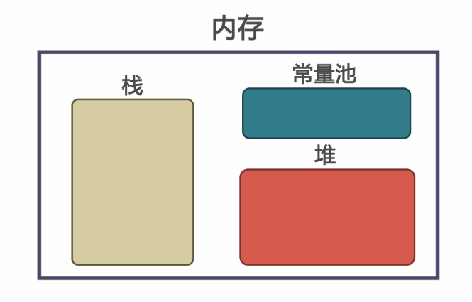
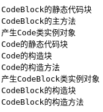

### 面向对象程序设计概述  
　　面向对象程序设计(简称OOP)是当今主流的程序设计范型，它已经取代了传统的“结构化”过程化程序开发技术。Java是完全面向对象的，必须熟悉OOP才能够编写Java程序。  
　　传统结构化程序设计主要通过设计一系列的过程(即算法)来解决问题，即算法+数据结构=程序，先要确定如何操作数据，再决定如何组织数据使之便于操作。而面向对象程序设计将数据域(属性)和对数据的操作(方法)绑定在一个对象中，将数据放在第一位，然后再考虑操作数据的算法。  
　　对于规模较小的问题将其分解为过程开发较为理想，而对于规模较大的问题使用OOP比较理想，比如出现错误，在集成在对象的方法中寻找错误比在众多零散过程中查找更容易。  

### 类和对象  
　　类：类是构造对象的模板或蓝图，用于定义对象的数据域和方法。一个java源文件中只能有一个公共类，且类名与文件名相同。编译源文件时每个类都生成一个.class文件。如果A类使用B类，称A类是B类的客户。  
　　对象：由类构造的实例，一个类可以构造多个实例。  
　　

### 设计类的简单规则  
　　先从设计类的数据域开始，再向类里添加方法。

### 类之间的关系  
1.依赖(use-a)  
　　如果A类的方法操纵B类的对象，我们说A类依赖于B类。应该尽可能使相互依赖的类减少，否则B类的改变会影响A类，从而可能使A类产生bug。用软件工程的术语来说，即让类之间的耦合度最小。  
2.聚合(has-a)  
　　如果A类对象包含B类对象，我们说A类和B类聚合。  
3.继承(is-a)  
　　如果一个类别A“继承自”另一个类别B，就把这个A称为“B的子类别”，而把B称为“A的父类别”也可以称“B是A的超类”。继承可以使得子类别具有父类别的各种属性和方法，而不需要再次编写相同的代码。在令子类别继承父类别的同时，可以重新定义某些属性，并重写某些方法，即覆盖父类别的原有属性和方法，使其获得与父类别不同的功能。另外，为子类别追加新的属性和方法也是常见的做法。  

### 对象与对象变量  
　　对象是调用构造方法在**堆**上分配内存产生的(用new + 构造方法来调用)，而对象变量是在**栈**上的持有对象引用的变量(声明方式为：类名 + 对象名)。一个对象可被多个对象变量引用。比如语句A a = new A()，new A()在堆上创建了对象，a是对象变量，包含对于该对象的引用。该语句完成了三个操作，前半部分声明了一个A类型的对象变量a，后半部分创建了A类对象的实例，等号把对象引用赋给对象遍历变量(如果不赋值给a，new A()是一个匿名对象)。大多数情况下，我们可以简单地说a是一个A类对象，而不用冗长地说a是一个包含对A对象引用的变量。在Java中，数组被看作对象，一个数组变量实际上是一个包含数组引用的变量。

### 存储区域
1.创建的实例及成员变量（静、非静态）在堆中  
2.局部变量在栈中  
3.类的基本信息和方法定义在方法区  


### UML类图  
相关知识见<http://www.uml.org.cn/oobject/201211231.asp>
### 构造器  
　　构造器用于构造对象实例，并对数据域进行相应初始化，物理层面表现为在堆上为对象的非静态成员开辟存储空间。  
　　构造器名应该与类名相同，无返回值，甚至连void也没有，可以被可见性修饰符(如public)修饰，因为它是用来创建实例的，所以它永远是实例方法，不能被static修饰。  
　　构造方法可以重载，没有参数的构造方法称为无参构造方法或默认构造方法，当类中没有定义构造方法时，编译器会自动插入一个方法体为空的默认构造方法，但一旦定义了有参构造方法，该默认构造方法不会被插入。      
  　　建议在构造方法中调用各属性的set方法来初始化属性，而不是给属性直接赋值，这样set方法的合法性检查也会应用于构造方法。

### 访问对象的数据和方法  
　　在面向对象编程中，对象成员可以引用该对象的数据域和方法。在创建一个对象后，它的数据域和方法可以使用点操作符(.)来访问和调用，该操作符也称为对象成员访问操作符。   

### 引用数据域和null值  
　　如果一个引用类型的数据域没有引用任何对象，那么它的值为null,是一个引用类型直接量。访问值为null引用变量的数据域或方法会抛出一个NullPointerException。

### 默认赋值规则
　　类中的变量如果没有赋值，会被自动赋予默认值，引用类型默认值为null，byte为(byte)0,short为(short)0,int为0,long为0L,float为0.0f,double为0.0，char为‘\u0000’(空字符,但也占长度),boolean为false。但如果Java没有给方法里的局部变量赋值，会出现编译错误。  

### 基本变量和引用变量的区别  
　　基本变量类型有byte,short,int,long,float,double,char,boolean八种，其他类型变量都是引用变量。基本变量对应内存所存储的值是基本类型值，而引用变量存储的值是一个引用，是对象的存储地址。将一个变量赋给另一个变量，另一个变量就被赋予同样的值。对基本类型来说，就是将一个变量的实际值赋给另一个变量;对引用变量来说，就是将一个变量的引用赋给另一个变量，从而两个变量指向同一个对象。  
　　没有变量引用的对象会成为垃圾，Java运行系统会检测垃圾并自动回收它所占的空间，这个过程称为垃圾回收。如果你认为不再需要某个对象，可以显式地给该对象变量赋null值，让它被JVM自动回收。  
  
### 静态/非静态变量、常量和静态/非静态方法  
静态变量：又称类变量，是由一个类的所有实例共享，变量值存储在一个公共内存地址，描述类的对象的公共属性，不依赖于具体对象的变量。用关键字static表示。不要从构造器中传入参数来初始化静态域，最好使用set方法改变静态数据域。  
非静态变量：又称实例变量，是依赖于具体对象的变量，变量值存储在特定对象的内存地址。
常量：类的所有对象共享且不可变的量，用static final修饰，final决定了其不可变性，static决定了它不依赖于具体对象，可以不实例化直接通过类名调用。  
静态方法：无需创建类实例就可以调用的方法，不依赖于具体对象，用关键字static表示,其中main方法也是静态方法。
非静态方法：又称实例方法，是依赖于具体对象的方法。  
关系：  
静态数据域或方法既可以通过类访问，也可以通过对象访问;非静态数据域或方法只能通过对象访问(但为了便于程序可读性，建议用类名调用静态成员，用对象名调用非静态成员)。  
静态方法只能访问静态数据域，非静态方法可以访问非静态数据域和静态数据域。   
在同一个类中： 对于静态方法，其他的静态或非静态方法都可以直接调用它。而对于非静态方法，其他的非静态方法是可以直接调用它的。但是其他静态方法只有通过创建对象才能调用它。

### 工厂方法  
静态方法还有另外一种常见的用途。类似LocalDate和NumberFormat的类使用静态工厂方法来构造对象。比如NumberFormat使用如下工厂方法生成不同风格的格式化对象：  
```java
NumberFormat currencyFormatter = NumberFormat.gerCurrencyInstance();  
NumberFormat percentFormatter = NumberFormat.gerPercentInstance();  
double x = 0.1;  
System.out.println(currencyFormatter.format(x));// prints $0.10
System.out.println(percentFormatter.format(x));//prints 10%
```
使用静态工厂方法的原因主要有两个：  
1.无法命名构造器。构造器名和类名必须相同，但NumberFormat希望得到的不同实例拥有不同名字  
2.当使用构造器时，无法改变所构造的对象类型。而Factory方法将返回一个DecimalFromat类对象，这是NumberFormat的子类
### 可见性修饰符  
public  
修饰的成员可以在任何范围内直接访问，只是一种最宽松的访问控制等级。需要注意的，所谓的直接访问仍需要先创建或获得一个相应类的对象然后才可以使用”对象名.成员“的方式访问其属性或调用其方法，但是出于信息封装和隐藏的需要一般不提倡把成员声明为public的，而构造方法和需要外界直接调用的普通方法则适合声明为public

protected  
修饰的成员可以在其所在类中、同一包中及子类中（无论子类在不在同一个包）被直接访问，但不能在位于不同包中的非子类中被直接访问

default  
缺省访问修饰符的成员只能在其所在类中或包中直接访问，在不同包中即使是不同包的子类也不能直接访问。  

private   
private成员只能在所在类中被直接访问，是4种访问等级最高的一个，建议为了实现类的封装，实例数据域应该使用private修饰。如果不想让一个类创建实例，可以用private修饰其构造方法。  

  

注意：private和protected只能修饰类成员，public和default可以修饰类和类成员。public的类成员只有位于public类里才能出包访问，如果类是default的，也不能出包访问。
### 包  
包可以用来更好地组织、管理类，在不同的包中可以定义同名的类而不会发生冲突，建议将因特网域名的逆序作为包名，比如域名habitdiary.cn，可以定义包名为cn.habitdiary,还可以进一步定义子包名，比如cn.habitdiary.core，当然包和子包的这种嵌套关系只是为了逻辑结构更加严谨，在编译器看来这两个包是互相独立的集合。为了把类放入包中，需要在程序中首先出现语句`package + 包名`，前面不能有注释或空白。如果定义类时没有指定包，就表示把它放在默认包中，建议最好将类放入包中，不要使用默认包。源文件应该放到与完整包名匹配的子目录下，比如cn.habitdiary.core应该放在子目录cn/habitdiary/core下，编译器会把编译得到的.class文件放在同一目录下。

### 类的导入    
精确导入：导入某个包的特定类,如`import java.util.Scanner`  
通配导入：导入某个包的所有类,如`import java.util.*`   
编译器定位类会按照配置的环境变量找到类库，再根据导入路径在相应的包中定位相应的类。  
静态导入：import语句不仅可以导入类，还可以导入静态方法和静态域，只要加入static关键字。比如`import static java.lang.System.*`导入了System类的静态方法和静态域，就可以不加类名前缀:`out.println("Hello world!")`，out是System类里定义的静态成员，是PrintStream的实例。  
**注意：**  
1、在要使用某个类时可以不导入，但要采用包名.类名的方式使用这个类。  
2、**不可以**使用**精确导入**导入两个包中的**同名类**，此时应该一个类精确导入，另一个类通配导入。程序默认使用的类是精确导入的类，如果要使用通配导入的同名类，要使用包名.类名的方式。  
3、使用通配导入的时候不能跨级导入，比如在`cn.habitdiary.core`包中的类只能通过`cn.habitdiary.core.*`来导入，而不能通过`cn.habitdiary.*`来导入。

### 数据域封装  
封装，即隐藏对象的属性和实现细节，仅对外公开接口，控制在程序中属性的读和修改的访问级别，避免了对数据域的直接修改，提高了数据的安全性和易维护性。实现封装的关键是绝不能让类中的方法直接访问其他类的实例域，程序仅通过方法和数据进行交互。  
实现封装的步骤：  
1.用private可见性修饰符修饰类成员  
2.设置访问器(get方法)，方法签名习惯为:public returnType getPropertyName()，如果返回值类型是boolean型,习惯下定义为:public boolean isPropertyName()  
3.设置修改器(set方法)，方法签名习惯为:public void setPropertyName(dataType propertyValue)  
**eclipse**有添加getter和setter方法的选项。
### 向方法传递对象参数  
可以将对象传递给方法，同传递数组一样，传递对象实际上是传递对象的引用。Java只有一种参数传递方式:值传递。只不过引用类型变量的值是引用，引用上传值的最好描述为传共享。  

### 对象数组和普通数组  
所有数组变量存储的都是对数组的引用，但是普通数组里存储的就是实际的值，对象数组里存储的则还是对象的引用，而非对象本身，其类似于二维数组有两层的引用关系，对象数组元素的初始值默认为null。  

### 不可变对象和类  
一旦创建之后内容就不可改变的对象是不可变对象，它的类称为不可变类。  
一个类是不可变类要满足以下三个条件：  
1.所有的数据域都是私有的  
2.没有修改器方法  
3.没有一个返回指向可变数据域引用的访问器方法  

### 变量作用域  
一个类的实例变量和静态变量的作用于是整个类，不论在何处声明，所以类的变量和方法可以在类中以任意顺序出现。但是当一个变量初始化要基于另一个变量时不是这样。比如  
```java
public class F{
   private int j = i + 1;
   private int i;
}
```
就是错误的，因为j的初始化基于i已经被初始化的前提。  

局部变量(包括方法中声明的变量和形参等)的作用域则从声明开始到包含该变量的块结束处。如果一个局部变量和类成员变量有相同的名字，则局部变量优先，同名的成员变量被隐藏。可以通过this引用显示隐藏的成员变量。  

建议：在声明类的变量和方法时，最好按照：数据域 —— 构造方法 —— 普通方法的顺序，且最好在数据域和方法之间空一行，提高程序可读性。

### this引用  
this关键字有两大作用：  
1.表示指向调用对象本身的引用名  
2.可以在构造方法内部调用同一个类的其他构造方法，此时`this(参数列表)`语句应该出现在构造方法其他语句之前，如果一个类有多个构造方法，最好尽可能使用`this(参数列表)`的形式来实现它们。这样做可以简化代码，使类易于维护。  

### 对象构造  
#### 默认域初始化  
即依赖编译器对数据域的默认初始化。  
#### 显式域初始化  
在数据域的定义处进行赋值，可以在执行构造器之前，先执行赋值操作。当一个类的所有构造器都希望把相同的值赋予某个特定实例域时，这种方法特别有用。初始值不一定是常量值，可以调用方法返回一个值对域进行初始化。  
#### 无参数的构造器  
即将对数据域的初始化置于一个无参的构造器中。  
#### 有参数的构造器  
即给构造器传入参数对数据域进行初始化  
#### 初始化块  
在方法内的代码块称为普通代码块，就是一组用花括号括起来的语句，没有特殊含义。而如果用花括号包含的一组数据域赋值代码块出现在类内，就称为初始化块或构造代码块。初始化块一般在数据域声明处之后，构造器之前。如果在初始化块前加static关键字，并在块内初始化静态数据域，就成了静态初始化块，不允许在静态初始化块内初始化实例成员。

#### 成员初始化顺序
1.父类静态成员和静态初始化快，按在代码中出现的顺序依次执行。  
2.子类静态成员和静态初始化块，按在代码中出现的顺序依次执行。  
3.父类的实例成员和实例初始化块，按在代码中出现的顺序依次执行。  
4.执行父类的构造方法。  
5.子类实例成员和实例初始化块，按在代码中出现的顺序依次执行。  
6.执行子类的构造方法。  

注意：静态成员和静态初始化块只在该类被加载的时候初始化一次，可以看作初始化类。注意是被加载就初始化，不一定要构造对象。且静态成员和静态初始化块的初始化出现在main方法之前。

比如下面这个例子,有CodeBlock.java和Code.java两个文件。  
```java
//CodeBlock.java
public class CodeBlock{
   // 创建CodeBlock的构造块

    {
        System.out.println("CodeBlock的构造块");
    }
   //创建CodeBlock的静态代码块
    static{
        System.out.println("CodeBlock的静态代码块");
    }


   //创建CodeBlock的构造方法
    public CodeBlock(){
        System.out.println("CodeBlock的构造方法");
    }


   public static void main(String[] args){
      System.out.println("CodeBlock的主方法");
      System.out.println("产生Code类实例对象");
      Code c = new Code();
      System.out.println("产生CodeBlock类实例对象");
      CodeBlock cb = new CodeBlock();
         
   }
}

```
```java
//Code.java
class Code{
   //创建外部类Code构造块（构造块）
   {
       System.out.println("Code的构造块");
   }

   //创建外部类Code静态代码块（静态代码块）
    static{
        System.out.println("Code的静态代码块");
    }

   //创建外部类Code构造方法（构造方法）
   public Code(){
       System.out.println("Code的构造方法");
   }

} 
```
运行结果如下：  


### 类设计技巧  
#### 1.一定要保证数据域私有  
#### 2.一定要对数据初始化  
最好不要依赖默认初始化，会影响程序可读性。  
#### 3.不要在类中使用过多的基本类型  
用其他集合了相关基本类型的类代替多个基本类型使用
#### 4.不是所有的域都需要独立的域访问器和域修改器  
有的数据域定义后不必要修改
#### 5.将职责过多的类进行分解  
所谓职责是指类变化的原因。如果一个类有多于一个的动机被改变,那么这个类就具有多于一个的职责。而**单一职责原则(SRP:Single responsibility principle)**就是指一个类或者模块应该有且只有一个改变的原因。  
在软件系统中,一个类(大到模块,小到方法)承担的职责越多,它被复用的可能性就越小,而且一个类承担的职责过多,就相当于将这些职责耦合在一起,当其中一个职责变化时,可能会影响其他职责的运作,因此要将这些职责进行分离,将不同的职责封装在不同的类中,即将不同的变化原因封装在不同的类中,如果多个职责总
是同时发生改变则可将它们封装在同一类中。
#### 6.类名和方法名要能够体现它们的职责  
#### 7.优先使用不可变的类  
更改对象的问题在于，如果多个线程试图同时更新一个对象，就会发生并发更改，其结果是不可预料的。如果类是不可更改的，就可以安全地在多个线程间共享其对象。修改状态可通过返回状态已修改的新对象来实现，而不是修改对象本身。


