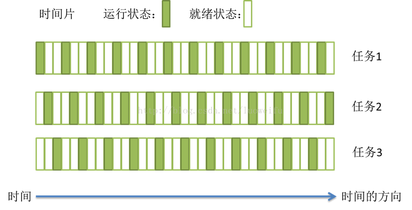
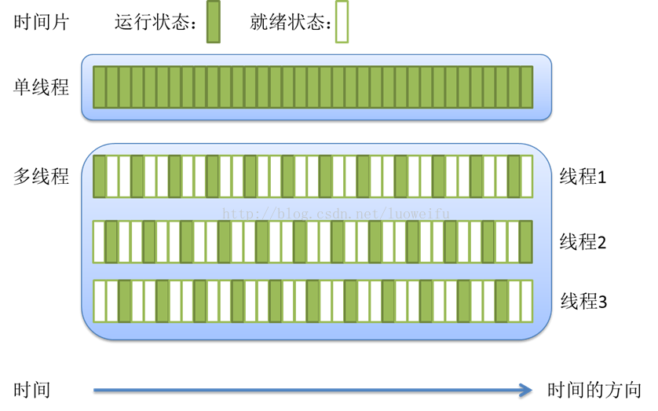
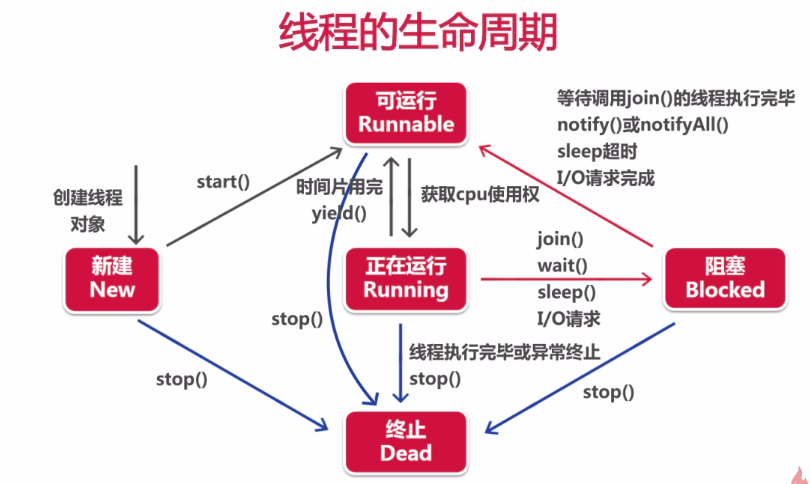
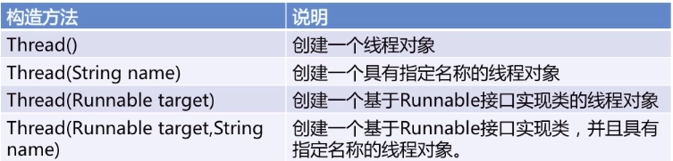
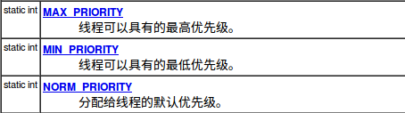
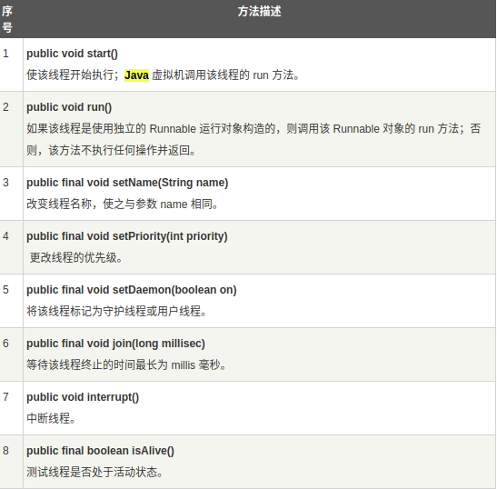
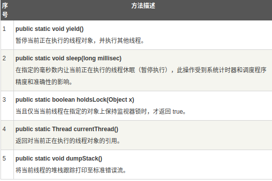
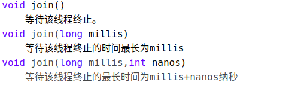

### 多任务  
操作系统的多任务指的是在同一刻运行多个程序的能力。例如，在编辑或下载邮件的同时可以打印文件。今天，人们很可能有单台拥有多个 CPU 的计算机, 但是 , 并发执行的进程数目并不是由 CPU 数目制约的。操作系统将 CPU 的时间片分配给每一个进程，给人并行处理的感觉。  
### 并行与并发  
**并行：**多个cpu或者多台机器同时执行一段处理逻辑，是真正的同时运行。  
**并发：**如果只有一个CPU，如何做到多个进程同时运行呢？我们先来看操作系统的一些相关概念。大部分操作系统(如Windows、Linux)的任务调度是采用**时间片轮转的抢占式调度方式**，即把CPU的执行时间分为很多小块，每一小块的时间相等且固定，我们把任务执行的这一小块时间叫做时间片。任务正在执行时的状态叫运行状态，一个任务执行一小段时间后会被强制暂停去执行下一个任务，被暂停的任务就处于就绪状态等待下一个属于它的时间片的到来，每个任务在CPU的调度下轮流执行。这样每个任务都能得到执行，由于CPU的执行效率非常高，时间片非常短，在各个任务之间快速地切换，给人的感觉就是多个任务在“同时进行”，这也就是我们所说的并发。
下面是时间片以及CPU轮转调度的示意图：  

### 进程  
进程是一个具有一定独立功能的程序在一个数据集上的一次动态执行的过程，是操作系统进行资源分配和调度的一个独立单位，是应用程序运行的载体。进程是一种抽象的概念，从来没有统一的标准定义。进程一般由**程序、数据集合和进程控制块**三部分组成。程序用于描述进程要完成的功能，是控制进程执行的指令集；数据集合是程序在执行时所需要的数据和工作区；程序控制块(Program Control Block，简称PCB)，包含进程的描述信息和控制信息，是进程存在的唯一标志。  

**进程具有的特征：**  
**动态性：**进程是程序的一次执行过程，是临时的，有生命期的，是动态产生，动态消亡的；  
**并发性：**任何进程都可以同其他进程一起并发执行；  
**独立性：**进程是系统进行资源分配和调度的一个独立单位；  
**结构性：**进程由程序、数据和进程控制块三部分组成。
### 线程  
在早期的操作系统中并没有线程的概念，进程是能拥有资源和独立运行的最小单位，也是程序执行的最小单位。任务调度采用的是时间片轮转的抢占式调度方式，而进程是任务调度的最小单位，每个进程有各自独立的一块内存，使得各个进程之间内存地址相互隔离。  
后来，随着计算机的发展，对CPU的要求越来越高，进程之间的切换开销较大，已经无法满足越来越复杂的程序的要求了。于是就发明了线程，线程是程序执行中一个单一的顺序控制流程，是程序执行流的最小单元，是处理器调度和分派的基本单位。一个进程可以有一个或多个线程，各个线程之间共享程序的内存空间(也就是所在进程的内存空间)。一个标准的线程由线程ID、当前指令指针(PC)、寄存器和堆栈组成。而进程由内存空间(代码、数据、进程空间、打开的文件)和一个或多个线程组成。**简言之，线程是比进程还要小的运行单位，可以看作是子程序，一个进程包含一个或多个线程。**  

#### 单线程  
只包含一个线程的程序，即主线程(主方法所在线程)。  

#### 多线程  
可以同时运行一个以上线程的程序。  

下面是单线程和多线程的关系示意图：  


### 进程和线程的区别与关系  
1.进程之间相互独立，但同一进程下的各个线程之间共享程序的内存空间(包括代码段、数据集、堆、栈、程序计数器PC等)及一些进程级的资源(如打开文件和信号)，某进程内的线程在其它进程不可见。**共享内存空间使线程之间的通信比进程之间的通信更有效、更容易，但也更具风险。**  
2.创建一个新进程或进程之间的切换会有较大的开销，线程则更"轻量级"，创建、撤销、切换一个线程比启动一个新进程的开销要小得多。  
3.一个进程由一个或多个线程组成，线程是一个进程中代码的不同执行路线。  
4.进程是操作系统进行资源分配和调度的最小单位，线程是程序执行的最小单位。    

### 线程的状态
* **新建状态:** 使用 new 关键字创建一个 Thread 类或其子类的线程对象后，该线程对象就处于新建状态。它保持这个状态直到程序调用它的start()方法启动这个线程，随后线程便进入了就绪状态。
* **就绪状态(可运行状态):** 当线程对象调用了start()方法之后，该线程并不是立即开始运行，而是进入就绪状态。就绪状态的线程处于就绪队列中，要等待JVM里线程调度器的调度，获取CPU使用权后才进入运行状态。
* **运行状态:** 如果就绪状态的线程获取 CPU 使用权，就可以执行 run()，此时线程便处于运行状态。处于运行状态的线程最为复杂，它可以变为阻塞状态、就绪状态和死亡状态。处于运行状态的线程如果CPU的时间片用完或者调用了yield()方法都会转化为就绪状态。而如果线程调用了sleep()方法、join()方法、wait()方法、获取synchronized同步锁失败或发出了I/O请求**(比如等待用户输入)**，线程都会进入阻塞状态。
* **阻塞状态:** 如果一个线程执行了sleep（睡眠）、suspend（挂起）等方法，失去所占用资源之后，该线程就从运行状态进入阻塞状态。在睡眠时间已到或获得设备资源后可以重新进入就绪状态(注意阻塞状态无法直接转入运行状态，阻塞解除只能转入就绪状态！)。可以分为三种：  
**1)等待阻塞：**运行状态中的线程执行 wait() 方法，使线程进入到**等待队列**，即进入等待阻塞状态(wait()会释放线程持有的锁)，当调用notice()或noticeAll()方法线程重新转入就绪状态。  
**2)同步阻塞：**也称**锁池状态**，线程在获取 synchronized 同步锁失败(因为同步锁被其他线程占用)进入同步阻塞状态，当同步锁占用被解除，线程重新转入就绪状态。  
**3)其他阻塞：**通过调用线程的 sleep() 或 join() 或发出了 I/O 请求时，线程就会进入到阻塞状态。当sleep() 状态超时，join() 等待线程终止或超时，或者 I/O 请求完毕**(比如用户输入完毕)**，线程重新转入就绪状态。
* **死亡状态(终止状态):**
一个线程执行完毕或者异常终止，该线程就切换到终止状态。其他四个状态都可以通过调用stop()方法来进入死亡状态，但stop()方法已经过时了，不建议使用。

### 线程的生命周期  
即前面提到的线程的五个状态之间的转化，可以通过调用Thread类的方法来影响线程的生命周期。  

**下面是线程生命周期的示意图：**  
  

### Thread类  
Thread类是一个线程类，位于java.lang包下。它实现了Runnable接口。  
1、构造方法  
  
2、常量  
  
3、常见方法  
  
  
更多见大牛博客[JAVA线程-Thread类的方法](http://blog.csdn.net/u014290221/article/details/51436710)  

### Runnable接口  
* 只有一个方法run();
* Runnable是Java中用于实现线程的接口  
* 任何实现线程功能的类都必须实现该接口

### 创建线程  
创建线程主要有三种方式：  
**一、继承Thread类创建线程类**   
继承Thread类的方法尽管被列为一种多线程实现方式，但Thread本质上也是实现了Runnable接口的一个实例，它代表一个线程的实例，并且启动线程的唯一方法就是通过Thread类的start()实例方法。start()方法是一个native方法，它将启动一个新线程，并执行run()方法。这种方式实现多线程很简单，通过自己的类直接extend Thread，并复写run()方法，就可以启动新线程并执行自己定义的run()方法。  

**下面是使用这种方法创建线程的具体步骤：**   
（1）定义Thread类的子类，并重写该类的run方法，该run方法的方法体就代表了线程要完成的任务。因此把run()方法称为执行体。  
（2）创建Thread子类的实例，即创建了线程对象。  
（3）调用线程对象的start()方法来启动该线程。

来看下面的一个例子：  
```java
package cn.habitdiary.thread;
class MyThread extends Thread{
	public void run(){
		System.out.println(getName()+"该线程正在执行！");
        //通过getName()获取线程名
	}
}
public class ThreadTest {

	public static void main(String[] args) {
		System.out.println("主线程1");
		MyThread mt=new MyThread();
		mt.start();//启动线程
		System.out.println("主线程2");
	}

}
```
在上述代码中，我们就通过创建一个继承自Thread类的子类MyThread的对象来创建了一个线程mt，此时该程序中共包含3个线程，一个是mt，一个是主方法所在的主线程，一个是垃圾收集器线程。三条输出语句的打印次序是随机的，这是因为某个线程何时获得CPU的使用权是CPU轮转调度的结果。  
值得注意的是，**在Java中，每次程序运行至少启动2个线程。一个是主线程，一个是垃圾收集器线程。因为当执行一个程序的时候，实际上都会启动一个JVM，启动一个JVM就是在操作系统中启动了一个进程。**  
我们通过下面的循环输出语句可以令这种线程间的时间片轮转调度更明显：  
```java
package cn.habitdiary.thread1;
class MyThread extends Thread{
	public MyThread(String name){
		super(name);
	}
	public void run(){
		for(int i=1;i<=10;i++){
			System.out.println(getName()+"正在运行"+i);
		}
	}
}
public class ThreadTest {

	public static void main(String[] args) {
		MyThread mt1=new MyThread("线程1");
		MyThread mt2=new MyThread("线程2");
		mt1.start();
		mt2.start();
	}

}
```
运行结果如下：  
  
可以看到线程的打印语句随机交替出现，这就证明了线程获得CPU使用权是随机的。  
**注意：**  
1、不要直接调用Thread类或Runnable对象的run方法，如果直接调用run方法，只会执行同一个线程中的任务，而不会启动新的线程。启动线程的唯一方法就是通过Thread类的start()实例方法，这个方法将创建一个执行run方法的新线程。  
2、不要重复启动同一个线程，比如重复两次调用mt.start(),程序会抛出一个IllegalThreadStateException异常。  
3、这种继承Thread类创建线程类的方法已不再推荐，应该将要并行运行的任务与运行机制解耦合。如果有很多个任务，要为每个任务创建一个独立的线程所付出的代价太大了。可以使用线程池来解决这个问题，有关内容参看博客后面的内容。  

**二、通过实现Runnable接口创建线程类**  
我们使用这种方法创建线程的频率更高。  
**提供这种方式的原因有如下：**  
1.Java不支持多继承，如果自定义类已经继承另一个类，就无法继承Thread，此时，必须实现Runnable接口。  
2.我们有时不打算重写Thread类的其他方法。  

**下面是使用这种方法创建线程的具体步骤：**  
（1）定义runnable接口的实现类，并重写该接口的run()方法，该run()方法的方法体同样是该线程的线程执行体。  
（2）创建 Runnable实现类的实例，并依此实例作为Thread的构造方法Thread(Runnable target)的target参数来创建Thread对象，该Thread对象才是真正的线程对象。    
（3）调用线程对象的start()方法来启动该线程。  

来看下面一个例子：  
```java
package cn.habitdiary.runnable;

class PrintRunnable implements Runnable {
	int i = 1;
	@Override
	public void run() {
		
		while (i <= 10)
			System.out.println(Thread.currentThread().getName()
            +"正在运行" + (i++)); 
            /*无法直接调用getName()方法，而是要通过
            Thread.currentThread()先获取当前线程的
            对象，再在其上调用getName()方法*/
	}

}

public class Test {

	public static void main(String[] args) {
		PrintRunnable pr = new PrintRunnable();
		Thread t1 = new Thread(pr);
		t1.start();
		//PrintRunnable pr1 = new PrintRunnable();
		Thread t2 = new Thread(pr);
		t2.start();

	}

}
```
在这段代码中，t1和t2共享PrintRunnable对象的成员变量i，所以语句被两个线程一共交替打印了十次。如果两个线程的pr是不同的PrintRunnable对象，则两个线程交替着各打印十次语句。这就是多个线程共享资源的简单例子。

**注意：**由于Runnable只有一个抽象方法，是一个函数式接口，所以我们也可以通过**匿名内部类或lambda表达式**的方式来简化上述创建线程的步骤。  

**三、通过Callable和Future创建线程**  

**下面是使用这种方法创建线程的具体步骤：**  
（1）创建Callable接口的实现类，并实现call()方法，该call()方法将作为线程执行体，并且有返回值，Callable接口是一个泛型接口。  
（2）创建Callable实现类的实例，使用FutureTask类来包装Callable对象，该FutureTask对象封装了该Callable对象的call()方法的返回值，它是一个泛型类。  
（3）使用FutureTask对象作为Thread对象的target创建并启动新线程。  
（4）调用FutureTask对象的get()方法来获得子线程执行结束后的返回值。  

示例代码：  
```java

package cn.habitdiary.thread;

import java.util.concurrent.Callable;
import java.util.concurrent.ExecutionException;
import java.util.concurrent.FutureTask;

public class CallableThreadTest implements Callable<Integer>
{

	public static void main(String[] args)
	{
		CallableThreadTest ctt = new CallableThreadTest();
		FutureTask<Integer> ft = new FutureTask<>(ctt);
		for(int i = 0;i < 100;i++){
			System.out.println(Thread.currentThread().getName()+
            " 的循环变量i的值"+i);
		if(i==20){
			new Thread(ft,"有返回值的线程").start();
			}
		}
		try{
			System.out.println("子线程的返回值："+ft.get());
		}
        catch (InterruptedException e){
			e.printStackTrace();
		} 
        catch (ExecutionException e){
			e.printStackTrace();
		}

	}

	@Override
	public Integer call() throws Exception{
		int i;
		for(i = 0;i < 100;i++){		
        System.out.println(Thread.currentThread().getName()
        +" "+i);
		}
		return i;
	}
}
```

**四、创建线程的三种方式的对比**  

**1)采用实现Runnable、Callable接口的方式创建多线程**  
**优势：**  
1.线程类只是实现了Runnable接口或Callable接口，还可以继承其他类。  
2.在这种方式下，多个线程可以共享同一个target对象，所以非常适合多个相同线程来处理同一份资源的情况，从而可以将CPU、代码和数据分开，形成清晰的模型，较好地体现了面向对象的思想。  
3.线程池只能放入实现Runable或callable类的线程，不能直接放入继承Thread的类。
  
**劣势：**编程稍微复杂，如果要访问当前线程，则必须使用Thread.currentThread()方法。  

**2)使用继承Thread类的方式创建多线程**  
**优势：**编写简单，如果需要访问当前线程，则无需使用Thread.currentThread()方法，直接使用this即可获得当前线程。  
**劣势：**线程类已经继承了Thread类，所以不能再继承其他父类。且继承Thread不适合线程间进行资源共享。

### 线程调度
#### 1、线程的优先级  
每一个 Java 线程都有一个优先级，这样有助于操作系统确定线程的调度顺序。JVM提供了10个线程优先级，即1到10的整数，超出这个范围会抛出异常，但它们与常见的操作系统都不能很好的映射，比如Windows只有7个优先级。如果希望程序能移植到各个操作系统中，应该仅仅使用Thread类里三个静态常量作为优先级，这样能保证同样的优先级采用了同样的调度方式。主线程的优先级为5。默认情况下，一个线程继承它的父线程的优先级。  
Thread类中提供了三个常量来表示优先级，分别为：  
Thread.MIN_PRIORITY(等价于1)  
Thread.MAX_PRIORITY(等价于10)  
Thread.NORM_PRIORITY(等价于5)  
每当线程调度器有机会选择新线程时，它首先选择具有较高优先级的线程。但是，线程优先级是高度依赖于操作系统环境和CPU的调度方式的，不能保证线程执行的顺序，即优先级高的线程呢不一定先执行。例如虽然设置了优先级，但启动线程start()有先后顺序等影响了线程的执行顺序。初级程序员常常过度使用线程优先级，不要将程序构建为功能的正确性依赖于优先级。  
如果确实要使用优先级，应该避免初学者常犯的一个错误。如果有几个高优先级的线程没有进入非活动状态，低优先级的线程可能永远也不能执行。每当调度器决定运行一个新线程时,首先会在具有高优先级的线程中进行选择,尽管这样会使低优先级的线程完全饿死。  

Thread类提供了改变和获取某线程优先级的方法  
  

#### 2、线程休眠  
线程休眠是使线程让出CPU使用权的最简单做法，某线程休眠的时候，会将CPU交给其他线程，以便轮换执行，而它自身进入阻塞状态，休眠一定时间后，线程会苏醒，进入就绪状态等待执行。线程的休眠方法是`Thread.sleep(long millis)`和`Thread.sleep(long millis,int nanos)`，均为静态方法，millis参数设定睡眠的时间，以毫秒为单位。**调用sleep休眠的哪个线程呢？在哪个线程中调用sleep，哪个线程就休眠。**  
来看一个例子，线程1休眠后，让出CPU，线程2执行，线程2执行完后，线程2休眠，让出CPU供线程1执行(此时线程1已经休眠结束，在就绪状态)，如此循环执行，直到结束。  

```java
 package Thread;
  
 public class SleepTest {
      public static void main(String[] args){
          Thread t1=new MyThread_1();
          Thread t2=new Thread(new MyRunnable1());
          t1.start();
          t2.start();
      }
 }
class MyThread_1 extends Thread{
     public void run(){
         for(int i=0;i<3;i++){
             System.out.println("线程1第"+i+"次执行！");
             try{
                 Thread.sleep(500);
             }catch(InterruptedException e){
                 e.printStackTrace();
             }
         }
     }
 }
class MyRunnable1 implements Runnable{
     public void run(){
         for(int i=0;i<3;i++){
             System.out.println("线程2第"+i+"次执行！");
             try{
                 Thread.sleep(500);
             }catch(InterruptedException e){
                 e.printStackTrace();
             }
         }
     }
 }
```
结果如下：  


**注意：**调用sleep()方法时必须处理可能抛出的InterruptedException，一般用try-catch块即可。  

**sleep方法的应用场景：**可以实现计时器效果或定期刷新数据的效果，但是由于线程在苏醒之后不会直接进入运行状态，而是进入就绪状态等待获取CPU使用权，所以同一线程两次执行的时间间隔会略大于休眠时间，不能保证精确定时。  

**我是彩蛋:** 了解了线程休眠，我们就可以写出传说中的睡眠排序了hhh，参考大牛博客[排序算法--睡眠排序、面条排序、猴子排序 (非常严肃)](https://www.jianshu.com/p/4f526ea40df4)
#### 3、线程加入  
join方法，重载形式如下：  


### 线程同步  
  
### 常用函数说明  
### 常见线程名词解释
### 线程间通信  
### 线程死锁  
### 线程控制：挂起、停止、恢复