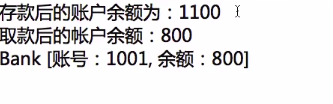
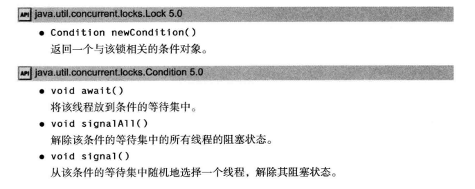
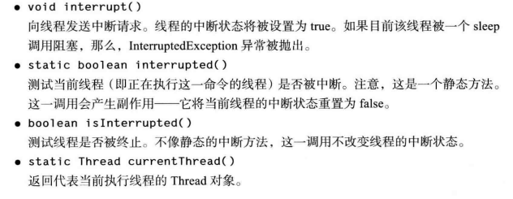

### 多任务  
操作系统的多任务指的是在同一刻运行多个程序的能力。例如，在编辑或下载邮件的同时可以打印文件。今天，人们很可能有单台拥有多个 CPU 的计算机, 但是 , 并发执行的进程数目并不是由 CPU 数目制约的。操作系统将 CPU 的时间片分配给每一个进程，给人并行处理的感觉。  
### 并行与并发  
**并行：**多个cpu或者多台机器同时执行一段处理逻辑，是真正的同时运行。  
**并发：**如果只有一个CPU，如何做到多个进程同时运行呢？我们先来看操作系统的一些相关概念。大部分操作系统(如Windows、Linux)的任务调度是采用**时间片轮转的抢占式调度方式**，即把CPU的执行时间分为很多小块，每一小块的时间相等且固定，我们把任务执行的这一小块时间叫做时间片。任务正在执行时的状态叫运行状态，一个任务执行一小段时间后会被强制暂停去执行下一个任务，被暂停的任务就处于就绪状态等待下一个属于它的时间片的到来，每个任务在CPU的调度下轮流执行。这样每个任务都能得到执行，由于CPU的执行效率非常高，时间片非常短，在各个任务之间快速地切换，给人的感觉就是多个任务在“同时进行”，这也就是我们所说的并发。
下面是时间片以及CPU轮转调度的示意图：  

### 进程  
进程是一个具有一定独立功能的程序在一个数据集上的一次动态执行的过程，是操作系统进行资源分配和调度的一个独立单位，是应用程序运行的载体。进程是一种抽象的概念，从来没有统一的标准定义。进程一般由**程序、数据集合和进程控制块**三部分组成。程序用于描述进程要完成的功能，是控制进程执行的指令集；数据集合是程序在执行时所需要的数据和工作区；程序控制块(Program Control Block，简称PCB)，包含进程的描述信息和控制信息，是进程存在的唯一标志。  

**进程具有的特征：**  
**动态性：**进程是程序的一次执行过程，是临时的，有生命期的，是动态产生，动态消亡的；  
**并发性：**任何进程都可以同其他进程一起并发执行；  
**独立性：**进程是系统进行资源分配和调度的一个独立单位；  
**结构性：**进程由程序、数据和进程控制块三部分组成。
### 线程  
在早期的操作系统中并没有线程的概念，进程是能拥有资源和独立运行的最小单位，也是程序执行的最小单位。任务调度采用的是时间片轮转的抢占式调度方式，而进程是任务调度的最小单位，每个进程有各自独立的一块内存，使得各个进程之间内存地址相互隔离。  
后来，随着计算机的发展，对CPU的要求越来越高，进程之间的切换开销较大，已经无法满足越来越复杂的程序的要求了。于是就发明了线程，线程是程序执行中一个单一的顺序控制流程，是程序执行流的最小单元，是处理器调度和分派的基本单位。一个进程可以有一个或多个线程，各个线程之间共享程序的内存空间(也就是所在进程的内存空间)。一个标准的线程由线程ID、当前指令指针(PC)、寄存器和堆栈组成。而进程由内存空间(代码、数据、进程空间、打开的文件)和一个或多个线程组成。**简言之，线程是比进程还要小的运行单位，可以看作是子程序，一个进程包含一个或多个线程。**  
#### 主线程  
JVM调用main()所产生的线程。
#### 当前线程  
当前正在运行的进程，可通过Thread.currentThread()来获取当前线程。  
#### 后台线程(守护线程)  
指为其他线程提供服务的线程，也称为守护线程。比如JVM的垃圾回收、内存管理等线程都是守护线程。当所有前台线程(用户线程)都结束，程序只剩下后台线程的时候，JVM就退出了，由于如果只剩下守护线程，就没必要继续运行程序了。可以通过isDaemon()和setDaemon()方法来判断一个线程是否为后台线程和设置一个线程为后台线程。    
守护线程有时会被初学者错误地使用，他们不打算考虑关机(shutdown)动作。但这是很危险的。守护线程应该永远不去访问固有资源, 如文件、数据库, 因为它会在任何时候甚至在一个操作的中间发生中断。比如一个守护线程在操作资源的时候，如果所有用户线程都退出了，JVM将直接杀死该守护线程而无法执行finally块中的关闭资源的语句。  

来看一个例子：  
```java
class DemoThread implements Runnable {
 
    @Override
    public void run() {
        // TODO Auto-generated method stub
        try {
            Thread.currentThread().sleep(1000);
            System.out.println("我是非守护线程");
        } catch (InterruptedException e) {
            // TODO Auto-generated catch block
            e.printStackTrace();
        };
         
    }
 
}

public class Main {
    public static void main(String[] args) {
        threadStart();
    }
     
    public static void threadStart(){
        DemoThread dt = new DemoThread();
        Thread thread = new Thread(dt);
        thread.setDaemon(true);
         
        thread.start();
    }
 
}
```
结果：  
1、当直接启动时，不会打印出内容  
2、当去掉thread.setDaemon(true)时，会打印出“我是非守护线程”。

原因分析：当thread被设置为守护线程时，主线程是前台线程，执行完之后就直接结束，JVM直接杀死thread，这个守护线程中的内容就不会继续执行下去；当去掉那一行时，thread就默认为前台线程，jvm会等所有前台线程执行完之后才会结束，thread线程就打印出内容  

#### 前台线程(用户线程、非守护线程) 
是指接受后台线程服务的线程，其实前台后台线程是联系在一起。由前台线程创建的线程默认也是前台线程。

#### 单线程  
只包含一个线程的程序，即主线程(主方法所在线程)。  

#### 多线程  
可以同时运行一个以上线程的程序。在具有多个处理器的机器上，每一个处理器运行一个线程，可以有多个线程并行运行。当然，如果线程的数目多于处理器的数目，调度器依然采用时间片机制。当选择下一个线程时，操作系统考虑线程的优先级。  

下面是单线程和多线程的关系示意图：  


### 进程和线程的区别与关系  
1.进程之间相互独立，但同一进程下的各个线程之间共享程序的内存空间(包括代码段、数据集、堆、栈、程序计数器PC等)及一些进程级的资源(如打开文件和信号)，某进程内的线程在其它进程不可见。**共享内存空间使线程之间的通信比进程之间的通信更有效、更容易，但也更具风险。**  
2.创建一个新进程或进程之间的切换会有较大的开销，线程则更"轻量级"，创建、撤销、切换一个线程比启动一个新进程的开销要小得多。  
3.一个进程由一个或多个线程组成，线程是一个进程中代码的不同执行路线。  
4.进程是操作系统进行资源分配和调度的最小单位，线程是程序执行的最小单位。    

### 线程的状态
* **新建状态:** 使用 new 关键字创建一个 Thread 类或其子类的线程对象后，该线程对象就处于新建状态。它保持这个状态直到程序调用它的start()方法启动这个线程，随后线程便进入了就绪状态。
* **就绪状态(可运行状态):** 当线程对象调用了start()方法之后，该线程并不是立即开始运行，而是进入就绪状态。就绪状态的线程处于就绪队列中，要等待JVM里线程调度器的调度，获取CPU使用权后才进入运行状态。
* **运行状态:** 如果就绪状态的线程获取 CPU 使用权，就可以执行 run()，此时线程便处于运行状态。处于运行状态的线程最为复杂，它可以变为阻塞状态、就绪状态和死亡状态。处于运行状态的线程如果CPU的时间片用完或者调用了yield()方法都会转化为就绪状态。而如果线程调用了sleep()方法、join()方法、wait()方法、获取synchronized同步锁失败或发出了I/O请求**(比如等待用户输入)**，线程都会进入阻塞状态。
* **阻塞状态:** 如果一个线程执行了sleep（睡眠）、suspend（挂起）等方法，失去所占用资源之后，该线程就从运行状态进入阻塞状态。在睡眠时间已到或获得设备资源后可以重新进入就绪状态(注意阻塞状态无法直接转入运行状态，阻塞解除只能转入就绪状态！)。可以分为三种：  
**1)等待阻塞：**运行状态中的线程执行 wait() 方法，使线程进入到**等待队列**，即进入等待阻塞状态(wait()会释放线程持有的锁)，当调用notice()或noticeAll()方法线程重新转入就绪状态。  
**2)同步阻塞：**也称**锁池状态**，线程在获取 synchronized 同步锁失败(因为同步锁被其他线程占用)进入同步阻塞状态，当其他线程释放该锁，并且线程调度器允许本线程持有它的时候，线程重新转入就绪状态。  
**3)其他阻塞：**通过调用线程的 sleep() 或 join() 或发出了 I/O 请求时，线程就会进入到阻塞状态。当sleep() 状态超时，join() 等待线程终止或超时，或者 I/O 请求完毕**(比如用户输入完毕)**，线程重新转入就绪状态。
* **死亡状态(终止状态):**
一个线程执行完毕或者异常终止，该线程就切换到终止状态。其他四个状态都可以通过调用stop()方法来进入死亡状态，但stop()方法已经过时了，不建议使用。

### 线程的生命周期  
即前面提到的线程的五个状态之间的转化，可以通过调用Thread类的方法来影响线程的生命周期。  

**下面是线程生命周期的示意图：**  
  

### Thread类  
Thread类是一个线程类，位于java.lang包下。它实现了Runnable接口。  
1、构造方法  
  
2、常量  
  
3、常见方法  
  
  
更多见大牛博客[JAVA线程-Thread类的方法](http://blog.csdn.net/u014290221/article/details/51436710)  

### Runnable接口  
* 只有一个方法run();
* Runnable是Java中用于实现线程的接口  
* 任何实现线程功能的类都必须实现该接口

### 创建线程  
创建线程主要有三种方式：  
**一、继承Thread类创建线程类**   
继承Thread类的方法尽管被列为一种多线程实现方式，但Thread本质上也是实现了Runnable接口的一个实例，它代表一个线程的实例，并且启动线程的唯一方法就是通过Thread类的start()实例方法。start()方法是一个native方法，它将启动一个新线程，并执行run()方法。这种方式实现多线程很简单，通过自己的类直接extend Thread，并复写run()方法，就可以启动新线程并执行自己定义的run()方法。  

**下面是使用这种方法创建线程的具体步骤：**   
（1）定义Thread类的子类，并重写该类的run方法，该run方法的方法体就代表了线程要完成的任务。因此把run()方法称为执行体。  
（2）创建Thread子类的实例，即创建了线程对象。  
（3）调用线程对象的start()方法来启动该线程。

来看下面的一个例子：  
```java
package cn.habitdiary.thread;
class MyThread extends Thread{
	public void run(){
		System.out.println(getName()+"该线程正在执行！");
        //通过getName()获取线程名
	}
}
public class ThreadTest {

	public static void main(String[] args) {
		System.out.println("主线程1");
		MyThread mt=new MyThread();
		mt.start();//启动线程
		System.out.println("主线程2");
	}

}
```
在上述代码中，我们就通过创建一个继承自Thread类的子类MyThread的对象来创建了一个线程mt，此时该程序中共包含3个线程，一个是mt，一个是主方法所在的主线程，一个是垃圾收集器线程。三条输出语句的打印次序是随机的，这是因为某个线程何时获得CPU的使用权是CPU轮转调度的结果。  
值得注意的是，**在Java中，每次程序运行至少启动2个线程。一个是主线程，一个是垃圾收集器线程。因为当执行一个程序的时候，实际上都会启动一个JVM，启动一个JVM就是在操作系统中启动了一个进程。**  
我们通过下面的循环输出语句可以令这种线程间的时间片轮转调度更明显：  
```java
package cn.habitdiary.thread1;
class MyThread extends Thread{
	public MyThread(String name){
		super(name);
	}
	public void run(){
		for(int i=1;i<=10;i++){
			System.out.println(getName()+"正在运行"+i);
		}
	}
}
public class ThreadTest {

	public static void main(String[] args) {
		MyThread mt1=new MyThread("线程1");
		MyThread mt2=new MyThread("线程2");
		mt1.start();
		mt2.start();
	}

}
```
运行结果如下：  
  
可以看到线程的打印语句随机交替出现，这就证明了线程获得CPU使用权是随机的。  
**注意：**  
1、不要直接调用Thread类或Runnable对象的run方法，如果直接调用run方法，只会执行同一个线程中的任务，而不会启动新的线程。启动线程的唯一方法就是通过Thread类的start()实例方法，这个方法将创建一个执行run方法的新线程。  
2、不要重复启动同一个线程，比如重复两次调用mt.start(),程序会抛出一个IllegalThreadStateException异常。  
3、这种继承Thread类创建线程类的方法已不再推荐，应该将要并行运行的任务与运行机制解耦合。如果有很多个任务，要为每个任务创建一个独立的线程所付出的代价太大了。可以使用线程池来解决这个问题，有关内容参看博客后面的内容。  

**二、通过实现Runnable接口创建线程类**  
我们使用这种方法创建线程的频率更高。  
**提供这种方式的原因有如下：**  
1.Java不支持多继承，如果自定义类已经继承另一个类，就无法继承Thread，此时，必须实现Runnable接口。  
2.我们有时不打算重写Thread类的其他方法。  

**下面是使用这种方法创建线程的具体步骤：**  
（1）定义runnable接口的实现类，并重写该接口的run()方法，该run()方法的方法体同样是该线程的线程执行体。  
（2）创建 Runnable实现类的实例，并依此实例作为Thread的构造方法Thread(Runnable target)的target参数来创建Thread对象，该Thread对象才是真正的线程对象。    
（3）调用线程对象的start()方法来启动该线程。  

来看下面一个例子：  
```java
package cn.habitdiary.runnable;

class PrintRunnable implements Runnable {
	int i = 1;
	@Override
	public void run() {
		
		while (i <= 10)
			System.out.println(Thread.currentThread().getName()
            +"正在运行" + (i++)); 
            /*无法直接调用getName()方法，而是要通过
            Thread.currentThread()先获取当前线程的
            对象，再在其上调用getName()方法*/
	}

}

public class Test {

	public static void main(String[] args) {
		PrintRunnable pr = new PrintRunnable();
		Thread t1 = new Thread(pr);
		t1.start();
		//PrintRunnable pr1 = new PrintRunnable();
		Thread t2 = new Thread(pr);
		t2.start();

	}

}
```
在这段代码中，t1和t2共享PrintRunnable对象的成员变量i，所以语句被两个线程一共交替打印了十次。如果两个线程的pr是不同的PrintRunnable对象，则两个线程交替着各打印十次语句。这就是多个线程共享资源的简单例子。

**注意：**由于Runnable只有一个抽象方法，是一个函数式接口，所以我们也可以通过**匿名内部类或lambda表达式**的方式来简化上述创建线程的步骤。  

**三、通过Callable和Future创建线程**  

**下面是使用这种方法创建线程的具体步骤：**  
（1）创建Callable接口的实现类，并实现call()方法，该call()方法将作为线程执行体，并且有返回值，Callable接口是一个泛型接口。  
（2）创建Callable实现类的实例，使用FutureTask类来包装Callable对象，该FutureTask对象封装了该Callable对象的call()方法的返回值，它是一个泛型类。  
（3）使用FutureTask对象作为Thread对象的target创建并启动新线程。  
（4）调用FutureTask对象的get()方法来获得子线程执行结束后的返回值。  

示例代码：  
```java

package cn.habitdiary.thread;

import java.util.concurrent.Callable;
import java.util.concurrent.ExecutionException;
import java.util.concurrent.FutureTask;

public class CallableThreadTest implements Callable<Integer>
{

	public static void main(String[] args)
	{
		CallableThreadTest ctt = new CallableThreadTest();
		FutureTask<Integer> ft = new FutureTask<>(ctt);
		for(int i = 0;i < 100;i++){
			System.out.println(Thread.currentThread().getName()+
            " 的循环变量i的值"+i);
		if(i==20){
			new Thread(ft,"有返回值的线程").start();
			}
		}
		try{
			System.out.println("子线程的返回值："+ft.get());
		}
        catch (InterruptedException e){
			e.printStackTrace();
		} 
        catch (ExecutionException e){
			e.printStackTrace();
		}

	}

	@Override
	public Integer call() throws Exception{
		int i;
		for(i = 0;i < 100;i++){		
        System.out.println(Thread.currentThread().getName()
        +" "+i);
		}
		return i;
	}
}
```

**四、创建线程的三种方式的对比**  

**1)采用实现Runnable、Callable接口的方式创建多线程**  
**优势：**  
1.线程类只是实现了Runnable接口或Callable接口，还可以继承其他类。  
2.在这种方式下，多个线程可以共享同一个target对象，所以非常适合多个相同线程来处理同一份资源的情况，从而可以将CPU、代码和数据分开，形成清晰的模型，较好地体现了面向对象的思想。  
3.线程池只能放入实现Runable或callable类的线程，不能直接放入继承Thread的类。
  
**劣势：**编程稍微复杂，如果要访问当前线程，则必须使用Thread.currentThread()方法。  

**2)使用继承Thread类的方式创建多线程**  
**优势：**编写简单，如果需要访问当前线程，则无需使用Thread.currentThread()方法，直接使用this即可获得当前线程。  
**劣势：**线程类已经继承了Thread类，所以不能再继承其他父类。且继承Thread不适合线程间进行资源共享。

### 线程调度
#### 1、线程的优先级  
每一个 Java 线程都有一个优先级，这样有助于操作系统确定线程的调度顺序。JVM提供了10个线程优先级，即1到10的整数，超出这个范围会抛出异常，但它们与常见的操作系统都不能很好的映射，比如Windows只有7个优先级。如果希望程序能移植到各个操作系统中，应该仅仅使用Thread类里三个静态常量作为优先级，这样能保证同样的优先级采用了同样的调度方式。主线程的优先级为5。默认情况下，一个线程继承它的父线程的优先级。  
Thread类中提供了三个常量来表示优先级，分别为：  
Thread.MIN_PRIORITY(等价于1)  
Thread.MAX_PRIORITY(等价于10)  
Thread.NORM_PRIORITY(等价于5)  
每当线程调度器有机会选择新线程时，它首先选择具有较高优先级的线程。但是，线程优先级是高度依赖于操作系统环境和CPU的调度方式的，不能保证线程执行的顺序，即优先级高的线程呢不一定先执行。例如虽然设置了优先级，但启动线程start()有先后顺序等影响了线程的执行顺序。初级程序员常常过度使用线程优先级，不要将程序构建为功能的正确性依赖于优先级。  
如果确实要使用优先级，应该避免初学者常犯的一个错误。如果有几个高优先级的线程没有进入非活动状态，低优先级的线程可能永远也不能执行。每当调度器决定运行一个新线程时,首先会在具有高优先级的线程中进行选择,尽管这样会使低优先级的线程完全饿死。  

Thread类提供了改变和获取某线程优先级的方法  
  

#### 2、线程休眠  
线程休眠是使线程让出CPU使用权的最简单做法，某线程休眠的时候，会将CPU交给其他线程，以便轮换执行，而它自身进入阻塞状态，休眠一定时间后，线程会苏醒，进入就绪状态等待执行。线程的休眠方法是`Thread.sleep(long millis)`和`Thread.sleep(long millis,int nanos)`，均为静态方法，millis参数设定睡眠的时间，以毫秒为单位。**调用sleep休眠的哪个线程呢？在哪个线程中调用sleep，哪个线程就休眠。**  
来看一个例子，线程1休眠后，让出CPU，线程2执行，线程2执行完后，线程2休眠，让出CPU供线程1执行(此时线程1已经休眠结束，在就绪状态)，如此循环执行，直到结束。  

```java
 package Thread;
  
 public class SleepTest {
      public static void main(String[] args){
          Thread t1=new MyThread_1();
          Thread t2=new Thread(new MyRunnable1());
          t1.start();
          t2.start();
      }
 }
class MyThread_1 extends Thread{
     public void run(){
         for(int i=0;i<3;i++){
             System.out.println("线程1第"+i+"次执行！");
             try{
                 Thread.sleep(500);
             }catch(InterruptedException e){
                 e.printStackTrace();
             }
         }
     }
 }
class MyRunnable1 implements Runnable{
     public void run(){
         for(int i=0;i<3;i++){
             System.out.println("线程2第"+i+"次执行！");
             try{
                 Thread.sleep(500);
             }catch(InterruptedException e){
                 e.printStackTrace();
             }
         }
     }
 }
```
结果如下：  


**注意：**调用sleep()方法时必须处理可能抛出的InterruptedException，一般用try-catch块即可。  

**sleep方法的应用场景：**可以实现计时器效果或定期刷新数据的效果，但是由于线程在苏醒之后不会直接进入运行状态，而是进入就绪状态等待获取CPU使用权，所以同一线程两次执行的时间间隔会略大于休眠时间，不能保证精确定时。  

**我是彩蛋:** 了解了线程休眠，我们就可以写出传说中的睡眠排序了hhh，参考大牛博客[排序算法--睡眠排序、面条排序、猴子排序 (非常严肃)](https://www.jianshu.com/p/4f526ea40df4)
#### 3、线程加入  
join方法，重载形式如下：  

在当前线程中调用要加入的线程的join()方法，则当前线程转入阻塞状态，转而执行新加入的线程，即新加入的线程被优先执行，抢占了CPU资源，直到该进程运行结束(如果调用带参的join方法，则超出时限该进程就会让出CPU)，当前线程再由阻塞转为就绪状态。可以认为join方法的作用是父线程等待子线程执行完成后再执行，换句话说是将异步执行的线程合并为同步执行的线程。  

下面是一个例子：  
```java
package com.imooc.join;

class MyThread extends Thread{
	public void run(){
		for(int i=1;i<=500;i++)
		System.out.println(getName()+"正在执行"+i+"次！");
	}
}
public class JoinDemo {

	public static void main(String[] args) {
		MyThread mt=new MyThread();
		mt.start();
		try {
			mt.join(1);
		} catch (InterruptedException e) {
			e.printStackTrace();
		}
		for(int i=1;i<=20;i++){
			System.out.println("主线程运行第"+i+"次！");
		}
		System.out.println("主线程运行结束！");
	}

}
```
**注意：**join方法也会抛出InterruptedException，要进行异常处理。  

#### 4、线程让步  
让步使用Thread.yield()方法，yield方法为静态方法，功能是让当前运行线程回到可运行状态，以允许具有**相同优先级的其他线程**获得运行机会。因此，使用yield()的目的是让相同优先级的线程之间能适当的轮转执行。但是，实际中无法保证yield()达到让步目的，因为让步的线程还有可能被线程调度程序再次选中。让出的时间和让出给哪个线程都是不可设定的，所以执行yield()的线程有可能在进入到可执行状态后马上又被执行。  
实际上，yield()方法对应了如下操作：先检测当前是否有相同优先级的线程处于同可运行状态，如有，则把 CPU  的占有权交给此线程，否则，继续运行原来的线程。所以yield()方法称为“退让”，它把运行机会让给了**同等优先级**的其他线程。
例子：一个线程先让步，让另一个线程先执行，然后再执行该线程。  
```java
package cn.habitdiary.thread;
public class YieldTest {
	public static void main(String[] args){
          Thread t1=new MyThread();
          Thread t2=new Thread(new MyRunnable());
          t2.start();
          t1.start();
          
      }
 }
 class MyThread extends Thread{
     public void run(){
         for(int i=0;i<10;i++){
             System.out.println("线程1第"+i+"次执行！");
             }
     }
 }
 class MyRunnable implements Runnable{
     public void run(){
         for(int i=0;i<10;i++){
             System.out.println("线程2第"+i+"次执行！");
             Thread.yield();
          }
     }
 }
```

**sleep()和yield()的区别**  
    sleep()使当前线程进入阻塞状态，所以执行sleep()的线程在指定的时间内肯定不会被执行；yield()只是使当前线程重新回到可执行状态，所以执行yield()的线程有可能在进入到可执行状态后马上又被执行。  
    sleep 方法使当前运行中的线程休眠一段时间，进入阻塞状态，这段时间的长短是由程序设定的，yield 方法使当前线程让出 CPU 占有权，但让出的时间是不可设定的。
       另外，sleep 方法允许较低优先级的线程获得运行机会，但 yield()方法执行时，当前线程仍处在就绪状态，所以，不可能让出较低优先级的线程些时获得 CPU 占有权。在一个运行系统中，如果较高优先级的线程没有调用 sleep() 方法，又没有受到 I\O 阻塞，那么，较低优先级线程只能等待所有较高优先级的线程运行结束，才有机会运行。   
#### 5、未捕获异常处理器  
### 线程同步  
在大多数实际的多线程应用中, 两个或两个以上的线程需要共享对同一数据的存取。如果两个线程存取相同的对象, 并且每一个线程都调用了一个修改该对象状态的方法，将会发生什么呢？可以想象,线程彼此踩了对方的脚。根据各线程访问数据的次序，可能会产生讹误的对象。这样一个情况通常称为**竞争条件(race condition)**。  

我们先来看一个银行存取款的例子。  

**Bank类**
```java
package cn.habitdiary.bank;

public class Bank {
	private String account;// 账号
	private int balance;// 账户余额

	public Bank(String account, int balance) {
		this.account = account;
		this.balance = balance;
	}

	public String getAccount() {
		return account;
	}

	public void setAccount(String account) {
		this.account = account;
	}

	public int getBalance() {
		return balance;
	}

	public void setBalance(int balance) {
		this.balance = balance;
	}

	@Override
	public String toString() {
		return "Bank [账号：" + account + ", 余额：" 
        + balance + "]";
	}

	// 存款
	public void saveAccount() {
		// 获取当前的账号余额
		int balance = getBalance();
		try {
			Thread.sleep(1000);
		} catch (InterruptedException e) {
			e.printStackTrace();
		}
		// 修改余额，存100元
		balance += 100;
		// 修改账户余额
		setBalance(balance);
		// 输出存款后的账户余额
		System.out.println("存款后的账户余额为：" + balance);
	}

	public void drawAccount() {
		   /* 在不同的位置处添加sleep方法来模拟方法在执行过程因为
           时间片轮转而发生暂停的情况*/

			// 获得当前的帐户余额
			int balance = getBalance();
			// 修改余额，取200
			balance = balance - 200;
			try {
				Thread.sleep(1000);
			} catch (InterruptedException e) {
				// TODO Auto-generated catch block
				e.printStackTrace();
			}
			// 修改帐户余额
			setBalance(balance);
			System.out.println("取款后的帐户余额：" + balance);

	}
}
```

**SaveAccount类**  
```java
package cn.habitdiary.bank;
//存款
public class SaveAccount implements Runnable{
	Bank bank;
	public SaveAccount(Bank bank){
		this.bank=bank;
	}
	public void run(){
		bank.saveAccount();
	}
}
```

**DrawAccount类**  
```java
package com.imooc.bank;
//取款
public class DrawAccount implements Runnable{
	Bank bank;
	public DrawAccount(Bank bank){
		this.bank=bank;
	}
	@Override
	public void run() {
		bank.drawAccount();
	}
	
}
```
**Test类**  
```java
package com.imooc.bank;

public class Test {

	public static void main(String[] args) {
		// 创建帐户，给定余额为1000
		Bank bank=new Bank("1001",1000);
		//创建线程对象
		SaveAccount sa=new SaveAccount(bank);
		DrawAccount da=new DrawAccount(bank);
		Thread save=new Thread(sa);
		Thread draw=new Thread(da);
		save.start();
		draw.start();
		try {
			draw.join();
			save.join();
		} catch (InterruptedException e) {
			e.printStackTrace();
		}
		System.out.println(bank);
	}

}
```
我们把程序设计为账户初始金额1000元，存100元，取200元，余额应该为900元。但输出结果如下：  
  

这样的银行系统给人极不可靠的感觉，我们来分析一下原因：由于存取款方法都对同一个数据balance进行操作，很可能在执行存款方法的SaveAccount线程运行到`balance += 100`时被剥夺了CPU使用权，所以还没来得及修改账户余额，而其中的balance局部变量为1100。此时转入执行取款方法的DrawAccount线程，由于账户余额未被修改还是1000，当这个线程运行到`balance = balance + 200;`时，balance局部变量为800，此时线程可能又转入SaveAccount线程，继续执行setBalance方法把账户余额设置为1100元并打印输出，之后又回到DrawAccount把账户余额设置为800元再打印输出，于是造成了混乱。  
混乱的可能还不只如此，这里我们引入一个**原子性**的概念。在Java中，对基本数据类型的变量的**读取和简单赋值操作**是原子性操作，即这些操作是不可被中断的，要么执行，要么不执行。  
比如下面4条赋值语句：  
1）x = 10  　　　　2）x = y  　　　3）x++ 　　　4）x = x + 2  
**只有1)是原子性操作，2)要先读取y的值并放入寄存器，再赋值给内存中的x，3)和4)则都要先读取x的值。**  
所以一条非原子性的Java语句由多条指令组成，它在执行过程中的任何一个时间点都可能被其他线程打断。  
所以上述问题的发生的原因就在于存取款方法不是原子性的，它们在执行的过程中可能被其他线程在随机时间点打断，而这些方法操作的又是同一个数据，所以造成了数据更新延迟、更新的数据被覆盖等讹误。

为了解决这一问题达到线程同步的目的。我们需要引入**锁**。多线程的锁，其实本质上就是给一块内存空间的访问添加访问权限，因为Java中是没有办法直接对某一块内存进行操作的，又因为Java是面向对象的语言，一切皆对象，所以具体的表现就是某一个对象承担锁的功能，每一个对象都可以是一个锁。现在的Java语言中，提供了2种锁，一种是语言特性提供的内置锁，还有一种是java.util.concurrent.locks 包中的显式锁。我们来一一介绍： 
#### 1、内置锁 
内置锁是用语言特性实现的锁，即使用 synchronized 关键字，又叫同步锁、互斥锁，Java的所有对象都有一个同步锁，甚至每个类的class对象也对应一个同步锁。  
我们先引入一个临界区的概念，**临界区是一个用以访问共享资源的代码块，这个代码块在同一时间内只允许一个线程执行**。  
Java提供了同步机制。当一个线程试图访问一个临界区时，它将使用一种同步机制来查看是不是已有其他线程进入临界区。如果没有其他线程进入临界区，它就可以进入临界区，即获得了该同步锁；如果已有线程进入了临界区，即同步锁被其他线程占用，它就被同步机制挂起，直到进入的线程离开这个临界区并释放锁，JVM允许它持有锁才能进入临界区。如果在等待进入临界区的线程不止一个，JVM会随机选择其中的一个，其余的将继续等待。  
**使用synchronized内置锁的好处在于，无论线程是执行完临界区代码正常退出还是抛出异常，JVM都会自动释放锁。**   

synchronized 修饰的对象包括以下几种：  
#### 修饰一个代码块  
被修饰的代码块称为**同步代码块**，其作用的范围(临界区)是大括号{}括起来的代码，锁住的对象是括号里的obj对象。   
例如：  
```java
	synchronized(obj)  /*obj是同步锁锁住的对象,如果是this，
                         就表示锁住当前对象*/
    {
        System.out.println("我是同步代码块");
        try
        {
            Thread.sleep(500);
        } catch (InterruptedException e)
        {
            e.printStackTrace();
        }
    }
```
#### 修饰一个非静态方法  
被修饰的方法称为同步方法，临界区是整个方法，锁住的对象是调用这个方法的对象。   
例如：
```java
public synchronized void Method() 
{ 
	System.out.println("我是同步方法1"); 
	try 
	{ 
		Thread.sleep(500); 
	} 
    catch (InterruptedException e) 
	{ 
		e.printStackTrace(); 
	}
}
```
下面使用同步代码块的写法是等价的，临界区是整个方法，锁住的也是调用方法的对象：  
```java
public void Method() 
{ 
	synchronized(this){
    	System.out.println("我是同步方法2"); 
		try 
		{ 
			Thread.sleep(500); 
		} 
    	catch (InterruptedException e) 
		{ 
		e.printStackTrace(); 
		}
    }
}在
```
#### 修改一个类
其临界区是synchronized后面大括号括起来的部分，作用的对象是这个类的所有对象。  
```java
 synchronized(Test.class){
        System.out.println(＂我修饰Test类＂);
        try
  		{
            Thread.sleep(500);
        } 
        catch (InterruptedException e)
        {
            e.printStackTrace();
        }
 }
```
#### 修饰一个静态方法  
其临界区是整个静态方法，锁住的对象是这个类的所有对象。 
例如：  
```java
public class Test{
	public static synchronized void Method(){ 
	System.out.println("我修饰静态方法"); 
	try 
	{ 
		Thread.sleep(500); 
	} 
    catch (InterruptedException e) 
	{ 
		e.printStackTrace(); 
	}
 }
}

```
下面使用同步代码块的写法是等价的，临界区是整个静态方法，锁住的对象也是这个类的所有对象。  
```java
public void Method()
{
    synchronized (Test.class)
    {
        System.out.println(＂我修饰静态方法＂);
        try
        {
            Thread.sleep(500);
        } catch (InterruptedException e)
        {
            e.printStackTrace();
        }

    }

}
```
#### 对象锁(方法锁)和类锁  
根据锁住的是对象还是类，我们把同步锁分为**对象锁(方法锁)和类锁。**  
对象锁就是方法锁，是用于非静态方法或者一个对象实例上的;类锁是用于类的静态方法或者一个类的class对象上的。我们知道，类的对象实例可以有很多个，但是每个类只有一个class对象，所以不同对象实例的对象锁是互不干扰的，但是每个类只有一个类锁。  
**也就是说，对象锁只是锁住了一个对象的代码段，防止多个线程同时执行同一对象的同一代码段，但多个线程访问不同对象的这一代码段不受干扰。而类锁则可以锁住同一个类的所有实例对象，它起到了全局锁的作用，真正锁住了代码段。**

例子见大牛博客：[synchronized锁住的是代码还是对象](https://www.cnblogs.com/QQParadise/articles/5059824.html)

**注意：** 我们在用synchronized关键字的时候，能缩小代码段的范围就尽量缩小，能在代码段上加同步就不要再整个方法上加同步。这叫减小锁的粒度，使代码更大程度的并发。原因是基于以上的思想，锁的代码段过长，其他线程等待进入临界区的时间会很长。

**学习了synchronized关键字，我们就可以解决银行转账的讹误了！只要用给setAccount()和drawAccount()加锁即可。**

**使用内置锁的缺点：**内置锁在采取的是无限等待的策略，一旦开始等待，就既不能中断也不能取消，容易产生饥饿与死锁的问题。在线程调用notify方法时，会随机选择相应对象的等待队列的一个线程将其唤醒，而不是按照FIFO(先入先出)的方式，如果有强烈的公平性要求，就无法满足。  

#### 2、显式锁  
java.util.concurrent.locks 包中提供了可重入锁(ReentrantLock)，是一种递归无阻塞的同步机制。它是一种显式锁，需要显式进行 lock 以及 unlock 操作。  

用 ReentrantLock 保护代码块的基本结构如下 :
```java
myLock.lock() ; // myLock是一个ReentrantLock对象
try
{
  //被同步的临界区
}
finally
{
myLock.unlock(); //即使异常抛出也要关闭锁
}
```
这一结构确保任何时刻只有一个线程进人临界区。一旦一个线程封锁了锁对象，其他任何线程都无法通过 lock 语句。当其他线程调用 lock 时，它们被阻塞，直到第一个线程释放锁对象。  

**可重入锁：**又称递归锁，可重入是指一个线程可以重复获得已持有的锁。即一个线程获得了某个对象的锁，此时这个对象还没有释放，当这个线程再次想获得这个对象的锁的时候还是可以获得的。**synchronized和ReentrantLock都是可重入的。**  
应用场景：  
1、递归调用一个带锁的方法  
2、在一个带锁的方法里嵌套调用另一个需要同一个对象的锁的方法。  
**如果锁是不可重入的，那么内部方法将无法获得外部方法的锁，一直等待外部方法释放该锁，于是造成了死锁。** 

每个锁关联一个线程持有者和一个计数器。当计数器为0时表示该锁没有被任何线程持有，那么任何线程都都可能获得该锁而调用相应方法。当一个线程请求成功后，JVM会记下持有锁的线程，并将计数器计加1。此时其他线程请求该锁，则必须等待。而该持有锁的线程如果再次请求这个锁，就可以再次拿到这个锁，同时计数器会递增。当线程退出一个ReentrantLock锁住的方法或synchronized方法/块时，计数器会递减，直到计数器为0才释放该锁。  

**注意：**  
1.把解锁操作置于 finally 子句之内是至关重要的。如果在临界区的代码抛出异常，锁必须被释放。否则，其他线程将永远阻塞。  
2.如果使用锁，就不能使用带资源的 try 语句。首先，解锁方法名不是 close。不过，即使将它重命名，带资源的 try 语句也无法正常工作。它的首部希望声明一个新变量。但是如果使用一个锁，你可能想使用多个线程共享的那个变量 (而不是新变量)。


#### 条件对象  
通常, 线程进人临界区，却发现在某一条件满足之后它才能执行。要使用一个条件对象来管理那些已经获得了一个锁但是却不能做有用工作的线程，我们在条件对象上可以调用Condition类的await(),signal(),signalAll()方法，它们的功能分别对应Object类的wait(),notify(),notifyAll()方法，但前者一般和ReentrantLock配合使用，后者和synchronized块配合使用。我们来介绍Java 库中条件对象的实现。  
下面是条件对象相关的API  
  

我们来看一个满足账户余额充足条件才能取款的例子。  
```java
class Bank
{
	private Condition sufficientFunds; //条件对象
    private Lock bankLock = new ReentrantLock(); //锁对象
    private int balance;//账户余额
    ...
    public Bank()
    {
    	...
        sufficientFunds = bankLock.newCondition();
        //获得该锁的条件对象
    }
    
    public void drawAccount(int amount)
    {
    	bankLock.lock();
        try
        {
        	while(balance < amount)
            	sufficientFunds.await();
            //saveAccount
            ...
            sufficientFunds.signalAll();
         }
         finally
         {
         	bankLock.unlock();
         }
   }
```
我们一般使用类似结构检测条件是否满足：  
```java
while(!(ok to proceed))
	condition.await();
```


### 线程中断  
当线程的 run 方法执行方法体中最后一条语句后，或者出现了在方法中没有捕获的异常时, 线程将终止。在 Java 的早期版本中，还有一个 stop 方法, 其他线程可以调用它终止线程。但是，这个方法现在已经被弃用了。  
没有可以强制线程终止的方法。然而,interrupt方法可以用来**请求终止线程**。  
当对一个线程调用 interrupt 方法时, 线程的中断状态将被置位。这是每一个线程都具有的 boolean 标志。每个线程都应该**不时地检査这个标志**，以判断线程是否被中断。要想弄清中断状态是否被置位，首先调用静态的Thread.currentThread方法获得当前线程，然后调用 islnterrupted 方法:  
```java
while (!Thread.currentThread().isInterrupted() && more work to do)
{
do more work
}
```
但是，如果线程被阻塞，就无法检测中断状态。这是产生 InterruptedException 异常的地方。当在一个被阻塞的线程 (调用 sleep 或 wait)上调用 interrupt 方法时, 阻塞调用将会被 InterruptedException 异常中断。  
没有任何语言方面的需求要求一个被中断的线程应该终止。中断一个线程不过是引起它的注意。被中断的线程可以决定如何响应中断。某些线程是如此重要以至于应该处理完异常后，继续执行，而不理会中断。**但是, 更普遍的情况是, 线程将简单地将中断作为一个终止的请求。**这种线程的 run 方法具有如下形式：  
```java
Runnable r= () -> {
	try{
    	...
		while (!Thread.currentThread().isInterrupted && 
    	more work to do){
				do more work
			}
		}
	catch(InterruptedException e){
	// thread was interruputed during sleep or wait
	}
	finally{
	 cleanup,if required
    }// exiting the run method terminates the thread
};
```
如果在每次工作迭代之后都调用 sleep 方法 (或者其他的可阻塞方法，isInterrupted 检测既没有必要也没有用处。如果在中断状态被置位时调用 sleep 方法，它不会休眠。相反，它将清除这一状态并拋出InterruptedException。因此,如果你的循环调用sleep,不要检测中断状态。相反,要如下所示捕获InterruptedException异常:  
```java
Runnable r= () -> {
	try{
    	...
		while (more work to do){
				do more work
                Thread.sleep(delay);
			}
		}
	catch(InterruptedException e){
	// thread was interruputed during sleep or wait
	}
	finally{
	 cleanup,if required
    }// exiting the run method terminates the thread
};
```
**注意：**有两个非常类似的方法, interrupted 和isInterrupted。Interrupted 方法是一个静态方法，它检测当前的线程是否被中断。而且，调用 interrupted 方法会清除该线程的中断状态。另一方面，isInterrupted 方法是一个实例方法，可用来检验是否有线程被中断。调用这个方法不会改变中断状态。  

在很多发布的代码中会发现 InterruptedException 异常被抑制在很低的层次上，像这样：  
```java
void mySubTask(){
	...
	try { sleep(delay) ; }
	catch(InterruptedException e) { } // Don't ignore!
	...
}
```
不要这样做！如果不认为在 catch 子句中做这一处理有什么好处的话，仍然有两种合理的选择:  
* 在 catch 子句中调用 Thread.currentThread().interrupt() 来设置中断状态。于是，调用者可以对其进行检测。

```java
void mySubTask()
{
	...
	try { sleep(delay);}
	catch(InterruptedException e) 
	{
		Thread.currentThread().interrupt();
	} 
...
}
```
* 或者, 更好的选择是, 用 throws InterruptedException 标记你的方法, 不采用 try 语句块捕获异常。于是，调用者(或者 最终的 run 方法)可以捕获这一异常。  

```java
void mySubTask() throws InterruptedException
{
	...
    sleep(delay);
    ...
}
```
下面是与线程中断有关的API  


### 线程间通信  
有时我们需要在线程之间进行通信，如上面银行的例子，如果账户余额不足，就要通知取款的线程暂停取款，等存款的线程把钱存入银行后再取款。
#### 线程等待和线程通知  
我们来了解几个**用于同步方法和同步代码块中**进行线程间通信的常用方法。**它们都是Object类的final方法，都只能在同步方法或同步代码块中调用，否则将抛出一个IllegalMonitorStateException。**  

**wait方法**  
wait()方法导致进入该同步方法或同步代码块的线程进入等待阻塞状态，并释放它持有的同步锁，它有三个重载的方法。  
1.void wait()  
导致进入该方法的线程进入等待状态，直到它被通知或者被中断。  
2.wait(long millis) 设定一个超时间隔，如果在规定时间内没有被通知或中断，线程将被唤醒，millis是毫秒数。  
3.wait(long millis,int nanos) 设定一个超时间隔，如果在规定时间内没有被通知或中断，线程将被唤醒，millis是毫秒数，nanos是纳秒数。  
  
如果在等待阻塞状态线程被中断会抛出一个InterruptedException异常。  

**notify方法**  
在同步方法或同步代码块调用该方法后，JVM会随机选择一个在该对象上调用wait方法的的线程，解除其阻塞状态。

**notifyAll方法**  
在同步方法或同步代码块调用该方法后，会解除所有在该对象上调用wait方法的线程的阻塞状态。  

**注意：**线程被唤醒只是从等待阻塞状态进入了就绪状态，可以参与锁的竞争，但并不代表它已经获得了锁。  

#### sleep方法和wait方法的区别  
最简单的区别是，wait方法只能用于同步方法或同步代码块，而sleep方法可以直接调用。而更深层次的区别在于sleep方法只是暂时让出CPU的执行权，并不释放同步锁。而wait方法则会释放锁。sleep()必须捕获异常，wait()不用捕获异常。一个调用了sleep()或wait()方法的线程如果调用interrupt()方法请求中断，都会立即抛出InterruptedException。  

#### 生产者-消费者模型  
下面使用wait()和notifyAll()配合实现一个经典的生产者-消费者模型，即一个线程生产，一个线程消费。  
```java
//Queue.java
package cn.habitdiary.queue;

public class Queue {
	private int n;
	boolean flag=false;
	
	public synchronized int get() {
		if(!flag){
			try {
				wait();
			} catch (InterruptedException e) {
				// TODO Auto-generated catch block
				e.printStackTrace();
			}
		}
		System.out.println("消费："+n);
		flag=false;//消费完毕，容器中没有数据
		notifyAll();
		return n;
	}

	public synchronized void set(int n) {
		if(flag){
			try {
				wait();
			} catch (InterruptedException e) {
				e.printStackTrace();
			}
		}
		System.out.println("生产："+n);
		this.n = n;
		flag=true;//生产完毕，容器中已经有数据
		notifyAll();
	}
	
}
```

```java
//Producer.java
package cn.habitdiary.queue;

public class Producer implements Runnable{
	Queue queue;
	Producer(Queue queue){
		this.queue=queue;
	}

	@Override
	public void run() {
		int i=0;
		while(true){
			queue.set(i++);
			try {
				Thread.sleep(1000);
			} catch (InterruptedException e) {
				e.printStackTrace();
			}
		}
		
	}

}
```

```java
//Consumer.java
package cn.habitdiary.queue;

public class Consumer implements Runnable{
	Queue queue;
	Consumer(Queue queue){
		this.queue=queue;
	}

	@Override
	public void run() {
		while(true){
			queue.get();
			try {
				Thread.sleep(1000);
			} catch (InterruptedException e) {
				// TODO Auto-generated catch block
				e.printStackTrace();
			}
		}
	}
	
}
```

```java
package cn.habitdiary.queue;

public class Test {

	public static void main(String[] args) {
		Queue queue=new Queue();
		new Thread(new Producer(queue)).start();
		new Thread(new Consumer(queue)).start();
	}

}
```
### 线程死锁  
如果最后一个活动线程在解除其他线程的阻塞状态之前就调用了wait()或await()，那么它也被阻塞，没有任何线程可以解除其他线程的阻塞，所有的线程都在互相等待，那么程序就发生了死锁。