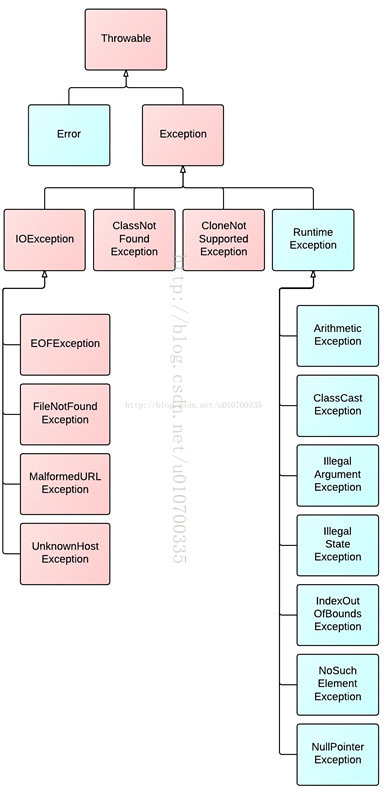
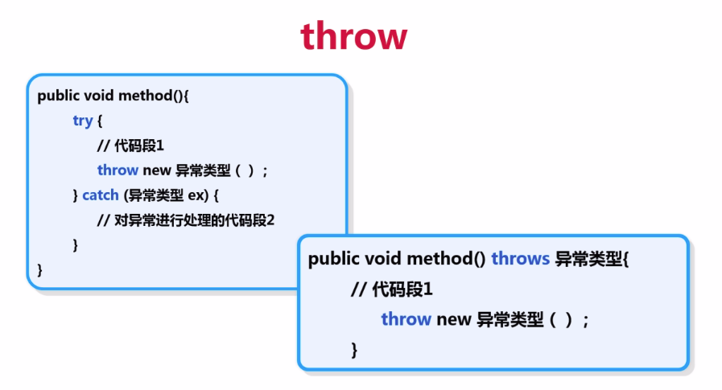
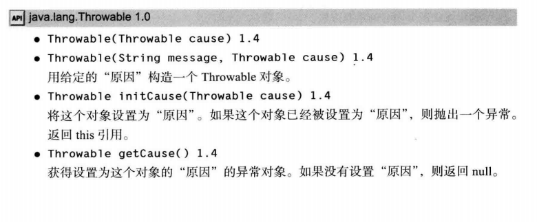
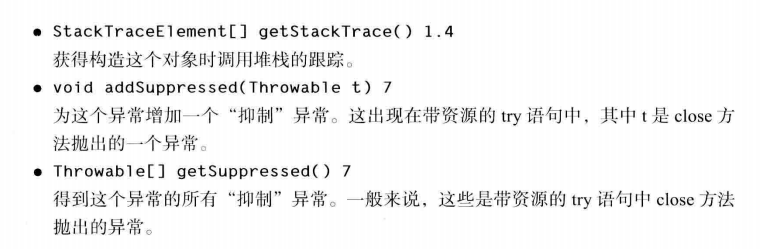
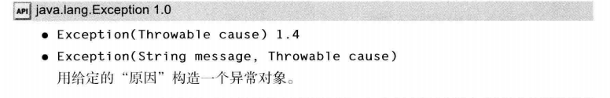
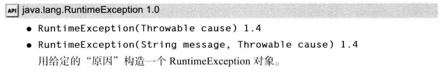
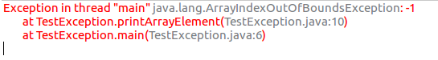
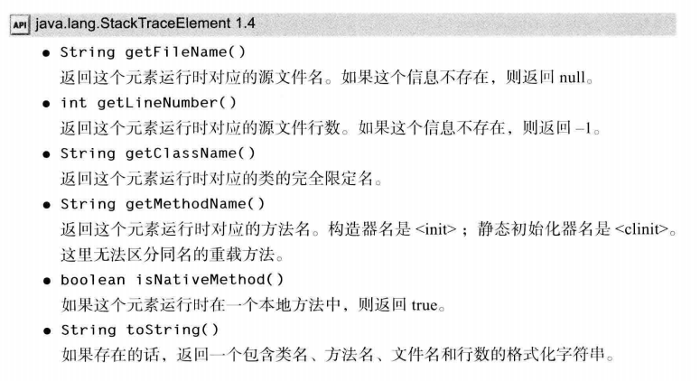
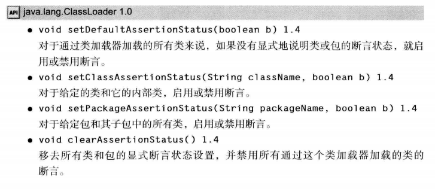

### 引言  
在程序运行过程中**(注意是运行阶段，程序可以通过编译)**，如果JVM检测出一个不可能执行的操作，就会出现**运行时错误**。例如，使用一个越界的下标访问数组，程序就会产生一个ArrayIndexOutOfBoundsException的运行时错误。如果程序需要输入一个整数的时候用户输入了一个double值，会得到一个InputMismatchException的运行时错误。  
在Java中，运行时错误会作为**异常**抛出。**异常**就是一种对象，表示阻止正常进行程序执行的错误或者情况。如果异常没有被处理，那么程序就会非正常终止。  
人们在遇到错误时会感觉不爽。如果一个用户在运行程序期间，由于程序的错误或一些外部环境的影响造成用户数据的丢失，用户就有可能不再使用这个程序了，为了避免这类事
情的发生，至少应该做到以下几点：  
* 向用户通告错误
* 保存所有的工作结果
* 允许用户以妥善的形式退出程序  

Java使用一种称为**异常处理**的错误捕获机制处理，从而使程序继续运行或优雅终止。  
### 异常处理概述  
异常处理使得程序可以处理非预期的情景，并且继续正常的处理。  
我们来看一个读取两个整数并显示它们商的例子：  
```java
public class Quotient{
	public static void main(String[] args){
    	Scanner input = new Scanner(System.in);
        System.out.print("Enter two integers: ");
        int number1 = input.nextInt();
        int number2 = input.nextInt();
        System.out.println(number1 + " / " + number2 
        + " is " + (number1 / number2));
     }
}
```
如果number2为0,就会产生一个运行时错误，因为不能用一个整数除以0(注意，一个浮点数除以0不会产生异常)。  
我们可以添加一个if语句来测试第二个数据：  
```java
public class Quotient{
	public static void main(String[] args){
    	Scanner input = new Scanner(System.in);
        System.out.print("Enter two integers: ");
        int number1 = input.nextInt();
        int number2 = input.nextInt();
        if(number2 != 0)
        	System.out.println(number1 + " / " + number2 
        + " is " + (number1 / number2));
        else
        	System.out.println("Divisor cannot be zero");
     }
}
```
为了介绍异常处理，我们使用一个**方法**来实现两个整数求商的操作：  
```java
public class QuotientWithMethod {
	public static int quotient(int number1,int number2) {
    if(number2 == 0) {
    	System.out.println("Divisor cannot be zero");
        System.exit(0);
       }
       return number1 / number2;
  }
  public static void main(String[] args) {
	Scanner input = new Scanner(System.in);
    System.out.print("Enter two integers: ");
    int number1 = input.nextInt();
    int number2 = input.nextInt();
    int result = quotient(number1,number2);
    System.out.println(number1 + " / " + number2 
    + " is " + result);
```
但上述代码有一个问题：当number2为0时，程序在quotient方法内终止。但不应该让一个方法来终止程序 —— **应该由方法的调用者决定是否终止程序，即方法只需要通知其调用者有运行时错误产生，而不应该自己做决定。**  
下面使用异常处理的方法，让quotient方法抛出一个异常，使其被调用这捕获和处理：  
```java
public class QuotientWithException {
	public static int quotient(int number1,int number2) {
    	if (number2 == 0) 
         throw new ArithmeticException("Divisor cannot be zero");
        return number1 / number2;
  }
  
  public static void main(String[] args) {
  	Scanner input = new Scanner(System.in);
    System.out.print("Enter two integers: ");
    int number1 = input.nextInt();
    int number2 = input.nextInt();
    try{
    	int result = quotient(number1,number2);
        System.out.println(number1 + " / " + number2 + " is "
        + result);
    }
    catch(ArithmeticException ex) {
		System.out.println("Exception: an integer " + 
        "cannot be divided by zero");
    }
    
    System.out.println("Execution continues ...");
    }
}
```
我们可以看到，上面的代码能使方法抛出一个异常给调用者，并由调用者处理该异常。如果不这么做，被调用的方法本身必须处理异常或者终止程序。但是库方法在设计时通常无法确定在出错时要进行什么操作，最好的做法就是将检测出的错误作为异常抛出给调用者处理，查阅API我们也会发现库方法会对其可能抛出的异常进行说明。异常处理的最根本优势就是**将检测错误(由被调用的方法完成)从处理错误(由调用方法完成)中分离出来。**  
当然，如果运行时错误发生在main方法中，就不必抛出异常了，可以考虑提供一个异常处理器对异常进行捕获和处理。  
### 异常类型  
异常是对象，而对象都采用类来定义。在 Java 程序设计语言中， 异常对象都是派生于 Throwable 类的一个实例。稍后还可以看到，如果 Java 中内置的异常类不能够满足需求，用户可以创建自己的异常类。  

下面是Java中的异常层次结构：  

  
可以看到，Throwable是所有异常类的根类，所有异常类都直接或间接继承自 Throwable。但在下一层立即分解为两个分支：Error 和 Exception。  
**Error 类层次结构描述了 Java 运行时系统的内部错误和资源耗尽错误。**应用程序不应该抛出这种类型的对象。 如果出现了这样的内部错误， 除了通告给用户，并尽力使程序安全地终止之外， 再也无能为力了。这种情况很少出现。  
在设计 Java 程序时， 需要关注 Exception 层次结构。 这个层次结构又分解为两个分支：
一个分支派生于 RuntimeException ; 另一个分支包含其他异常。划分两个分支的规则是：由程序错误导致的异常属于RuntimeException;而程序本身没有问题，但由于像 I/O 错误这类
问题导致的异常属于其他异常。  
有一条相当有道理的规则：**如果出现 RuntimeException，那么就一定是你的问题**。  
也就是说，RuntimeException是可以在编程时避免的。比如，可以通过检测数组下标是否越界来避免IndexOutOfBoundsException，可以通过在使用变量前检测是否为null杜绝NullPointerException。  

**免检异常：**又称非受查异常(Unchecked Exception)，RuntimeException、Error以及它们的子类都称为免检异常。意思是编译器不会强制检查程序是否处理或声明了异常。如果想让使用某方法的程序员注意到方法可能抛出的免检异常，可以给该方法加上文档注释。  
**必检异常：**又称受查异常(Checked Exception)，除了免检异常的其他异常都是必检异常，意思是编译器会强制程序员检查并通过try-catch语句处理它们，或者在方法头进行声明，否则无法通过编译。  
### 关于异常处理的更多知识  
**异常处理器是通过从当前的方法开始，沿着方法调用链，按照异常的反向传播方向找到的。**即如果某方法的异常没有在该方法内被捕获和处理，就会被抛出给它的调用者，并在调用者中搜寻相应的异常处理器，如果还没有找到就继续上抛，如果在整个方法调用链中异常都没有被捕获处理，该异常会被抛给JVM，JVM会终止程序并打印错误信息。
Java的异常处理模型基于三种操作：  
* 声明异常  
* 抛出异常  
* 捕获异常  

### 声明异常  
一个方法不仅需要告诉编译器将要返回什么值，还要告诉编译器有可能发生什么错误。例如，一段读取文件的代码知道有可能读取的文件不存在， 或者内容为空，因此， 试图处理文件信息的代码就需要通知编译器可能会抛出 IOException 类的异常。
方法应该在其首部声明所有可能抛出的异常，这样可以从首部反映出这个方法可能抛出异常。  
每个方法只需声明所有它可能抛出的**必检异常类型**，这称为**声明异常**。无需声明免检异常，因为免检异常要么不可控制(Error)，要么就应该避免发生(RuntimeException)。  
可以声明多个异常，用逗号隔开即可：  
```java
public void myMethod() throws Exception1, Exception2,...
```
当然，从前面的示例中可以知道：除了声明异常之外， 还可以捕获异常。这样会使异常不被抛到方法之外，也不需要 throws 规范。稍后，将会讨论如何决定一个异常是被捕获，还是被抛出让其他的处理器进行处理。  
下面有一些规则：  
* 在方法定义处声明的异常类型可以是方法内抛出异常的类型及其父类型。
* 如果在子类中重写了父类的一个方法，子类方法中声明的受查异常必须是父类所声明异常的同类或子类(也就是说，子类方法中可以抛出更特定的异常，或者根本不抛出任何异常)  
* 如果在超类方法中没有声明/抛出异常，子类也不能声明/抛出异常  

### 抛出异常  
检测到错误的程序可以创建一个合适的异常类型的实例并抛出它，这就称为**抛出异常**。下面有一个例子，方法的参数必须是非负的，如果传入一个负参数，程序就创建一个IllegalArgumentException实例并抛出它：  
```java
IllegalArgumentException ex = 
	new IllegalArgumentException("Wrong Argument");
throw ex;
```
或者  
```java
throw new IllegalArgumentException("Wrong Argument");
```
第一种写法创建了一个异常对象并赋给一个异常类引用变量，并抛出它;第二种写法则直接抛出一个匿名异常对象。  
Java库中每个异常类一般至少有两个构造方法：一个无参构造方法和一个带可描述这个异常的String参数的构造方法。如上述就使用了带参数的构造方法并传入了"Wrong Argument"的异常描述。可以通过在异常对象上调用getMessage()获取异常描述字符串。  
抛出异常的三个步骤：  
1. 找到一个合适的异常类  
2. 创建这个类的一个对象 
3. 将对象抛出  

**注意：**这里所说抛出异常是指我们在编写程序时用throw关键字显式抛出异常，但是在很多情况下，异常是由库方法抛出的，throw关键字被封装在库方法中，对用户是不可见的，此时用户程序中是没有显式的throw关键字的。  

我们使用throw关键字手动抛出异常有两种基本方案：  
1、在throw语句外加上对应异常的try-catch块，即自己抛出的异常自己捕获处理。  
2、在含有throw语句的方法声明处通过throws关键字声明对应的异常，由方法的调用者来处理这个异常。  


### 捕获异常  
当抛出一个异常时，可以提供try-catch语句来捕获和处理它，如下所示：  
```java
	try {
    	statements; // Statements that may throw exceptions
     }
     catch(Exception exVar1) {
     	handler for exception1;
     }
     catch(Exception exVar2) {
     	handler for exception2;
     }
     ...
     catch(Exception exVarN) {
     	handler for exceptionN;
     }
```
可以为一个try块提供多个catch语句，因为一个try块可能抛出多种不同类型的异常。  
如果在执行try块的过程中没有出现异常，则跳过catch子句。  
如果try块中的某条语句抛出一个异常，Java就会跳过try块中剩余的语句，然后开始查找合适的处理异常的代码，即**异常处理器**。可以从当前的方法开始，沿着方法调用链，按照异常的**反向传播**方向找到这个处理器。从第一个到最后一个逐个检查catch块，判断在catch块中的异常类变量是否是该异常对象的类型。如果是，就将该异常对象赋值给所声明的变量，然后执行catch块中的代码。如果没有发现异常处理器，Java会退出这个方法，把异常传递给调用这个方法的方法，继续同样的过程来查找处理器。如果在调用的方法链中找不到处理器，程序就会终止并且在控制台上打印出错信息。**寻找处理器的过程称为捕获异常。**  
**注意：**如果一个catch块可以捕获一个父类的异常对象，它就能捕获那个父类的所有子类的异常对象。在catch块中异常被指定的顺序是非常重要的，如果父类异常的catch块在子类异常的catch块之前，就会导致编译错误。道理很简单，如果将父类异常的catch块放在子类异常的catch块之前，则子类异常对象一定会被父类异常的catch块捕获，子类异常的catch块就失去了意义。**因为我们无法保证所编写的catch块涵盖了try块中可能出现的所有异常类型，所以建议在多重catch块的最后添加所有异常的父类Exception的异常处理器来保证try块中出现的任何异常被捕获。**  
对于使用同样的处理代码处理多个异常的情况，可以使用**多捕获**特征简化异常的代码编写，如：  
```java
catch(Exception1 | Exception2 | ... | ExceptionN ex) {
	// Same code for handling these exceptions
}
```
**小提示：对于InputMismatchedException，要在catch块中吸收错误输入，否则该错误输入将被下一条读取语句读取。**
### 创建自定义异常类  
在程序中，可能会遇到任何标准异常类都没有能够充分地描述清楚的问题。在这种情况下，我们可以通过派生Exception类或其子类来创建自定义的异常类。   
下面给出一个例子，当半径为负时，setRadius方法会抛出一个异常：  
```java
public class InvalidRadiusException extends Exception {
	private double radius;
    
    public InvalidRadiusException(double radius) {
    	super("Invalid radius " + radius);
        this.radius = radius;
    }
    
    public double getRadius() {
    	return radius;
    }
```
可见异常类里可定义数据域和访问器，使外界能访问到导致异常的非法参数。  
**注意：**建议不要让自定义的异常类继承RuntimeException及其子类，这样会使自定义的异常类称为免检异常，最好使自定义的异常类必检，这样编译器就可以在程序中强制捕获或声明这些异常。

### 从异常中获取信息  
异常对象中包含了关于异常的有价值的信息，可以利用Throwable类中的实例方法获取有关的信息，如下所示：  


* Throwable() 无参构造器  
* Throwable(String message) 带描述异常信息字符串的构造器 
* String getMessage() 返回一个描述该异常对象信息的字符串 
* String toString() 返回三个字符串的连接：1) 异常类的全名; 2) ": " 一个冒号和一个空格 3) getMessage(方法)  
* void printStackTrace() 在控制台上打印 Throwable对象和它的调用堆栈信息  

同样Exception和RuntimeException也有类似的方法  
  
 
堆栈轨迹(stack trace)是一个方法调用过程的列表，它包含了程序执行过程中方法调用的特定位置。类似于数据结构中的栈，一个方法被调用就会入栈，即最先被调用的方法(main方法)在栈底，后被调用的方法在栈顶。当一个方法调用结束，就会出栈，也是栈顶方法先出栈，最后main方法也调用完毕，整个方法栈被销毁，程序结束。  
Throwable的printStackTrace方法就是这样从上到下打印了方法栈，栈顶是产生异常的方法，栈底是main方法。比如下面的代码访问了数组的-1下标，抛出一个ArrayIndexOutOfBoundsException：  
```java
public class TestException {
	public static void main(String[] args) {
			int[] array = {1,2,3,4,5};
		    printArrayElement(array,-1);
	}
	public static void printArrayElement(int[] a,int index) {
		System.out.println(a[index]);
	}
}
```
打印的堆栈轨迹是：  

一种更灵活的方法是getStackTrace()，它会得到一个StackTraceElement对象的一个数组，每个元素都是方法堆栈中的一个方法，其API如下：  
  
### 再次抛出异常与异常链  
当异常被捕获之后，可以在catch子句中重新抛出异常，这样做的目的是改变异常的类型。如果开发了一个供其他程序员使用的子系统，那么，用于表示子系统的异常类型可能会产生多种解释。ServletException就是这样一个异常类型的例子。执行servlet的代码可能不想知道发生错误的细节原因，但希望明确地知道servlet是否有问题。  
同原始异常一起抛出一个新异常(带有附加信息)，这称为**异常链**。
下面给出了抛出异常链的基本方法：  
```java
try 
{
	access the database
}
catch(SQLException e)
{
	Throwable se = new ServletException("database error: " 
    + e.getMessage());
}
```
不过，我们发现原始异常被改变了。有一种更好的处理方法，可以将原始异常设置为新异常的"原因"：  
```java
try 
{
	access the database
}
catch(SQLException e)
{
	Throwable se = new ServletException("database error");
	se.initCause(e);
	throw se;
}
```
当捕获到异常时，就可以使用下面的这条语句重新得到原始异常：  
```java
Throwable e = se.getCause();
```
强烈建议使用这种包装技术，这样可以让用户抛出子系统中的高级异常，而不会丢失原始异常的细节。也可以使用带有包装功能的构造方法来封装原始异常并抛出该新异常。  
### finally子句  
当代码抛出一个异常时，就会终止方法中剩余代码的处理，并退出这个方法的执行。如果方法获得了一些本地资源，并且只有这个方法自己知道，又如果这些资源在退出方法之前必须被回收，那么就会产生资源回收问题。一种解决方案是捕获并重新抛出所有的异常。但是，这种解决方案比较乏味，这是因为需要在两个地方清除所分配的资源。一个在正常的代码中；另一个在异常代码中。  
Java 有一种更好的解决方案，这就是 finally 子句。无论异常是否产生，finally子句总是会被执行,即使在到达finally子句之前有一个return语句，finally块还是会执行。唯一使finally子句不执行的方法是在finally子句前使用`System.exit(1)`方法，这个方法的作用是终止正在运行的JVM，参数为0表示程序正常终止，非0表示异常终止。在try块(或try-catch块)和finally块之间不能有其他任何代码。finally子句常用于在抛出异常时关闭资源，比如关闭文件和关闭与数据库的连接。   
比如下面的代码：  
```java
InputStream in = new FileInputStream(. . .);
try
{
//1
code that might throw exceptions
//2
}
catch (IOException e)
{
// 3
show error message
// 4
}
finally
{
// 5
in.close();
}
//6
```
在上面的代码中，有下列3种情况会执行finally子句：  
1) 代码没有抛出异常。在这种情况下，程序首先执行 try 语句块中的全部代码，然后执行 finally 子句中的代码。随后，继续执行 try 语句块之后的下一条语句。也就是说，执行标
注的1、2、5、6处  
2) 抛出一个在 catch 子句中捕获的异常。在上面的示例中就是 IOException 异常。在这种情况下，程序将执行 try语句块中的所有代码，直到发生异常为止。此时，将跳过 try语句块中的剩余代码，转去执行与该异常匹配的 catch 子句中的代码， 最后执行 finally 子句中的代码。  
 如果 catch 子句没有抛出异常，程序将执行 try 语句块之后的第一条语句。在这里，执行标注 1、 3、 4、5、 6 处的语句。  
 如果 catch 子句抛出了一个异常， 异常将被抛回这个方法的调用者。在这里， 执行标注
1、 3、 5 处的语句。  
3) 代码抛出了一个异常，但这个异常不是由 catch 子句捕	获的。在这种情况下，程序将执行 try 语句块中的所有语句，直到有异常被抛出为止。此时，将跳过 try 语句块中的剩余代
码，然后执行 finally 子句中的语句，并将异常抛给这个方法的调用者。在这里， 执行标注 1、5 处的语句。  
try 语句可以只有 finally 子句，而没有 catch 子句。例如，下面这条 try 语句：  
```java
    InputStream in = . .
	try
	{
	code that might throw exceptions
	}
	finally
	{
	in.close();
	}
```
无论在 try 语句块中是否遇到异常，finally 子句中的 in.close()语句都会被执行。当然,
如果真的遇到一个异常，这个异常将会被重新抛出，并且必须由另一个 catch 子句捕获。  
强烈建议解耦合 try/catch 和 try/finally 语句块。这样可以提高代码的清晰度。例如：  
```java
InputStream in = . . .;
try
{
	try
	{
	code that might throw exceptions
	}
	finally
	{
	in.close();
	}
}
catch (IOException e)
{
show error message
}
```
内层的 try 语句块只有一个职责，就是确保关闭输入流。外层的 try 语句块也只有一个职责，就是确保报告出现的错误。这种设计方式不仅清楚， 而且还具有一个功能，就是**将会报告 finally 子句中出现的错误。**  
**注意：**当 finally 子句包含 return 语句时，将会出现一种意想不到的结果„ 假设利用 return 语句从 try 语句块中退出。在方法返回前，finally 子句的内容将被执行。如果 finally 子句中也有一个 return 语句，这个返回值将会覆盖原始的返回值。请看一个复杂的例子：  
```java
public static int f(int n)
{
	try
	{
		int r = n * n;
		return r;
	}
	finally
	{
		if (n == 2) return 0;
	}
}
```
如果调用 f(2), 那么 try 语句块的计算结果为 r = 4, 并执行 return 语句然而，在方法真正返回前，还要执行 finally 子句。finally 子句将使得方法返回 0, 这个返回值覆盖了原始的返回值4。  
有时候， finally 子句也会带来麻烦。例如， 清理资源的方法也有可能抛出异常。假设希望能够确保在流处理代码中遇到异常时将流关闭。  
```java
InputStream in = . . .;
try
{
code that might throw exceptions
}
finally
{
in.close();
}
```
现在，假设在 try 语句块中的代码抛出了一些非 IOException 的异常，这些异常只有这个方法的调用者才能够给予处理。执行 finally 语句块，并调用 close 方法。而 close 方法本身也
有可能抛出 IOException 异常。当出现这种情况时， 原始的异常将会丢失，转而抛出 close 方法的异常。  
这会有问题， 因为第一个异常很可能更有意思。如果你想做适当的处理，重新抛出原来的异常， 代码会变得极其繁琐。 如下所示：  
```java
InputStream in = . . .;
Exception ex = null;
try
{
	try
    {
    	code that might throw exceptions
	}
	catch (Exception e)
    {
    ex = e;
	throw ex;
    }
}
finally
{
	try
	{
		in.close()；
	}
	catch (Exception e)
	{
	if (ex = null) throw e;
    }
}
```
上面的代码太繁琐，在 Java SE 7中提供了一种更便捷的方法。  
### 带资源的try语句  
对于以下代码模式:
```java
open a resource
try
{
	work with the resource
}
finally
{
	close the resource
}
```
假设资源属于一个实现了 AutoCloseable 接口的类，Java SE 7 为这种代码模式提供了一个很有用的快捷方式。AutoCloseable 接口有一个方法：
```java
void close() throws Exception
```
另外，还有一个 Closeable 接口。这是 AutoCloseable 的子接口， 也包含一个 close方法。不过，这个方法声明为抛出一个 IOException。  
带资源的 try 语句（try-with-resources) 的最简形式为：
```java
try (声明和创建资源){
	使用资源来处理文件;
}
```
try块退出时，会自动调用 res.close()。下面给出一个典型的例子， 这里要读取一个文件中的所有单词：  
```java
try (Scanner in = new Scanner(new FileInputStream(7usr/share/dict/words")), "UTF-8")
{
	while (in.hasNext())
	System.out.println(in.next());
}
```
这个块正常退出时， 或者存在一个异常时， 都会调用 in.close() 方法， 就好像使用了finally块一样。  
还可以指定多个资源,例如：  
```java
try (Scanner in = new Scanne(new FileInputStream("7usr/share/dict/words"), "UTF-8");
PrintWriter out = new PrintWriter("out.txt"))
{
	while (in.hasNext())
	out.println(in.next().toUpperCase());
}
```
不论这个块如何退出， in 和 out 都会关闭。如果你用常规方式手动编程，就需要两个嵌套的 try/finally语句。  
前面已经看到，如果 try 块抛出一个异常， 而且 close 方法也抛出一个异常，这就会带来一个难题。带资源的 try 语句可以很好地处理这种情况。原来的异常会重新抛出，而 close方法抛出的异常会"被抑制"。这些异常将自动捕获，并由 addSuppressed 方法增加到原来的异常。 如果对这些异常感兴趣， 可以调用 getSuppressed 方法，它会得到从 close 方法抛出并被抑制的异常列表。  
你肯定不想采用这种常规方式编程。只要需要关闭资源， 就要尽可能使用带资源的 try语句。
### 使用异常机制的技巧  
#### 1.异常处理不能代替简单的测试  
异常处理需要初始化新的异常对象，需要调用栈返回，而且还需要沿着方法调用链来传播异常以找到它的异常处理器，所以，异常处理通常需要更多的时间和资源。  
如果能在发生异常的方法中处理异常，就不需要抛出异常。在个别方法中的简单错误最好进行局部处理，无须抛出异常。  
例如：  
```java
try {
	System.out.println(refVar.toString());
}
catch(NullPointerException ex) {
	System.out.println("refVar is null");
}
```
最好用下面的代码代替：  
```java
if (refVar != null)
	System.out.println(refVar.toString());
else
	System.out.println("refVar is null");
```
只有在异常不可预料的情况下才抛出异常，简单的情况不应该使用异常机制。
#### 1.不要过分细化异常  
很多程序员习惯将每一条语句都分装在一个独立的 try 语句块中。  
```java
PrintStream out;
Stack s;
for (i = 0;i < 100; i++)
{
	try
	{
	n = s.pop();
	}
	catch (EmptyStackException e)
	{
		// stack was empty
	}
	try
	{
	out.writelnt(n);
	}
	catch (IOException e)
	{
		// problem writing to file
	}
}
```
这种编程方式将导致代码量的急剧膨胀。首先看一下这段代码所完成的任务。在这里，希望从栈中弹出 100 个数值， 然后将它们存入一个文件中。如果栈是空的， 则不会变成非空状态；如果文件出现错误， 则也很难给予排除。出现上述问题后，这种编程方式无能为力。因此，有必要将整个任务包装在一个 try语句块中，这样，当任何一个操作出现问题时，整个任务都可以取消。  
```java
try
{
	for (i = 0; i < 100; i++)
	{
	n = s.pop();
	out.writelnt(n);
	}
}
catch (IOException e)
{
	// problem writing to file
}
catch (EmptyStackException e)
{
	// stack was empty
}
```
这段代码看起来清晰多了。这样也满足了异常处理机制的其中一个目标，将正常处理与错误处理分开。
#### 3.利用异常层次结构  
不要只抛出 RuntimeException 异常。应该寻找更加适当的子类或创建自己的异常类。  
不要只捕获 Thowable 异常， 否则，会使程序代码更难读、 更难维护。  
考虑受查异常与非受查异常的区别。 已检查异常本来就很庞大，不要为逻辑错误抛出这些异常。（例如， 反射库的做法就不正确。 调用者却经常需要捕获那些早已知道不可能发生的异常。）  
将一种异常转换成另一种更加适合的异常时不要犹豫。例如， 在解析某个文件中的一个整数时，捕获NumberFormatException 异 常，然后将它转换成 IOException 或 MySubsystemException 的子类。  
#### 4.不要压制异常  
在 Java 中，往往强烈地倾向关闭异常。如果编写了一个调用另一个方法的方法，而这个方法有可能 100 年才抛出一个异常， 那么， 编译器会因为没有将这个异常列在 throws 表中产生抱怨。而没有将这个异常列在 throws 表中主要出于编译器将会对所有调用这个方法的方法进行异常处理的考虑。因此，应该将这个异常关闭：  
```java
public Image loadImage(String s)
{
	try
	{
		// code that threatens to throw checked exceptions
	}
	catch (Exception e)
	{} // so there
}
```
现在，这段代码就可以通过编译了。除非发生异常，否则它将可以正常地运行。即使发生了异常也会被忽略。如果认为异常非常重要，就应该对它们进行处理。  
#### 5.在检测错误时，"苛刻"要比放任更好  
当检测到错误的时候，有些程序员担心抛出异常。在用无效的参数调用一个方法时，返回一个虚拟的数值， 还是抛出一个异常， 哪种处理方式更好？ 例如， 当栈空时，Stack.pop 是
返回一个 null, 还是抛出一个异常？ 我们认为：在出错的地方抛出一个 EmptyStackException异常要比在后面抛出一个 NullPointerException 异常更好。  
#### 6.不要羞于传递异常  
很多程序员都感觉应该捕获抛出的全部异常。如果调用了一个抛出异常的方法，例如，FilelnputStream 构造器或 readLine 方法，这些方法就会本能地捕获这些可能产生的异常。其实， 传递异常要比捕获这些异常更好：  
```java
public void readStuff(String filename) throws IOException
// not a sign of shame!
{
InputStream in = new FilelnputStream(filename);
. . .
}
```
让高层次的方法通知用户发生了错误， 或者放弃不成功的命令更加适宜。  
**规则 5、6 可以归纳为"早抛出，晚捕获"**
### 使用断言  
在测试期间，需要进行大量的检测以验证程序操作的正确性。然而，这些检测可能非常耗时，在测试完成后也不必保留它们，因此，可以将这些检测删掉，并在其他测试需要时将它们粘贴回来，这是一件很乏味的事。  
#### 1.断言的概念  
假设确信某个属性符合要求，并且代码的执行依赖于这个属性。例如，需要计算：  
```java
double y = Math.sqrt(x);
```
我们确信，这里的 X 是一个非负数值。原因是：X 是另外一个计算的结果，而这个结果不可能是负值；或者 X 是一个方法的参数，而这个方法要求它的调用者只能提供一个正整数。
然而，还是希望进行检查，以避免让“不是一个数”的数值参与计算操作。当然，也可以抛出一个异常：  
```java
if (x < 0) throw new IllegalArgumentException("x < 0");
```
但是这段代码会一直保留在程序中，即使测试完毕也不会自动地删除。如果在程序中含有大量的这种检查，程序运行起来会相当慢。  
断言机制允许在测试期间向代码中插入一些检査语句。当代码发布时，这些插入的检测语句将会被自动地移走。  
Java 语言引人了关键字 assert。这个关键字有两种形式：  
`assert 条件;`和`assert 条件：表达式;`  
这两种形式都会对条件进行检测，如果结果为 false, 则在第一种形式中会抛出一个 AssertionError 异常。在第二种形式中，表达式将被传人 AssertionError 的构造器，并转换成一个消息字符串,在打印异常信息时会随之显示出来。  
**注意：**"表达式"部分的唯一目的是产生一个消息字符串。AssertionError 对象并不存储表达式的值，因此，不可能在以后得到它。正如 JDK 文档所描述的那样：如果使用表达式的值，就会鼓励程序员试图从断言中恢复程序的运行，这不符合断言机制的初衷。
要想断言 x 是一个非负数值，只需要简单地使用下面这条语句：   
`assert x >= 0;`  
或者将 x 的实际值传递给 AssertionError 对象， 从而可以在后面显示出来：  
`assert x >= 0 : x;`  
#### 2.启用和禁用断言  
在默认情况下，断言被禁用。可以在运行程序时用  
`-enableassertions` 或 `-ea` 选项启用：  
```java
java -enableassertions MyApp
```
需要注意的是，在启用或禁用断言时**不必重新编译程序**。启用或禁用断言是类加载器(class loader) 的功能。当断言被禁用时，类加载器将跳过断言代码，因此，不会降低程序运行的速度。  
也可以在某个类或整个包中使用断言，例如：  
`java -ea:MyClass -ea:com.mycompany.mylib... MyApp`  

这条命令将开启 MyClass 类以及在 com.mycompany.mylib 包和它的子包中的所有类的断言。选项 -ea 将开启默认包中的所有类的断言。 也可以用选项 `-disableassertions` 或 `-da` 禁用某个特定类和包的断言：  
`java -ea:... -da:MyClass MyApp`  
有些类不是由类加载器加载，而是直接由虚拟机加载。可以使用这些开关有选择地启用或禁用那些类中的断言。  
然而，启用和禁用所有断言的 `-ea` 和 `-da` 开关不能应用到那些没有类加载器的"系统类"上。对于这些系统类来说，需要使用 `-enablesystemassertions/-esa` 开关启用断言。  
在程序中也可以控制类加载器的断言状态。有关这方面的内容请参看本文末尾的 API 注释。  
还可以在eclipse里开启断言，只要Run -> Run Configurations -> Arguments页签 -> VM arguments文本框中加上断言开启的标志:  
-enableassertions 或者-ea 就可以了。  
#### 3.使用断言完成参数检查  
在 Java 语言中，给出了3种处理系统错误的机制：
* 抛出一个异常
* 日志
* 使用断言
  
什么时候应该选择使用断言呢？ 请记住下面几点：
* 断言失败是致命的、 不可恢复的错误。
* 断言检查只用于开发和测阶段(这种做法有时候被戏称为“ 在靠近海岸时穿上救生衣，但在海中央时就把救生衣抛掉吧”)。  

因此，**不应该**使用断言向程序的其他部分通告发生了**可恢复性的错误**，或者，不应该作为程序向用户通告问题的手段。断言只应该用于在测试阶段**确定程序内部的错误位置**。
下面看一个十分常见的例子：检查方法的参数。是否应该使用断言来检查非法的下标值或null 引用呢？ 要想回答这个问题， 首先阅读一下这个方法的文档。假设实现一个排序方法。
```java
/**
Sorts the specified range of the specified array in ascending 
numerical order.
The range to be sorted extends from fromlndex, inclusive, 
to tolndex, exclusive.
@param a the array to be sorted.
@param fromlndex the index of the first element (inclusive) 
to be sorted.
@param tolndex the index of the last element (exclusive) to be 
sorted.
©throws IllegalArgumentException if fromlndex > tolndex
©throws ArraylndexOutOfBoundsException if fromlndex < 0 or 
tolndex > a.length
*/
static void sort(int[] a, int fromlndex, int tolndex)
```
文档指出，如果方法中使用了错误的下标值，那么就会抛出一个异常。这是方法与调用者之间约定的处理行为。如果实现这个方法，那就必须要遵守这个约定，并抛出表示下标值有误的异常。因此，这里使用断言不太适宜。  
是否应该断言 a 不是 null 呢？ 这也不太适宜。当 a 是 null 时，这个方法的文档没有指出应该采取什么行动。在这种情况下，调用者可以认为这个方法将会成功地返回，而不会抛出
一个断言错误。  
然而，假设对这个方法的约定做一点微小的改动：  
```java
@param a the array to be sorted (must not be null)
```
现在，这个方法的调用者就必须注意：不允许用 null 数组调用这个方法，并在这个方法的开头使用断言：`assert a != null;`  
计算机科学家将这种约定称为前置条件(Precondition)。最初的方法对参数没有前置条件， 即承诺在任何条件下都能够给予正确的执行。修订后的方法有一个前置条件，即 a 非空。如果调用者在调用这个方法时没有提供满足这个前置条件的参数， 所有的断言都会失败，并且这个方法可以执行它想做的任何操作。事实上，由于可以使用断言，当方法被非法调用时， 将会出现难以预料的结果。有时候会拋出一个断言错误， 有时候会产生一个 null 指针异常， 这完全取决于类加载器的配置。  
#### 4.为文档假设使用断言  
很多程序员使用注释说明假设条件。看一下下面的示例：  
```java
if (i % 3 == 0)
	. . .
else if (i % 3 = 1)
	. . .
else // (i % 3 == 2)
	. . .
```
在这个示例中，使用断言会更好一些。
```java
if (i % 3 == 0)
	. . .
else if (i % 3 == 1)
	. . .
else
{
	assert i % 3 == 2;
    . . .
}
```
当然，如果再仔细地考虑一下这个问题会发现一个更有意思的内容。i%3 会产生什么结果？如果 i 是正值，那余数肯定是 0、 1 或 2。如果 i 是负值，则余数则可以是 -1 和-2。然而，实际上都认为 i 是非负值， 因此， 最好在 if 语句之前使用下列断言：`assert i >= 0;`  
无论如何，这个示例说明了程序员如何使用断言来进行自我检查。前面已经知道，断言是一种测试和调试阶段所使用的战术性工具; 而日志记录是一种在程序的整个生命周期都可以使用的策略性工具。  




