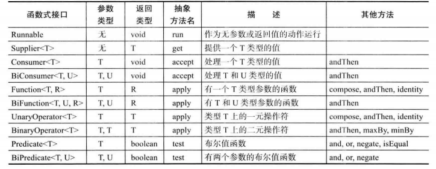
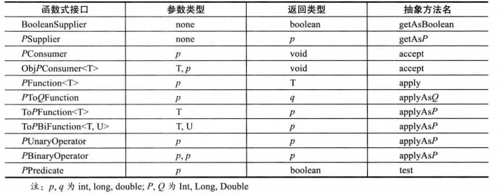

### 抽象类  
在继承的层次结构中，每个新子类都使类变得越来越明确具体。如果从一个子类追溯到父类，类就会变得更通用和抽象。类的设计应该确保父类包含它子类的共同特征。**如果一个父类设计得非常抽象，以至于它没有任何具体的实例，这样的类称为抽象类，使用abstract关键字修饰。抽象类定义了相关子类的共同行为。**  
### 抽象方法  
如果一个方法非常抽象，只定义了方法，没有提供方法的具体实现，那么我们把它定义为一个抽象方法，它的具体实现由子类提供，即子类覆盖抽象方法提供方法体。  
抽象方法由abstract关键字修饰，只有方法头，没有花括号和方法体，以分号结尾。比如一个GeometricObject类定义了一个名为getArea的抽象方法，即`public abstract double getArea();` 

### 几点说明  
1.抽象方法应该定义为public，以便子类进行重写。  
2.抽象类的构造器应该定义为protected，因为抽象类不能通过new直接创建实例，其构造器只被子类调用。创建一个具体子类的实例时，它的父类的构造器被调用以初始化父类中定义的数据域。  
3.一个包含抽象方法的类必须定义为抽象类，一个不包含抽象方法的类也可以定义为抽象类(如果不想让某类创建实例，可以把它定义为抽象类)  
4.如果子类继承抽象类时没有覆盖其所有的抽象方法，即子类中仍有抽象方法，子类也应该定义为抽象的  
5.抽象方法是非静态的  
6.子类可以覆盖父类的方法并将它定义为abstract,这种情况很少见，但它在当父类方法实现在子类中变得无效时是很有用的，在这种情况下，子类必须定义为abstract  
7.即使子类的父类是具体的，这个子类也可以是抽象的。例如，Object是具体的，但它的子类GeometricObject是抽象的。  
8.不能使用new操作符从一个抽象类创建一个实例，但是抽象类可以用作一种数据类型。下面的语句创建一个GeometricObject类型的数组是正确的：`GeometricObject[] objects = new GeometricObject[10];`然后可以创建一个具体子类的实例并把它的引用赋给数组，如：`Objects[0] = new Circle();`

### 接口  
接口在很多方面都与抽象类很相似，但它的目的是指明**相关或者不相关类**的多个对象的共同行为，属性成员都是**公共静态常量**，成员方法都是**公共抽象方法**。例如，使用正确的接口，可以指明这些对象是可比较的、可克隆的。为了区分接口和类，Java采用Interface关键字定义接口。在一个java文件内，只能有一个public类或一个public接口，即public类和public接口不能同文件共存。接口没有构造器，没有实例域，也不能使用new操作符创建实例。接口没有构造器的原因有三点：  
1.构造器用于初始化成员变量，接口没有成员变量，不需要构造器  
2.类可以实现多个接口，如果多个接口都有构造方法，不好确定构造方法链的调用次序  
3.作为高度抽象的概念，接口不能实例化对象，也就不需要构造器  

像常规类一样，每个接口都被编译为独立的字节码文件，可以作为引用变量的数据类型和类型转换的结果，可以使用instanceof关键字等。  
类实现接口用implements关键字，一个类可以实现多个接口，用逗号隔开即可，**一个类必须实现它实现接口的所有方法，否则要定义为抽象类。**一个接口可以继承多个接口，用extends关键字，此时实现类需要重写接口继承链上所有接口的所有抽象方法。**如果接口在继承在多个父接口时，父接口中出现了重名的默认方法冲突，就要在该接口中提供一个同名默认方法来解决冲突。**  
在定义接口中的数据域和方法时可以简写，例如：  
```java
public interface T{
	public static final int K = 1;
    public abstract void p();
 }
```
可简写成  
```java
public interface T{
	int K = 1;
    void p();
}
```
要注意接口中所有的数据域都是public static final，所有的方法都是public abstract，在定义接口中允许省略修饰符，但在子类重写方法时不可缺省public修饰符，否则方法的可见性会缩小为包内可见。  
**接口只能使用public修饰符或缺省访问控制修饰符。**  
**如果在具体实现类中定义了和接口中常量同名的常量，那么用接口变量指向实现类引用时变量调用的常量仍然是接口中定义的常量。**
### 静态方法
从Java SE 8开始，允许在接口中增加静态方法，并给静态方法提供方法体实现，该静态方法只能通过`接口名.静态方法`来调用。实现语法只要在方法前面加static关键字即可，这理论上讲是可以的，但这有违于接口作为抽象规范的初衷。**静态方法只能被具体实现类继承，不能在实现类中重写。**  
### 默认方法
可以为接口方法提供一个默认方法体实现，在方法前加default修饰符即可，这样子类无需重写这个方法也能得到一个接口的默认实现。例如：  
```java
public interface Collection
{
	int size();
    default boolean isEmpty()
    {
    	return size() == 0;
    }
}

```
这样实现Collection的程序员就不用操心实现isEmpty方法了。  
**当然，默认方法也可以被具体实现类重写。在实现类中调用默认方法要使用接口名.super.默认方法来调用。**  
默认方法的一个重要用法是**“接口演化”**。以Collection接口为例，这个接口作为Java的一部分已经很多年了，假设很久以前定义了一个实现Collection接口的类Bag。后来在Collection接口中增加了一个stream方法，假设stream方法不是一个默认方法，那么Bag类将不能编译，因为它没有实现这个新方法。如果不重新编译这个类，而是使用原先包含这个类的JAR文件，这个类仍能正常加载，正常构造实例，但如果在一个Bag实例上调用stream方法，会出现一个AbstractMethodError。**但如果把stream方法定义为默认方法就可以解决这个问题，既可以重新编译也可以使用JAR文件加载类并调用stream方法。**  
### 解决默认方法的冲突  
如果先在一个接口中将一个方法定义为默认方法，然后又在超类或另一个接口中定义了同样的方法，会发生冲突。解决冲突规则如下：  
1) 超类和接口冲突。如果超类提供了一个具体方法，那么根据超类优先原则，同名而且有相同参数类型的默认方法会被忽略。  
2) 多接口之间冲突。如果一个实现类实现了多个接口，一个接口提供了一个默认方法，另一个接口提供了一个同名而且参数类型(不论是否是默认参数)相同的方法，此时就发生了接口冲突，必须在实现类中重写这个方法来解决冲突。  
### 解决重名常量的冲突   
1）超类和接口冲突。如果一个类继承了一个超类和实现了若干接口，此时不像默认方法冲突一样有超类优先原则。只能通过在实现类中覆盖该常量来解决冲突。  
2）多接口之间冲突。如果一个类实现了多个接口，而这些接口又有重名常量，此时会发生冲突。必须用`接口名.常量`的方式来精确指明要使用的常量。
### Comparable接口  
Comparable接口定义了compareTo方法，用于比较对象。当想使用Arrays类的sort方法对对象数组进行排序时，对象所属的类必须实现了Comparable接口。  
Comparable接口是一个带泛型的接口，定义为：  
```java
public interface Comparable<E>{
	public int compareTo(E o);
 }
 ```
 compareTo应该与equals保持一致，即当且仅当o1.equals(o2)为true时，o1.compareTo(o2) == 0成立。以下是compareTo方法的实现：  
 ```java
 class Employee implements Comparable<Employee>{
 public int compareTo(Employee other){
 	return Double.compare(salary,other.salary);
    }
 }
 ```
 **在比较浮点数时可以使用Double的静态方法compare,这样就不必担心溢出或精度损失，类似的还有Integer.compare方法等**  
 **继承过程中的compareTo，如果由子类决定相等的概念，每个compare方法都应该在开始时检测：`if(getClass() != other.getClass()) throw new ClassCastException()`**：**如果父类决定相等的概念，应该在超类中提供一个compareTo方法，并将这个方法声明为final。**  
 
 ### Comparator接口  
 Comparator接口意为"比较器"接口，是一个泛型接口，可用于自定义排序规则和大小比较等。要进行自定义排序，Arrays.sort方法有一个重载版本，需要提供一个数组和一个比较器作为参数，比较器是实现了Comparator接口的类的实例。接口定义为：  
 ```java
 public interface Comparator<T>
 {
 	int compare(T first,T second);
 }
 ```
 如果要按长度比较字符串，由于String是按字典序比较字符串，肯定不能让String类用两种方法实现compareTo方法 —— 况且String类也不由我们修改。此时可以定义如下实现Comparator<String>的类：  
 ```java
 class lengthComparator implements Comparator<String>
 {
 	public int compare(String first,String second){
    	return first.length() - second.length();
    }
 }
 ```
 因为要调用compare方法，所以具体比较大小和排序时都要创建一个lengthComparator的实例：  
 **大小比较**
 ```java
 Comparator<String> comp = new LengthComparator();
 if(comp.compare(words[i],words[j]) > 0) ...
 ```
 **自定义排序**  
 ```java
 String[] friends = {"Peter","Paul","Mary"};
 Arrays.sort(friends,new LengthComparator());
 ```
 
 **Comparable接口和Comparator接口都可以用于自定义排序。但前者只能在定义要比较的类的同时实现，比如自定义的类，使用sort的不带比较器的方法排序。后者则可用于类的定义时或类已经设计完成但还想进行排序，因为它的实现是在要比较的类之外的，比如对Java类库中的类进行排序，无法修改类的定义，只好在外部定义一个实现了Comparator的比较器，并使用sort带比较器的方法排序。**  
下面对于一个学生类的两个关键字进行排序，先按分数从高到低排序，分数相同按年龄从小到大排序。  
**方法一：实现Comparable接口**  
重写的compareTo方法为：  
```java
public int compareTo(Student stu){    
        if(this.score>stu.score){
            return -1 ;
        }else if(this.score < stu.score){
            return 1 ;
        }else{
            if(this.age>stu.age){
                return 1 ;
            }else if(this.age < stu.age){
                return -1 ;
            }else{
                return 0 ;
            }
        }    
    }
```
**方法二：实现Comparator接口**   
重写的compare方法为：
```java
 public int compare(Student stu1,Student stu2){    
        if(stu1.score>stu2.score){
            return -1 ;
        }else if(stu1.score<stu2.score){
            return 1 ;
        }else{
            if(stu1.age>stu2.age){
                return 1 ;
            }else if(stu1.age<stu2.age){
                return -1 ;
            }else{
                return 0 ;
            }
        }    
    }
```
**自定义排序总结：**无论是重写compare方法还是compareTo方法，对大于、小于、等于三种情况都要有返回值，否则无法通过编译。在compareTo方法中，规定this.xxx > o.xxx 返回 1,this.xxx == o.xxx 返回0,this.xxx < o.xxx 返回-1是升序排列，反之就是降序排列。在compare方法中,规定o1.xxx > o2.xxx返回1,o1.xxx == o2.xxx返回0,o1.xxx < o2.xxx返回 -1是升序排列，反之就是降序排列。  
技巧：如果要比较的属性也实现了Comparable接口，就可以调用它的compareTo方法。如果要降序排列，就交换compareTo的参数顺序即可。如果要比较的类是基本数据类型，可以返回差值，如果差值不是int类型，就转换为int类型。
 ### Cloneable接口  
 首先，我们考虑为一个包含对象引用的变量建立副本会发生什么，例如：  
 ```java
 Employee original = new Employee("John Public",50000);
 Employee copy = original;
 copy.ratseSalary(10); //original的salary也被改变
 ```
 原变量和副本都会指向同一个对象，这说明，任何一个变量的改变都会影响到另一个变量。如果有一个对象original，希望创建一个对象copy使得其初始状态与original相同，但是之后它们各自回有自己不同的状态，这种情况下就可以使用克隆，例如：  
```java
Employee copy = original.clone();
copy.raiseSalary(10); //original的salary不会被改变
```
Object类中的clone方法将原始对象的每个数据域复制给目标对象，如果一个数据域是基本数据类型，复制的就是它的值，如果是引用类型，复制的就是它的引用，这种克隆称为**浅复制**,即original != copy,但original.hireDay == copy.hireDay。这有时是不符合我们要求的，我们不希望在改变某个对象的引用类型的数据域时影响到另一个对象，这时我们需要**深复制**,即如果数据域是引用类型，复制的是对象的内容而不是引用。  
无论是**浅复制**还是**深复制**，我们都需要先实现Cloneable接口，否则会产生一个必检异常。Cloneable接口的定义是：  
```java
public interface Cloneable{

}
```
我们发现这个接口是空的，一个带空体的接口称为标记接口。一个标记接口既不包括常量也不包括方法，它用来表示一个类拥有的某些特定的属性，其惟一的作用是允许在类型查询中使用instanceof关键字。但如果一个请求克隆的对象不实现这个接口，会产生CloneNotSupportedException，即使clone的默认(浅拷贝)实现能够满足要求，还是要实现这一接口。在这里，Cloneable接口的出现与接口的正常使用并没有关系。具体来说，它没有指定clone方法，这个方法是从Object类继承的，这个接口只是作为一个标记。  

Object类中提供的原始clone方法的方法头是`protected native Object clone() throws CloneNotSupportedException`,关键字native表明这个方法不是用Java写的，但它是JVM针对自身平台实现的。关键字protected限定方法只能在同一个包内或在其子类中访问。由于这个原因：**必须在要实现克隆的子类中覆盖这个方法并把可见性修饰父改为public**。  
下面给出一个浅复制的例子：  
```java
class Employee implements Cloneable
{
	public Employee clone() throws CloneNotSupportedException
    {
    return (Employee) super.clone();
    }
    . . .
}
```
下面给出一个深复制的例子：
 ```java
class Employee implements Cloneable
{
	public Employee clone() throws CloneNotSupportedException
    {
     . . .
     Employee cloned = (Employee) super.clone;
     cloned.hireDay = (Date)hireDay.clone();
     return cloned;
    }
}
```
我们注意到Object类的clone方法的返回值类型是Object，而Employee类的clone方法返回值类型是Employee，这叫做协变返回类型，即**子类在重写父类方法时可以返回父类返回值类型的子类型**。clone方法声明异常也可以改成捕获异常，如：  
```java
public Employee clone()
{
	try
	{
		Employee cloned = (Employee) super.clone();
        . . .
    }
    catch(CloneNotSupportedException e){ return null;}
 }
```
### 复制数组的四种方法  
1.申请一个新数组，遍历原数组逐一复制元素  
2.使用System类的静态方法arraycopy  
3.使用`数组对象.clone`返回一个数组克隆的引用  
4.使用Arrays类的copyOf方法  

### 接口和抽象类  
区别：  
1.接口所有的变量必须是public static final;抽象类的变量无限制  
2.接口没有构造方法，不能用new操作符实例化;抽象类有构造方法，由子类通过构造方法链调用，不能用new操作符实例化  
3.接口所有方法必须是公共抽象实例方法(Java SE 8开始允许定义静态方法)，抽象类无限制  
4.一个类只可以继承一个父类，但可以实现多个接口
5.所有的类有一个共同的根Object类，接口没有共同的根  
6.抽象类和子类的关系应该是强的“是一种”关系(strong is-a relationship),而接口和子类的关系是弱的"是一种"关系(weak is-a relationship)。接口比抽象类更灵活，因为实现接口的子类只需要具有统一的行为即可，不需要都属于同一个类型的类。

 ### 接口与回调  
 回调是一种常见的程序设计模式。在这种模式中，可以指出某个特定事件发生时应该采取的动作。例如，可以指出在按下按钮或选择某个菜单项时应该采取什么行动。
 ### 内部类  
 内部类，或者称为嵌套类，是一个定义在另一个类范围中的类。一个内部类可以如常规类一样使用。通常，在一个类只被它的外部类所使用的时候，才将它定义为内部类，内部类机制主要用于设计具有互相协作关系的类集合。比如：  
 
 ```java
 //OuterClass.java: inner class demo
 public class OuterClass {
    private int data;
    /** A method in the outer class */
    public void m(){
    //Do something
    }
    // An inner class
    class InnerClass {
    /** A method in the inner class */
    public void mi(){
    	data++;
        m();
      }
    }
  }
 ```
 
 为什么要使用内部类，主要原因有三：  
 1.内部类可以访问包含它的外部类的所有数据域(包括私有数据域)和方法，没有必要将外部类对象的引用传递给内部类的构造方法,内部类有一个指向外部类对象的隐式引用，如果显式写出，外部类的引用是OuterClass.this  
 2.内部类可以对同一个包中的其他类隐藏起来  
 3.当想要定义一个回调函数且不想编写大量代码时，使用匿名内部类比较便捷  
 
 内部类具有一下特征：  
 1) 一个成员内部类被编译成一个名为`OuterClassName$InnerClassName`的类。例如，一个定义在Test类中的成员内部类A被编译成`Test$A.class`  
 2) 一个内部类可以使用可见性修饰符(public、private、protected、default)所定义，和应用于一个类中成员的可见性规则一样  
 3) 一个内部类可以被定义为static，一个static的内部类可以使用外部类的名字访问,一个static内部类不能访问外部类中的非静态成员  
 4) 内部类对象通常在外部类中创建，但是你也可以从另外一个类中来创建一个内部类的对象。如果内部类是非静态的，你必须先创建一个外部类的实例，然后使用下面的语法创建一个内部类对象：`OuterClass.InnerClass innerObject = outerObject.new InnerClass();` 如果内部类是静态的，使用下面语法来创建一个内部类对象:`OuterClass.InnerClass innerObject = new OuterClass.InnerClass();`。  
 一般建议在外部类中定义一个用于获取内部类对象的方法，以便于从外部类外获取内部类对象，比如：  
 ```java
 public InnerClass getInnerClass(){
 	return new InnerClass();
 }
 ```
 5) 内部类所有的静态域必须是final修饰的**静态常量**,不能有静态变量，也不能有静态方法
 
 一个简单的内部类的用途是将相互依赖的类结合到一个主类中，这样做减少了源文件的数量(因为非内部类如果用public修饰必须放在不同的源文件中，而内部类可放在同一源文件中)，这样也使得类文件容易组织，因为它们都将主类名作为前缀。另外一个内部类的实际用途是避免类名冲突。  
 
 内部类对于定义处理器类非常有用，一个处理器类被设计为针对一个GUI组件创建一个处理器对象(比如，一个按钮)。处理器类不会被其他应用所共享，所以将它定义在主类里面作为一个内部类使用是恰如其分的。  
  
广泛意义上的内部类一般来说包括四种：**成员内部类**、**局部内部类**、**匿名内部类**和**静态内部类**。下面就先来了解一下这四种内部类的用法。  
 ### 成员内部类  
 　成员内部类是最普通的内部类，它的定义为位于另一个类的内部，形如下面的形式：  
  ```java
  class Circle {
    private double radius = 0;
    public static int count =1;
    public Circle(double radius) {
        this.radius = radius;
    }
     
    class Draw {     //内部类
        public void drawSahpe() {
            System.out.println(radius);  //外部类的private成员
            System.out.println(count);   //外部类的静态成员
        }
    }
}
  ```
  这样看起来，类Draw像是类Circle的一个成员，Circle称为外部类。成员内部类可以无条件访问外部类的所有成员属性和成员方法（包括private成员和静态成员），但外部类想要访问内部类的成员属性和方法时必须先实例化内部类对象。  
  　不过要注意的是，当成员内部类拥有和外部类同名的成员变量或者方法时，会发生隐藏现象，即默认情况下访问的是成员内部类的成员。如果要访问外部类的同名成员，需要以下面的形式进行访问：`外部类.this.成员变量 外部类.this.成员方法`
 ### 局部内部类  
 可以把内部类定义在一个方法中，称为局部内部类，也叫方法内部类。**局部内部类就像是方法里面的一个局部变量一样，不能有public、protected、private以及static修饰符。它的作用域被限定在声明这个局部类的块中。**局部类有一个优势，即对外部世界完全隐藏起来。即使外部类中的其他代码也不能访问它。除了其所在的方法之外，没有任何方法知道该局部类的存在。**局部内部类只能访问被final修饰的局部变量。**    
 局部内部类被编译器编译成一个`OuterClassName$1InnerClassName`的类。序号逐渐递增。
 ```java
 class People{
    public People() {
         
    }
}
 
class Man{
    public Man(){
         
    }
     
    public People getWoman(){
        class Woman extends People{   //局部内部类
            int age =0;
        }
        return new Woman();
    }
}
 ```
 注意：上述代码中通过调用getWoman()获取了局部内部类Woman的引用，不能通过`局部内部类引用.属性`的方式来直接访问局部内部类的成员，所以我们一般会在该方法中直接调用局部内部类的方法进行某种操作，然后返回操作结果。
 ### 匿名内部类  
 有时我们在程序中对一个类只使用一次，此时就可以把类的定义和实例化对象整合在一起，来简化对于抽象类和接口实现的操作，这就是**匿名内部类**。  
 一个匿名内部类是一个没有名字的内部类，其语法如下：  
 ```java
 new SuperClassName/InterfaceName(){
 	//implement or override methods in superclass or interface
    
     //Other methods if necessary
  }
 ```
 其含义是**创建一个继承自SuperClass或实现Interface的类的实例，并在类块内重写父类或接口的抽象方法**，应该将匿名内部类理解成**一个匿名子类的匿名对象**,而不是理解成一个类。  
 
 匿名内部类有如下特征：  
 1.没有可见性修饰符  
 2.没有构造方法(因为没有名字,无法命名构造方法),但可以有构造代码块，也可以调用父类的构造方法，即`new SuperClassName()`调用父类无参构造方法，`new SuperClassName(args1,...)`调用父类有参构造方法。如果实现的是接口，则不能有任何参数，但是小括号仍然不可缺省  
 3.必须总是从一个父类继承或者实现一个接口，但是它不能有显式的extends或者implements子句  
 4.必须实现父类或接口中的所有抽象方法  
 5.一个匿名内部类被编译成一个名为OuterClassName$n.class的类，例如：如果外部类Test有两个匿名内部类，分别被编译成Test$1.class和Test$2.class  
 
 **应用一**  
 下面的技巧称为**"双括号初始化"**，这里利用了内部类语法。假设你想构造一个数组列表，并将它传递到一个方法。  
 ```java
 ArrayList<String> friends = new ArrayList<String>();
 friends.add("Harry");
 friends.add("Tony");
 invite(friends);
 ```
 如果不再需要这个数组列表，最好让它作为一个匿名列表。语法如下：  
 ```java
 invite(new ArrayList<String> 
 {
 	{
    	add("Harry");
        add("Tony");
     }
});
 ```
 注意这里的双括号，外括号建立了一个ArrayList的匿名子表，内括号则是一个对象构造块。  
   
 **应用二**  
 生成日志或调试消息时，通常希望包含当前类的类名，如：  
 `System.err.println("Something awful happened in " + getClass());`   
 不过这对于静态方法并不凑效，因为调用getClass()调用的是this.getClass(),但静态方法里没有this，所以应该使用下面的表达式：`new Object(){}.getClass().getEnclosingClass()`,在这里，new Object(){} 会建立Object的一个匿名子类的匿名对象，getEnclosingClass则得到其外围类，也就是包含这个静态方法的类 
 
 ### 静态内部类  
 有时候，使用内部类只是为了把一个类隐藏在另外一个类的内部，并不需要内部类引用外围类的对象。为此，可以为内部类加上static关键字声明为静态内部类，以便取消产生的引用。**静态内部类中的方法不能直接调用外部类的非静态成员属性和访问非静态方法，如果要调用和访问，必须实例化外部类对象。当静态内部类拥有和外部类同名的成员变量或者方法时，会发生隐藏现象，即默认情况下访问的是静态内部类的成员。如果要访问外部类的非静态同名成员，不能再使用`外部类.this.成员`的形式，而是要实例化外部类对象。如果要访问外部类的静态同名成员，可以通过`外部类.成员`的方式来访问。**与常规内部类不同，静态内部类可以有**静态变量**和**静态方法**。可以通过`外部类.内部类.静态成员`方式来访问。  
 下面是一个使用静态内部类的典型例子。考虑一下计算一个数组中最大值和最小值的问题，当然，可以编写两个方法，一个计算最大值，一个计算最小值，在调用这两个方法的时候，数组被遍历两次，而如果数组只被遍历一次就可以计算出最大值和最小值，那么效率就大大提高了。通过一个方法就计算出最大值和最小值：这个方法需要返回两个数（max 和 min），为此可以定义一个Pair类来封装这种数据结构，但是Pair是个非常大众的名字，可能在其他地方定义过，会发生名字冲突，此时可以将Pair定义为ArrayAlg类的内部类ArrayAlg.Pair。又因为Pair没有必要访问外围类ArrayAlg的数据域或方法，应该定义为静态内部类。  
 下面给出代码：  
 ```java
 
public class ArrayAlg{
    //Pair类，起数据封装的作用
    public static class Pair{
        private double first;
        private double second;

        public Pair(double f, double s){
            first = f;
            second = s;
        }

        public double getFirst(){
            return first;
        }

        public double getSecond(){
            return second;
        }
    }

    public static Pair maxmin(double[] values){
        double min = Double.POSITIVE_INFNITY;
        double max = Double.NEGATIVE_INFNITY;

        for(double x : values){
            if(x<min) min = x;
            if(x>max) max = x;
        }
        return new Pair(max,min);
    }

    public static void main(String[] args){
        Test te = new Test();
        double[] teArgs = new double[]{2.13,100.0,11.2,34.5,67.1,88.9};
        Pair res = te.maxmin(teArgs);
        System.out.println("max = "+res.getFirst());
        System.out.println("min = "+res.getSecond());
    }
}
 ```
 特别注意：代码中的Pair类如果没有声明为static，就不能在静态方法minmax中构造Pair的实例，编译器会给出错误报告：没有可用的隐式ArrayAlg类型对象初始化内部类对象  
 
 ### lambda表达式 
 lambda表达式可以被看作使用精简语法的匿名内部类，编译器对待一个lambda表达式如同它是从一个匿名内部类创建的对象。它是一种表示可以在将来某个时间点执行的代码块的简洁方法。使用lambda表达式，可以用一种精简的方式表示使用回调或变量行为的代码。如果要编译器理解lambda表达式，其代替的匿名内部类实现的接口必须只包含一个抽象方法，这样的接口被称为函数式接口(功能接口、单抽象方法接口）。在底层，接受lambda表达式的方法会接受实现某函数式接口的类的对象，并在这个对象上调用接口的方法，所以可以把lambda表达式赋给函数式接口(lambda表达式实际是一个实现了该函数式接口的类的类型，这里用到了多态)，不能把lambda表达式赋给Object变量，因为Object不是一个函数式接口。  
 一个lambda表达式就是一个代码块，以及必须传入代码的变量规范。其基础语法是(expression只有一条语句，不用花括号，也不用分号结尾)  
 ```java
 (type1 param1, type2 param2, ...) -> expression
 ```
 或者(statements是多条语句，要花括号，每条语句之后要分号结尾)  
 ```java
  (type1 param1, type2 param2, ...) -> {statements;}
 ```
 一个参数的数据类型既可以显式声明，也可以由编译器隐式推断。如果只有一个参数，并且没有显式的数据类型，圆括号可以被省略。如：  
 ```java
 e -> {
 // Code for processing event e
 }
 ```
 即使lambda表达式没有参数，也要提供空括号，就像无参数方法一样：  
 ```java
 () -> {for(int i = 100;i >=0 ;i--) System.out.println(i);}
 ```
  无需指定lambda表达式的返回类型，编译器会由上下文推断，例如：  
 ```java
 (String first,String second) -> first.length() - second.length()
 ```
 可以在需要int类型结果的上下文中使用  
 
 如果一个lambda表达式只在某些分支上返回一个值，而在另外一些分支不返回值，是不合法的。例如：  
 ```java
 (int x) -> {if(x >= 0) return 1;}
 ```
   
 Comparator接口是一个函数式接口，可以用lambda表达式实现自定义排序的简化：  
 ```java
 Arrays.sort(words,(first,second) 
 -> first.length() - second.length());
 ```
 
 ### 函数式接口  
 对于只有一个抽象方法的接口，需要这种接口的对象时，就可以提供一个lambda表达式，这种接口称为函数式接口。  
 如果自己设计了一个函数式接口，可以用@FunctionalInterface注解来标记这个接口，这样做有两个好处：  
 1.可以在你无意中增加一个非抽象方法时产生编译错误  
 2.javadoc页里会指出你的接口是一个函数式接口
 
 ### 方法引用  
 有时，可能已经有现成的方法可以完成你想要传递到其他代码的某个动作。例如，假设你希望只要出现一个定时器事件就打印这个事件对象，可以调用：  
 ```java
 Timer t = new Timer(1000,event -> System.out.println(event));
 ```
 可以直接把println方法传递到Timer的构造器：  
 ```java
 Timer t = new Timer(1000,System.out::println);
 ```
 表达式System.out::println是一个方法引用，它等价于lambda表达式`x -> System.out.println(x)`  
 我们再看一个例子，假设要对字符串排序，而不考虑字母的大小写，可以调用`Arrays.sort(strings,String::compareToIgnoreCase);`
 
 方法引用主要有三种情况：  
 * object::instanceMethod
 * Class::staticMethod  
 * Class::instanceMethod    
 
对于前两种情况，方法引用等价于提供方法参数的lambda表达式。比如：System.out::println等价于x -> System.out.println(x)，Math::pow等价于(x,y) -> Math.pow(x,y)。第三种情况的第一个参数会称成为调用方法的目标对象，其余参数成为方法参数，比如：String::compareToIgnoreCase等价于(x,y) -> x.compareToIgnoreCase(y)  
可以在方法里使用this和super,this::equals等同于x -> this.equals(x),super::greet等同于() -> super.greet()  

类似于lambda表达式，方法引用不能独立存在，总是会转换为函数式接口的实例。  

### 构造器引用  
构造器引用与方法引用类似，只不过方法名为new。例如`Employee::new`是Employee构造器的一个引用。至于是哪一个构造器取决于上下文，比如`  Function<Integer,Employee> func1 = Employee :: new;`就相当于` Function<Integer,Employee> func = x -> new Employee(x);`   
数组类型也有构造器引用，如`int[]::new`等价于lambda表达式`x -> new int[x]`  

### 处理lambda表达式  
我们之前提到，lambda表达式的重点是**延迟执行**，之所以希望以后再执行代码，有很多原因，如：  
* 在一个单独的线程中运行代码  
* 多次运行代码  
* 在算法的恰当位置运行代码(例如，排序中的比较操作)  
* 发生某种情况时执行代码(如，点击了一个按钮、数据到达等) 
* 只在必要时才运行代码  

下面是常用的函数式接口和基本类型的函数式接口：  

  



下面来看一个简单的例子。假设你想要重复一个动作n次。将这个动作和重复次数传递给一个repeat方法：  
```java
repeat(10,() -> System.out.println("Hello world"));
```
要接受这个lambda表达式，需要选择一个函数式接口。在这里，我们可以使用Runnable接口：  
```java
public static void repeat(int n,Runnable action)
{
	for(int i = 0;i < n;i++) 
    action.run();
}
```
现在让这个例子更复杂一点，我们希望告诉这个动作它出现在那一次迭代中。为此需要选择一个合适的函数式接口，其中要包含一个方法。这个方法有一个int参数而且返回类型为void。处理int值的标准接口如下：  
```java
public interface IntConsumer
{
	void accept(int value);
}
```
下面给出repeat方法的改进版本:  
```java
public static void repeat(int n,IntConsumer action)
{
	for(int i = 0;i < n;i++)  action.accept(i);
}
```
可以如下调用它：  
```java
repeat(10,i -> System.out.println("Countdown: " + (9 - i)));
```
大多数函数标准函数式接口都提供了非抽象方法来生成或合并函数。例如,Predicate.isEqual(a)等同于a::equals,不过如果a为null也能正常工作。已经提供了默认方法and、or和negate来合并谓词。例如,`Predicate.isEqual(a).or(Predicate.isEqual(b))`就等同于`x -> a.equals(x) || b.equals(x)`
 
 
 ### 通过三种方式实现事件处理器  
 
 #### 1.内部类  
 ```java
 public class HandleEvent extends Application {

	@Override
	public void start(Stage primaryStage) throws Exception {
		HBox pane = new HBox(10);
		pane.setAlignment(Pos.CENTER);
		Button btOK = new Button("OK");
		OKHandlerClass handler1 = new OKHandlerClass();
		btOK.setOnAction(handler1);
		Button btCancel = new Button("Cancel");
		CancelHandlerClass handler2 = new CancelHandlerClass();
		btCancel.setOnAction(handler2);
		pane.getChildren().addAll(btOK,btCancel);
		
		Scene scene = new Scene(pane,100,50);
		primaryStage.setTitle("HandleEvent");
		primaryStage.setScene(scene);
		primaryStage.show();
	}

	
	class OKHandlerClass implements EventHandler<ActionEvent>{
		@Override
		public void handle(ActionEvent e) {
			System.out.println("OK button clicked");
		}
	}
	
	class CancelHandlerClass implements EventHandler<ActionEvent>{
		@Override
		public void handle(ActionEvent e) {
			System.out.println("Cancel button clicked");
		}
	}
	public static void main(String[] args) {
		Application.launch(args);

	}

}
 ```
 #### 2.匿名内部类  
 ```java
 import javafx.application.Application;
import javafx.event.ActionEvent;
import javafx.event.EventHandler;
import javafx.geometry.Pos;
import javafx.scene.Scene;
import javafx.scene.control.Button;
import javafx.scene.layout.HBox;
import javafx.stage.Stage;

public class AnonymousHandlerDemo extends Application {

	@Override
	public void start(Stage primaryStage) throws Exception {
	    HBox hBox = new HBox();
	    hBox.setSpacing(10);
	    hBox.setAlignment(Pos.CENTER);
	    Button btNew = new Button("New");
	    Button btOpen = new Button("Open");
	    Button btSave= new Button("Save");
	    Button btPrint = new Button("Print");
	    hBox.getChildren().addAll(btNew,btOpen,btSave,btPrint);
	    
	    btNew.setOnAction(new EventHandler<ActionEvent>() {
	    	@Override
	    	public void handle(ActionEvent e) {
	    		System.out.println("Process New");
	    	}
	    });
	    
	    btOpen.setOnAction(new EventHandler<ActionEvent>() {
	    	@Override
	    	public void handle(ActionEvent e) {
	    		System.out.println("Process Open");
	    	}
	    });
	    
	    btSave.setOnAction(new EventHandler<ActionEvent>() {
	    	@Override
	    	public void handle(ActionEvent e) {
	    		System.out.println("Process Save");
	    	}
	    });
	    
	    btPrint.setOnAction(new EventHandler<ActionEvent>() {
	    	@Override
	    	public void handle(ActionEvent e) {
	    		System.out.println("Process Print");
	    	}
	    });
	    
	    Scene scene = new Scene(hBox,300,50);
	    primaryStage.setTitle("AnonymousHandlerDemo");
	    primaryStage.setScene(scene);
	    primaryStage.show();
	}

	public static void main(String[] args) {
		Application.launch(args);

	}

}
 ```
 #### 3.lambda表达式  
 ```java
 import javafx.application.Application;
import javafx.event.ActionEvent;
import javafx.event.EventHandler;
import javafx.geometry.Pos;
import javafx.scene.Scene;
import javafx.scene.control.Button;
import javafx.scene.layout.HBox;
import javafx.stage.Stage;

public class LambdaHandlerDemo extends Application {

	@Override
	public void start(Stage primaryStage) throws Exception {
	    HBox hBox = new HBox();
	    hBox.setSpacing(10);
	    hBox.setAlignment(Pos.CENTER);
	    Button btNew = new Button("New");
	    Button btOpen = new Button("Open");
	    Button btSave= new Button("Save");
	    Button btPrint = new Button("Print");
	    hBox.getChildren().addAll(btNew,btOpen,btSave,btPrint);
	    
	    btNew.setOnAction((ActionEvent e)->{System.out.println("Process New");});
	    
	    btOpen.setOnAction((e)->{System.out.println("Process Open");});
	    
	    btSave.setOnAction(e->{System.out.println("Process Save");});
	    
	    btPrint.setOnAction(e->System.out.println("Process Print"));
	    
	    Scene scene = new Scene(hBox,300,50);
	    primaryStage.setTitle("LambdaHandlerDemo");
	    primaryStage.setScene(scene);
	    primaryStage.show();
	}

	public static void main(String[] args) {
		Application.launch(args);

	}

}
 ```
 ### 代理  
 见大牛博客  
 * [Java的三种代理模式](http://www.cnblogs.com/cenyu/p/6289209.html)  
 * [java中Proxy(代理与动态代理)](http://blog.csdn.net/pangqiandou/article/details/52964066)  
 * [java静态代理和动态代理](http://layznet.iteye.com/blog/1182924)  
 * [深入理解Java反射](http://www.cnblogs.com/luoxn28/p/5686794.html)

