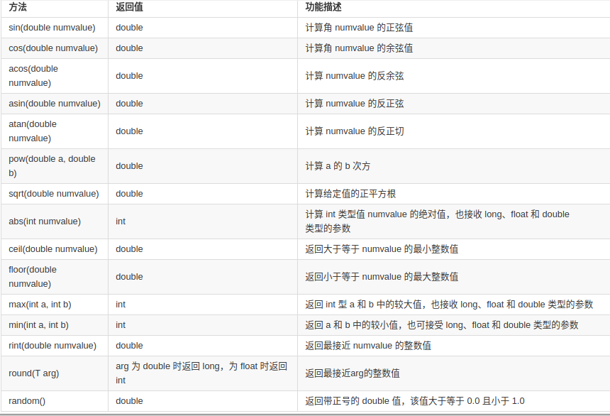
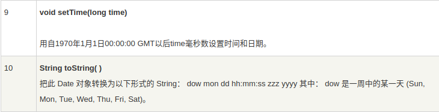

### 概述
Java 的核心 API 是非常庞大的，这给开发者来说带来了很大的方便。所谓的 API 就是一些已经写好、可直接调用的类库。Java 里有非常庞大的 API，其中有一些类库是我们必须得掌握的，只有熟练掌握了 Java 一些核心的 API，我们才能更好的使用 Java。

<center>参考资料：实验楼JDK 核心 API</center>    
下面我们以包为单位对开发中常用的核心API进行总结。  
### java.lang包  
在程序中，java.lang 包并不需要像其他包一样需要import关键字进行引入。系统会自动加载，所以我们可以直接取用其中的所有类。下面我们就来详细地学习一下 java.lang 包吧。

#### 包装类  
Java 是一种面向对象语言，Java 中的类把方法与数据连接在一起，构成了自包含式的处理单元。但在 Java 中不能定义基本数据类型(primitive type)对象，这样存在一个问题：即**基本数据类型不具备对象特性，就不能进行对象化交互。**为了能将基本类型视为对象进行处理，并能连接相关的方法，Java 为每个基本类型都提供了包装类。如 int 型数值的包装类 Integer，boolean 型数值的包装
类 Boolean 等，这样便可以把这些基本类型转换为对象来处理了。下面将介绍Java 中提供的各种包装类。  
  
在这八个类名中，除了**Integer类**和**Character类**，其它六个类的类名和基本数据类型一致，只是类名的首字母大写，这八种包装类都是**被final关键字修饰的，没有无参的构造方法，且是不可变的。**其实还有两个包装类，但它们没有对应的基本数据类型，即java.math包中的BigInteger类和BigDecimal类，主要应用于高精度的运算，BigInteger 支持任意精度的整数，BigDecimal 支持任意精度带小数点的运算，它们没有被final关键字修饰。关于这两个类我们将在java.math包中进行详细介绍。  
#### 基本类型与包装类型的异同:  
1、在 Java 中，一切皆对象，但八大基本类型却不是对象。  
2、声明方式的不同，基本类型无需通过 new 关键字来创建，而包装类型需 new 关键字。  
3、存储方式及位置的不同，基本类型是直接存储变量的值保存在栈中能高效的存取，包装类型需要通过引用指向实例，具体的实例保存在堆中。  
4、初始值的不同，包装类型的初始值为 null，基本类型的的初始值视具体的类型而定，比如 int 类型的初始值为 0，boolean 类型为 false。  
5、使用方式的不同，比如与集合类合作使用时只能使用包装类型。

#### Number类   
在八种包装类中，**数值包装类**(除了Character和Boolean，它们的直接父类是Object)以及之后会介绍的java.math包中的**BigInteger类**和**BigDecimal类**都有一个共同的**抽象父类**，即**Number类**。在学习包装类之前，我们先来学习Number类。  
抽象类 Number 是父类,Number 的子类必须提供将表示的数值转换成 byte / double / float / long / int / short 的方法。Number 类的方法被 Number 的各子类所实现,常用方法如下:  

  

#### Integer类
1、构造方法有两种:  
a) 以 int 型变量作为参数创建 Integer 对象,实例代码如下:
```java
Integer number=new Integer(7);
```
b) 以 String 型变量作为参数创建 Integer 对象,实例代码如下:
```java
Integer number=new Integer(“7”);
```

2、常用方法:
     
需要注意的是Integer也存在除了intValue()之外的其他xxxValue()方法，可以把Integer类型的对象转换为任意基本数值类型，这是从Number类继承的方法。还有，parseInt()方法有多个重载方法，可以把字符串转换为不同进制的基本数据类型。  

3、常用的常量:  
a) MAX_VALUE: 表示 int 型可取的最大值  
b) MIN_VALUE: 表示 int 型可取的最小值  
c) SIZE:表示以二进制补码形式表示 int 值的位数  
d) TYPE: 表示基本类型 Class 实例

4、基本数据类型、包装类、字符串三者之间的转换：    
a)基本数据类型和包装类之间的转换  
我们先来认识两个概念：装箱与拆箱。    
装箱：把基本数据类型转换成包装类，分为自动装箱和手动装箱。    
拆箱：把包装类转换成基本数据类型，分为自动拆箱和手动拆箱。  
下面通过代码来演示：  
```java
		//装箱：把基本数据类型转换成包装类
		
        //自动装箱
		int t1 = 2;
		Integer t2 = t1;
        
		//手动装箱
        //1、构造方法
		Integer t3 = new Integer(t1);
        //2、包装类的valueOf()
        Integer t4 = Integer.valueOf(t1);
        
        //拆箱：把包装类转换成基本数据类型
        
		//自动拆箱
		int t4 = t2;
        
		//手动拆箱
		int t5 = t2.intValue();
```  
b)基本数据类型和字符串之间的转换   
直接看代码：  
```java
		//基本数据类型转换为字符串
		int t1=2;
		String t2=Integer.toString(t1);
        //也可直接用'+'进行字符串连接，会自动调用toString()
        
        //字符串转换为基本数据类型
        //1、包装类的parseInt
		int t3=Integer.parseInt(t2);
		/*2、包装类的valueOf()先将字符串转换为包装类，
        再通过自动拆箱完成基本类型转换*/
		int t4=Integer.valueOf(t2);
```
c)包装类和字符串之间的转换  
```java
     //包装类转换为字符串
     Integer t1 = 10;
     String t2 = t1.toString();
     
     //字符串转换为包装类  
     //1、构造方法  
     Integer t3 = new Integer("10");
     //2、包装类的valueOf()
     Integer t4 = Integer.valueOf("10");
```

5、包装类对象间的比较  
我们先来看下面的代码：  
```java
package wrap;

public class WrapperTest {

	public static void main(String[] args) {
		Integer one=new Integer(100);
		Integer two=new Integer(100);
		System.out.println("one==two的结果："+(one==two));//1 false
		
		Integer three=100;//自动装箱
        //自动装箱时隐式调用Integer three=Integer.valueOf(100);
        System.out.println("one==three的结果"+(one==three));//2 false
		System.out.println("three==100的结果："+(three==100));//3 自动拆箱 true
		//Integer four=100;
		Integer four=Integer.valueOf(100);
		System.out.println("three==four的结果："+(three==four));//4 true
		
		Integer five=200;
		System.out.println("five==200的结果："+(five==200));//5 true
		
		Integer six=200;
		System.out.println("five==six的结果："+(five==six));//6 false
		
		Double d1=Double.valueOf(100);
		System.out.println("d1==100的结果："+(d1==100));//7 true
		
		Double d2=Double.valueOf(100);
		System.out.println("d1==d2的结果："+(d1==d2));//8 false
	}

}
```
我们先来引入一个对象池的概念，Java的内存空间主要分为栈、堆、常量池(对象池)，对象池可以认为是Java提供的缓存技术。当我们调用Integer的valueOf()方法且传入的参数在-128~127之间时**(注意自动装箱的原理实际上就是编译器隐式调用了这个方法)**，会首先在常量池中查找是否存在该对象，如果不存在，就在常量池中创建该对象，并让存在于栈中的Integer引用变量指向它;如果对象池中已经存在这个对象就直接让栈中的Integer引用变量指向它。  
     

我们来逐一解释输出的结果：  
1处结果为false，因为每次使用new关键字，会在堆上新开辟一块内存空间，所以用==判断结果一定为false。  
2处结果为false，因为one指向的是堆上开辟的空间，而three自动装箱，会在对象池里创建对象，并指向对象池的对应空间，所以==判断结果为false。  
3处结果为true，因为当包装类和基本数据类型进行比较时会自动拆箱，相当于比较100==100,结果自然是true。  
4处结果为true，因为前面three自动装箱已经隐式调用valueOf方法并在对象池中创建过一个100的Integer对象(100在-128~127之间，所以会在对象池中创建该对象)，所以当four再次调用valueOf方法时会在对象池中进行寻找，找到该对象后four也指向该对象，所以three和four指向的是同一个对象，结果为true。  
5处结果为true，原因同3,不赘述。  
6处结果为false，这是因为200不在-128~127的范围，不能使用对象池。  
7处结果为true，自动拆箱，即比较100.0==100，结果为true。 
8处结果为false，因为在包装类中，Double和Float不存在对象池。  

**最后提醒：比较包装类的值不要使用==，此时并不会对两个包装类进行自动拆箱，而是和其他类型对象比较一样比较其地址，所以比较值还是使用equals或compareTo方法！！！**
#### Boolean类  
Boolean 类将基本类型为 boolean 的值包装在一个对象中。一个 Boolean类型的对象只包含一个类型为 boolean 的字段。此外,此类还为 boolean 和String 的相互转换提供了许多方法,并提供了处理 boolean 时非常有用的其他一些常量和方法。  
1、构造方法:  
a) 创建一个表示 value 参数的 boolean 对象,实例如下:  
```java
Boolean b = new Boolean(true);
```
b)以 String 变量作为参数,创建 boolean 对象。此时,如果传入的字符串不为 null,且忽略大小写后的内容等于”true”,则生成 Boolean 对象值为 true,反之为 false。  
```java
Boolean b1 = new Boolean("ok"); 
System.out.println(b1); //输出false
Boolean b2=new Boolean("TRUE");
System.out.println(b2); //输出true
```
2、常用方法:  
       
3、常用的常量:  
a) TRUE:对应基值 true 的 Boolean 对象;  
b) FALSR:对应基值 false 的 Boolean 对象;  
c) TYPE:表示基本类型 Class 实例

#### Byte类  
Byte 类将基本类型为 byte 的值包装在一个对象中,一个 byte 类型的对象只包含一个类型为 byte 的对象。此外,该类还为 byte 和 String 之间相互转换提供方法,并提供了一些处理 byte 时非常有用的常量。  
1、构造方法  
Byte 类提供了两种构造方法的重载形式来创建 BYTE 类对象:  
a) Byte (byte value) 通过这种方法创建的 byte 对象,可表示指定的 byte值。如：
```java
Byte b = new Byte(45);
```
b) Byte(String str) 通过这种方法创建的 byte 对象,可表示 String 参数指定的 byte 值，例:  
```java
Byte mybyte = new Byte("12");
```
2、常用方法  
    
3、常用的常量  
a) MIN_VALUE: 最小值  
b) MAX_VALUE: 最大值  
c) SIZE: 二进制  
d) TYPE: 表示基本类型 byte 的 class 实例  

#### Character类  
Character 类在对象中包装一个基本类型为 char 的值。一个 Character 对象包含类型为 char 的单个字段。  
1、构造方法  
Character 类的构造方法的语法如下:  
```java
Character(char value)  
```
2、常用方法  
   
还有isDigit(ch)、isLetter(ch)、isLetterOrDigit(ch)等方法分别返回一个布尔值表示ch是否是数字字符、ch是否是字母、ch是否是字母或者数字。
#### Double类  
Double 和 Float 包装类是对 double、float 基本类型的封装,他们都是 Number 类的子类,又都是对小数进行操作,所以常用基本方法相同,Double 类在对象中包装一个基本类型为 double 的值,每个 double 类都包含一个 double 类型的字段。  
1、 构造方法  
Double 类提供了两种构造方法来获得 Double 类对象  
a) Double(double value): 基于 double 参数创建 Double 类对象;  
b) Double(String str): 构造一个新分配的 Double 对象,表示用字符串表示的 Double 类型的浮点值  
2、常用方法  
 
 

#### Math类  
我们在编程的过程中，经常需要对一些数字进行数学操作，如初等指数、对数、平方根和三角函数，其实 java.lang 里的 Math 类包含了用于执行基本数学运算的方法。我们就来学习一下吧！  
1、构造方法  
Math类的构造方法是private的，这样设计的意图是不让使用者创建Math类的对象，也就是说，Math类的所有方法都是静态方法。另外Math类是final的，设计为不能被继承。  
2、常用方法  
   

#### String类  
1、构造方法  

 
2、常用方法(方法很多，勤查API)  
 
 
 
 
 
   

**特别关注：**  
1)字符串的替换和分隔  
replace、replaceFirst、replaceAll、split等方法。  
2)依照模式匹配、替换和分隔(正则表达式)  
matches方法配合正则表达式。更多拓展还应学习java.util.regex 包里的Pattern类和Matcher类。  
3)字符串与字符数组之间的转换  
字符串转字符数组使用toCharArray()方法，字符数组转字符串使用字符串的构造方法String(char[])或valueOf(char[])。  
4)字符串与字符和数值之间的转换
字符串转字符和数值使用包装类的parseXXX()方法或valueOf(String)方法，字符和数值转字符串可以使用'+'直接连接，也可以使用String类的valueOf方法。  
5)格式化字符串  
使用String类的静态format方法，可以格式化字符串。  

3、等于运算符与equals方法的区别  
equals比较的是String对象的内容，==比较的是String对象的引用。值得注意的是，String类型变量看似存储了一个字符串，但它仍然属于引用类型变量，所以String类型变量存在于栈中，而实际的字符串对象存在于堆中或常量池中。String类型变量存储的是String对象的引用，String对象存储的才是字符串值。  
4、String对象的存储  
我们首先来看看Java中的内存分布。  
   
如果我们用`String str = "Hello world"`的形式创建字符串，会首先在常量池寻找是否存在这样的字符串常量，如果没有，就创建并让字符串变量指向它;如果有，就直接让字符串变量指向它。而如果使用`String str = new str("Hello world")`的形式，就在堆上重新开辟一块内存空间并让字符串变量指向它。  
示意图如下：  
   
5、String类的不可变性  
String类是不可变类，即String对象一旦被创建，其内容是不可变的。  
```java
package com.imooc.string;

public class StringDemo6 {

	public static void main(String[] args) {
		//String的不可变性
		//String对象一旦被创建，则不能修改，是不可变的
		//所谓的修改其实是创建了新的对象，所指向的内存空间不变
		String s1="imooc";
        String s2="hello,"+s1;
        //s2指向"hello,imooc"
		s1="hello,"+s1;
		//s1不再指向imooc所在的内存空间，而是指向了"hello,imooc"
		System.out.println("s1="+s1);//s1=hello,imooc
		System.out.println("s2="+s2); //s2=hello,imooc
	}
}
```
 
   

#### StringBuilder类 & StringBuffer类  
由于String类的不可变性，String在操作字符串时可能会产生很多冗余的中间字符串变量。所以，当需要频繁操作字符串时，建议使用StringBuilder类或StringBuffer类，这两个类是可变类。  
StringBuilder类和StirngBuffer类的区别  
两者除了StringBuffer修改缓冲区的方法是同步的，其他用法基本相同。而由于StringBuffer类是多线程安全的，所以在单线程程序中StringBuilder性能略高。所以建议在单线程情况下使用StringBuilder，多线程情况下使用StringBuffer。  

由于两者的构造方法和常见方法基本相同，所以我们以StringBuffer为例进行介绍：   
1、构造方法  
  
2、常见方法  
   

#### Class类  
详见[Java学习总结之反射](http://habitdiary.cn/2017/10/14/Java%E5%AD%A6%E4%B9%A0%E6%80%BB%E7%BB%93%E4%B9%8B%E5%8F%8D%E5%B0%84/)  

#### Object类  
掌握Object类的九个方法：equals()，hashCode(),getClass(),toString(),clone(),sleep(),wait()(三个重载方法)  
详见 [Java学习总结之继承和多态](http://habitdiary.cn/2017/10/12/Java%E5%AD%A6%E4%B9%A0%E6%80%BB%E7%BB%93%E4%B9%8B%E7%BB%A7%E6%89%BF%E5%92%8C%E5%A4%9A%E6%80%81/)  和 [Java学习总结之并发](http://habitdiary.cn/2018/02/01/Java%E5%AD%A6%E4%B9%A0%E6%80%BB%E7%BB%93%E4%B9%8B%E5%B9%B6%E5%8F%91/#more)

#### System类   
详见[Java学习总结之Java IO系统](http://habitdiary.cn/2017/11/28/Java%E5%AD%A6%E4%B9%A0%E6%80%BB%E7%BB%93%E4%B9%8BJava-IO%E7%B3%BB%E7%BB%9F/#more)

#### Enum类  
详见[Java学习总结之Java基本程序设计结构](http://habitdiary.cn/2017/10/10/Java%E5%AD%A6%E4%B9%A0%E6%80%BB%E7%BB%93%E4%B9%8BJava%E5%9F%BA%E6%9C%AC%E7%A8%8B%E5%BA%8F%E8%AE%BE%E8%AE%A1%E7%BB%93%E6%9E%84/)  
#### Thread类  
详见[Java学习总结之并发](http://habitdiary.cn/2018/02/01/Java%E5%AD%A6%E4%B9%A0%E6%80%BB%E7%BB%93%E4%B9%8B%E5%B9%B6%E5%8F%91/#more)
### java.math包   
java.math包主要包含BigInteger类和BigDecimal类，主要应用于高精度的运算，BigInteger 支持任意精度的整数，BigDecimal 支持任意精度带小数点的运算。**不要混淆java.math包和java.lang包中的Math类。**
#### BigInteger类   
1、构造方法
   
2、常见方法  
   
  
  
  
3、常量  
  
#### BigDecimal类　　
1、构造方法  
  
  
2、常见方法  
  
  
  
  
  
3、常量  
  

### java.util包 

#### Date类  
Date 类表示日期和时间，里面封装了操作日期和时间的方法。Date 类经常用来获取系统当前时间。  
1、构造方法  
  
2、常用方法  
  

#### Random类  
Java 实用工具类库中的类 java.util.Random 提供了产生各种类型随机数的方法。它可以产生 int、long、float、double 以及 Gaussian 等类型的随机数。这也是它与 java.lang.Math 中的方法 Random() 最大的不同之处，后者只产生 double 型的随机数。  
1、构造方法  
  
2、常见方法  
```java
//该方法是设定基值seed
public synchronized void setSeed(long seed)

//该方法是产生一个整型随机数 
public int nextInt()

//该方法是产生一个long型随机数
public long nextLong()

//该方法是产生一个Float型随机数
public float nextFloat()
　
//该方法是产生一个Double型随机数
public double nextDouble()

//该方法是产生一个double型的Gaussian随机数
public synchronized double nextGaussian()

/*synchronized 是 Java 语言的关键字，当它用来修饰
一个方法或者一个代码块的时候，能够保证在同一时刻最
多只有一个线程执行该段代码*/
```
#### Scanner类  
详见[Java学习总结之Java基本程序设计结构](http://habitdiary.cn/2017/10/10/Java%E5%AD%A6%E4%B9%A0%E6%80%BB%E7%BB%93%E4%B9%8BJava%E5%9F%BA%E6%9C%AC%E7%A8%8B%E5%BA%8F%E8%AE%BE%E8%AE%A1%E7%BB%93%E6%9E%84/)  
#### Arrays类
详见[Java学习总结之Java基本程序设计结构](http://habitdiary.cn/2017/10/10/Java%E5%AD%A6%E4%B9%A0%E6%80%BB%E7%BB%93%E4%B9%8BJava%E5%9F%BA%E6%9C%AC%E7%A8%8B%E5%BA%8F%E8%AE%BE%E8%AE%A1%E7%BB%93%E6%9E%84/)  
#### 集合框架  
详见[Java学习总结之集合](http://habitdiary.cn/2017/10/23/Java%E5%AD%A6%E4%B9%A0%E6%80%BB%E7%BB%93%E4%B9%8B%E9%9B%86%E5%90%88/)  

### java.io包  
详见[Java学习总结之Java IO系统](http://habitdiary.cn/2017/11/28/Java%E5%AD%A6%E4%B9%A0%E6%80%BB%E7%BB%93%E4%B9%8BJava-IO%E7%B3%BB%E7%BB%9F/)