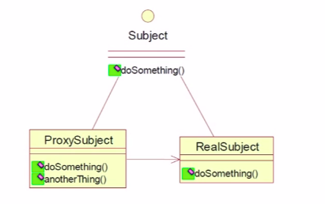
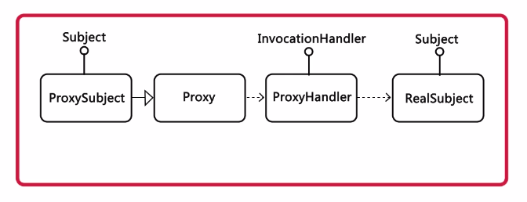
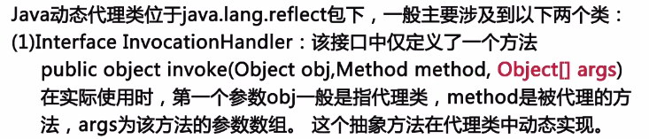
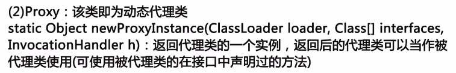
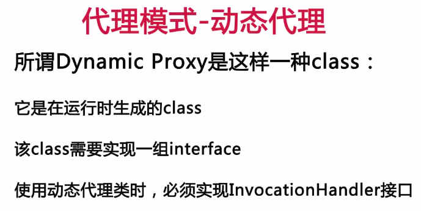
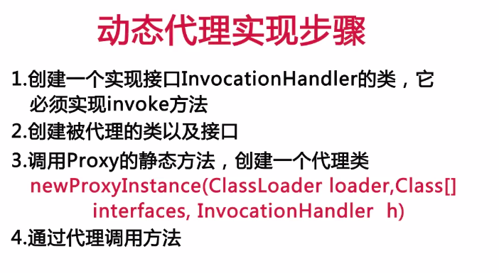
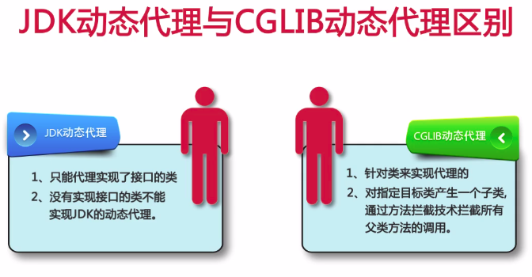
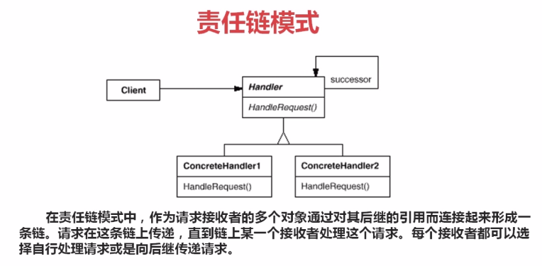
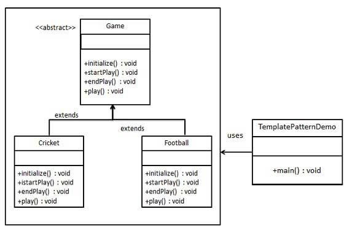

### 设计模式概述  
设计模式（Design pattern）代表了最佳的实践，通常被有经验的面向对象的软件开发人员所采用。设计模式是软件开发人员在软件开发过程中面临的一般问题的解决方案。这些解决方案是众多软件开发人员经过相当长的一段时间的试验和错误总结出来的。  
设计模式是**一套被反复使用、多数人知晓的、经过分类的、代码设计经验的总结。**  
### 使用设计模式的目的  
为了代码可重用性、让代码更容易被他人理解、保证代码可靠性。 设计模式使代码编写真正工程化；设计模式是软件工程的基石脉络，如同大厦的结构一样。  
### 提出者  
设计模式是由GOF(四人帮，Gang of Four)提出的。  
在 1994 年，由 Erich Gamma、Richard Helm、Ralph Johnson 和 John Vlissides 四人合著出版了一本名为 Design Patterns - Elements of Reusable Object-Oriented Software（中文译名：设计模式 - 可复用的面向对象软件元素） 的书，该书首次提到了软件开发中设计模式的概念。  
四位作者合称 GOF（四人帮，全拼 Gang of Four）。他们所提出的设计模式主要是基于以下的面向对象设计原则：
* 对接口编程而不是对实现编程。
* 优先使用对象组合而不是继承。    

### 设计模式的使用  
设计模式在软件开发中的两个主要用途。  
#### 开发人员的共同平台  
设计模式提供了一个标准的术语系统，且具体到特定的情景。例如，单例设计模式意味着使用单个对象，这样所有熟悉单例设计模式的开发人员都能使用单个对象，并且可以通过这种方式告诉对方，程序使用的是单例模式。  
#### 最佳的实践  
设计模式已经经历了很长一段时间的发展，它们提供了软件开发过程中面临的一般问题的最佳解决方案。学习这些模式有助于经验不足的开发人员通过一种简单快捷的方式来学习软件设计。  

### 设计模式的类型  
根据设计模式的参考书** Design Patterns - Elements of Reusable Object-Oriented Software（中文译名：设计模式 - 可复用的面向对象软件元素）** 中所提到的，总共有** 23 种**设计模式。这些模式可以分为三大类：**创建型模式（Creational Patterns）、结构型模式（Structural Patterns）、行为型模式（Behavioral Patterns）**。当然，我们还会讨论另一类设计模式：**J2EE 设计模式。**  

  
  
  
 下面用一个图片来整体描述一下设计模式之间的关系：  
 
   
### 设计模式的七大原则  
#### 1、单一职责原则（SRP：Single Responsibility Principle）
所谓职责是指类变化的原因。如果一个类有多于一个的动机被改变，那么这个类就具有多于一个的职责。而单一职责原则就是指一个类或者模块应该有且只有一个改变的原因。如果一个类承担的职责过多，就等于把这些职责耦合在一起了。一个职责的变化可能会削弱或者抑制这个类完成其他职责的能力。这种耦合会导致脆弱的设计，当发生变化时，设计会遭受到意想不到的破坏。而如果想要避免这种现象的发生，就要尽可能的遵守单一职责原则。此原则的核心就是解耦和增强内聚性。  
#### 2、开闭原则（OCP：Open Close Principle）  
开闭原则的意思是：对扩展开放，对修改关闭。在程序需要进行拓展的时候，不能去修改原有的代码，实现一个热插拔的效果。简言之，是为了使程序的扩展性好，易于维护和升级。想要达到这样的效果，我们需要使用接口和抽象类，后面的具体设计中我们会提到这点。  
#### 3、里氏代换原则（LSP：Liskov Substitution Principle）  
里氏代换原则是面向对象设计的基本原则之一。 里氏代换原则中说，任何基类可以出现的地方，子类一定可以出现。LSP 是继承复用的基石，只有当派生类可以替换掉基类，且软件单位的功能不受到影响时，基类才能真正被复用，而派生类也能够在基类的基础上增加新的行为。里氏代换原则是对开闭原则的补充。实现开闭原则的关键步骤就是抽象化，而基类与子类的继承关系就是抽象化的具体实现，所以里氏代换原则是对实现抽象化的具体步骤的规范。  
#### 4、依赖倒转原则（DIP：Dependence Inversion Principle）  
这个原则是开闭原则的基础，具体内容：针对接口编程，依赖于抽象而不依赖于具体。  
#### 5、接口隔离原则（ISP：Interface Segregation Principle）  
这个原则的意思是：使用多个隔离的接口，比使用单个接口要好。它还有另外一个意思是：降低类之间的耦合度。由此可见，其实设计模式就是从大型软件架构出发、便于升级和维护的软件设计思想，它强调降低依赖，降低耦合。  
#### 6、迪米特法则，又称最少知道原则（DP：Demeter Principle）  
最少知道原则是指：一个实体应当尽量少地与其他实体之间发生相互作用，使得系统功能模块相对独立。  
#### 7、合成复用原则（CRP：Composite Reuse Principle）  
合成复用原则是指：尽量使用合成/聚合的方式，而不是使用继承。  

#### 下面我们将通过Java实例来总结常用的设计模式。

### 创建型模式  

### 1、工厂模式  
工厂模式（Factory Pattern）是 Java 中最常用的设计模式之一。这种类型的设计模式属于创建型模式，它提供了一种创建对象的最佳方式。  
在工厂模式中，我们在创建对象时不会对客户端暴露创建逻辑，并且是通过使用一个共同的接口来指向新创建的对象。  
#### 介绍  
**意图：**定义一个创建对象的接口，让其子类自己决定实例化哪一个工厂类，工厂模式使其创建过程延迟到子类进行。  

**主要解决：**主要解决接口选择的问题。  

**何时使用：**我们明确地计划不同条件下创建不同实例时。  

**如何解决：**让其子类实现工厂接口，返回的也是一个抽象的产品。  

**关键代码：**创建过程在其子类执行。  

**应用实例：** 1、您需要一辆汽车，可以直接从工厂里面提货，而不用去管这辆汽车是怎么做出来的，以及这个汽车里面的具体实现。 2、Hibernate 换数据库只需换方言和驱动就可以。  
**优点：** 1、一个调用者想创建一个对象，只要知道其名称就可以了。 2、扩展性高，如果想增加一个产品，只要扩展一个工厂类就可以。 3、屏蔽产品的具体实现，调用者只关心产品的接口。  

**缺点：**每次增加一个产品时，都需要增加一个具体类和对象实现工厂，使得系统中类的个数成倍增加，在一定程度上增加了系统的复杂度，同时也增加了系统具体类的依赖。这并不是什么好事。  

**使用场景：** 1、日志记录器：记录可能记录到本地硬盘、系统事件、远程服务器等，用户可以选择记录日志到什么地方。 2、数据库访问，当用户不知道最后系统采用哪一类数据库，以及数据库可能有变化时。 3、设计一个连接服务器的框架，需要三个协议，"POP3"、"IMAP"、"HTTP"，可以把这三个作为产品类，共同实现一个接口。  

**注意事项：**作为一种创建类模式，在任何需要生成复杂对象的地方，都可以使用工厂方法模式。有一点需要注意的地方就是复杂对象适合使用工厂模式，而简单对象，特别是只需要通过 new 就可以完成创建的对象，无需使用工厂模式。如果使用工厂模式，就需要引入一个工厂类，会增加系统的复杂度。

#### 实现 
我们将创建一个 Shape 接口和实现 Shape 接口的实体类。下一步是定义工厂类 ShapeFactory。  
FactoryPatternDemo，我们的演示类使用 ShapeFactory 来获取 Shape 对象。它将向 ShapeFactory 传递信息（CIRCLE / RECTANGLE / SQUARE），以便获取它所需对象的类型。 


**步骤 1**  
创建一个接口。  
Shape.java
```java
public interface Shape {
   void draw();
}
```
**步骤 2**    
创建实现接口的实体类。  
Rectangle.java  
```java
public class Rectangle implements Shape {

   @Override
   public void draw() {
      System.out.println("Inside Rectangle::draw() method.");
   }
}
```

Square.java  
```java
public class Square implements Shape {

   @Override
   public void draw() {
      System.out.println("Inside Square::draw() method.");
   }
}
```

Circle.java  
```java
public class Circle implements Shape {

   @Override
   public void draw() {
      System.out.println("Inside Circle::draw() method.");
   }
}

```

**步骤 3**  
创建一个工厂，生成基于给定信息的实体类的对象。
ShapeFactory.java  
```java
public class ShapeFactory {
    
   //使用 getShape 方法获取形状类型的对象
   public Shape getShape(String shapeType){
      if(shapeType == null){
         return null;
      }        
      if(shapeType.equalsIgnoreCase("CIRCLE")){
         return new Circle();
      } else if(shapeType.equalsIgnoreCase("RECTANGLE")){
         return new Rectangle();
      } else if(shapeType.equalsIgnoreCase("SQUARE")){
         return new Square();
      }
      return null;
   }
}
```

**步骤 4**  
使用该工厂，通过传递类型信息来获取实体类的对象。
FactoryPatternDemo.java  
```java
public class FactoryPatternDemo {

   public static void main(String[] args) {
      ShapeFactory shapeFactory = new ShapeFactory();

      //获取 Circle 的对象，并调用它的 draw 方法
      Shape shape1 = shapeFactory.getShape("CIRCLE");

      //调用 Circle 的 draw 方法
      shape1.draw();

      //获取 Rectangle 的对象，并调用它的 draw 方法
      Shape shape2 = shapeFactory.getShape("RECTANGLE");

      //调用 Rectangle 的 draw 方法
      shape2.draw();

      //获取 Square 的对象，并调用它的 draw 方法
      Shape shape3 = shapeFactory.getShape("SQUARE");

      //调用 Square 的 draw 方法
      shape3.draw();
   }
}
```

**步骤 5**  
验证输出。  
Inside Circle::draw() method.  
Inside Rectangle::draw() method.  
Inside Square::draw() method.  

使用**反射机制**可以解决每次增加一个产品时，都需要增加一个对象实现工厂接口的缺点。注意要使用完整包名，也可以使用Properties文件做映射。  
```java
public class ShapeFactory {
    public Shape getShapeByClassName(String className) {
   	Shape obj = null;

        try {
			obj = (Shape)Class.forName(clazz.getName()).newInstance();
        } catch (ClassNotFoundException e) {
            e.printStackTrace();
        } catch (InstantiationException e) {
            e.printStackTrace();
        } catch (IllegalAccessException e) {
            e.printStackTrace();
        }

        return obj;
        
    }
}
```

**工厂模式的实际应用**  


### 2、抽象工厂模式  
抽象工厂模式（Abstract Factory Pattern）是围绕一个超级工厂创建其他工厂。该超级工厂又称为其他工厂的工厂。这种类型的设计模式属于创建型模式，它提供了一种创建对象的最佳方式。  

在抽象工厂模式中，接口是负责创建一个相关对象的工厂，不需要显式指定它们的类。每个生成的工厂都能按照工厂模式提供对象。    

抽象工厂模式是所有形态的工厂模式中最为抽象和最具一般性的一种形态。  

为了方便引进抽象工厂模式，引进一个新概念：产品族（Product Family）。所谓产品族，是指位于不同产品等级结构，功能相关联的产品组成的家族。如图：  
   
图中一共有四个产品族，分布于三个不同的产品等级结构中。同一个产品族是同一个工厂生产的，而不同等级结构来自不同的工厂。只要指明一个产品所处的产品族以及它所属的等级结构，就可以唯一的确定这个产品。  
所谓的抽象工厂是指一个工厂等级结构可以创建出分属于不同产品等级结构的一个产品族中的所有对象。如果用图来描述的话，如下图：  
 
#### 介绍
**意图：**提供一个创建一系列相关或相互依赖对象的接口，而无需指定它们具体的类。

**主要解决：**主要解决接口选择的问题。

**何时使用：**系统的产品有多于一个的产品族，而系统只消费其中某一族的产品。

**如何解决：**在一个产品族里面，定义多个产品。

**关键代码：**在一个工厂里聚合多个同类产品。

**应用实例：**工作了，为了参加一些聚会，肯定有两套或多套衣服吧，比如说有商务装（成套，一系列具体产品）、时尚装（成套，一系列具体产品），甚至对于一个家庭来说，可能有商务女装、商务男装、时尚女装、时尚男装，这些也都是成套的，即一系列具体产品。假设一种情况（现实中是不存在的，要不然，没法进入共产主义了，但有利于说明抽象工厂模式），在您的家中，某一个衣柜（具体工厂）只能存放某一种这样的衣服（成套，一系列具体产品），每次拿这种成套的衣服时也自然要从这个衣柜中取出了。用 OO 的思想去理解，所有的衣柜（具体工厂）都是衣柜类的（抽象工厂）某一个，而每一件成套的衣服又包括具体的上衣（某一具体产品），裤子（某一具体产品），这些具体的上衣其实也都是上衣（抽象产品），具体的裤子也都是裤子（另一个抽象产品）。

**优点：**当一个产品族中的多个对象被设计成一起工作时，它能保证客户端始终只使用同一个产品族中的对象。

**缺点：**产品族扩展非常困难，要增加一个系列的某一产品，既要在抽象的 Creator 里加代码，又要在具体的里面加代码。

**使用场景：** 1、QQ 换皮肤，一整套一起换。 2、生成不同操作系统的程序。

**注意事项：**产品族难扩展，产品等级易扩展。  

   

上图的描述用产品族描述如下：  
   
#### 实现  
我们来举这样一个例子，QQ秀有不同的装扮，分为男孩和女孩，而男孩又分为圣诞男孩和新年男孩，女孩分为圣诞女孩和新年女孩。那么就可以有一个抽象工厂生产男孩和女孩。两个具体的工厂分别生产圣诞系列的男孩和女孩、新年系列的男孩和女孩。同一系列的男孩和女孩是一个产品族，而不同系列构成不同的产品等级。  

**步骤 1**  
为男孩创建一个接口。  
Boy.java
```java
public interface Boy {
	public void drawMan();
}
```
**步骤 2**  
创建实现接口的实体类。  
MCBoy.java
```java
public class MCBoy implements Boy {

	@Override
	public void drawMan() {
		System.out.println("-----------------圣诞系列的男孩子--------------------");
	}

}
```
HNBoy.java
```java
public class HNBoy implements Boy {

	@Override
	public void drawMan() {
		System.out.println("-----------------新年系列的男孩子--------------------");
	}

}
```
**步骤 3**  
为女孩创建一个接口  
Girl.java
```java
public interface Girl {
	public void drawWomen();
}
```
**步骤 4**
创建实现接口的实体类。  
MCGirl.java
```java
public class MCGirl implements Girl {

	@Override
	public void drawWomen() {
		System.out.println("-----------------圣诞系列的女孩子--------------------");
	}

}
```
HNGirl.java  
```java
public class HNGirl implements Girl {

	@Override
	public void drawWomen() {
		// TODO Auto-generated method stub
		System.out.println("-----------------新年系列的女孩子--------------------");
	}

}
```
**步骤 5**  
创建生产男孩女孩的抽象工厂接口  
PersonFactory.java
```java
public interface PersonFactory {
	//男孩接口
	public Boy getBoy();
	//女孩接口
	public Girl getGirl();	
}
```
**步骤 6**  
创建生产圣诞和新年系列的具体工厂  
MCFactory.java  
```java
public class MCFctory implements PersonFactory {

	@Override
	public Boy getBoy() {
		return new MCBoy();
	}

	@Override
	public Girl getGirl() {
		return new MCGirl();
	}

}
```
HNFactory.java  
```java
public class HNFactory implements PersonFactory {

	@Override
	public Boy getBoy() {
		return new HNBoy();
	}

	@Override
	public Girl getGirl() {
		return new HNGirl();
	}

}
```
**步骤 7**  
使用工厂生产  
AbstractFactoryPatternDemo.java
```java
public class AbstractFactoryPatternDemo{
	public static void main(String[] args){
    	MCFactory mcFactory = new MCFactory();
        HNFactory hnFactory = new HNFactory();
        Boy mcBoy = mcFactory.getBoy();
        Girl mcGirl = mcFactory.getGirl();
        Boy hnBoy = hnFactory.getBoy();
        Girl hnGirl = hnFactory.getGirl();
        mcBoy.drawMan();
        mcGirl.drawWomen();
        hnBoy.drawMan();
        hnGirl.drawWomen();
    }
}
```

**步骤 8**  
验证输出  
-----------------圣诞系列的男孩子--------------------  
-----------------圣诞系列的女孩子--------------------  
-----------------新年系列的男孩子--------------------  
-----------------新年系列的女孩子--------------------  


### 3、单例模式  
单例模式（Singleton Pattern）是 Java 中最简单的设计模式之一。这种类型的设计模式属于**创建型模式**，它提供了一种创建对象的最佳方式。  
这种模式涉及到一个**单一的类**，该类负责**创建自己的对象，同时确保只有单个对象被创建**。这个类提供了一种访问其唯一的对象的方式，**可以直接访问，不需要实例化该类的对象**。  
**注意：**  
1、单例类只能有**一个实例**。  
2、单例类必须**自己创建自己的唯一实例**，而不是在外部随意地new对象。  
3、单例类必须给所有其他对象**提供**这一实例。  
#### 介绍
**意图：**保证一个类仅有一个实例，并提供一个访问它的全局访问点。  
**主要解决：**一个全局使用的类频繁地创建与销毁。  
**何时使用：**当想控制实例数目，节省系统资源的时候。  
**如何解决：**判断系统是否已经有这个单例，如果有则返回，如果没有则创建。  
**关键代码：**构造函数是私有的。  
**应用实例：** 1、一个党只能有一个主席。 2、Windows 是多进程多线程的，在操作一个文件的时候，就不可避免地出现多个进程或线程同时操作一个文件的现象，所以所有文件的处理必须通过唯一的实例来进行。 3、一些设备管理器常常设计为单例模式，比如一个电脑有两台打印机，在输出的时候就要处理不能两台打印机打印同一个文件。  
**优点：** 1、在内存里只有一个实例，减少了内存的开销。2、避免频繁的创建和销毁实例，提高性能（比如管理学院首页页面缓存）。 2、避免对资源的多重占用（比如写文件操作）。   
**缺点：**1、扩展比较困难，没有接口，不能继承，与单一职责原则冲突，一个类应该只关心内部逻辑，而不关心外面怎么样来实例化。2、如果实例化后的对象长期不利用，系统将默认为垃圾进行回收，造成对象状态丢失。  
**使用场景：** 1、当多个实例存在可能引起程序逻辑错误，如要求生产唯一序列号。 2、对系统内资源要求统一读写，如读写配置信息，又如WEB 中的计数器，不用每次刷新都在数据库里加一次，用单例先缓存起来。 3、创建的一个对象需要消耗的资源过多，但同时又需要用到该对象，比如 I/O 与数据库的连接等。  
**注意事项：**getInstance() 方法中需要使用同步锁 synchronized (Singleton.class) 防止多线程同时进入造成 instance 被多次实例化。  
#### 实现 
我们将创建一个 SingleObject 类。SingleObject 类有它的私有构造函数和本身的一个静态实例。  
SingleObject 类提供了一个静态方法，供外界获取它的静态实例。SingletonPatternDemo，我们的演示类使用 SingleObject 类来获取 SingleObject 对象。  
  
**步骤 1**
创建一个 Singleton 类。  
```java
SingleObject.java
public class SingleObject {

   //创建 SingleObject 的一个对象
   private static SingleObject instance = new SingleObject();

   //让构造函数为 private，这样该类就不会被实例化
   private SingleObject(){}

   //获取唯一可用的对象
   public static SingleObject getInstance(){
      return instance;
   }

   public void showMessage(){
      System.out.println("Hello World!");
   }
}
```
**步骤 2**  
从 singleton 类获取唯一的对象。
```java
SingletonPatternDemo.java
public class SingletonPatternDemo {
   public static void main(String[] args) {

      //不合法的构造函数
      //编译时错误：构造函数 SingleObject() 是不可见的
      //SingleObject object = new SingleObject();

      //获取唯一可用的对象
      SingleObject object = SingleObject.getInstance();

      //显示消息
      object.showMessage();
   }
}
```
**步骤 3**  
验证输出。
```java
Hello World!
```
#### 单例模式的几种实现方式  
单例模式的实现有多种方式，如下所示：  
**1、懒汉式，线程不安全**  
**是否 Lazy 初始化：**是  
**是否多线程安全：**否  
**实现难度：**易  
**描述：**这种方式是最基本的实现方式，这种实现最大的问题就是不支持多线程。假设开始线程1进入，判断instance为空，在将要创建实例时，时间片切换，线程2又进来了，同样判断instance为空，创建了实例，这是CPU调度回到线程1，继续创建实例。因为没有加锁 synchronized，所以严格意义上它并不算单例模式。  
这种方式 lazy loading 很明显，不要求线程安全，在多线程不能正常工作。  
**代码实例：**
```java
public class Singleton {  
    private static Singleton instance;  
    private Singleton (){}  
  
    public static Singleton getInstance() {  
    if (instance == null) {  /*懒汉式标志：Lazy 初始化,
    在外部第一次请求使用该类对象时才实例化，是时间换空间的模式*/
        instance = new Singleton();  
    }  
    return instance;  
    }  
}  
```
**接下来介绍的几种实现方式都支持多线程，但是在性能上有所差异。**  
**2、懒汉式，线程安全**  
**是否 Lazy 初始化：**是  
**是否多线程安全：**是  
**实现难度：**易  
**描述：**这种方式具备很好的 lazy loading，能够在多线程中很好的工作，但是，效率很低，99% 情况下不需要同步。  
**优点：**第一次调用才初始化，避免内存浪费。  
**缺点：**必须加锁 synchronized 才能保证单例，但加锁会影响效率。  
getInstance() 的性能对应用程序不是很关键（该方法使用不太频繁）。  
**代码实例：**
```java
public class Singleton {  
    private static Singleton instance;  
    private Singleton (){}  
    public static synchronized Singleton getInstance() {  
    //加同步锁
    if (instance == null) {   
        instance = new Singleton();  
    }  
    return instance;  
    }  
} 
```
**3、饿汉式**    
**是否 Lazy 初始化：**否  
**是否多线程安全：**是  
**实现难度：**易  
**描述：**这种方式比较常用，但容易产生垃圾对象。  
**优点：**没有加锁，执行效率会提高。  
**缺点：**类加载时就初始化，浪费内存。  
它基于 classloder 机制避免了多线程的同步问题，不过，instance 在类装载时就实例化，虽然导致类装载的原因有很多种，在单例模式中大多数都是调用 getInstance 方法， 但是也不能确定有其他的方式（或者其他的静态方法）导致类装载，这时候初始化 instance 显然没有达到 lazy loading 的效果。  
**代码实例：**  
```java
public class Singleton {  
    private static Singleton instance = new Singleton();  
                           /*饿汉式标志：在类加载时直接初始化，
                           是空间换时间的模式*/
    private Singleton (){}  
    public static Singleton getInstance() {  
    return instance;  
    }  
}  
```
**4、双检锁/双重校验锁（DCL，即 double-checked locking）**    
**JDK 版本：**JDK1.5 起  
**是否 Lazy 初始化：**是    
**是否多线程安全：**是  
**实现难度：**较复杂  
**描述：**这种方式采用双锁机制，安全且在多线程情况下能保持高性能。getInstance() 的性能对应用程序很关键。这种方法既能保证线程安全又能提高了效率。
假设线程1进入方法，instance为空，进入同步代码块，时间片切换，线程2进来，instance为空，在同步代码块外被阻塞，因为此时线程1正在里面。cup切换，线程1执行创建实例，当2再进入代码块后，此时instace不为空，直接返回instance。当再有线程进来，instance不为空，不用执行同步代码块，提高了效率。   
**代码实例：**  
```java
public class Singleton {  
    private volatile static Singleton singleton;  
    private Singleton (){}  
    public static Singleton getSingleton() {  
    if (singleton == null) {  
        synchronized (Singleton.class) {  
        if (singleton == null) {  
            singleton = new Singleton();  
        }  
        }  
    }  
    return singleton;  
    }  
}  
```
**5、登记式/静态内部类**  
**是否 Lazy 初始化：**是  
**是否多线程安全：**是  
**实现难度：**一般  
**描述：**这种方式能达到双检锁方式一样的功效，但实现更简单。对静态域使用延迟初始化，应使用这种方式而不是双检锁方式。这种方式只适用于静态域的情况，双检锁方式可在实例域需要延迟初始化时使用。  
这种方式同样利用了 classloder 机制来保证初始化 instance 时只有一个线程，它跟第 3 种方式不同的是：第 3 种方式只要 Singleton 类被装载了，那么 instance 就会被实例化（没有达到 lazy loading 效果），而这种方式是 Singleton 类被装载了，instance 不一定被初始化。因为 SingletonHolder 类没有被主动使用，只有通过显式调用 getInstance 方法时，才会显式装载 SingletonHolder 类，从而实例化 instance。想象一下，如果实例化 instance 很消耗资源，所以想让它延迟加载，另外一方面，又不希望在 Singleton 类加载时就实例化，因为不能确保 Singleton 类还可能在其他的地方被主动使用从而被加载，那么这个时候实例化 instance 显然是不合适的。这个时候，这种方式相比第 3 种方式就显得很合理。  
**代码实例：**
```java
public class Singleton {  
    private static class SingletonHolder {  
    private static final Singleton INSTANCE = new Singleton();  
    }  
    private Singleton (){}  
    public static final Singleton getInstance() {  
    return SingletonHolder.INSTANCE;  
    }  
}   
```
**6、枚举**  
**JDK 版本：**JDK1.5 起  
**是否 Lazy 初始化：**否  
**是否多线程安全：**是  
**实现难度：**易  
**描述：**这种实现方式还没有被广泛采用，但这是实现单例模式的最佳方法。它更简洁，自动支持序列化机制，绝对防止多次实例化。  
这种方式是 Effective Java 作者 Josh Bloch 提倡的方式，它不仅能避免多线程同步问题，而且还自动支持序列化机制，防止反序列化重新创建新的对象，绝对防止多次实例化。不过，由于 JDK1.5 之后才加入 enum 特性，用这种方式写不免让人感觉生疏，在实际工作中，也很少用。  
不能通过 reflection attack 来调用私有构造方法。  
**代码实例：**
```java
public enum Singleton {  
    INSTANCE;  
    public void whateverMethod() {  
    }  
}  
```
**经验之谈：**一般情况下，不建议使用第 1 种和第 2 种懒汉方式，建议使用第 3 种饿汉方式。只有在要明确实现 lazy loading 效果时，才会使用第 5 种登记方式。如果涉及到反序列化创建对象时，可以尝试使用第 6 种枚举方式。如果有其他特殊的需求，可以考虑使用第 4 种双检锁方式。  
### 4.建造者模式  
### 5.原型模式  

### 结构型模式  

### 6.适配器模式  
适配器模式（Adapter Pattern）是作为两个不兼容的接口之间的桥梁。这种类型的设计模式属于结构型模式，它结合了两个独立接口的功能。  
这种模式涉及到一个单一的类，该类负责加入独立的或不兼容的接口功能。举个真实的例子，读卡器是作为内存卡和笔记本之间的适配器。您将内存卡插入读卡器，再将读卡器插入笔记本，这样就可以通过笔记本来读取内存卡。  

#### 介绍
**意图：**将一个类的接口转换成客户希望的另外一个接口。适配器模式使得原本由于接口不兼容而不能一起工作的那些类可以一起工作。

**主要解决：**主要解决在软件系统中，常常要将一些"现存的对象"放到新的环境中，而新环境要求的接口是现对象不能满足的。

**何时使用：** 1、系统需要使用现有的类，而此类的接口不符合系统的需要。 2、想要建立一个可以重复使用的类，用于与一些彼此之间没有太大关联的一些类，包括一些可能在将来引进的类一起工作，这些源类不一定有一致的接口。 3、通过接口转换，将一个类插入另一个类系中。（比如老虎和飞禽，现在多了一个飞虎，在不增加实体的需求下，增加一个适配器，在里面包容一个虎对象，实现飞的接口。）

**如何解决：**继承或依赖（推荐）。

**关键代码：**适配器继承或依赖已有的对象，实现想要的目标接口。

**应用实例：** 1、美国电器 110V，中国 220V，就要有一个适配器将 110V 转化为 220V。 2、JAVA JDK 1.1 提供了 Enumeration 接口，而在 1.2 中提供了 Iterator 接口，想要使用 1.2 的 JDK，则要将以前系统的 Enumeration 接口转化为 Iterator 接口，这时就需要适配器模式。 3、在 LINUX 上运行 WINDOWS 程序。 4、JAVA 中的 jdbc。

**优点：** 1、可以让任何两个没有关联的类一起运行。 2、提高了类的复用。 3、增加了类的透明度。 4、灵活性好。

**缺点：** 1、过多地使用适配器，会让系统非常零乱，不易整体进行把握。比如，明明看到调用的是 A 接口，其实内部被适配成了 B 接口的实现，一个系统如果太多出现这种情况，无异于一场灾难。因此如果不是很有必要，可以不使用适配器，而是直接对系统进行重构。 2.由于 JAVA 至多继承一个类，所以至多只能适配一个适配者类，而且目标类必须是抽象类。

**使用场景：**有动机地修改一个正常运行的系统的接口，这时应该考虑使用适配器模式。

**注意事项：**适配器不是在详细设计时添加的，而是解决正在服役的项目的问题。  


#### 实现  
我们来看这样一个例子，笔记本(Laptop)需要三相插座(ThreePlugIf)充电，但是只有一个国标二相插座(GBTwoPlug),我们可以使用一个适配器来使用二相插座给笔记本充电。

(1)使用**组合**方式实现**对象**适配器  
把“被适配者”作为一个对象组合到适配器类中，以修改目标接口包装“被适配者”。  
ThreePlugIf.java
```java
/*
 * 三相插座接口
 */
public interface ThreePlugIf {
	
	//使用三相电流供电
	public void powerWithThree();
}
```
GBTwoPlug.java
```java
public class GBTwoPlug {
	
	//使用二相电流供电
	public void powerWithTwo(){
		System.out.println("使用二相电流供电");
	}
}
```
TwoPlugAdapter.java
```java
/*
 * 二相转三相的插座适配器
 */

public class TwoPlugAdapter implements ThreePlugIf {
	private GBTwoPlug plug;
	
	public TwoPlugAdapter(GBTwoPlug plug){
		this.plug = plug;
	}
	@Override
	public void powerWithThree() {
		System.out.println("通过转化");
		plug.powerWithTwo();
	}

}
```
Laptop.java
```java
public class Laptop {
	private ThreePlugIf  plug;
	
	public Laptop(ThreePlugIf plug){
		this.plug = plug;
	}
	
	//使用插座充电
	public void charge(){
		plug.powerWithThree();
	}
	
	public static void main(String[] args) {
		GBTwoPlug two =  new GBTwoPlug();
		ThreePlugIf three = new TwoPlugAdapter(two);
		Laptop lp = new Laptop(three);
		lp.charge();
	}

}
```
验证输出：  
通过转化  
使用二相电流供电  

分析：Laptop需要一个实现ThreePlugIf接口的对象来使用三相电流供电，我们就传入一个实现了该接口的适配器，看似调用了powerWithThree()方法，实际上是调用了组合在适配器里的GBTwoPlug的powerWithTwo()方法。

(2)使用**继承**方式实现**类**适配器  
继承“被适配者”并实现目标接口。  
TwoPlugAdapterExtends.java
```java
/*
 * 采用继承方式的插座适配器
 */
public class TwoPlugAdapterExtends extends GBTwoPlug implements ThreePlugIf {

	@Override
	public void powerWithThree() {
		System.out.println("借助继承适配器");
		this.powerWithTwo();

	}

}
```
Laptop.java
```java
public class Laptop {

	private ThreePlugIf  plug;
	
	public Laptop(ThreePlugIf plug){
		this.plug = plug;
	}
	
	//使用插座充电
	public void charge(){
		plug.powerWithThree();
	}
	
	public static void main(String[] args) {
		three = new TwoPlugAdapterExtends();
		lp = new Laptop(three);
		lp.charge();
	}

}
```
验证输出：  
借助继承适配器  
使用二相电流供电

两种方法比较，组合适配可以适配"被适配者"的任何子类(根据多态机制可以给适配器中的GBTwoPlug赋予GBTwoPlug的任何子类的引用)，但继承适配是为单一的类服务的(已经继承了GBTwoPlug，不能再继承它的子类)，只能适配"被适配者"。
### 7.桥接模式
### 8.过滤器模式
### 9.组合模式
### 10.装饰器模式
### 11.外观模式
### 12.享元模式
### 13.代理模式  
在代理模式（Proxy Pattern）中，代理对象为其他对象提供代理以控制对被代理对象的访问。代理对象起到中介作用，可去掉功能服务或增加额外的服务，这种类型的设计模式属于结构型模式。

在代理模式中，我们创建具有现有对象的对象，以便向外界提供功能接口。

#### 介绍
**意图：**为其他对象提供一种代理以控制对这个对象的访问。

**主要解决：**在直接访问对象时带来的问题，比如说：要访问的对象在远程的机器上。在面向对象系统中，有些对象由于某些原因（比如对象创建开销很大，或者某些操作需要安全控制，或者需要进程外的访问），直接访问会给使用者或者系统结构带来很多麻烦，我们可以在访问此对象时加上一个对此对象的访问层。

**何时使用：**想在访问一个类时做一些控制。

**如何解决：**增加中间层。

**关键代码：**实现与被代理类**组合**。

**应用实例：** 1、Windows 里面的快捷方式。 2、猪八戒去找高翠兰结果是孙悟空变的，可以这样理解：把高翠兰的外貌抽象出来，高翠兰本人和孙悟空都实现了这个接口，猪八戒访问高翠兰的时候看不出来这个是孙悟空，所以说孙悟空是高翠兰代理类。 3、买火车票不一定在火车站买，也可以去代售点。 4、一张支票或银行存单是账户中资金的代理。支票在市场交易中用来代替现金，并提供对签发人账号上资金的控制。 5、spring aop。

**优点：** 1、职责清晰。 2、高扩展性。 3、智能化。

**缺点：** 1、由于在客户端和真实主题之间增加了代理对象，因此有些类型的代理模式可能会造成请求的处理速度变慢。 2、实现代理模式需要额外的工作，有些代理模式的实现非常复杂。

**使用场景：**按职责来划分，通常有以下使用场景：  
1、远程代理。为不同地理的对象提供局域网代表对象。比如通过远程代理监控分店的库存和销售情况。   
2、虚拟代理。根据需要将资源消耗很大的对象进行延迟，真正需要的时候进行创建。   
3、Copy-on-Write 代理。  
4、保护（Protect or Access）代理。即控制对一个对象的访问权限。比如论坛游客和用户的权限。  
5、Cache代理。   
6、防火墙（Firewall）代理。  
7、同步化（Synchronization）代理。   
8、智能引用（Smart Reference）代理。提供对目标对象额外的服务。

**注意事项： **[菜鸟版JAVA设计模式—适配器模式，装饰模式，代理模式异同](http://blog.csdn.net/lulei9876/article/details/39994825)


#### 实现  
我们来看这样一个例子，一辆车有行驶的功能，现在通过代理模式新增记录行驶时间的功能。
#### 代理模式分类    
#### 静态代理    
代理和被代理对象在代理之前是确定的。它们都实现相同的接口或者继承相同的抽象类。  

    
**1) 通过继承的方式实现静态代理**  

**步骤 1**  
定义Moveable接口  

Moveable.java  
```java
package com.imooc.proxy;

public interface Moveable {
	void move();
}
```

**步骤 2**  
定义Car类实现Moveable接口  

Car.java  
```java
package com.imooc.proxy;

import java.util.Random;

public class Car implements Moveable {

	@Override
	public void move() {
		//实现开车
		try {
			Thread.sleep(new Random().nextInt(1000));
			System.out.println("汽车行驶中....");
		} catch (InterruptedException e) {
			e.printStackTrace();
		}
	}

}
```

**步骤 3**  
定义代理类Car2类继承被代理类Car，并增加记录时间功能  

```java
package com.imooc.proxy;

public class Car2 extends Car {

	@Override
	public void move() {
		long starttime = System.currentTimeMillis();
		System.out.println("汽车开始行驶....");
		super.move();
		long endtime = System.currentTimeMillis();
		System.out.println("汽车结束行驶....  汽车行驶时间：" 
				+ (endtime - starttime) + "毫秒！");
	}

	
}
```

**步骤 4**  
定义测试类  
```java
package com.imooc.proxy;

public class Client {

	/**
	 * 测试类
	 */
	public static void main(String[] args) {
		Moveable m = new Car2();
		m.move();
	}

}
```
**2) 通过聚合的方式实现静态代理**  

**步骤 1**  
定义Moveable接口  

Moveable.java  
```java
package com.imooc.proxy;

public interface Moveable {
	void move();
}
```

**步骤 2**  
定义Car类实现Moveable接口  

Car.java  
```java
package com.imooc.proxy;

import java.util.Random;

public class Car implements Moveable {

	@Override
	public void move() {
		//实现开车
		try {
			Thread.sleep(new Random().nextInt(1000));
			System.out.println("汽车行驶中....");
		} catch (InterruptedException e) {
			e.printStackTrace();
		}
	}

}
```

**步骤 3**  
定义代理类Car3类实现Moveable接口并聚合被代理类Car，增加记录时间功能  

```java
package com.imooc.proxy;

public class Car3 implements Moveable {
	private Car car;
    
	public Car3(Car car) {
		this.car = car;
	}
	@Override
	public void move() {
		long starttime = System.currentTimeMillis();
		System.out.println("汽车开始行驶....");
		car.move();
		long endtime = System.currentTimeMillis();
		System.out.println("汽车结束行驶....  汽车行驶时间：" 
				+ (endtime - starttime) + "毫秒！");
	}

}
```

**步骤 4**  
定义测试类  
```java
package com.imooc.proxy;

public class Client {

	/**
	 * 测试类
	 */
	public static void main(String[] args) {
		Car car = new Car();
		Moveable m = new Car3(car);
		m.move();
	}

}
```

比较两种实现静态代理的方式，会发现随着功能的扩展，使用继承的方式的代理类数量会膨胀，难以维护，而使用聚合的方式更加灵活。所以，**聚合比继承更适合代理模式**。   

#### 动态代理  
在上面的例子中我们会发现一个问题，如果想要对自行车、火车等进行记录时间的代理，还需要创建自行车代理类、火车代理类等，如果有很多类需要代理，会造成代理类膨胀。  
而动态代理能**动态产生**代理，实现对**不同类**,不同**方法**的代理。  

**1) 通过JDK实现动态代理**    
JDK提供了动态代理的API。代理对象不需要实现目标接口，但目标对象必须实现目标接口。代理对象的生成,是利用JDK的API,动态的在内存中构建代理对象(需要我们指定创建代理对象/目标对象实现的接口的类型)，JDK动态代理也叫做接口代理。  

    

  

    

我们用动态代理来实现上面的例子  

**步骤 1**  
定义Moveable接口  

Moveable.java  
```java
package com.imooc.proxy;

public interface Moveable {
	void move();
}
```

**步骤 2**  
定义Car类实现Moveable接口  

Car.java  
```java
package com.imooc.proxy;

import java.util.Random;

public class Car implements Moveable {

	@Override
	public void move() {
		//实现开车
		try {
			Thread.sleep(new Random().nextInt(1000));
			System.out.println("汽车行驶中....");
		} catch (InterruptedException e) {
			e.printStackTrace();
		}
	}

}
```

**步骤 3**  
定义代理类TimeHandler实现InvocationHandler接口，聚合被代理类对象target  

```java
package com.imooc.jdkproxy;

import java.lang.reflect.InvocationHandler;
import java.lang.reflect.Method;

public class TimeHandler implements InvocationHandler {

	public TimeHandler(Object target) {
		super();
		this.target = target;
	}

	private Object target; //target对象是聚合在代理类里的目标对象(被代理对象)
	
	/*
	 * 参数：
	 * proxy  代理对象
	 * method  被代理对象的方法
	 * args 方法的参数
	 * 
	 * 返回值：
	 * Object  方法的返回值
	 * */
	@Override
	public Object invoke(Object proxy, Method method, Object[] args)
			throws Throwable {
		long starttime = System.currentTimeMillis();
		System.out.println("汽车开始行驶....");
		method.invoke(target); //被代理的target对象调用method方法，args为null可以不写
		long endtime = System.currentTimeMillis();
		System.out.println("汽车结束行驶....  汽车行驶时间：" 
				+ (endtime - starttime) + "毫秒！");
		return null;
	}
    
    //获取代理对象
	public Object getProxy() {
    	/** static Object newProxyInstance(ClassLoader loader,Class[] interfaces,InvocationHandler)
		 * loader  被代理类(Car)的类加载器
		 * interfaces  被代理类(Car)实现的接口
		 * 通过获取Car的类对象获取loader和interfaces
		 * h 实现了InvocationHandler接口的代理类对象
		 */
        return Proxy.newProxyInstance(
        target.getClass().getClassLoader(),   
        target.getClass().getInterfaces(), this);  
    }  
}  
}
```

**步骤 4**  
定义测试类 

```java
package com.imooc.jdkproxy;

import java.lang.reflect.InvocationHandler;
import java.lang.reflect.Proxy;

import com.imooc.proxy.Car;
import com.imooc.proxy.Moveable;

public class Test {

	/**
	 * JDK动态代理测试类
	 */
	public static void main(String[] args) {
    	// 实例化目标对象
		Car car = new Car();
        // 实例化InvocationHandler
		InvocationHandler h = new TimeHandler(car);
        // 获取代理对象
		Moveable m = (Moveable)h.getProxy();
        // 调用代理方法
		m.move();
	}

}
```

上面步骤 3可以直接定义一个动态代理工厂类ProxyFactory，把InvocationHandler作为ProxyFactory的匿名内部类。即：  

ProxyFactory.java
```java
package com.imooc.jdkproxy;

import java.lang.reflect.InvocationHandler;
import java.lang.reflect.Method;

public class TimeHandler implements InvocationHandler {

	public TimeHandler(Object target) {
		super();
		this.target = target;
	}

	private Object target; 
	

    
    //获取代理对象
	public Object getProxyInstance() {
    	return Proxy.newProxyInstance(
        target.getClass().getClassLoader(),
        target.getClass().getInterfaces(),
        new InvocationHandler(){
        	@Override
        public Object invoke(Object proxy, Method method, Object[]
        args) throws Throwable {
        	long starttime = System.currentTimeMillis();
		System.out.println("汽车开始行驶....");
		method.invoke(target); //被代理的target对象调用method方法，args为null可以不写
		long endtime = System.currentTimeMillis();
		System.out.println("汽车结束行驶....  汽车行驶时间：" 
				+ (endtime - starttime) + "毫秒！");
		return null; //方法无返回值,返回null
        }
        });
    }  
}
```
    
    
拓展：  
* [Java的三种代理模式](http://www.cnblogs.com/cenyu/p/6289209.html)
* [InvocationHandler中invoke方法中的第一个参数proxy的用途](http://blog.csdn.net/bu2_int/article/details/60150319) 
* [java中Proxy(代理与动态代理)](http://blog.csdn.net/pangqiandou/article/details/52964066)  
* [java静态代理和动态代理](http://layznet.iteye.com/blog/1182924)    
* [深入理解Java反射](http://www.cnblogs.com/luoxn28/p/5686794.html)

**JDK动态代理的简易实现**  
实现功能：通过Proxy的newProxyInstance返回代理对象  

（1）声明一段源码（动态产生代理）  
（2）编译源码（JDK Compiler API），产生新的类（代理类） 
（3）将这个类load到内存当中，产生一个新的对象（代理对象）
（4）return代理对象   
具体见慕课视频：[模拟JDK动态代理实现思路分析](https://www.imooc.com/video/4903)
**总结：**代理对象不需要实现接口,但是目标对象一定要实现接口,否则不能用JDK动态代理  

**2) 使用cglib实现动态代理**  
上面的静态代理和动态代理模式都是要求目标对象是实现一个接口的目标对象，但是有时候目标对象只是一个单独的对象，并没有实现任何的接口，这个时候就可以使用以目标对象子类的方式类实现代理，这种方法就叫做Cglib代理。  

Cglib代理，也叫作子类代理，它是在内存中构建一个子类对象从而实现对目标对象功能的扩展。  

JDK的动态代理有一个限制,就是使用动态代理的对象必须实现一个或多个接口,如果想代理没有实现接口的类,就可以使用Cglib实现。  

Cglib是一个强大的高性能的代码生成包,它可以在运行期扩展Java类与实现Java接口。它广泛的被许多AOP框架使用,例如Spring AOP和synaop,为他们提供方法的interception(拦截)。

Cglib子类代理实现方法:  
1.需要引入cglib的jar文件,但是Spring的核心包中已经包括了Cglib功能,所以直接引入pring-core-3.2.5.jar即可。  
2.引入功能包后,就可以在内存中动态构建子类。  
3.代理的类不能为final,否则报错。  
4.目标对象的方法如果为final/static,那么就不会被拦截,即不会执行目标对象额外的业务方法。  

  

Train.java
```java
/**
 * 目标对象,没有实现任何接口
 */
public class Train {

    public void move() {
        System.out.println("火车行驶中...");
    }
}
```
ProxyFactory.java
```java
/**
 * Cglib子类代理工厂，实现MethodInterceptor接口  
 * 设置Cglib子类的父类为目标对象的类
 * 对Train在内存中动态构建一个子类对象
 * 重写intercept方法对目标父类的方法调用进行拦截
 */
public class ProxyFactory implements MethodInterceptor{
    //维护目标对象
    private Object target;

    public ProxyFactory(Object target) {
        this.target = target;
    }

    //给目标对象创建一个代理对象
    public Object getProxyInstance(){
        //1.创建加强器，用来创建动态代理类
        Enhancer en = new Enhancer();
        //2.为加强器指定要代理的业务类（即为下面生成的代理类指定父类）
        en.setSuperclass(target.getClass());
        //3.设置回调：在调用目标方法时，CgLib会回调intercept方法进行拦截，来实现你自己的代理逻辑
        en.setCallback(this);
        //4.创建动态代理类对象并返回  
        return en.create();

    }
	`/**
	 * 拦截所有目标父类方法的调用
	 * obj  目标类的实例
	 * method   目标方法的反射对象
	 * args  方法的参数
	 * proxy 代理类的实例
	 */
    @Override
    public Object intercept(Object obj, Method method, Object[] args, MethodProxy proxy) throws Throwable {
        System.out.println("日志开始...");
		//代理类调用父类的方法
		proxy.invokeSuper(obj, args);
		System.out.println("日志结束...");
		return null; //方法无返回值，返回null
    }
}
```
Client.java
```java
/**
 * 测试类
 */
public class Client {

    @Test
    public void test(){
        //目标对象
        Train target = new Train();

        //代理对象
        Train proxy = 
        (Train)new ProxyFactory(target).getProxyInstance();

        //执行代理对象的方法
        proxy.move();
    }
}
```
### 行为型模式  
### 14.责任链模式  
顾名思义，责任链模式（Chain of Responsibility Pattern）为请求创建了一个接收者对象的链。这种模式给予请求的类型，对请求的发送者和接收者进行解耦。这种类型的设计模式属于行为型模式。
在这种模式中，通常每个接收者都包含对另一个接收者的引用。如果一个对象不能处理该请求，那么它会把相同的请求传给下一个接收者，依此类推。

#### 介绍  
**意图：**避免请求发送者与接收者耦合在一起，让多个对象都有可能接收请求，将这些对象连接成一条链，并且沿着这条链传递请求，直到有对象处理它为止。

**主要解决：**职责链上的处理者负责处理请求，客户只需要将请求发送到职责链上即可，无须关心请求的处理细节和请求的传递，所以职责链将请求的发送者和请求的处理者解耦了。

**何时使用：**在处理消息的时候以过滤很多道。

**如何解决：**拦截的类都实现统一接口。

**关键代码：**Handler里面聚合它自己，在 HandlerRequest 里判断是否合适，如果没达到条件则向下传递，向谁传递之前 set 进去。

**应用实例：** 1、红楼梦中的"击鼓传花"。 2、JS 中的事件冒泡。 3、JAVA WEB 中 Apache Tomcat 对 Encoding 的处理，Struts2 的拦截器，jsp servlet 的 Filter。 4.JAVA 的异常链机制

**优点：** 1、降低耦合度。它将请求的发送者和接收者解耦。 2、简化了对象。使得对象不需要知道链的结构。 3、增强给对象指派职责的灵活性。通过改变链内的成员或者调动它们的次序，允许动态地新增或者删除责任。 4、增加新的请求处理类很方便。

**缺点：** 1、不能保证请求一定被接收。 2、系统性能将受到一定影响，而且在进行代码调试时不太方便，可能会造成循环调用。 3、可能不容易观察运行时的特征，有碍于除错。

**使用场景：** 1、有多个对象可以处理同一个请求，具体哪个对象处理该请求由运行时刻自动确定。 2、在不明确指定接收者的情况下，向多个对象中的一个提交一个请求。 3、可动态指定一组对象处理请求。

**注意事项：**在 JAVA WEB 中遇到很多应用。  


### 实现  
我们以销售楼盘为例，客户是Customer类，发送一个折扣请求给责任链。责任链由楼盘各级人员组成，都继承自PriceHandler抽象类，自底向上为Sales(销售)、Lead(销售小组长)、Manager(销售经理)、Director(销售总监)、VicePresident(销售副总裁)、CEO(首席执行官)。沿着责任链，能批准折扣的力度依次上升。  
  
**步骤 1** 创建PriceHandler抽象类  
PriceHandler.java  
```java
package com.imooc.pattern.cor.handler;

/*
 * 价格处理人，负责处理客户折扣申请
 */
public abstract class PriceHandler {
	
	/*
	 * 直接后继，用于传递请求
	 */
	protected PriceHandler successor;

	public void setSuccessor(PriceHandler successor) {
		this.successor = successor;
	}
	
	/*
	 * 处理折扣申请
	 */
	public abstract  void processDiscount(float discount);

}
```

**步骤 2** 创建PriceHandler的具体类  
Sales.java  
```java
package com.imooc.pattern.cor.handler;

/*
 * 销售， 可以批准5%以内的折扣
 */
public class Sales extends PriceHandler {

	@Override
	public void processDiscount(float discount) {
		if(discount <= 0.05){
			System.out.format("%s批准了折扣：%.2f%n", this.getClass().getName(), discount);
		}else{
			successor.processDiscount(discount);
		}

	}

}
```

Lead.java  
```java
package com.imooc.pattern.cor.handler;

/*
 * 销售小组长， 可以批准15%以内的折扣
 */
public class Lead extends PriceHandler {

	@Override
	public void processDiscount(float discount) {
		if(discount<=0.15){
			System.out.format("%s批准了折扣:%.2f%n",this.getClass().getName(),discount);
		}else{
			successor.processDiscount(discount);
		}

	}

}
```

Manager.java  
```java
package com.imooc.pattern.cor.handler;

/*
 * 销售经理， 可以批准30%以内的折扣
 */
public class Manager extends PriceHandler {

	@Override
	public void processDiscount(float discount) {
		if(discount<=0.3){
			System.out.format("%s批准了折扣:%.2f%n",this.getClass().getName(),discount);
		}else{
			successor.processDiscount(discount);
		}

	}

}
```

Director.java  
```java
package com.imooc.pattern.cor.handler;

/*
 * 销售总监， 可以批准40%以内的折扣
 */
public class Director extends PriceHandler {

	@Override
	public void processDiscount(float discount) {
		if(discount<=0.4){
			System.out.format("%s批准了折扣:%.2f%n",this.getClass().getName(),discount);
		}else{
			successor.processDiscount(discount);
		}

	}

}
```

VicePresident.java  
```java
package com.imooc.pattern.cor.handler;


/*
 * 销售副总裁， 可以批准50%以内的折扣
 */
public class VicePresident extends PriceHandler {

	@Override
	public void processDiscount(float discount) {
		if(discount<=0.5){
			System.out.format("%s批准了折扣:%.2f%n",this.getClass().getName(),discount);
		}else{
			successor.processDiscount(discount);
		}

	}

}
```

CEO.java
```java
package com.imooc.pattern.cor.handler;

/*
 * CEO， 可以批准55%以内的折扣
 * 折扣超出55%， 就拒绝申请
 */
public class CEO extends PriceHandler {

	@Override
	public void processDiscount(float discount) {
		if(discount<=0.55){
			System.out.format("%s批准了折扣:%.2f%n",this.getClass().getName(),discount);
		}else{
			System.out.format("%s拒绝了折扣:%.2f%n", this.getClass().getName(),discount);
		}

	}

}
```

**步骤 3** 创建PriceHandlerFactory类  
```java
package com.imooc.pattern.cor.handler;

public class PriceHandlerFactory {

	/*
	 * 创建PriceHandler的工厂方法，类似于构建链表并返回表头
	 */
	public static PriceHandler createPriceHandler() {
		
		PriceHandler sales = new Sales();
		PriceHandler lead = new Lead();
		PriceHandler man = new Manager();
		PriceHandler dir = new Director();
		PriceHandler vp = new VicePresident();
		PriceHandler ceo = new CEO();
		
		sales.setSuccessor(lead);
		lead.setSuccessor(man);
		man.setSuccessor(dir);
		dir.setSuccessor(vp);
		vp.setSuccessor(ceo);
		
		return sales;
	}

}
```

**步骤 4** 创建Customer类  
```java
package com.imooc.pattern.cor;

import java.util.Random;
import com.imooc.pattern.cor.handler.PriceHandler;
import com.imooc.pattern.cor.handler.PriceHandlerFactory;

/*
 * 客户，请求折扣
 */
public class Customer {
	
	private PriceHandler priceHandler;
	
	public void setPriceHandler(PriceHandler priceHandler) {
		this.priceHandler = priceHandler;
	}

	public void requestDiscount(float discount){
		priceHandler.processDiscount(discount);
	}
	
	
	public static void main(String[] args){
		Customer customer = new Customer();
		customer.setPriceHandler(PriceHandlerFactory.createPriceHandler());
		
		Random rand = new Random();
		
		for(int i=1;i<=100;i++){
			System.out.print(i+":");
			customer.requestDiscount(rand.nextFloat());
		}
		
		
	}
	

}
```
### 15.命令模式
### 16.解释器模式
### 17.迭代器模式
### 18.中介者模式
### 19.备忘录模式
### 20.观察者模式  
当对象间存在一对多关系时，则使用观察者模式（Observer Pattern）。比如，当一个对象被修改时，则会自动通知它的依赖对象，被通知的对象会做出各自的反应。观察者模式属于行为型模式。  

#### 介绍
**意图：**定义对象间的一种一对多的依赖关系，当一个对象的状态发生改变时，所有依赖于它的对象都得到通知并被自动更新。

**主要解决：**一个对象状态改变给其他对象通知的问题，而且要考虑到易用和低耦合，保证高度的协作。

**何时使用：**一个对象（目标对象）的状态发生改变，进行广播通知，所有的依赖对象（观察者对象）都将得到通知并做出各自的反应。

**如何解决：**使用面向对象技术，可以将这种依赖关系弱化。

**关键代码：**在抽象类里有一个 ArrayList 存放观察者们。

**应用实例：** 1、拍卖的时候，拍卖师观察最高标价，然后通知给其他竞价者竞价。 2、西游记里面悟空请求菩萨降服红孩儿，菩萨洒了一地水招来一个老乌龟，这个乌龟就是观察者，他观察菩萨洒水这个动作。

**优点：** 1、观察者和被观察者是抽象耦合的，被观察者只知道观察者接口，不知道具体的观察者类，实现了被观察者类和具体观察者类的解耦。 2、建立一套触发机制，实现了动态联动。 
3、支持广播通信。

**缺点：** 1、如果一个被观察者对象有很多的直接和间接的观察者的话，将所有的观察者都通知到会花费很多时间。 2、如果在观察者和观察目标之间有循环依赖的话，观察目标会触发它们之间进行循环调用，可能导致系统崩溃。 3、观察者模式没有相应的机制让观察者知道所观察的目标对象是怎么发生变化的，而仅仅只是知道观察目标发生了变化。

**使用场景：** 1、一个抽象模型有两个方面，其中一个方面的操作(观察者)依赖于另一个方面状态的变化(被观察者)。 2、如果在更改一个对象的时候，需要同时连带改变其他对象，而且不知道究竟有多少对象需要被连带改变。 3、当一个对象必须通知其他对象，而又希望这个对象和其他被通知的对象是松散耦合的。

**注意事项：** 1、JAVA 中已经有了对观察者模式的支持类。 2、避免循环引用。 3、如果顺序执行，某一观察者错误会导致系统卡壳，一般采用异步方式。

#### 实现
观察者模式使用三个类 Subject、Observer 和 Client。Subject 对象带有绑定观察者到 Client 对象和从 Client 对象解绑观察者的方法。我们创建 Subject 类、Observer 抽象类和扩展了抽象类 Observer 的实体类。  
ObserverPatternDemo，我们的演示类使用 Subject 和实体类对象来演示观察者模式。  

  


#### 观察者模式实现的两种方式  
**1) 推模型**  
目标对象主动向观察者推送目标的详细信息，推送的信息通常是目标或目标对象的全部数据。一般这种模型的实现中，会把目标对象想要推送的信息通过update方法传递给观察者。      
**步骤 1**  
创建 Subject 类(目标类、被观察者类)  
Subject.java
```java
import java.util.ArrayList;
import java.util.List;

public class Subject {
   private List<Observer> observers 
      = new ArrayList<Observer>();
   private int state;

   public int getState() {
      return state;
   }

   public void setState(int state) {
      this.state = state;
      notifyAllObservers(state);
   }

   public void attach(Observer observer){
      observers.add(observer);        
   }
   
   public void detach(Observer observer){
   	  observers.remove(observer);
   }
   
   public void notifyAllObservers(int state){
      for (Observer observer : observers) {
         observer.update(state);
      }
   }     
}
```
**步骤 2**  
创建 Observer 类  

Observer.java
```java
public abstract class Observer {
   public abstract void update(int state); //传递要推送的信息，观察者只能接收到目标推送的数据
}
```
**步骤 3**    
创建实体观察者类  

BinaryObserver.java
```java
public class BinaryObserver extends Observer{
   @Override
   public void update(int state) {
      System.out.println( "Binary String: " 
      + Integer.toBinaryString(state)); 
   }
}
```
OctalObserver.java
```java
public class OctalObserver extends Observer{
   @Override
   public void update(int state) {
     System.out.println( "Octal String: " 
     + Integer.toOctalString(state)); 
   }
}
```
HexaObserver.java
```java
public class HexaObserver extends Observer{
   @Override
   public void update(int state) {
      System.out.println( "Hex String: " 
      + Integer.toHexString(state).toUpperCase()); 
   }
}
```
**步骤 4**  
使用 Subject 和实体观察者对象  

ObserverPatternDemo.java
```java
public class ObserverPatternDemo {
   public static void main(String[] args) {
      Subject subject = new Subject();
      Observer o1 = new HexaObserver();
      Observer o2 = new OctalObserver();
      Observer o3 = new BinaryObserver();
	  subject.attach(o1);
      subject.attach(o2);
      subject.attach(o3);
      System.out.println("First state change: 15");    
      subject.setState(15);
      System.out.println("Second state change: 10");    
      subject.setState(10);
   }
}
```
**步骤 5**  
验证输出

First state change: 15  
Hex String: F  
Octal String: 17  
Binary String: 1111  
Second state change: 10  
Hex String: A  
Octal String: 12  
Binary String: 1010  


**2) 拉模型**  
目标对象在通知观察者的时候，只传递少量信息。如果观察者需要更具体的信息，由观察者主动到目标对象中获取，相当于观察者从目标对象中拉数据。一般这种模型的实现中，会把目标对象自身的引用通过update方法传递给观察者。    
**步骤 1**  
创建 Subject 类(目标类、被观察者类)  

Subject.java
```java
import java.util.ArrayList;
import java.util.List;

public class Subject {
   private List<Observer> observers 
      = new ArrayList<Observer>();
   private int state;

   public int getState() {
      return state;
   }

   public void setState(int state) {
      this.state = state;
      notifyAllObservers();
   }

   public void attach(Observer observer){
      observers.add(observer);        
   }
   
   public void detach(Observer observer){
   	  observers.remove(observer);
   }
   
   public void notifyAllObservers(){
      for (Observer observer : observers) {
         observer.update(this);
      }
   }     
}
```
**步骤 2**  
创建 Observer 类  

Observer.java
```java
public abstract class Observer {
	/*传递目标对象自身的引用，观察者可自己选择
    从目标对象中拉哪些数据*/
   public abstract void update(Subject message);
}
```
**步骤 3**    
创建实体观察者类  

BinaryObserver.java
```java
public class BinaryObserver extends Observer{
   @Override
   public void update(Subject message) {
   	  int state = message.getState(); 
      System.out.println( "Binary String: " 
      + Integer.toBinaryString(state)); 
   }
}
```
OctalObserver.java
```java
public class OctalObserver extends Observer{
   @Override
   public void update(Subject message) {
     int state = message.getState(); 
     System.out.println( "Octal String: " 
     + Integer.toOctalString(state)); 
   }
}
```
HexaObserver.java
```java
public class HexaObserver extends Observer{
   @Override
   public void update(Subject message) {
      int state = message.getState(); 
      System.out.println( "Hex String: " 
      + Integer.toHexString(state).toUpperCase()); 
   }
}
```
**步骤 4**  
使用 Subject 和实体观察者对象  

ObserverPatternDemo.java
```java
public class ObserverPatternDemo {
   public static void main(String[] args) {
      Subject subject = new Subject();
      Observer o1 = new HexaObserver();
      Observer o2 = new OctalObserver();
      Observer o3 = new BinaryObserver();
	  subject.attach(o1);
      subject.attach(o2);
      subject.attach(o3);
      System.out.println("First state change: 15");    
      subject.setState(15);
      System.out.println("Second state change: 10");    
      subject.setState(10);
   }
}
```
**步骤 5**  
验证输出

First state change: 15  
Hex String: F  
Octal String: 17  
Binary String: 1111  
Second state change: 10  
Hex String: A  
Octal String: 12  
Binary String: 1010  

**两种模型的区别：**  
1) 推模型由目标对象决定推送的信息，观察者不能获取推送信息之外目标对象的其他信息，较为被动。拉模型虽然仍是目标对象主动推送信息，但推送的是整个目标对象的引用，观察者可以选择性接收目标对象的信息。  
2) 推模型一般用于目标对象知道观察者需要的数据;而拉模型则用于目标对象不知道观察者需要的数据，因此把自身传递给观察者，由观察者来取值。  
3) 推模型会使观察者对象难以复用。拉模型下，update方法的参数是目标对象本身，基本上可以适应各种情况的需要。  

#### 利用Java提供的观察者实现  
Java提供了观察者模式的实现，有关类和接口是java.util包的Observable类和Observer接口。  
和自己实现对比：  
1.不需要自己定义观察者和目标接口了，JDK帮忙定义了  
2.具体的目标实现里面不需要再维护观察者的注册信息了，这个在Java中的Observable类里面已经帮忙实现好了。  
3.触发通知的方式有一点变化，要先调用setChanged方法,这个是Java为了帮助实现更精确的触发控制而实现的功能。   
4.具体观察者的实现里面，update方法其实能同时支持推模型和拉模型，这个是Java在定义的时候，就已经考虑进去的了。

实现方法：  
1、让具体Subject实现类继承Observable目标父类，Observable意为可被观察的，所以让具体目标类继承它。  
2、让具体观察者实现类实现Observer接口，Observer意为观察者，所以让具体观察者实现类实现它。  

**步骤 1**  
创建具体目标对象实现类继承Observable类  
Subject.java  
```java
import java.util.Observable;

public class Subject extends Observable {
	private int state;

	public int getState() {
		return state;
	}

	public void setState(int state) {
		this.state = state;
		//通知观察者之前必须调用setChanged()
		this.setChanged();
		
		/*通知所有观察者，既传递目标对象引用给观察者，
		 * 也传递参数给观察者update的第二个参数*/
		this.notifyObservers(Integer.valueOf(state));
		
		/* 重载方法的无参方法notifyObservers()
		 * 通知所有观察者，但只是传递目标对象引用给观察者，
		 * 观察者update的第二个参数为null
		 * */
	}
}

```

**步骤 2**  
创建观察者的具体实现类实现Observer接口
BinaryObserver.java
```java
import java.util.Observable;
import java.util.Observer;

public class BinaryObserver implements Observer {
	/**
	 * Observable o是目标对象传递的引用，用于拉模型
	 * Object arg是目标对象主动推送的信息，用于推模型
	 * 如果目标对象使用带参的notifyObservers方法，
	 * 则即可推也可拉;如果使用无参的notifyObservers方法，
	 * 则只能拉
	 */
	@Override
	public void update(Observable o, Object arg) {
		//1.推的方式
		System.out.println( "推模型：Binary String: " 
	    + Integer.toBinaryString(((Integer)arg).intValue())); 
		//2.拉的方式  
		System.out.println( "拉模型：Binary String: " 
	    + Integer.toBinaryString(((Subject)o).getState())); 

	}

}

```
HexaObserver.java
```java
import java.util.Observable;
import java.util.Observer;

public class HexaObserver implements Observer {

	@Override
	public void update(Observable o, Object arg) {
		System.out.println( "推模型：Hex String: " 
	    + Integer.toHexString(((Integer)arg).intValue()).toUpperCase()); 
		System.out.println( "拉模型：Hex String: " 
	    + Integer.toHexString(((Subject)o).getState()).toUpperCase()); 
	}

}

```
OctalObserver.java
```java
import java.util.Observable;
import java.util.Observer;

public class OctalObserver implements Observer {

	@Override
	public void update(Observable o, Object arg) {
		System.out.println( "推模型：Octal String: " 
			    + Integer.toOctalString(((Integer)arg).intValue())); 
				System.out.println( "拉模型：Octal String: " 
			    + Integer.toOctalString(((Subject)o).getState())); 
	}

}

```

**步骤 3**  
创建测试类  
ObserverPatternDemo.java
```java
import java.util.Observer;

public class ObserverPatternDemo {
   public static void main(String[] args) {
      Subject subject = new Subject();
      Observer o1 = new HexaObserver();
      Observer o2 = new BinaryObserver();
      Observer o3 = new OctalObserver();
	  subject.addObserver(o1); //注册观察者
	  subject.addObserver(o2);
	  subject.addObserver(o3);
      System.out.println("First state change: 15");    
      subject.setState(15);
      System.out.println("Second state change: 10");    
      subject.setState(10);
   }
}
```
**步骤 4**  
验证输出  
First state change: 15  
推模型：Octal String: 17  
拉模型：Octal String: 17  
推模型：Binary String: 1111  
拉模型：Binary String: 1111  
推模型：Hex String: F  
拉模型：Hex String: F  
Second state change: 10  
推模型：Octal String: 12  
拉模型：Octal String: 12  
推模型：Binary String: 1010  
拉模型：Binary String: 1010  
推模型：Hex String: A  
拉模型：Hex String: A

#### 区别对待观察者模式  
之前的观察者模式是目标对象无条件通知所有观察者对象，然而有时需要在特定条件下对特定的观察者进行通知。这是就需要观察者模式的变形 —— **区别对待观察者模式**。  
具体实现只要修改Subject类的notifyAllObservers方法,对Observer的身份做特定判断，然后有条件的推送信息即可。  

### 21.状态模式
### 22.空对象模式
### 23.策略模式  
在策略模式（Strategy Pattern）中，一个类的行为或其算法可以在运行时更改。这种类型的设计模式属于行为型模式。  
在策略模式中，我们创建表示各种策略的对象和一个行为随着策略对象改变而改变的 context 对象。策略对象改变 context 对象的执行算法。  
### 介绍
**意图：**定义一系列的算法,把它们一个个封装起来, 并且使它们可相互替换。

**主要解决：**在有多种算法相似的情况下，使用 if...else 所带来的复杂和难以维护。

**何时使用：**一个系统有许多许多类，而区分它们的只是他们直接的行为。

**如何解决：**将这些算法封装成一个一个的类，任意地替换。

**关键代码：**抽象出行为的共性作为一个策略接口，各种策略类实现这个接口。在调用这个行为的类中通过组合持有这个接口的对象，通过这个策略接口对象代理具体的行为。

**应用实例：** 1、诸葛亮的锦囊妙计，每一个锦囊就是一个策略。 2、旅行的出游方式，选择骑自行车、坐汽车，每一种旅行方式都是一个策略。 3、JAVA AWT 中的 LayoutManager。

**优点：** 1、算法可以自由切换。 2、避免使用多重条件判断。 3、扩展性良好。

**缺点：** 1、策略类会增多。 2、所有策略类都需要对外暴露。

**使用场景：** 1、如果在一个系统里面有许多类，它们之间的区别仅在于它们的行为，那么使用策略模式可以动态地让一个对象在许多行为中选择一种行为。 2、一个系统需要动态地在几种算法中选择一种。 3、如果一个对象有很多的行为，如果不用恰当的模式，这些行为就只好使用多重的条件选择语句来实现。

**注意事项：**如果一个系统的策略多于四个，就需要考虑使用混合模式，解决策略类膨胀的问题。   

#### 实现  
我们将创建一个定义活动的 Strategy 接口和实现了 Strategy 接口的实体策略类。Context 是一个使用了某种策略的类。
StrategyPatternDemo，我们的演示类使用 Context 和策略对象来演示 Context 在它所配置或使用的策略改变时的行为变化。  
  

**步骤 1**  
创建一个接口。  
Strategy.java
```java
public interface Strategy {
   public int doOperation(int num1, int num2);
}
```
**步骤 2**  
创建实现接口的实体类。  
OperationAdd.java
```java
public class OperationAdd implements Strategy{
   @Override
   public int doOperation(int num1, int num2) {
      return num1 + num2;
   }
}
```
OperationSubstract.java
```java
public class OperationSubstract implements Strategy{
   @Override
   public int doOperation(int num1, int num2) {
      return num1 - num2;
   }
}
```
OperationMultiply.java
```java
public class OperationMultiply implements Strategy{
   @Override
   public int doOperation(int num1, int num2) {
      return num1 * num2;
   }
}
```
**步骤 3**  
创建 Context 类。  
Context.java
```java
public class Context {
   private Strategy strategy;//组合一个策略接口对象

   public Context(Strategy strategy){
      this.strategy = strategy;
   }

   public int executeStrategy(int num1, int num2){
      return strategy.doOperation(num1, num2);
      //用策略接口对象代理具体实现
   }
}
```
**步骤 4**  
使用 Context 来查看当它改变策略 Strategy 时的行为变化。 
StrategyPatternDemo.java
```java
public class StrategyPatternDemo {
   public static void main(String[] args) {
      Context context = new Context(new OperationAdd());        
      System.out.println("10 + 5 = " + context.executeStrategy(10, 5));

      context = new Context(new OperationSubstract());        
      System.out.println("10 - 5 = " + context.executeStrategy(10, 5));

      context = new Context(new OperationMultiply());        
      System.out.println("10 * 5 = " + context.executeStrategy(10, 5));
   }
}
```
**步骤 5**  
验证输出。  
10 + 5 = 15  
10 - 5 = 5  
10 * 5 = 50


### 24.模板模式  
在模板模式（Template Pattern）中，一个抽象类公开定义了执行它的方法的方式/模板。它的子类可以按需要重写方法实现，但调用将以抽象类中定义的方式进行。这种类型的设计模式属于行为型模式。  
#### 介绍
**意图：**定义一个操作中的算法的骨架，而将一些步骤延迟到子类中。模板方法使得子类可以不改变一个算法的结构即可重定义该算法的某些特定步骤。

**主要解决：**一些方法通用，却在每一个子类都重新写了这一方法。

**何时使用：**有一些通用的方法。

**如何解决：**将这些通用算法抽象出来。

**关键代码：**准备一个抽象类，将部分逻辑以具体方法的形式实现，然后声明一些抽象方法交由子类实现剩余逻辑，用钩子方法给予子类更大的灵活性。最后将方法汇总为一个final的模板方法。

**应用实例：** 1、在造房子的时候，地基、走线、水管都一样，只有在建筑的后期才有加壁橱加栅栏等差异。 2、西游记里面菩萨定好的 81 难，这就是一个顶层的逻辑骨架。 3、spring 中对 Hibernate 的支持，将一些已经定好的方法封装起来，比如开启事务、获取 Session、关闭 Session 等，程序员不重复写那些已经规范好的代码，直接丢一个实体就可以保存。

**优点：** 1、封装性好，封装不变部分，扩展可变部分。 2、复用性好，提取公共代码，便于维护。 3、屏蔽细节，行为由父类控制，子类实现。

**缺点：**1、每一个不同的实现都需要一个子类来实现，导致类的个数增加，使得系统更加庞大。2、Java的单继承使得继承了其他父类子类难以实现对模板基类的继承。

**使用场景：** 1、有多个子类共有的方法，且逻辑相同。 2、重要的、复杂的方法，可以考虑作为模板方法。

**注意事项：**为防止恶意操作，一般模板方法都加上 final 关键词。在模板方法内的步骤中，通用的方法在抽象基类里提供实现，特定的方法定义为抽象方法，延迟到子类中实现。

#### 实现  
我们将创建一个定义操作的 Game 抽象类，其中，模板方法设置为 final，这样它就不会被重写。Cricket 和 Football 是扩展了 Game 的实体类，它们重写了抽象类的方法。  
TemplatePatternDemo，我们的演示类使用 Game 来演示模板模式的用法。  

  

**步骤 1**
创建一个抽象类，它的模板方法被设置为 final。  
Game.java
```java
public abstract class Game {
   abstract void initialize();
   //如果子类通用，可以在抽象基类实现，不必定义为抽象方法
   abstract void startPlay();
   abstract void endPlay();

   //模板,定义为final，防止被子类重写
   public final void play(){

      //初始化游戏
      initialize();

      //开始游戏
      startPlay();

      //结束游戏
      endPlay();
   }
}
```
**步骤 2**  
创建扩展了上述类的实体类。  
Cricket.java
```java
public class Cricket extends Game {

   @Override
   void endPlay() {
      System.out.println("Cricket Game Finished!");
   }

   @Override
   void initialize() {
      System.out.println("Cricket Game Initialized! Start playing.");
   }

   @Override
   void startPlay() {
      System.out.println("Cricket Game Started. Enjoy the game!");
   }
}
```
Football.java
```java
public class Football extends Game {

   @Override
   void endPlay() {
      System.out.println("Football Game Finished!");
   }

   @Override
   void initialize() {
      System.out.println("Football Game Initialized! Start playing.");
   }

   @Override
   void startPlay() {
      System.out.println("Football Game Started. Enjoy the game!");
   }
}
```
**步骤 3**
使用 Game 的模板方法 play() 来演示游戏的定义方式。  
TemplatePatternDemo.java
```java
public class TemplatePatternDemo {
   public static void main(String[] args) {

      Game game = new Cricket();
      game.play();
      System.out.println();
      game = new Football();
      game.play();        
   }
}
```
**步骤 4**  
验证输出。  
Cricket Game Initialized! Start playing.  
Cricket Game Started. Enjoy the game!  
Cricket Game Finished!  
Football Game Initialized! Start playing.  
Football Game Started. Enjoy the game!  
Football Game Finished!  

如果想要灵活选择模板中的某一步骤是否出现，可以添加一个钩子方法：比如在泡饮品的模板方法中，烧水——倒入饮品冲剂——加水——加调料。如果有的饮品不想要调料，可以在模板方法中把加调料放在if语句中，if的条件是一个返回值为boolean类型的方法，比如isCustomerWantsCondiments(),提供一个空的或者默认返回true的实现，称为钩子方法。子类可以根据需要重写该钩子方法选择要不要加调料。
### 25.访问者模式  

### J2EE模式  
### 26.MVC 模式
### 27.业务代表模式
### 28.组合实体模式
### 29.数据访问对象模式
### 30.前端控制器模式
### 31.拦截过滤器模式
### 32.服务定位器模式
### 33.传输对象模式
参考资料：菜鸟教程之设计模式