### Java集合框架  
Java中封装了许多常用的数据结构，称为集合框架，可以有效组织数据，提高程序性能。最初Java只为最常用的数据结构提供了很少的一组类：Vector、Stack、Hashtable、Bitset和Enumeration接口，其中Enumeration接口提供了一种用于访问任意容器中各个元素的抽象机制，但要想建立一个全面的集合类库还需要大量的时间和高超的技能。  
后来，经过艰难的抉择，设计人员设计出了一组功能完善的数据结构，下面我们来进入集合框架的学习。    
#### 使用集合的场景  
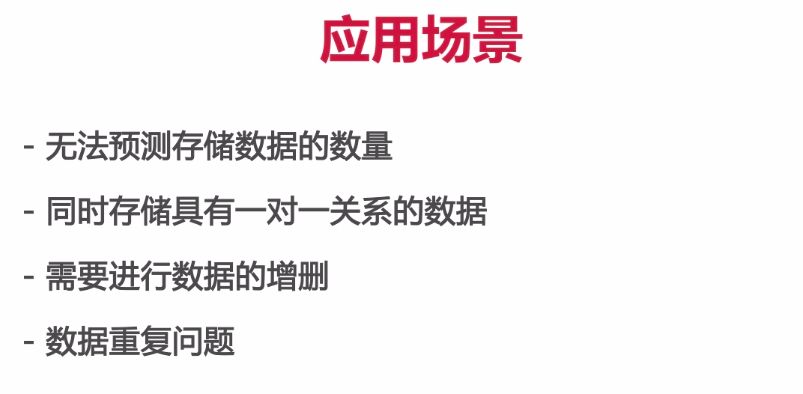

#### 集合接口与具体实现分离  
Java集合类库将接口与实现分离。比如队列接口，其指出可以在队列的尾部添加元素，在队头删除元素，并可以查找队列中元素的个数等。队列接口的最简形式可能类似下面这样：  
```java
public interface Queue<E>
{
	void add(E element);
    E remove();
    int size();
}
```
但这个接口并没有说明队列的具体实现，实际上，队列的实现主要有两种方式：**一是使用循环数组，二是使用链表。**如果需要一个循环数组队列，可以使用**ArrayDeque类**;如果需要一个链表队列，就直接使用**LinkedList类**。这两个类都实现了Queue接口。  
当我们使用队列时，一旦创建了集合就不用关心究竟使用了哪种实现，因此，只有在构建集合时，使用具体的类才有意义。  
用两种具体类实现Queue接口：  
```java
Queue<E> q = new ArrayDeque<>();
Queue<E> q = new LinkedList<>();
```
**注意：一般情况下循环数组比链表更高效，但它是一个有界集合，即容量有限，超过一定范围会进行扩容，降低效率。所以如果处理的数据量较小，优先使用循环数组，但如果程序要收集的对象数量没有上限，最好使用链表实现。**  
在研究API时会发现一组名字以Abstract开头的类，例如，AbstractQueue。这些类是为类库设计者设计的，如果想要实现自己的队列类，会发现扩展AbstractQueue类比实现Queue接口中的所有方法轻松得多。  

#### Collection接口  
在Java类库中，集合类的基本接口是Collection接口，其常用API如下：    
* boolean add(E e)   
 将一个元素添加到集合中。如果由于这个调用改变了集合，返回true。   
* boolean addAll(Collection<? extends E> other)     
  将other集合中的所有元素都添加到这个集合。如果由于这个调用改变了集合，返回true。  
* void clear()  移除这个集合中的所有元素。  
* boolean contains(Object obj)   
 如果这个集合包含了一个与obj相等的对象，返回true。  
* boolean	containsAll(Collection<?> other)   
 如果这个集合包含other集合中的所有元素，返回 true。    
* boolean isEmpty() 如果这个集合没有元素，返回 true。
* Iterator`<E>`	iterator()   
 返回一个用于访问集合中每个元素的迭代器。  
* boolean remove(Object obj)   
 从这个集合中删除等于obj的对象。如果有匹配的对象被删除，返回true。  
* boolean removeAll(Collection<?> other)   
 从这个集合中删除other集合中存在的所有元素。如果由于这个调用改变了集合，返回true。  
* boolean retainAll(Collection<?> other)  
仅保留这个集合中那些也包含在other集合里的元素  
* int size()  返回这个集合的元素数。
* Object[]	toArray() 返回这个集合的对象数组。
* `<T>` T[] toArray(T[] arrayToFill)   
 返回这个集合的对象数组。如果arrayToFill足够大，就将集合的元素填入这个数组中，剩余空间补null;否则，分配一个新数组，其成员类型和arrayToFill一样，其长度等于集合的大小，并填充集合元素。  
* default boolean removeIf(Predicate<? super E> filter)
从这个集合中删除filter返回true的所有元素。如果这个调用改变了集合，返回true 
 
**注意：在使用Object[] toArray()时不能把返回的Object[]数组成强制类型转换其他类型的数组，因为所有数组类型的父类都是Object，甚至Object[]的父类也是Object，所以这种向下类型转换是错误的,会抛出一个ClassCastException**  
 ```java
 Integer[] array = (Integer[])a.toArray();// Error
 Object[] array =  a.toArray();// Right
 ```
 或者使用  
 ```java
 Integer[] array = a.toArray(new Integer[10]);
 ```
 removeIf函数的参数是一个函数式接口Predicate，表示布尔值函数，可以传递一个lambda表达式描述要删除的元素的特征。例如下面的代码可以删除列表中的所有偶数：  
 ```java
 a.removeIf(e -> e %2 == 0);
 ```
 同队列，Java也给类库设计者提供了一个AbstractCollection类，其提供了一些例行方法，可以让实现者更容易实现自己的集合类。
 #### 迭代器  
 Collection接口的`Iterator<E>	iterator()`方法可以返回一个迭代器，它是一个实现了Iterator接口的对象，可以使用这个迭代器对象依次访问集合中的元素。  
 Iterator接口包含4个方法：  
 ```java
 public interface Iterator<E>
 {
 	E next();
    boolean hasNext();
    void remove();
    default void forEachRemaining(Consumer<? super E> action);
 ```
 C++的STL中的迭代器是根据数组索引建模的，即迭代器指向指定位置的元素。但Java中的迭代器应该理解为位于两个元素之间，其起始位置在所有元素之前。调用next方法，迭代器会**越过一个元素并且返回被越过的元素**。通过next方法可以逐个访问集合中的每个元素，但是如果到达了集合的末尾，next方法将抛出一个NoSuchElementException。因此,需要在每次调用next方法之前调用hasNext方法。如果迭代器还有剩余供访问的元素，这个方法就返回true。如果要想查看一个集合中的所有元素，就请求一个迭代器，并在hasNext返回true时反复调用next方法，例如：  
 ```java
 Collection<String> c = . . .;
 Iterator<String> iter = c.iterator();
 while(iter.hasNext())
 {
	String element = iter.next();
    do something with element
 }
 ```
 "for-each"循环可以更简练地表示同样的操作：  
 ```java
 for(String element: c)
 {
 	do something with element
 }
 ```
 编译器简单地将"for-each"循环翻译为**带有迭代器的循环**，"for-each"循环可以和任何实现了Iterable接口的对象一起工作，这个接口只包含一个抽象方法：  
 ```java
 public interface Iterable<E>
 {
 	Interator<E> iterator();
 }
 ```
 Iterable接口表示实现它的类是可以迭代的(即可以返回一个迭代器对象)，Collection接口扩展了Iterable接口，所以**对于标准类库中的任何集合都可以使用"for-each"循环**  
 Java SE 8提供了一种更简便的方式，甚至不用写循环。可以调用forEachRemaining方法并提供一个lambda表达式(它会处理一个元素)。将对迭代器的每一个元素调用这个lambda表达式，直到再没有元素为止,例如：  
 ```java
 iter.forEachRemaining(element -> do something with element);
 ```
 **元素被访问的顺序取决于集合类型。**如果对ArrayList进行迭代，迭代器将从索引0开始，每迭代一次索引加1.如果访问HashSet中的元素，每个元素将会以某种随机的次序出现。但这对于计算总和或统计符合某个条件的元素个数这类与顺序无关的操作来说没有影响。  
 Iterator接口的remove方法将会删除**上一次调用next方法**时返回的元素，也就是说，如果要删除某个元素，必须先用next方法越过它：  
 ```java
 Iterator<String> it = c.iterator();
 it.next();// skip over the first element
 it.remove(); // now remove it
 ```
如果在调用remove方法之前没有调用next方法会抛出一个IllegalStateException。  
如果想删除两个相邻的元素，不能直接连续调用两次remove：  
```java
it.remove();
it.remove();//Error
```
必须先越过要删除的元素：  
```java
it.remove();
it.next();
it.remove();//OK
```
所以删除元素必须在刚越过该元素时就进行，否则"过了这个村就没这个店了"  
### 集合框架中的接口  
Java集合框架为不同类型的集合定义了大量接口，如下图所示：  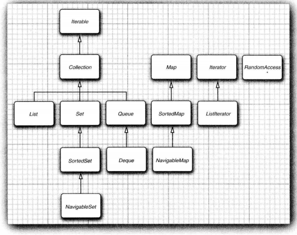  
集合有两个基本接口：**Collection**和**Map**。Collection用于保存一个元素序列，Map用于表示键值对之间的映射关系。在Collection中插入元素使用`boolean add(E element)`,获取元素使用迭代器访问;在Map中插入元素使用`V put(K key,V value)`,通过key获取value使用`V get(K key)`  
List是一个有序集合，允许有null值存在。元素会增加到容器中的特定位置。可以采用两种方式访问元素：使用迭代器访问，使用一个整数索引访问。前者称为顺序访问，后者称为随机访问。  
List的重要API如下：  
```java
 * ListIterator<E> listIterator()
    返回一个列表迭代器，以便用来访问列表中的元素  
 * ListIterator<E> listIterator(int index)
    返回一个列表迭代器，以便用来访问列表中的元素，
    初始位置在索引为index元素的前面，索引从0开始  
 * void add(int i,E element) 在给定位置添加一个元素  
 * E remove(int i) 删除给定位置的元素并返回这个元素  
 * E get(int i) 获取给定位置的元素  
 * E set(int i, E element) 
    用新元素取代给定位置的元素，并返回原来那个元素  
 * int indexOf(Object element) 返回与指定元素相等的元素  
  在列表中第一次出现的位置，如果没有这样的元素返回-1  
 * int lastIndexOf(Object element) 返回与指定元素相等的元素
  在列表中最后一次出现的位置，如果没有这样的元素返回-1 
```
我们发现List接口提供了多个用于随机访问的方法：  
```java
void add(int i,E element)
void remove(int index)
E get(int index)
E set(int index,E element)
```
当我们给List接口选择具体实现类时，需要考虑顺序访问和随机访问哪种情况更多，如果随机访问占操作的大多数，应该使用数组或动态列表ArrayList实现List接口，否则应该使用链表LinkedList实现List接口。  
为了避免对链表进行随机访问，Java定义了一个标记接口RandomAccess，这个接口不包含任何方法，但可以用来测试一个特定的集合是否支持高效的随机访问：  
```java
if(c instanceof RandomAccess)
{
	use random access algorithm
}
else
{
	use sequential access algorithm
}
```
不建议在LinkedList实现的List列表中使用get、set等随机访问方法，此时应该通过一个ListIterator顺序访问列表。
ListIterator接口是Iterator的一个子接口，它是一种更灵活的迭代器，只用于List。下面是ListIterator的重要API：  

* void add(E newElement) 在当前位置前添加一个元素  
* void set(E newElement) 用新元素取代next或previous上次访问的元素。
* boolean hasPrevious() 当反向迭代列表时，还有可供访问的元素，返回true  
* E previous() 返回前一个对象，如果已经到达了列表的头部，就抛出一个NoSuchElementException  
* int nextIndex() 返回下次调用next方法时将返回元素的索引  
* int previous() 返回下次调用previous方法时将返回元素的索引  

**并发修改：**如果在一个迭代器修改集合时，另一个迭代器对它进行遍历，一定会出现混乱。例如：  
```java
List<String> list = . . .;
ListIterator<String> iter1 = list.ListIterator();
ListIterator<String> iter2 = list.ListIterator();
iter1.next();
iter1.remove();
iter2.next();//throws ConcurrentModificationException
```
上述代码中iter2迭代器在遍历链表时，iter1修改了链表结构，iter2会检测到这种变化，抛出一个ConcurrentModificationException。  
为了避免出现并发修改异常，请遵循下述简单规则：**可以根据需要给容器附加许多迭代器，但是这些迭代器只能读取列表。另外，再单独附加一个既能读也写的迭代器**。  
通过调用AbstractCollection类的toString方法可以打印出集合中的所有元素。   
**Set接口等同于Collection接口，不过其方法的行为有更严谨的定义。集(Set)的add方法不允许增加重复的元素,允许有null值，当然只允许一个null值。要适当定义equals方法：只要两个集包含同样的元素就认为是相等的，而不要求有同样的顺序。hashCode方法的定义要保证包含相同元素的两个集会得到相同的散列码。  
SortedSet和SortedMap接口会提供用于排序的比较器对象，这两个接口定义了可以得到集合子集试图的方法。  
最后，Java SE 6引入了接口NavigableSet和NavigableMap，其中包含一些用于搜索和遍历有序集和映射的方法，TreeSet和TreeMap实现了这些接口。**  

### 具体的集合  
下面是Java库中的具体集合和集合框架中的类
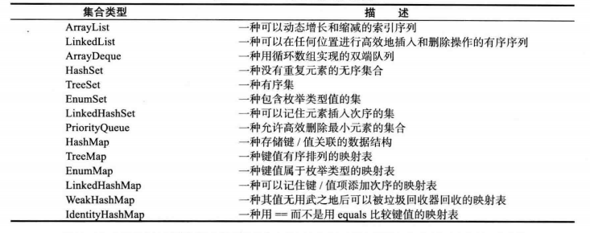
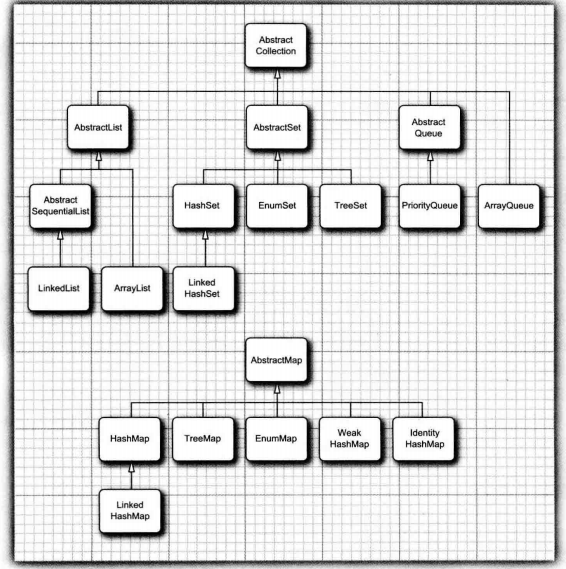
#### LinkedList  
LinkedList是链表类，相较于数组以及动态的ArrayList类，能够更高效地从集合的中间位置插入、删除元素，Java中的LinkedList类是**双向链接**的。  
除了实现了Collection接口和List接口之外，LinkedList还提供了以下API：  
* LinkedList() 构造一个空链表  
* LinkedList(Collection<? extends E> elements)  
  构造一个链表，并将集合中的所有元素添加到这个链表中  
* void addFirst(E element) 将某个元素添加到列表的头部  
* void addLast(E element) 将某个元素添加到列表的尾部  
* E getFirst 返回列表头部的元素  
* E getLast 返回列表尾部的元素  
* E removeFirst() 删除并返回列表头部的元素 
* E removeLast() 删除并返回列表尾部的元素    

#### ArrayList  
ArrayList是动态数组列表，适用于常常要随机访问元素的情况。下面给出ArrayList的常用API：  
* `ArrayList<E>()` 构造一个初始容量为10的空列表  
* `ArrayList<E>(int initialCapacity)`构造一个具有指定初始容量的空列表  
* boolean add(E e) 将指定的元素添加到此列表的尾部，永远返回true  
* void add(int index, E element) 将指定的元素插入此列表中的指定位置。 
* int size() 返回此列表中的元素数。  
* void ensureCapacity(int minCapacity) 如果可以预先确定要插入的元素个数，使用此方法一次性扩容到位，否则通过add方法需要多次拷贝扩容，大大降低效率。  
* E get(int index) 返回此列表中指定位置上的元素。  
* E remove(int index) 移除此列表中指定位置上的元素并返回该元素。  
* boolean remove(Object o) 移除此列表中首次出现的指定元素（如果存在）。  
* void set(int index, E element) 用指定的元素替代此列表中指定位置上的元素。  
* boolean isEmpty() 如果此列表中没有元素，则返回 true  
* boolean contains(Object o) 如果此列表中包含指定的元素，则返回 true。  
* void clear() 移除此列表中的所有元素。  
* Object clone() 返回此 ArrayList 实例的浅表副本。  
* trimToSize() 将此 ArrayList 实例的容量调整为列表的当前大小。  

**ArrayList和Vector的区别：**Vector类的所有方法都是同步的，可以由两个线程安全地访问一个Vector对象，然而如果由一个线程访问Vector,代码要在同步操作上耗费大量的时间。所以建议在不需要同步的时候使用ArrayList，而不要使用Vector
#### HashSet  
链表和数组可以按照人们的意愿排列元素的次序，但如果要查看某个元素，却忘记了它的位置，需要访问所有元素直到找到为止，将会消耗很多时间。  
HashSet是一种基于**散列表**的集，实现了Set接口，它无法控制元素的次序，但可以快速查找元素。散列表基于散列码，散列码由类的hashCode方法提供，用于将元素插入散列表的特定位置，hashCode和equals方法应该兼容，即使用equals方法返回true的两个对象应该有相同的散列码，**一个自定义类如果重写了equals方法就必须要重写hashCode方法，以便于将该类的对象插入散列表中。否则HashSet无法知道插入的两个对象是否相同，无法保证集合元素的唯一性。这两个方法的重写在eclipse的source菜单里也有快捷添加选项。**  
在Java中，散列表用链表数组实现，每个**散列单元**被称为**桶**。要想查找表中对象的位置，就要先计算它的散列码，然后与桶的总数取余，如果桶中没有元素，可以直接插入，如果已经有元素，即发生**散列冲突**，则需要将新元素和桶中已有的所有元素进行比较，如果桶中有元素和新元素相等，就不插入，反之插入。**注意：在HashSet的一个桶中可以有多个不同元素，即使用链地址法解决冲突。**如果散列码是合理且随机分布的，桶的数目也足够大，需要比较的次数就会很少。这样，当我们在HashSet中查找某元素时，不必像在线性表中一样循环遍历整个表来比较，只需要根据散列规则找到对应的桶，对桶里的元素进行遍历比较即可。  
**所以，从上面的分析我们可以得到equals方法和hashCode方法之间的关系：**  
1、如果重写了equals方法，必须重写hashCode方法，因为两个对象的euqals方法如果返回true,它们的hashCode值一定要相同。  
2、如果两个对象的hashCode值相同，它们并不一定相同，比如HashSet中同一个桶中的对象就是发生了散列冲突的具有相同hashCode值的对象。它们的equals方法有可能返回false。  

这就是为什么我们在HashSet使用时要同时重写这两个方法的原因，重写hashCode方法以进行桶间的查找，重写equals方法以进行同一个桶内对象的比较。  
在Java SE 8中，桶满时会从链表变为平衡二叉树。如果选择的散列函数不当，会产生很多冲突，或者有恶意代码试图在散列表中填充多个有相同散列码的值，这样就能提高性能。  
如果想更多地控制散列表的运行性能，就要指定一个初始桶数。通常将桶数设置为预计元素个数的75% ~ 150%,最好将桶数设置为一个**素数**,以防键的集聚。标准类库使用的桶数是2的幂，默认值为16,**为散列表的大小提供的任何值都被自动转换为2的下一个幂**。  
如果最初的估计过低，散列表太满，散列表会进行再散列，创建一个桶数更多的表。**装填因子**决定何时再散列，比如装填因子为0.75，当散列表中超过75%的位置已经填入了元素，这个表就会用双倍的桶数自动进行再散列，大多数情况装填因子为0.75是比较合理的。  
下面是HashSet的常用API：  
* HashSet() 构造一个空散列集  
* HashSet(Collection<? extends E> elements)   
 构造一个散列集，并将集合中的所有元素添加到这个散列集中 
* HashSet(int initialCapacity) 构造一个具有指定容量(桶数)的散列集  
* HashSet(int initialCapacity,float loadFactor) 构造一个具有指定容量和装填因子(一个0.0 ~ 1.0之间的数值，确定散列表填充的百分比，当大于这个百分比时，散列表进行再散列)的空散列集      

**特别要注意,在HashSet中没有get和set方法，因为HashSet是无序集，不存在索引概念，如果要访问HashSet中的元素应该使用迭代器，另外contains方法也被重新定义，可以快速查看某个元素是否出现在集中，此时不用查看集中的所有元素，只用通过散列码定位到一个桶，查看这个桶中的所有元素即可**  

如果要查找HashSet中符合某条件的对象，可以使用迭代器遍历或者使用foreach循环遍历HashSet。如果要删除符合某条件的对象，如果在for-each循环中边删除边遍历会抛出一个并发修改异常ConcurrentModificationException，此时有两种解决方案：  
1、如果只删除一个元素，就在remove之后break即可  
2、如果要删除多个元素，就先把要删除的元素添加到另一个集合中，循环结束后调用removeAll的求差集方法删除目标子集即可。  

**还可以使用迭代器遍历来避免这种情况。**
#### TreeSet  
TreeSet和HashSet十分类似，不过当元素以任意顺序插入TreeSet时，TreeSet会保证元素是有序排列的。其底层是由**红黑树**实现的,每次将一个元素添加到树中，都被放置在正确的排序位置上。  
**一个元素添加到树中比添加到散列表中慢**，但是与检查数组或链表中的重复元素相比还是快很多。如果树中包含n个元素，查找新元素的正确位置平均需要log2n次比较。如果对集合中的元素次序没有要求，应该使用HashSet而不是TreeSet，即使排序的花销不大，但也会影响效率。  
**注意：要使用TreeSet，插入的元素必须可排序，即这些元素必须实现Comparable接口或者构造集时必须提供一个Comparator**  
从Java SE 6起,TreeSet类实现了Navigable接口，这个接口增加了几个便于定位元素以及反向遍历的方法。  
  
下面是TreeSet的常用API：  
* TreeSet() 构造一个空树集  
* TreeSet(Collection<? extends E> elements)   
 构造一个空树集，并将集合中的所有元素添加到这个树集中  
* TreeSet(Comparator<? super E> comparator)  构造一个空树集  
* TreeSet(SortedSet<`E`> s)   
构造一个空树集，并将有序集中的所有元素添加到这个树集中，并使用与给定的有序集相同的比较器

下面是SortedSet的常用API：  
* Comparator<? super E> comparator()   
 返回用于对元素进行排序的比较器。如果元素用Comparable接口的compareTo方法进行比较则返回null  
* E first() 返回有序集中的最小元素  
* E last() 返回有序集中的最大元素   

下面是NavigableSet的常用API： 
* E higher(E value)  
* E lower(E value)  
返回大于value的最小元素或小于value的最大元素，如果没有这样的元素则返回null  
* E ceiling(E value)  
* E floor(E value)  
返回大于等于value的最小元素或小于等于value的最大元素，如果没有这样的元素则返回null  
* E poolFirst()  
* E pollLast()  
删除并返回这个集合中的最大元素或最小元素，这个集合为空时返回null  
* Iterator<`E`> descendingIterator()  
返回一个按照递减顺序遍历集中元素的反向迭代器  

#### 队列与双端队列  
Deque(双端队列)接口继承自Queue(队列)接口，与之有所不同的是，双端队列可以在队列的头部和尾部添加或删除元素，但也不支持在队列中间添加或删除元素。  
和普通队列一样，双端队列也可以用ArrayDeque和LinkedList实现。  

下面是Queue的常用API：  
* boolean add(E element)  
* boolean offer(E element)  
都是将一个元素入队并返回true，如果队列已满，前者会抛出一个IllegalStateException，后者则返回false  
* E remove()  
* E poll()  
都是将队头元素出队并返回，如果队列为空，前者会抛出一个NoSuchElementException，后者则返回null  
* E element()  
* E peek()  
都是取队头元素但不删除，如果队列为空，前者会抛出一个NoSuchElementException，后者则返回null   

下面是Deque的常用API：  
* void addFirst(E element)  
* void addLast(E element)  
* boolean offerFirst(E element)  
* boolean offerLast(E element)  
都是将给定元素添加到双端队列的头部或尾部，如果队列满了，前两个方法会抛出一个IllegalStateException，后两个方法则返回false  
* E removeFirst()  
* E removeLast()  
* E pollFirst()  
* E pollLast()  
都是删除双端队列的头部或尾部并返回元素，如果队列为空，前两个方法会抛出一个NoSuchElementException，后两个方法则返回null  
* E getFirst()  
* E getLast() 
* E peekFirst()  
* E peekLast()  
都是返回双端队列的头部或尾部元素但不删除，如果队列为空，前两个方法会抛出一个NoSuchElementException，后两个方法则返回null  

下面是ArrayDeque的常用API：  
* ArrayDeque() 用默认初始容量16构造一个空队列  
* ArrayDeque(int initialCapacity) 用指定容量构造一个空队列    

#### PriorityQueue 
在优先队列中，元素被赋予优先级。当访问元素时，具有最高优先级的元素最先出队。优先队列具有最高级先出(first in, largest out)的行为特征。  
PriorityQueue的底层是通过堆(小根堆，**将较小的元素设为最高优先级**)实现的，堆是一个可以自我调整的二叉树，对树执行添加和删除操作，可以让最小的元素移动到根，而不必花费时间对元素进行排序。  
PriorityQueue是一个实现了Queue接口的具体类。  
**和TreeSet一样，要实现排序，即这些元素必须实现Comparable接口或者构造集时必须提供一个Comparator。**  

**注意：**方法iterator()中提供的迭代器并不保证以有序的方式遍历优先级队列中的元素。原因是PriorityQueue内部是一个堆，堆只能保证根具有最高的优先级，但整个堆并不是有序的。方法iterator()中提供的迭代器可能只是对整个数组的依次遍历，也就是只能保证数组的第一个元素具有最高优先级。但如果将元素依次出队，出队顺序可以保证是有序的，这是因为在每一次出队后堆会进行调整，将下一个优先级最高的元素移动到根。

下面是PriorityQueue的常用API：  
* PriorityQueue() 构造一个空优先队列  
* PriorityQueue(int initialCapacity)   
用指定容量构造一个空优先队列  
* PriorityQueue(int initialCapacity,Comaparator<? super E> c)   
用指定容量构造一个空优先队列,并指定比较器对元素进行排序  

### 映射  
集(Set)是一个集合，它可以快速查找现有元素。但是，有时我们知道某些键的信息，并想要查找与之对应的元素。映射(map)数据结构就是为此设计的，map用来存放键值对(Key-value)，key-value以Entry类型的对象实例存在，Entry对象是无序排列的。允许使用null键和null值(当然只允许有一个null键)，提供键(Key)就能快速查找到值(Value)。Key不允许重复，每个Key最多只能映射到一个Value。  
Java类库为映射提供了两个实现：HashMap和TreeMap，这两个类都实现了Map接口。  
HashMap(散列映射)对**键**进行散列，键值对是无序的。TreeMap(树映射)用**键**的整体顺序对元素进行排序，并将其组织成搜索树。散列或比较函数只能作用于键，与键关联的值不能进行散列或比较。**与集一样，HashMap比TreeMap快一些，如果不需要按照排列顺序访问键，就最好选择散列。**  

下面是Map接口的常用API：  
* V get(Object key)   
获取并返回与键对应的值，如果没有在映射中找到这个键，返回null  
* default V getOrDefault(Object key,V defaultValue)  
获取并返回与键对应的值，如果没有在映射中找到这个键，返回defaultValue  
* V put(K key,V value)  
将键与对应的值关系插入到映射中。如果这个键已经存在，新的对象将取代与这个键对应的旧对象，并返回键对应的旧值，如果这个键以前没有出现过则返回null。**键可以为null，但值不能为null**  
* V putAll(Map<? extends K,? extends V> entries)  
将给定映射中的所有条目添加到这个映射中  
* boolean containsKey(Object key)   
 如果在映射中已经有这个键，返回true 
* boolean containsValue(Object value)  
 如果在映射中已经有这个值，返回true  
* default void forEach(BiConsumer<? super K,? super V> action)  
对这个映射中的所有键值对应用这个动作，参数是一个函数式接口类型，可以传入一个lambda表达式,例如：  
```java
scores.forEach((k,v) -> 
System.out.println("key=" + k + ", value=" + v));
```

下面是HashMap的常用API：   
* HashMap()  构造一个空散列映射
* HashMap(int initialCapacity) 用指定容量构造一个空散列映射 
* HashMap(int initialCapacity,float LoadFactor)  
用指定容量和装填因子构造一个空散列映射，默认的装填因子是0.75  

下面是TreeMap的常用API：   
* TreeMap() 构造一个空树映射  
* TreeMap(Comparator<? super K> c)   
 构造一个空树映射，并使用一个指定的比较器对键进行排序  
* TreeMap(Map<? extends K,? extends V> entries) 构造一个空树映射，并将某个映射的所有条目添加到树映射中   
* TreeMap(SortedMap<? extends K,? extends V> entries)   
构造一个空树映射，将某个有序映射中的所有条目添加到树映射中，并使用与给定的有序映射相同的比较器  

下面是SortedMap的常用API：   
* Comparator<? super K> comparator()  
返回对键进行排序的比较器。如果键是用Comparable接口的compareTo方法进行比较的，返回null  
* K firstKey()  
* K lastKey()  
返回映射中最小元素和最大元素  

#### 更新映射项  
假设我们要统计一个单词在文件中出现的次数，当得到一个单词时，我们将其计数器加1：  
```java
counts.put(word,counts.get(word) + 1);
```
但这可能会出错，如果word第一次出现，counts.get(word)会返回null，从而抛出一个NullPointerException。  

为了避免这种情况，我们可以用**getOrDefault方法**来取代get方法，即：  
```java
counts.put(word,counts.getOrDefault(word,0) + 1);
```
另一种方法是首先调用**putIfAbsent方法**，这个方法会在映射中不存在word时插入键值对初始化word的值为0：  
```java
counts.putIfAbsent(word,0);
counts.put(word,counts.get(word) + 1);
```
还可以做得更好,**merge方法**可以简化这个常见操作。如果键原先不存在，则下面的调用：  
```java
counts.merge(word,1,Integer::sum);
```
将把word和1关联，如果word存在，则会使用Integer::sum函数组合原值和1(也就是将原值和1求和)  

#### 映射视图  
集合框架不认为映射本身是一种集合，不过可以得到映射视图 —— 这是实现了Collection接口或某个子接口的对象。  
有三种视图：键集、值集合**(不是一个集)**、键值对集。**键集**和**键值对集**是集，因为一个映射中的键是唯一的，但值不能构成集，只能是值集合，因为一个映射中可以有多个相同的值。  
下面的方法可以从映射中返回这三种视图：  
```java
Set<K> keySet()
Collection<V> values()
Set<Map.Entry<K,V>> entrySet() 
```
**需要说明的是，keySet不是HashSet或TreeSet，而是实现了Set接口的另外某个类的对象。Set接口扩展了Collection接口，所以可以向使用集合一样使用keySet**  

键值对是Map.Entry`<K,V>`类型的，可以使用entrySet()方法返回映射的键值对集，再通过循环对于每个键值对对象使用，例如：  
```java
for(Map.Entry<String,Employee> entry: staff.entrySet())
{
	String k = entry.getKey();
    Employee v = entry.getValue();
    // do something with k,v
}
```
**getKey方法获取该键值对的键，getValue方法获取该键值对的值，setValue方法将键值对的值设置为新值并返回原值。  
当然查看键值对最高效的方法是使用forEach方法**：
```java
counts.forEach((k,v) -> {
	do something with k,v
})
```
**注意:**可以在键集视图上调用迭代器的remove方法，结果会在映射中删除这个键和与它关联的值，但不能调用add方法，否则会抛出一个UnsupportedOperationException;可以在值集合视图删除元素，所删除的值和相应的键将从映射中删除，也不能增加元素;可以在键值对集合中删除元素，将从映射中删除相应的键值对，但也不能增加元素。**总之，可删不可增。**  

#### WeakHashMap  
当一个映射中引用某个值的所有键都消亡，即没有任何途径引用这个值时，这个值成为了无用对象。但是垃圾回收器跟踪**活动的对象**，只要映射对象是活动的，其中的所有桶也是活动的，它们不能被回收。于是，长期存活的映射中可能会存在一些无用的值，此时需要由程序负责从长期存活的映射表中删除那些无用的值，或者使用WeakHashMap。当对键的唯一应用来自散列条目时，这种数据结构会协助垃圾回收期协同工作一起删除键值对。  
下面是这种机制的内部运行情况。WeakHashMap使用**弱引用**保存键。WeakReference对象将引用保存到另外一个对象中，在这里，就是散列键。对于这种特定类型的对象，垃圾回收器用一种特有的方式进行处理。通常，如果垃圾回收器发现某个特定的对象已经没有他人引用了，就将其回收。然而，如果某个对象只能由WeakReference引用，垃圾回收器仍然回收它，但要将引用这个对象的弱引用放入队列中。WeakHashMap将周期性地检查队列，以便找出新添加的弱引用。一个弱引用进入队列意味着这个键不再被他人使用，并且已经被收集起来。于是，WeakHashMap将删除对应的条目。  

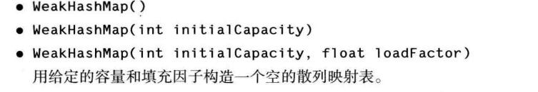

更多细节见：[深入理解WeakHashMap](http://mikewang.blog.51cto.com/3826268/880775/)  


#### LinkedHashSet & LinkedHashMap  
LinkedHashSet和LinkedHashMap会按照**元素插入顺序**存放元素或键值对。当条目插入到表中时，就会并入到双向链表中。
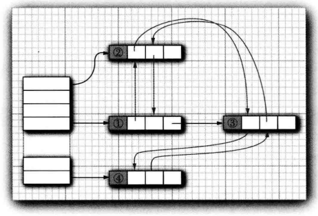
也可以使用`LinkedHashMap<K, V>(initialCapacity, loadFactor, true)`来构造一个按照**元素访问顺序**迭代键值对的LinkedHashMap。每次调用get或put，受到影响的条目将从当前位置删除，并放到条目链表的尾部(只有条目在链表中位置会受影响，而散列表中的桶不会受影响。一个条目总位于与键散列码对应的桶中)。  
访问顺序对于实现高速缓存的“最近最少使用”原则十分重要。例如，可能希望将访问频率高的元素放在内存中，而访问频率低的元素则从数据库中读取。当在表中找不到元素项且表又已满时，可以将迭代器加入到表中，并将前几个元素删除掉。这些是近期最少使用的几个元素。  
甚至可以让这一过程自动化。即构造一个LinkedHashMap的子类，然后覆盖下面的方法：  
```java
protected boolean removeEldestEntry(Map.Entry<K, V> eldest)
```
每当方法返回true时，就添加一个新条目，从而导致删除eldest条目。例如，下面的高速缓存可以存放100个元素：  
```java
Map<K, V> cache = new 
LinkedHashMap<>(128, 0.75F, true)
{
	protected boolean removeEldestEntry(Map.Entry<K, V> eldest)
    {
    	return size() > 100; 
        /*当元素个数 <= 100，直接插入元素，
        否则进行替换，删除“最近最少使用”的元素，
        插入新元素*/
    }
}();
```
另外，还可以对eldest条目进行评估，以此决定是否应该将它删除。例如，可以检查与这个条目一起存在的时间戳。
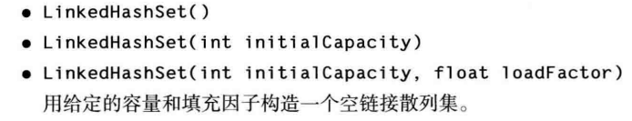


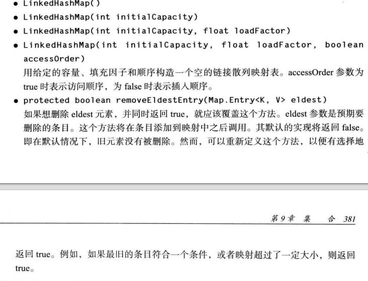


#### EnumSet & EnumMap  
EnumSet是一个枚举类型元素集的高效实现。由于枚举类型只有有限个实例，所以EnumSet内部用位序列实现。如果对应的值在集中，则相应的位被置为1.  
EnumSet没有公共的构造器，可以使用静态工厂方法构造这个集，下面给出得到EnumSet的几个常用方法：  
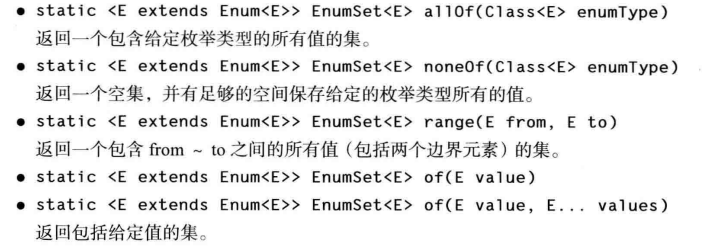
例如：  
```java
enum Weekday { MONDAY, TUESDAY, WEDNESDAY, THURSDAY, FRIDAY, SATURDAY, SUNDAY};
EnumSet<Weekday> always = EnumSet.allOf(Weekday.class);
EnumSet<Weekday> never = EnumSet.noneOf(Weekday.class);
EnumSet<Weekday> workday = EnumSet.range(Weekday.MONDAY,Weekday.FRIDAY);
EnumSet<Weekday> mwf = EnumSet.of(Weekday.MONDAY,Weekday.WEDNESDAY,Weekday.FRIDAY);
```
可以使用Set接口的常用方法来修改EnumSet  
EnumMap是一个**键类型**为枚举类型的映射。它可以直接且高效地用一个值数组实现。在使用时，需要在构造器中指定键类型：  
```java
EnumMap<Weekday, Employee> personInChange = new EnumMap<>(Weekday.class);
```
这样就构造了一个键为Weekday类型的空映射。

#### IdentityHashMap  
类IdentityHashMap有特殊的作用。在这个类中，键的散列值不是用hashCode函数计算的，而是用System.identityHashCode方法计算的。这是Object.hashCode方法根据对象的内存地址来计算散列码时所使用的方式。而且，在对两个对象进行比较时，IdentityHashMap类使用 == ，而不使用equals  
也就是说，不同的键对象，即使内容相同，也被视为不同的对象。在实现对象遍历算法(如对象串行化)时，这个类非常有用，可以用来跟踪每个对象的遍历状况。  
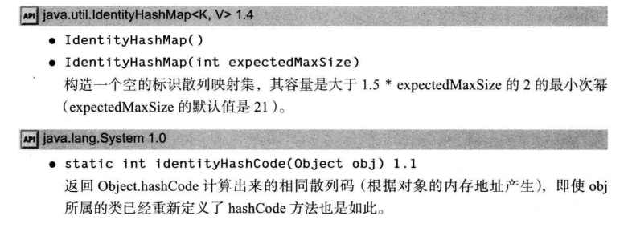

### 视图与包装器  
通过使用**视图**可以获取其他的实现了Collection接口或Map接口的对象，映射类的keySet方法就是这样一个示例。这个方法看似创建了一个新集，并将映射中的所有键都填进去，然后返回这个集。**然而事实并非如此，keySet方法返回一个实现了Set接口的类对象，这个类的方法对原映射进行操作。这样的集合称为视图。**  
#### 轻量级集合包装器  
Arrays类的静态方法asList将返回一个**包装了普通Java数组的List包装器**。这个方法可以将数组传递给一个期望得到列表或集合参数的方法。例如：  
```java
	Card[] cardDeck = new Card[52];
    ...
    List<Card> cardList = Arrays.asList(cardDeck);
```
返回的对象不是ArrayList，而是一个视图对象，带有访问底层数组的get和set方法。   
**改变数组大小的所有方法(例如，与迭代器相关的add和remove方法)都会抛出一个UnsupportedOperationException。**
asList方法可以接收可变数目的参数，如：  
```java
List<String> names = Arrays.asList("Amy","Bob","Carl");
```
这个方法调用`Collections.nCopies(n,anObject)`
将返回一个实现了List接口的**不可修改的对象**，并给人一种包含n个元素，每个元素都像是一个anObject的错觉。
例如，下面的调用将创建一个包含100个字符串的List，每个串都被设置为"DEFAULT"：  
```java
List<String> settings = Collections.nCopies(100,"DEFAULT");
```
存储代价很小，可用于不需要修改元素的情况。这是视图技术的一种巧妙的应用。
**注意：**Collections类包含很多使用的方法，这些方法的参数和返回值都是集合，不要将它和Collection接口混起来。  

如果调用以下方法：  
```java
Collections.singleton(anObject);
```
将返回一个实现了Set接口的视图对象(与产生List视图的ncopies方法不同)，即一个不可修改的单元素集，而不需要付出建立数据结构的开销。singletonList方法与singletonMap方法类似。  
类似地，对于集合框架中的每一个接口，还有一些方法可以生成空集、列表、映射等等。特别是，集的类型可以推导得出：  
```java
Set<String> deepThoughts = Collections.emptySet();
```

#### 子范围  
可以为很多集合建立子范围视图。例如，假设有一个列表staff，想从中取出第10个-第19个元素。可以使用subList方法来获得一个列表的子范围视图：  
```java
List group2 = staff.subList(10,20);
```
第一个索引包含在内，第二个索引则不包含在内。可以将**任何操作**应用于子范围，该操作会影响整个列表。例如，可以删除整个子范围：  
```java
group2.clear();
```
现在，staff列表中该范围的元素也被删除，并且group2为空。 
对于SortedSet和SortedMap，可以使用排序顺序而不是元素位置建立子范围。SortedSet接口声明了3个方法：  
```java
SortedSet<E> subSet(E from,E to)
SortedSet<E> headSet(E to)
SortedSet<E> tailSet(E from)
```
这些方法返回大于等于from且小于to的所有元素构成的子集。

SortedMap也有类似的方法：  
```java
SortedMap<K, V> subMap(K from,K to)
SortedMap<K, V> headMap(K to)
SortedMap<K, V> tailMap(K from)
```
返回映射视图，该映射包含**键**落在指定范围内的所有元素。  
Java SE 6引入的NavigableSet接口赋予子范围操作更多控制能力。可以指定是否包括边界：  
```java
NavigableSet<E> subSet(E from, boolean fromInclusive,E to,boolean toInclusive)
NavigableSet<E> headSet(E to,boolean toInclusive)
NavigableSet<E> tailSet(E from,boolean fromInclusive)
```

#### 不可修改的视图  
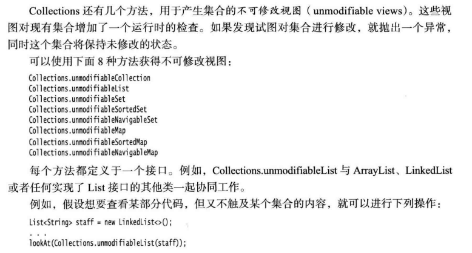
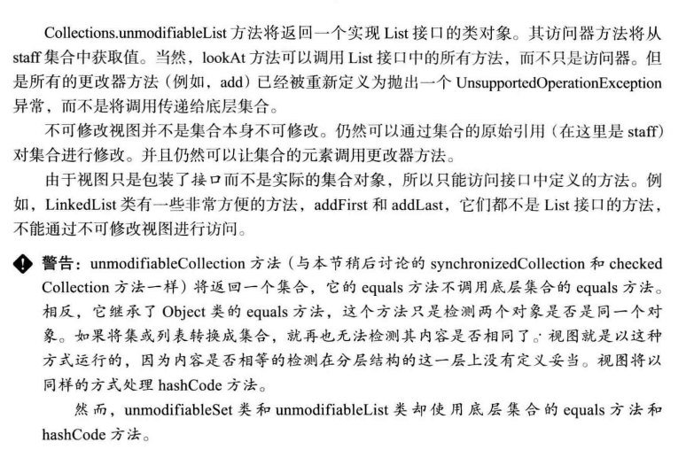
#### 同步视图  
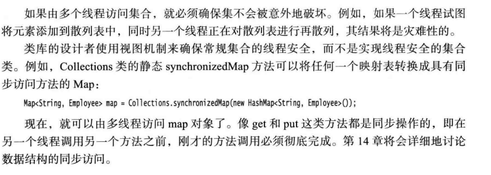
#### 受查视图  
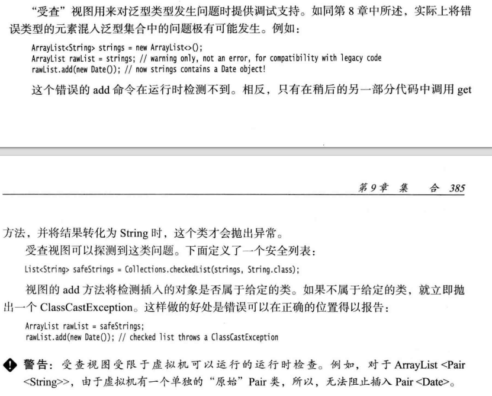
#### 关于可选操作的说明
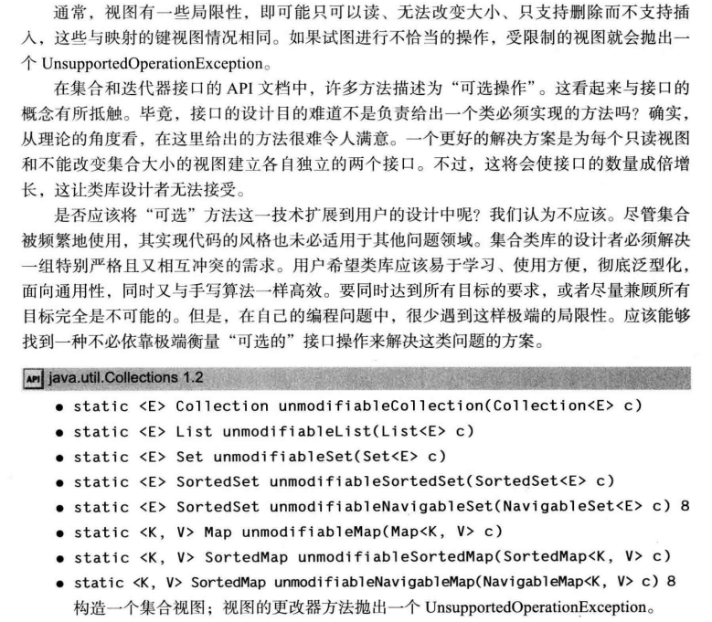
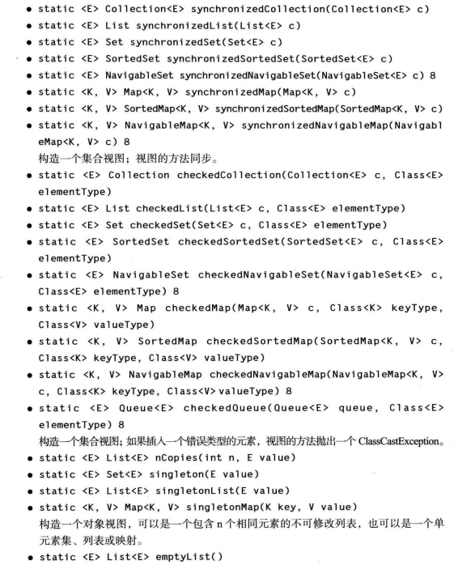
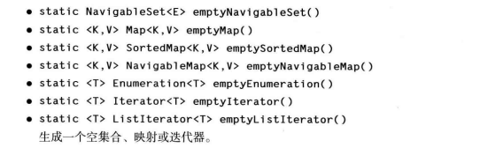

### Collections
内容较多，见Java核心技术卷一 P388 ~ P396，并查阅相关API
### 遗留的集合  
见Java核心技术 P396 ~ P402


