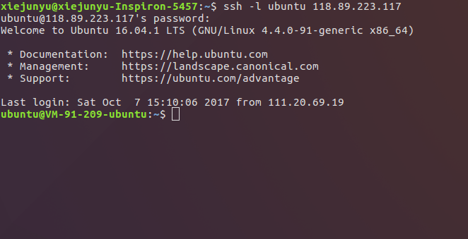
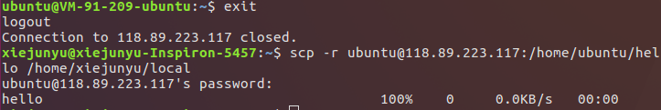
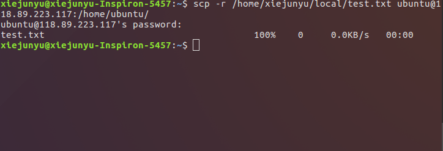
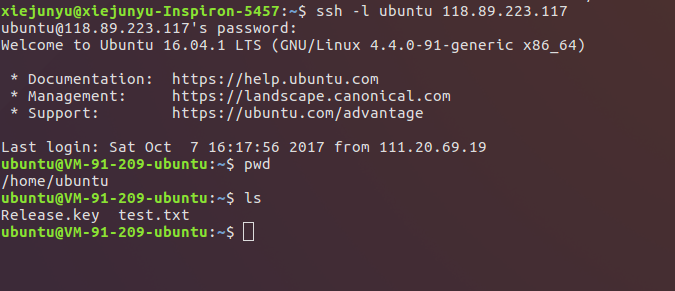

SSH是一种以安全、加密方式连接远程主机或服务器的方法。SSH服务器接受从有SSH的客户机的连接，允许操作者象在本地一样地登录系统。如果已经搭建了SSH远程登录服务，如何实现本地机和远程服务器的文件交互呢？以下操作基于远程机已经安装了SSH服务器端，如果没有安装，详细步骤见:  [在Ubuntu下通过SSH连接远程服务器](http://habitdiary.cn/2017/10/07/%E5%9C%A8Ubuntu%E4%B8%8B%E9%80%9A%E8%BF%87SSH%E8%BF%9E%E6%8E%A5%E8%BF%9C%E7%A8%8B%E6%9C%8D%E5%8A%A1%E5%99%A8/#more)  
### (1)用SSH登录远程ubuntu主机
假设远程Ubuntu主机安装了SSH服务器端。远程Ubuntu主机的IP为：118.89.223.117,用户名为ubuntu  
我们在命令行输入以下命令来连接：  
`ssh -l ubuntu 118.89.223.117`    
之后提示输入密码，回车，登录成功，注意此时已经切换到了远程机的终端
  
### (2)从远程Ubuntu主机下载文件/文件夹到本地(scp)  
语法格式：scp -r 远程主机用户名@远程主机ip:待下载文件的远程主机目录路径 保存下载文件的本地文件路径  

我们先在远程机的/home/ubuntu目录下新建一个名为hello的文件  
  
要下载文件到本地,我们要结束SSH连接,切换到本地机,输入`eixt`或`quit`即可  

我们将远程机的hello文件下载到本地的/home/xiejunyu/local目录下，输入密码后提示文件下载成功  
  

我们进入本地目录验证一下  
  

hello文件的确下载到了本地
### (3)从本地向远程ubuntu主机上传文件/文件夹(scp)  
语法格式：scp -r 待上传的本地文件路径 远程主机用户名@远程主机ip:用于保存文件的远程主机目录路径  

假设要上传一个在/home/xiejunyu/local目录下的test.txt文件,远程主机用户名为ubuntu,ip为118.89.223.117,保存到远程主机的/home/ubuntu目录下  

要上传本地文件,我们要结束SSH连接,切换到本地机,输入`eixt`或`quit`即可  
然后输入命令`$ scp -r /home/xiejunyu/local/test.txt ubuntu@118.89.223.117:/home/ubuntu/`，输入密码后提示文件上传成功  
  

我们通过SSH登录到远程主机验证一下,`pwd`打印当前所在位置，发现我们处于/home/ubuntu目录下,`ls`显示当前目录下的文件，我们发现有test.txt文件,说明本地的test.txt已经上传到了远程机的/home/ubuntu目录下  
  

