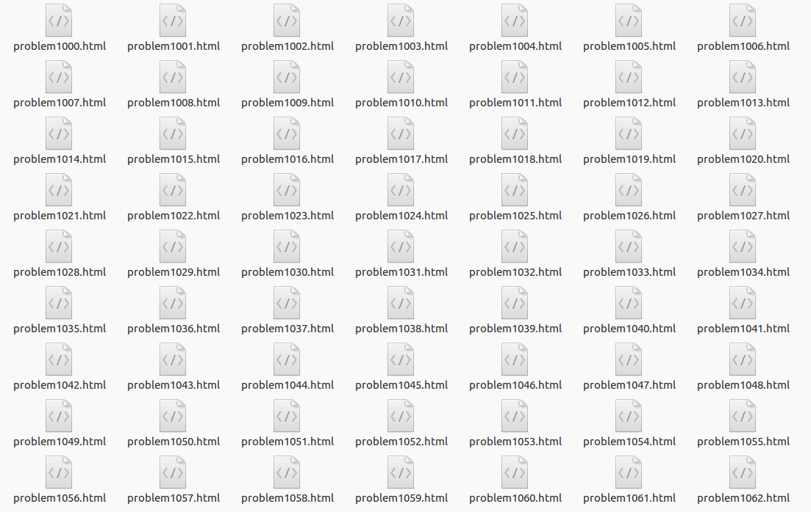

最近校创的项目终于立项啦！一直在等答辩通知，结果无需答辩直接立项2333。马上和队友开始着手项目，目标是做一个基于习题推荐的算法分类学习平台，简单来说就是一个根据用户历史做题情况自动推荐相应难度或类型题目的Online Judge。作为ACM校队的弱菜，正好造福一下学弟学妹ORZ  
当然，作为一个新兴的OJ，肯定是没有题目来源的，所以我们把罪恶的双手(嘘~)伸向了一些目前主流的OJ。我们需要用爬虫技术爬取这些OJ的题面，并提取总提交数和通过数来计算AC率，从而把AC率作为题目难度的一个指标，以便后续实现题目推荐。  
之前没有写过爬虫，队友告诉我Java可以用jsoup库很方便地解析html网页的元素。于是粗略学习了jsoup,再配合一点CSS选择器的知识，这对于一般的html网页的爬取就够用了，下面是几个学习的网站：  
[jsoup Cookbook(中文版)](http://www.open-open.com/jsoup/)    
[CSS 选择器](http://www.w3school.com.cn/cssref/css_selectors.asp)

我分到的是[POJ](http://poj.org/)，打开Problems，选择第一道题，即[A+B Problem](http://poj.org/problem?id=1000)。查看网页的源代码发现TABLE标签之后的table标签恰好包括了所有我需要的信息(POJ真友好啊)，将爬到的内容重定向到一个html文件，我们就得到了题面。核心代码只有几行，不多说上代码：  
```java
import java.io.File;
import java.io.FileOutputStream;
import java.io.IOException;
import java.io.PrintStream;
import java.util.Iterator;
import java.util.List;

import org.jsoup.Jsoup;
import org.jsoup.nodes.Document;
import org.jsoup.nodes.Element;
import org.jsoup.nodes.Node;
import org.jsoup.select.Elements;

public class Crawler {

	public static void main(String[] args) throws IOException {
				for(int pid = 1000;pid <= 1100;pid++) {
					Document doc = Jsoup.connect("http://poj.org/"
                    +"problem?id=" + pid).get();
					Elements text = doc.select("TABLE+table");
                    //选择TABLE标签之后的table标签
					text.select(".ptt").attr("align", "center");
                    //题目没有居中，添加居中属性
                    String href = text.select("img").attr("src");
					text.select("img").attr("src","http://poj.org/"+href);
  //图片在poj服务器上，必须修改图片路径为绝对路径，否则无法显示					
                    System.setOut(new PrintStream(new 
                     FileOutputStream("problem"+pid+".html")));
					 System.out.println(text);
                     //重定向输出到html文件
            }
		}
	}
```
耐心等待爬取题目编号为1000到1100的题目,显示如下：  
  
用浏览器打开problem1000.html，效果如下：  
  
大功告成！！！  