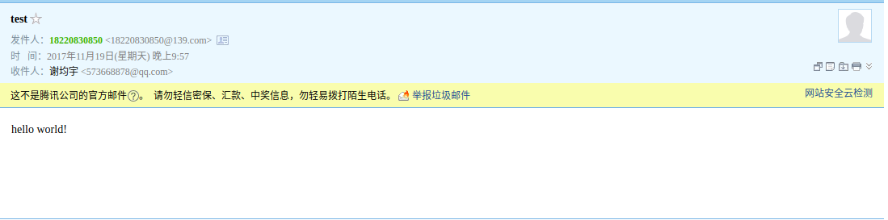

最近在看《计算机网络自顶向下方法》，初步了解了SMTP协议。尝试用telnet登录SMTP服务给自己的qq邮箱发送了一封邮件，中间踩了很多坑，现在把具体步骤总结如下：  

**1.打开终端，输入`telnet`,回车**  

**2.输入`o smtp.139.com 25`,此处o是open的缩写,以139邮箱为例,25表示SMTP服务器时刻监听的端口号,登录SMTP服务器。服务器返回`220 localhost richmail system v10(2eff5a1190ba8e2-ea850)`表示成功**  

**3.输入`HELO xxx`,和服务器打招呼,xxx可以是任意内容,确认服务器应答,服务器返回`250 localhost richmail system v10(2eff5a1190ba8e2-ea850)`表示成功**  

**4.输入`auth login`,请求登录,服务器返回`334 dXNlcm5hbWU6`,334是成功的状态码,后面是 username: 的base64码,可以在网上找到编码和解码工具**  

**5.输入转换为base64码后的发送邮箱的用户名,不用带邮件域名，服务器返回`334 UGFzc3dvcmQ6`，334是成功的状态码，后面是 password: 的base64码**  

**6.输入转换为base64码后的发送邮箱的密码,服务器返回`235 Authentication successful`表示登录成功**  

**7.输入`MAIL FROM:<发件人邮箱地址>`，告诉服务器发信人的地址,服务器返回`250 Mail OK`表示成功**  

**8.输入`RCPT TO:<收件人邮箱地址>`，告诉服务器收信人的地址,服务器返回`250 Mail OK`表示成功**  

**9.输入`DATA`,开始写邮件,服务器返回`354 End data with .`提示邮件以一个单独占有一行的`.`结束**  

**10.邮件格式如下:**  
```
To:收件人邮箱地址
From:发件人邮箱地址
Subject:邮件主题 //前三行是首部行
			//首部行和报文体之间要有一个空行	
邮件正文	//报文体
． 	//结束邮件的标志
```
**服务器返回`250 ok`表示发送成功，如果要继续发送，则返回步骤7重复即可。**  

**11.发送完所有邮件之后输入`QUIT`,关闭TCP连接** 

**下面是成功接收的邮件**

  

**注意几个坑：  
1.发件方使用的是139邮箱，尝试qq邮箱和163邮箱开启了SMTP服务也不成功，可能是基于安全性考虑进行了限制  
2.收件方邮箱如果有反垃圾机制，应该事先关闭，否则会拒绝接收邮件**  


