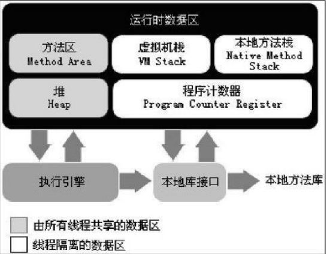
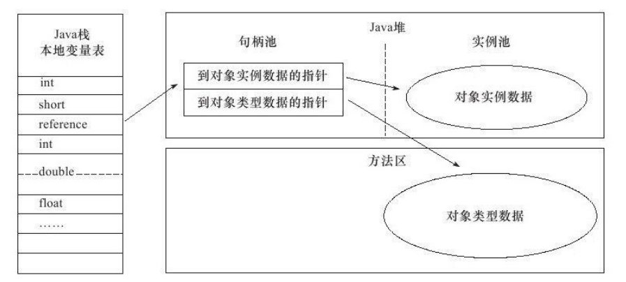
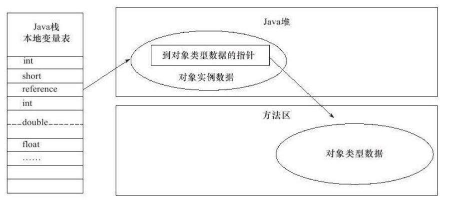

Java与C++之间有一堵由内存动态分配和垃圾收集技术所围成的“高墙”，墙外面的人想进去，墙里面的人却想出来。
### 概述
对于从事C/C++程序开发的开发人员来说，在内存管理领域，他们既是拥有最高权力的“皇帝”又是从事最基础工作的“劳动人民”——既拥有每一个对象的“所有权”，又担负着每
一个对象生命开始到终结的维护责任。  
对于Java程序员来说，在虚拟机自动内存管理机制的帮助下，不再需要为每一个new操作去写配对的delete/free代码，不容易出现内存泄漏和内存溢出问题，由虚拟机管理内存这一切看起来都很美好。不过，也正是因为Java程序员把内存控制的权力交给了Java虚拟机，一旦出现内存泄漏和溢出方面的问题，如果不了解虚拟机是怎样使用内存的，那么排查错误将会成为一项异常艰难的工作。

### 运行时数据区域(JVM内存模型)  
Java虚拟机在执行Java程序的过程中会把它所管理的内存划分为若干个不同的数据区域。这些区域都有各自的用途，以及创建和销毁的时间，有的区域随着虚拟机进程的启动而存在，有些区域则依赖用户线程的启动和结束而建立和销毁。  
Java 虚拟机（Java Virtual Machine=JVM）的内存空间主要分为五个部分，分别是：  
1、程序计数器  
2、Java 虚拟机栈  
3、本地方法栈  
4、堆  
5、方法区  
如下图所示：
  

### 程序计数器  
#### 什么是程序计数器？  
程序计数器(Program Counter Register)是一块较小的内存空间，它可以看作是**当前线程**所执行的**字节码的行号指示器**。也就是说，程序计数器里面记录的是当前线程正在执行的那一条字节码指令的地址。  
#### 程序计数器的作用  
程序计数器有两个作用：  
1、在虚拟机的概念模型里(仅是概念模型，各种虚拟机可能
会通过一些更高效的方式去实现)，字节码解释器工作时就是通过改变这个计数器的值来**选取下一条需要执行的字节码指令**，分支、循环、跳转、异常处理、线程恢复等基础功能都需要依赖这个计数器来完成。  
2、由于Java虚拟机的多线程是通过线程轮流切换并分配处理器执行时间的方式来实现的，在任何一个确定的时刻,一个处理器(对于多核处理器来说是一个内核)都只会执行一条线程中的指令。因此，每条线程都需要有一个独立的程序计数器来**记录当前线程执行的位置**，从而当线程被切换回来的时候能够知道该线程上次运行到哪儿了。各条线程之间计数器互不影响，独立存储，我们称这类内存区域为**“线程私有”**的内存。  
#### 注意  
如果线程正在执行的是一个Java方法,这个计数器记录的是正在执行的虚拟机字节码指令的地址；如果正在执行的是Native方法，这个计数器值则为空(Undefined)。此内存区域是唯一一个在Java虚拟机规范中没有规定任何OutOfMemoryError情况的区域。

### Java虚拟机栈
#### 什么是Java虚拟机栈？  
与程序计数器一样,Java虚拟机栈(Java Virtual Machine Stacks)也是**线程私有**的，它的生命周期与线程相同。虚拟机栈描述的是**Java方法执行的内存模型**：每个方法在执行的同时都会创建一个**栈帧(Stack Frame)**用于存储**局部变量表**、**操作数栈**、**动态链接**、**方法出口**等信息。每一个方法从调用直至执行完成的过程，就对应着一个栈帧在虚拟机栈中入栈到出栈的过程。  

#### 堆和栈浅谈  
经常有人把Java内存区分为堆内存(Heap)和栈内存(Stack)，这种分法比较粗糙，Java内存区域的划分实际上远比这复杂。这种划分方式的流行只能说明大多数程序员最关注的、与对象内存分配关系最密切的内存区域是这两块。这里的“堆”可以这么理解，但这里的“栈”只代表了Java虚拟机栈中的局部变量表部分。  
**局部变量表**存放了**编译期可知的各种基本数据类型**(boolean、byte、char、short、int、float、long、double)、**对象引用**(reference类型,它不等同于对象本身，可能是一个指向对象起始地址的引用指针，也可能是指向一个代表对象的句柄或其他与此对象相关的位置)和**returnAddress类型**(指向了一条字节码指令的地址)。  
其中64位长度的long和double类型的数据会占用2个局部变量空间(Slot)，其余的数据类型只占用1个。**局部变量表所需的内存空间在编译期间完成分配**，当进入一个方法时，这个方法需要在帧中分配多大的**局部变量空间是完全确定的**,在方法运行期间**不会改变局部变量表的大小**。  

#### 可能出现的异常  
Java 虚拟机栈会出现两种异常：**StackOverFlowError** 和 **OutOfMemoryError**。  

**StackOverFlowError：** 若Java虚拟机栈的内存大小**不允许动态扩展**，那么当线程请求栈的深度超过当前Java虚拟机栈的最大深度的时候，就抛出StackOverFlowError异常。  
**OutOfMemoryError：** 若Java虚拟机栈的内存大小**允许动态扩展**，且当线程请求栈时内存用完了，无法再动态扩展了，此时抛出OutOfMemoryError异常。  
**StackOverFlowError和OutOfMemoryError的异同：**StackOverFlowError表示当前线程申请的栈超过了事先定好的栈的最大深度，但内存空间可能还有很多。而OutOfMemoryError是指当线程申请栈时发现栈已经满了，而且内存也全都用光了。  
### 本地方法栈  
本地方法栈(Native Method Stack)与虚拟机栈所发挥的作用是非常相似的,它们之间的区别不过是虚拟机栈为虚拟机执行Java方法(也就是字节码)服务,而本地方法栈则为虚拟机使用到的Native方法服务。在虚拟机规范中对本地方法栈中方法使用的语言、使用方式与数据结构并没有强制规定,因此具体的虚拟机可以自由实现它。甚至有的虚拟机(譬如Sun HotSpot虚拟机)直接就把本地方法栈和虚拟机栈合二为一。与虚拟机栈一样,本地方法栈区域也会抛出StackOverflowError和OutOfMemoryError异常。  

### 堆  
#### 什么是堆？  
堆是用来存放对象的内存空间。 几乎所有的对象都存储在堆中。  
### 堆的特点  
**1、线程共享**  
对于大多数应用来说,Java堆(Java Heap)是Java虚拟机所管理的内存中**最大的一块**。Java堆是**被所有线程共享的一块内存区域**，在虚拟机启动时创建。此内存区域的唯一目的就是存放对象实例，**几乎所有的对象实例**都在这里分配内存。  

**2、内存回收和内存分配的主要场所**  
Java堆是垃圾收集器管理的主要区域，因此很多时候也被称做“GC堆”(Garbage
Collected Heap)。  
从**内存回收**的角度来看,由于现在收集器基本都采用**分代收集算法**，所以Java堆中还可以细分为：**新生代和老年代**；新生代又分为**Eden空间、Survivor1空间、Survivor2空间等**。  
从**内存分配**的角度来看，线程共享的Java堆中可能划分出多个**线程私有的分配缓冲区**(Thread Local Allocation Buffer，TLAB)。不过无论如何划分，都与存放内容无关，无论哪个区域，存储的都仍然是对象实例，进一步划分的目的是为了更好地回收内存，或者更快地分配内存。    

**3、内存空间的不连续性和可扩展性**  
**根据Java虚拟机规范的规定，Java堆可以处于物理上不连续的内存空间中，只要逻辑上是连续的即可，就像我们的磁盘空间一样。**在实现时，既可以实现成固定大小的,也可以是可扩展的，不过当前主流的虚拟机都是按照可扩展来实现的(通过-Xmx和-Xms控制)。**如果在堆中没有内存完成实例分配,并且堆也无法再扩展时,将会抛出OutOfMemoryError异常。**  

### 方法区  
#### 什么是方法区？  
方法区(Method Area)与Java堆一样，是**各个线程共享的内存区域**,它用于存储**已被虚拟机加载的类信息、常量、静态变量、即时编译器编译后的代码等数据**。虽然Java虚拟机规范把方法区描述为堆的一个逻辑分区，但是它却有一个别名叫做Non-Heap(非堆)，目的应该是与Java堆区分开来。根据Java虚拟机规范的规定，当方法区无法满足内存分配需求时，将抛出OutOfMemoryError异常。  
#### 方法区的特点  
**1、线程共享**  
方法区是堆的一个逻辑部分，因此和堆一样，都是线程共享的。整个虚拟机中只有一个方法区。  
**2、永久代**  
方法区中的信息一般需要长期存在，而且它又是堆的逻辑分区，因此用堆的划分方法，我们把方法区称为永久代。  
**3、内存回收效率低**  
相对而言，垃圾收集行为在这个区域是比较少出现的，但并非数据进入了方法区就如永久代的名字一样“永久”存在了。这区
域的内存回收目标主要是：**针对常量池的回收和对类型的卸载**。一般来说,这个区域的回收“成绩”比较难以令人满意，尤其是类型的卸载，条件相当苛刻，但是这部分区域的回收确实是必要的。   
**4、Java虚拟机规范对方法区的要求比较宽松**  
Java虚拟机规范对方法区的限制非常宽松，除了和Java堆一样不需要连续的内存和可以选择固定大小或者可扩展外，还可以选择不实现垃圾收集。  

### 运行时常量池  
方法区用于存储**已被虚拟机加载的类信息、常量、静态变量、即时编译器编译后的代码等数据**。其中常量存储在运行时常量池中。既然运行时常量池是方法区的一部分，自然受到方法区内存的限制，当常量池无法再申请到内存时会抛出OutOfMemoryError异常。    
我们一般在一个类中通过public static final来声明一个常量。这个类被编译后便生成class文件，这个类的所有信息都存储在这个class文件中。  
**当这个类被Java虚拟机加载后，class文件中的常量就存放在方法区的运行时常量池中。**而且之所以叫运行时常量池，是因为在运行期间，可以向常量池中添加新的常量。如：String类的intern()方法就能在运行期间向常量池中添加字符串常量。    
当运行时常量池中的某些常量没有被对象引用，同时也没有被变量引用，那么就需要垃圾收集器回收。  

### 直接内存  
直接内存(Direct Memory)并不是虚拟机运行时数据区的一部分，也不是Java虚拟机规范中定义的内存区域。但是这部分内存也被频繁地使用，而且也可能导致OutOfMemoryError异常出现，所以我们放到这里一起讲解。  
在JDK 1.4中新加入了NIO(New Input/Output)类，引入了一种基于通道(Channel)与缓冲区(Buffer)的I/O方式，它可以使用Native函数库直接分配**堆外内存**，然后通过一个存储在Java堆中的**DirectByteBuffer**对象作为这块内存的引用进行操作。这样能在一些场景中显著提高性能，**因为无需先将外面内存中的数据复制到堆中再操作，从而提升了数据操作的效率**。显然，本机直接内存的分配不会受到Java堆大小的限制,但是,既然是内存，肯定还是会受到本机总内存(包括RAM以及SWAP区或者分页文件)大小以及处理器寻址空间的限制。当内存不足就会抛出OutOfMemoryError异常。  

### 各内存区域的总结  
1、Java虚拟机的内存模型中一共有两个“栈”，分别是：Java虚拟机栈和本地方法栈。两个“栈”的功能类似，都是方法运行过程的内存模型。并且两个“栈”内部构造相同，都是线程私有。 只不过Java虚拟机栈描述的是Java方法运行过程的内存模型，而本地方法栈是描述Java本地方法运行过程的内存模型。  
2、Java虚拟机的内存模型中一共有两个“堆”，一个是原本的堆，一个是方法区。方法区本质上是属于堆的一个逻辑部分。堆中存放对象，方法区中存放类信息、常量、静态变量、即时编译器编译的代码。  
3、堆是Java虚拟机中最大的一块内存区域，也是垃圾收集器主要的工作区域。  
4、程序计数器、Java虚拟机栈、本地方法栈是线程私有的，即每个线程都拥有各自的程序计数器、Java虚拟机栈、本地方法栈。并且他们的生命周期和所属的线程一样。 而堆、方法区是线程共享的，在Java虚拟机中只有一个堆、一个方法栈。并在JVM启动的时候就创建，JVM停止才销毁。

### 对象的创建  
Java是一门面向对象的编程语言，在Java程序运行过程中无时无刻都有对象被创建出来。在语言层面上，创建对象(例如克隆、反序列化)通常仅仅是一个new关键字而已，而在虚拟机中，对象(文中讨论的对象限于普通Java对象，不包括数组和Class对象等)的创建又是怎样一个过程呢?  

当虚拟机遇到一条含有new的指令时，会进行一系列对象创建的操作：  
**1）检查常量池中是否有即将要创建的这个对象所属的类的符号引用**
* 若常量池中没有这个类的符号引用，说明这个类还没有被定义，抛出ClassNotFoundException
* 若常量池中有这个类的符号引用，则进行下一步工作  

**2）进而检查这个符号引用所代表的类是否已经被JVM加载**
* 若该类还没有被加载，就找该类的class文件，并加载进方法区  
* 若该类已经被JVM加载，则准备为对象分配内存  

**3）根据方法区中该类的信息确定该类所需的内存大小**  
**一个对象所需的内存大小是在这个对象所属类被定义完就能确定的**，且一个类所生产的所有对象的内存大小是一样的。JVM在一个类被加载进方法区的时候就知道该类生产的每一个对象所需要的内存大小，为对象分配空间的任务等同于把一块确定大小的内存从Java堆中划分出来。  

**4）从堆中划分一块对应大小的内存空间给新的对象**  
分配堆中内存有两种方式：  
* 指针碰撞：如果JVM的垃圾收集器采用**复制算法**或**标记-整理算法**，那么堆中空闲内存是**完整的区域**，所有用过的内存都放在一边，空闲的内存放在另一边，中间放着一个指针作为分界点的指示器，那所分配内存就仅仅是把那个指针向空闲空间那边挪动一段与对象大小相等的距离，这种分配方式称为“指针碰撞”(Bump the Pointer)。  
* 空闲列表：如果JVM的垃圾收集器采用**标记-清除算法**，那么堆中空闲区域和已使用区域**交错**，就没有办法简单地进行指针碰撞了，虚拟机就必须维护一个列表，记录哪些内存块是可用的，在分配的时候从列表中找到一块足够大的空间划分给对象实例，并更新列表上的记录，这种分配方式称为“空闲列表”(Free List)。  

综上所述：JVM选择哪种分配方式由Java堆是否规整决定，而Java堆是否规整又由所采用的垃圾收集器是否带有压缩整理功能决定。因此，在使用Serial、ParNew等带Compact过程的收集器时,系统采用的分配算法是指针碰撞，而使用CMS这种基于Mark-Sweep算法的收集器时，通常采用空闲列表。  

**5）为对象中的成员变量赋上初始值(默认初始化)**

**6）设置对象头中的信息**

**7）调用对象的构造函数进行初始化**  

此时，整个对象的创建过程就完成了。  

### 对象的内存布局  
一个对象从逻辑角度看，它由成员变量和成员函数构成，从物理角度来看，对象是存储在堆中的一串二进制数，这串二进制数的组织结构如下。  
对象在内存中分为三个部分：  
1、对象头  
2、实例数据  
3、对齐补充  

#### 对象头  
HotSpot虚拟机的对象头包括两部分信息，第一部分用于存储**对象自身的运行时数据**，如哈希码(HashCode)、GC分代年龄、锁状态标志、线程持有的锁、偏向线程ID、偏向时间戳等。  
对象头的另外一部分是**类型指针**，即对象指向它的类元数据的指针，虚拟机通过这个指针来确定这个对象是哪个类的实例。  
另外，如果对象是一个数组，那在对象头中还必须有一块用于记录**数组长度**的数据，因为虚拟机可以通过普通Java对象的元数据信息确定Java对象的大小，但是从数组的元数据中却无法确定数组的大小。  

#### 实例数据  
实例数据就是成员变量的值，其中包含**父类的成员变量和本类的成员变量**。这部分的存储顺序会受到**虚拟机分配策略参数(FieldsAllocationStyle)**和字段在Java源码中**定义顺序**的影响。HotSpot虚拟机默认的分配策略为longs/doubles、ints、shorts/chars、bytes/booleans、oops(Ordinary Object Pointers)，从分配策略中可以看出，**相同宽度的字段总是被分配到一起。**在满足这个前提条件的情况下，**在父类中定义的变量会出现在子类之前**。如果CompactFields参数值为true(默认为true)，那么子类之中较窄的变量也可能会插入到父类变量的空隙之中。  

#### 对齐补充  
并不是必然存在的，也没有特别的含义，它仅仅起着占位符的作用。由于HotSpot VM的自动内存管理系统要求对象起始地址必须是8字节的整数倍，换句话说，就是对象的大小必须是8字节的整数倍。而对象头部分正好是8字节的倍数(1倍或者2倍)，因此，当对象实例数据部分没有对齐时，就需要通过对齐填充来补全。

### 访问对象的过程  
我们知道，引用类型的变量中存放的是一个地址，那么根据地址类型的不同，对象有不同的访问方式：  
1、句柄访问方式：堆中分配出一块叫做“句柄池”的内存空间，用于存放对象实例数据与类型数据各自的具体地址信息。引用类型的变量存放的是该对象在句柄池中的地址。访问对象时，首先需要通过引用类型的变量找到该对象的句柄，然后根据句柄中对象的地址再访问对象。
  

2、直接指针访问方式：引用类型的变量直接存放**对象的地址**，从而不需要句柄池，通过引用能够直接访问对象。**但对象所在的内存空间中需要额外的策略存储对象所属的类信息的地址。**
    

这两种对象访问方式各有优势，使用句柄来访问的最大好处就是**reference中存储的是稳定的句柄地址**，在对象被移动(垃圾收集时移动对象是非常普遍的行为)时只会改变句柄中的实例数据指针，而reference本身不需要修改。  
使用直接指针访问方式的最大好处就是**速度更快**，它节省了一次指针定位的时间开销，由于对象的访问在Java中非常频繁，因此这类开销积少成多后也是一项非常可观的执行成本。   

HotSpot采用**直接指针方式**访问对象，因为它只需一次寻址操作，从而性能比句柄访问方式快一倍。但它需要额外的策略存储对象在方法区中类信息的地址。

