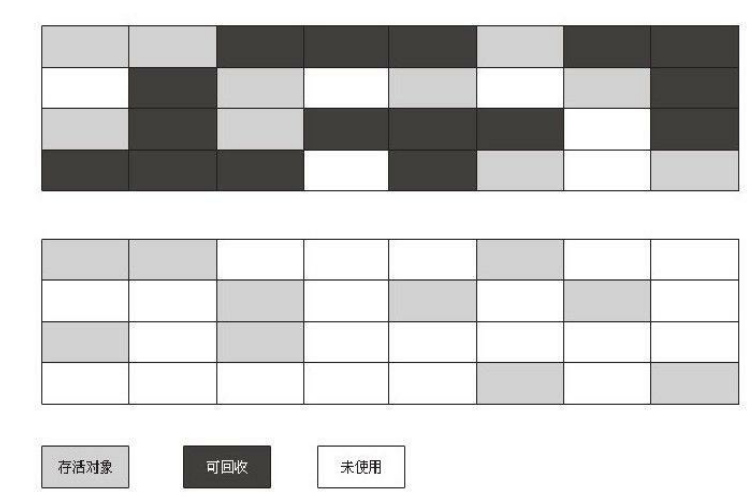
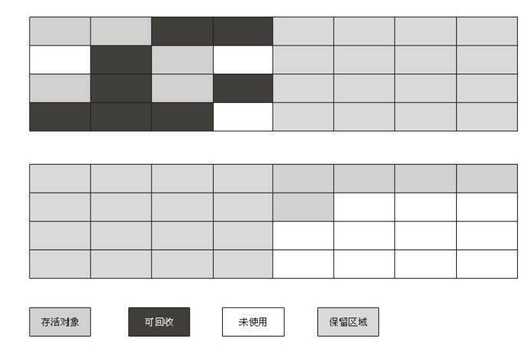
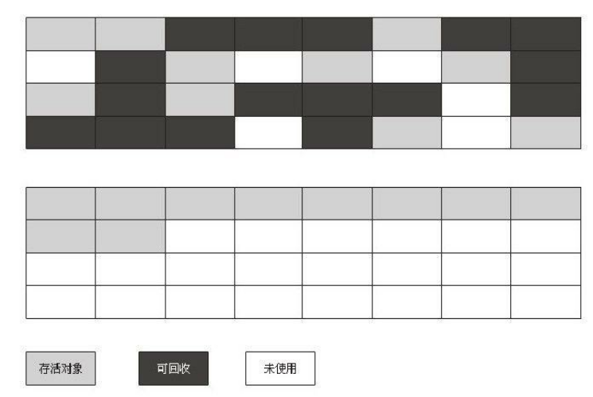

### 概述  
观察Java内存运行时区域的各个部分，其中程序计数器、Java虚拟机栈、本地方法栈3个区域随线程而生，随线程而灭；栈中的栈帧随着方法的进入和退出而有条不紊地执行着出栈和入栈操作。**每一个栈帧中分配多少内存基本上是在类结构确定下来时就已知的，因此这几个区域的内存分配和回收都具备确定性，在这几个区域内就不需要过多考虑回收的问题，因为方法结束或者线程结束时，内存自然就跟随着回收了。**然而，堆和方法区中的内存清理工作就没那么容易了。 堆和方法区所有线程共享，并且都在JVM启动时创建，一直得运行到JVM停止时。因此它们没办法根据线程的创建而创建、线程的结束而释放。  
堆中存放JVM运行期间的所有对象，虽然每个对象的内存大小在加载该对象所属类的时候就确定了，但究竟创建多少个对象只有在程序运行期间才能确定。  
方法区中存放类信息、静态成员变量、常量。类的加载是在程序运行过程中，当需要创建这个类的对象时才会加载这个类。因此，JVM究竟要加载多少个类也需要在程序运行期间确定。  
这部分内存的分配和回收都是动态的，垃圾收集器所关注的是这部分内存，本文后续讨论中的“内存”分配与回收也**仅指Java堆和方法区的内存**。  

### 对象已死吗？  
在堆里面存放着Java世界中几乎所有的对象实例，垃圾收集器在对堆进行回收前，**第一件事情就是要确定这些对象之中哪些还“存活”着，哪些已经“死去”(即不可能再被任何途径使用的对象)。**  
下面介绍两种判断对象是否存活的算法：  

#### 引用计数算法  
给每个对象添加一个引用计数器，每当有一个地方引用它时，计数器值就加1；当引用失效时，计数器值就减1；任何时刻计数器为0的对象就是不可能再被使用的。  
但主流的Java虚拟机里面没有选用引用计数算法来管理内存，因为这种算法存在一个缺陷，**即它无法解决对象之间相互循环引用的问题：**  
举个简单的例子，对象objA和objB都有字段
instance，赋值令objA.instance = objB 及 objB.instance = objA，除此之外，这两个对象再无任何引用，实际上这两个对象已经不可能再被访问，但是它们因为互相引用着对方，导致它们的引用计数都不为0，于是引用计数算法无法通知GC收集器回收它们。  

#### 可达性分析算法  
在主流的商用程序语言(Java、C#、Lisp)的主流实现中，都是通过可达性分析(Reachability Analysis)来判定对象是否存活的。这个算法的基本思路就是通过**一系列的称为“GC Roots”的对象**作为起始点，从这些节点开始向下搜索，搜索所走过的路径称为引用链(Reference Chain)，当一个对象到GC Roots没有任何引用链相连(用图论的话来说,就是从GC Roots到这个对象不可达)时，则证明此对象是不可用的。  
如下图所示,对象object 5、object 6、object 7虽然互相有关联，但是它们到GC Roots是不可达的，所以它们将会被判定为是可回收的对象。

  

在Java语言中，可作为GC Roots的对象包括下面几种:  
1、虚拟机栈(栈帧中的本地变量表)中引用的对象。  
2、本地方法栈中JNI(即一般说的Native方法)引用的对象。  
3、方法区中类静态属性引用的对象。  
4、方法区中常量引用的对象。   

###  回收无效对象的过程  
即使在可达性分析算法中不可达的对象，也并非是“非死不可”的，这时候它们暂时处于“缓刑”阶段，要真正宣告一个对象死亡，**至少要经历两次标记过程**：如果对象在进行可达
性分析后发现没有与GC Roots相连接的引用链，那它将会被**第一次标记并且进行一次筛选**，筛选的条件是**此对象是否有必要执行finalize()方法**。当对象没有覆盖finalize()方法，或
者finalize()方法已经被虚拟机调用过，虚拟机将这两种情况都视为“没有必要执行”。  
具体步骤如下：

**1）判断该对象是否覆盖了finalize()方法**  
若已覆盖该方法，并该对象的finalize()方法还没有被执行过，那么就会将对象放入F-Queue队列中；若未覆盖该方法，则直接释放对象内存。  

**2）执行F-Queue队列中的finalize()方法**   
虚拟机会以较低的优先级执行这些finalize()方法，所谓的“执行”是指虚拟机会触发这个方法，但不会确保所有的finalize()方法都会执行结束。一个对象在finalize()方法中执行缓慢,或者发生了死循环(更极端的情况)，将很可能会导致F-Queue队列中其他对象永久处于等待，甚至导致整个内存回收系统崩溃，此时虚拟机就直接停止执行，将该对象清除。

**3）对象重生或死亡**   
finalize()方法是对象逃脱死亡命运的最后一次机会，稍后GC将对F-Queue中的对象进行第二次小规模的标记，如果对象要在finalize()中成功拯救自己——只要重新与引用链上的任何一个对象建立关联即可，譬如把自己(this关键字)赋值给某个类变量或者对象的成员变量，那在第二次标记时它将被移除出“即将回收”的集合；如果对象这时候还没有逃脱，那基本上它就真的被回收了。

**注意：强烈不建议使用finalize()函数进行任何操作！如果需要释放资源，请使用try-finally。因为finalize()不确定性大，开销大，无法保证顺利执行。**

### Java引用种类  
无论是通过引用计数算法判断对象的引用数量，还是通过可达性分析算法判断对象的引用链是否可达，判定对象是否存活都与“引用”有关。  
在JDK 1.2以前,Java中的引用的定义很传统：如果reference类型的数据中存储的数值代表的是另外一块内存的起始地址，就称这块内存代表着一个引用。这种定义很纯粹，但是太过狭隘，一个对象在这种定义下只有被引用或者没有被引用两种状态，对于如何描述一些“食之无味，弃之可惜”的对象就显得无能为力。我们希望能描述这样一类对象：当内存空间还足够时，则能保留在内存之中；如果内存空间在进行垃圾收集后还是非常紧张，则可以抛弃这些对象。很多系统的缓存功能都符合这样的应用场景。  
在JDK1.2之后，Java对引用的概念进行了扩充，将引用分为强引用(Strong Reference)、软引用(Soft Reference)、弱引用(Weak Reference)、虚引用(Phantom Reference)4种，**这4种引用强度依次逐渐减弱**。  

#### 强引用  
我们平时所使用的引用就是强引用。 A a = new A(); 也就是通过关键字new创建的对象所关联的引用就是强引用。 只要强引用存在，该对象永远也不会被回收。  

#### 软引用  
软引用是用来描述一些还有用但并非必需的对象。对于软引用关联着的对象，在系统将要发生OutOfMemeryError之前，将会把这些对象列进回收范围之中进行第二次回收。如果这次回收还没有足够的内存，才会抛出OutOfMemeryError。软引用的生命周期比强引用短一些。  

#### 弱引用  
弱引用也是用来描述非必需对象的，但是它的强度比软引用更弱一些，被弱引用关联的对象**只能生存到下一次垃圾收集发生之前**。当垃圾收集器工作时，无论当前内存是否足够，都会回收掉只被弱引用关联的对象。  

#### 虚引用   
虚引用也称为幽灵引用或者幻影引用，它是最弱的一种引用关系。一个对象是否有虚引用的存在，完全不会对其生存时间构成影响，也无法通过虚引用来取得一个对象实例。为一个对象设置虚引用关联的**唯一目的就是能在这个对象被收集器回收时收到一个系统通知**。  

### 方法区的内存回收  
很多人认为方法区(或者HotSpot虚拟机中的永久代)是没有垃圾收集的，Java虚拟机规范中确实说过可以不要求虚拟机在方法区实现垃圾收集，而且在方法区中进行垃圾收集的“性价比”一般比较低：在堆中，尤其是在新生代中，常规应用进行一次垃圾收集一般可以回收70%~95%的空间，而永久代的垃圾收集效率远低于此。  
永久代的垃圾收集主要回收两部分内容：**废弃常量和无用的类**。  
#### 如何判定废弃常量？  
清除废弃的常量和清除对象类似，只要常量池中的常量不被任何变量或对象引用，那么这些常量就会被清除掉。  

#### 如何判定废弃的类？  
清除废弃类的条件较为苛刻：  
1、该类所有的实例都已经被回收，也就是Java堆中不存在该类的任何实例。  
2、加载该类的ClassLoader已经被回收。  
3、该类对应的java.lang.Class对象没有在任何地方被引用，无法在任何地方通过反射访问该类的方法。  

### 垃圾收集算法  
现在我们知道了判定一个对象是无效对象、判定一个类是废弃类、判定一个常量是废弃常量的方法，也就是知道了垃圾收集器会清除哪些数据，那么接下来介绍如何清除这些数据。  
#### 标记-清除算法  
最基础的收集算法是“标记-清除”(Mark-Sweep)算法，如同它的名字一样，算法分为“标记”和“清除”两个阶段：**首先标记出所有需要回收的对象，在标记完成后统一回收所有被标记的对象**。  
之所以说它是最基础的收集算法，是因为后续的收集算法都是基于这种思路并对其不足进行改进而得到的。**它的主要不足有两个：一个是效率问题，标记和清除两个过程的效率都不高；另一个是空间问题，标记清除之后会产生大量不连续的内存碎片，空间碎片太多可能会导致以后在程序运行过程中需要分配较大对象时，无法找到足够的连续内存而不得不提前触发另一次垃圾收集动作。**标记—清除算法的执行过程如下图所示：
    

#### 复制算法  
为了解决效率问题，一种称为“复制”(Copying)的收集算法出现了，它将可用内存按容量划分为**大小相等的两块，每次只使用其中的一块**。当这一块的内存用完了，就将还存活着的对象复制到另外一块上面，然后再把已使用过的内存空间一次清理掉。这样使得每次都是对整个半区进行内存回收，内存分配时也就不用考虑内存碎片等复杂情况，只要移动堆顶指针，按顺序分配内存即可，实现简单，运行高效。**这种算法避免了碎片空间，但内存被缩小了一半。 而且每次都需要将有用的数据全部复制到另一片内存上去，效率不高。**复制算法的执行过程如下图所示：  
      
**注意：**在复制的时候会将存活对象复制到**一片连续的空间上**，因为复制算法的内存分配是通过“指针碰撞”方式实现的。  

##### 解决空间利用率问题  
现在的商业虚拟机都采用这种收集算法来回收**新生代**。在新生代中，由于大量的对象都是“朝生夕死”，也就是一次垃圾收集后只有少量对象存活，所以并不需要按照1:1的比例来划分内存空间，我们将**新生代内存**划分成三块：Eden、Survior1、Survior2，内存大小分别是8:1:1，每次分配内存时，只使用Eden和其中一块Survivor。比如先使用Eden+Survior1，当发现Eden+Survior1的内存即将满时，JVM会发起一次Minor GC，清除掉废弃的对象，并将所有存活下来的对象复制到另一块Survior2中。那么，接下来就使用Survior2+Eden进行内存分配。也就是每次新生代中可用内存空间为整个新生代容量的90%(80%+10%)，只有10%的内存会被“浪费”。  
通过这种方式，只需要浪费10%的内存空间即可实现带有压缩功能的垃圾收集方法，避免了内存碎片的问题。  
但是，当一个对象要申请内存空间时，发现Eden+Survior中剩下的空间无法放置该对象，此时需要进行Minor GC，如果MinorGC过后空闲出来的内存空间仍然无法放置该对象，那么此时就需要将对象转移到老年代中，这种方式叫做“分配担保”。  

##### 什么是分配担保？  
当JVM准备为一个对象分配内存空间时，发现此时Eden+Survior中空闲的区域无法装下该对象，那么就会触发Minor GC，对该区域的废弃对象进行回收。但如果Minor GC过后只有少量对象被回收，仍然无法装下新对象，那么此时需要将Eden+Survior中的所有对象都转移到老年代中，然后再将新对象存入Eden区。这个过程就是“分配担保”。  

#### 标记-整理算法  
标记-整理算法是一种**老年代**的垃圾收集算法。老年代中的对象一般寿命比较长，因此每次垃圾回收会有大量对象存活，因此如果选用“复制”算法，每次需要复制大量存活的对象，会导致效率很低。而且，在新生代中使用“复制”算法，当Eden+Survior中都装不下某个对象时，可以使用老年代的内存进行“分配担保”，而如果在老年代使用该算法，那么在老年代中如果出现Eden+Survior装不下某个对象时，没有其他区域给他作分配担保。因此，老年代中一般使用“标记-整理”算法。  
根据老年代的特点，有人提出了另外一种“标记-整理”(Mark-Compact)算法，标记过程仍然与“标记-清除”算法一样，但后续步骤不是直接对可回收对象进行清理，而是让所有存活的对象都向一端移动，然后直接清理掉端边界以外的内存，“标记-整理”算法的示意图如下图所示：   
      

#### 分代收集算法  
当前商业虚拟机的垃圾收集都采用“分代收集”(Generational Collection)算法，这种算法并不是一种具体的方法，而是一种思想，即根据对象存活周期的不同将内存划分为几块。一般是把Java堆分为新生代和老年代，这样就可以根据各个年代的特点采用最适当的收集算法。**在新生代中，每次垃圾收集时都发现有大批对象死去，只有少量存活，那就选用复制算法，只需要付出少量存活对象的复制成本就可以完成收集。而老年代中因为对象存活率高、没有额外空间对它进行分配担保，就必须使用“标记—清理”或者“标记—整理”算法来进行回收。**  

### 内存分配与回收策略  
#### 对象优先在Eden分配  
目前主流的垃圾收集器都会采用分代回收算法，因此需要将堆内存分为新生代和老年代。  
在新生代中为了防止内存碎片问题，因此垃圾收集器一般都选用“复制”算法。因此，堆内存的新生代被进一步分为：Eden区＋Survior1区＋Survior2区。  
每次创建对象时，首先会在Eden区中分配。若Eden区已满，则在Survior1区中分配。若Eden区＋Survior1区剩余内存太少，导致对象无法放入该区域时，则会触发Minor GC，对该区域的废弃对象进行回收。但如果Minor GC过后只有少量对象被回收，仍然无法装下新对象，就会启用“分配担保”，将当前Eden区＋Survior1区中的对象转移到老年代中，然后再将新对象存入Eden区。  
**新生代GC(Minor GC)：**指发生在新生代的垃圾收集动作，因为Java对象大多都具备朝生夕灭的特性，所以Minor GC非常频繁,一般回收速度也比较快。  
**Minor GC触发条件：**当Eden区满时，触发Minor GC。  
**老年代GC(Major GC/Full GC)：**指发生在老年代的GC，出现了Major GC，经常会伴随至少一次的Minor GC(但非绝对的，在Parallel Scavenge收集器的收集策略里就有直接进行Major GC的策略选择过程)。Major GC的速度一般会比Minor GC慢10倍以上。  
**Full GC触发条件：**  
1）调用System.gc()时，系统**建议执行Full GC，但是不必然执行**   
2）老年代空间不足  
3）方法区空间不足  
4）通过Minor GC后进入老年代的平均大小大于老年代的可用内存  
5）由Eden区、Survivor1区向Survivor2区复制时，对象大小大于Survivor2可用内存，则把该对象转存到老年代，且老年代的可用内存小于该对象大小  

#### 大对象直接进入老年代    
所谓的大对象是指,需要大量连续内存空间的Java对象,最典型的大对象就是那种很长字符串以及数组。  
当发现一个大对象在Eden区＋Survior1区中存不下的时候就需要分配担保机制把当前Eden区＋Survior1区的所有对象都复制到老年代中去。 我们知道，一个大对象能够存入Eden区＋Survior1区的概率比较小，发生分配担保的概率比较大，而分配担保需要涉及到大量的复制，就会造成效率低下。 因此，对于大对象我们直接把他放到老年代中去，从而就能避免大量的复制操作。 那么，什么样的对象才是“大对象”呢？  
**通过-XX:PretrnureSizeThreshold参数设置大对象**  
该参数用于设置大小超过该参数的对象被认为是“大对象”，直接进入老年代。    
**注意：**该参数只对Serial和ParNew收集器有效。  

#### 生命周期较长的对象进入老年代  
老年代用于存储生命周期较长的对象，那么我们如何判断一个对象的年龄呢？  
新生代中的每个对象都有一个年龄计数器，当新生代发生一次Minor GC后，存活下来的对象的年龄就加一，当年龄超过一定值时，就将超过该值的所有对象转移到老年代中去。  
**使用-XXMaxTenuringThreshold设置新生代的最大年龄**  
设置该参数后，只要超过该参数的新生代对象都会被转移到老年代中去。  

#### 动态对象年龄判定
如果当前新生代的Survior中，**年龄相同的对象的内存空间总和超过了Survior内存空间的一半，那么所有年龄相同的对象和超过该年龄的对象都被转移到老年代中去**。无需等到对象的年龄超过MaxTenuringThreshold才被转移到老年代中去。  

#### “分配担保”策略详解  
当垃圾收集器准备要在新生代发起一次Minor GC时，首先会检查**老年代中最大的连续空闲区域的大小是否大于新生代中所有对象的大小**，也就是老年代中目前能够将新生代中所有对象全部装下。  
若老年代能够装下新生代中所有的对象，那么此时进行Minor GC没有任何风险，然后就进行Minor GC。  
若老年代无法装下新生代中所有的对象，那么此时进行Minor GC是有风险的，垃圾收集器会进行一次预测：根据以往MinorGC过后存活对象的平均数来预测这次MinorGC后存活对象的平均数。  
如果以往存活对象的平均数小于当前老年代最大的连续空闲空间，那么就进行MinorGC，虽然此次MinorGC是有风险的。  
如果以往存活对象的平均数大于当前老年代最大的连续空闲空间，那么就对老年代进行一次Full GC，通过清除老年代中废弃数据来扩大老年代空闲空间，以便给新生代作担保。  
这个过程就是**分配担保**。

