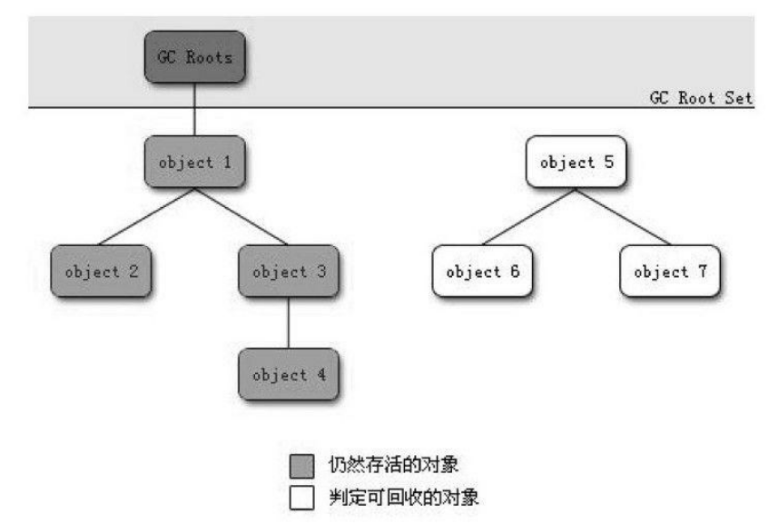

### 概述  
观察Java内存运行时区域的各个部分，其中程序计数器、Java虚拟机栈、本地方法栈3个区域随线程而生，随线程而灭；栈中的栈帧随着方法的进入和退出而有条不紊地执行着出栈和入栈操作。**每一个栈帧中分配多少内存基本上是在类结构确定下来时就已知的，因此这几个区域的内存分配和回收都具备确定性，在这几个区域内就不需要过多考虑回收的问题，因为方法结束或者线程结束时，内存自然就跟随着回收了。**然而，堆和方法区中的内存清理工作就没那么容易了。 堆和方法区所有线程共享，并且都在JVM启动时创建，一直得运行到JVM停止时。因此它们没办法根据线程的创建而创建、线程的结束而释放。  
堆中存放JVM运行期间的所有对象，虽然每个对象的内存大小在加载该对象所属类的时候就确定了，但究竟创建多少个对象只有在程序运行期间才能确定。  
方法区中存放类信息、静态成员变量、常量。类的加载是在程序运行过程中，当需要创建这个类的对象时才会加载这个类。因此，JVM究竟要加载多少个类也需要在程序运行期间确定。  
这部分内存的分配和回收都是动态的，垃圾收集器所关注的是这部分内存，本文后续讨论中的“内存”分配与回收也**仅指Java堆和方法区的内存**。  

### 对象已死吗？  
在堆里面存放着Java世界中几乎所有的对象实例，垃圾收集器在对堆进行回收前，**第一件事情就是要确定这些对象之中哪些还“存活”着，哪些已经“死去”(即不可能再被任何途径使用的对象)。**  
下面介绍两种判断对象是否存活的算法：  

#### 引用计数算法  
给每个对象添加一个引用计数器，每当有一个地方引用它时，计数器值就加1；当引用失效时，计数器值就减1；任何时刻计数器为0的对象就是不可能再被使用的。  
但主流的Java虚拟机里面没有选用引用计数算法来管理内存，因为这种算法存在一个缺陷，**即它无法解决对象之间相互循环引用的问题：**  
举个简单的例子，对象objA和objB都有字段
instance，赋值令objA.instance = objB 及 objB.instance = objA，除此之外，这两个对象再无任何引用，实际上这两个对象已经不可能再被访问，但是它们因为互相引用着对方，导致它们的引用计数都不为0，于是引用计数算法无法通知GC收集器回收它们。  

#### 可达性分析算法  
在主流的商用程序语言(Java、C#、Lisp)的主流实现中，都是通过可达性分析(Reachability Analysis)来判定对象是否存活的。这个算法的基本思路就是通过**一系列的称为“GC Roots”的对象**作为起始点，从这些节点开始向下搜索，搜索所走过的路径称为引用链(Reference Chain)，当一个对象到GC Roots没有任何引用链相连(用图论的话来说,就是从GC Roots到这个对象不可达)时，则证明此对象是不可用的。  
如下图所示,对象object 5、object 6、object 7虽然互相有关联，但是它们到GC Roots是不可达的，所以它们将会被判定为是可回收的对象。

  

在Java语言中，可作为GC Roots的对象包括下面几种:  
1、虚拟机栈(栈帧中的本地变量表)中引用的对象。  
2、本地方法栈中JNI(即一般说的Native方法)引用的对象。  
3、方法区中类静态属性引用的对象。  
4、方法区中常量引用的对象。   

###  回收无效对象的过程  
即使在可达性分析算法中不可达的对象，也并非是“非死不可”的，这时候它们暂时处于“缓刑”阶段，要真正宣告一个对象死亡，**至少要经历两次标记过程**：如果对象在进行可达
性分析后发现没有与GC Roots相连接的引用链，那它将会被**第一次标记并且进行一次筛选**，筛选的条件是**此对象是否有必要执行finalize()方法**。当对象没有覆盖finalize()方法，或
者finalize()方法已经被虚拟机调用过，虚拟机将这两种情况都视为“没有必要执行”。  
具体步骤如下：

**1）判断该对象是否覆盖了finalize()方法**  
若已覆盖该方法，并该对象的finalize()方法还没有被执行过，那么就会将对象放入F-Queue队列中；若未覆盖该方法，则直接释放对象内存。  

**2）执行F-Queue队列中的finalize()方法**   
虚拟机会以较低的优先级执行这些finalize()方法，所谓的“执行”是指虚拟机会触发这个方法，但不会确保所有的finalize()方法都会执行结束。一个对象在finalize()方法中执行缓慢,或者发生了死循环(更极端的情况)，将很可能会导致F-Queue队列中其他对象永久处于等待，甚至导致整个内存回收系统崩溃，此时虚拟机就直接停止执行，将该对象清除。

**3）对象重生或死亡**   
finalize()方法是对象逃脱死亡命运的最后一次机会，稍后GC将对F-Queue中的对象进行第二次小规模的标记，如果对象要在finalize()中成功拯救自己——只要重新与引用链上的任何一个对象建立关联即可，譬如把自己(this关键字)赋值给某个类变量或者对象的成员变量，那在第二次标记时它将被移除出“即将回收”的集合；如果对象这时候还没有逃脱，那基本上它就真的被回收了。

**注意：强烈不建议使用finalize()函数进行任何操作！如果需要释放资源，请使用try-finally。因为finalize()不确定性大，开销大，无法保证顺利执行。**

### Java引用种类  
无论是通过引用计数算法判断对象的引用数量，还是通过可达性分析算法判断对象的引用链是否可达，判定对象是否存活都与“引用”有关。  
在JDK 1.2以前,Java中的引用的定义很传统：如果reference类型的数据中存储的数值代表的是另外一块内存的起始地址，就称这块内存代表着一个引用。这种定义很纯粹，但是太过狭隘，一个对象在这种定义下只有被引用或者没有被引用两种状态，对于如何描述一些“食之无味，弃之可惜”的对象就显得无能为力。我们希望能描述这样一类对象：当内存空间还足够时，则能保留在内存之中；如果内存空间在进行垃圾收集后还是非常紧张，则可以抛弃这些对象。很多系统的缓存功能都符合这样的应用场景。  
在JDK1.2之后，Java对引用的概念进行了扩充，将引用分为强引用(Strong Reference)、软引用(Soft Reference)、弱引用(Weak Reference)、虚引用(Phantom Reference)4种，**这4种引用强度依次逐渐减弱**。  

#### 强引用  
我们平时所使用的引用就是强引用。 A a = new A(); 也就是通过关键字new创建的对象所关联的引用就是强引用。 只要强引用存在，该对象永远也不会被回收。  

#### 软引用  
软引用是用来描述一些还有用但并非必需的对象。对于软引用关联着的对象，在系统将要发生OutOfMemeryError之前，将会把这些对象列进回收范围之中进行第二次回收。如果这次回收还没有足够的内存，才会抛出OutOfMemeryError。软引用的生命周期比强引用短一些。  

#### 弱引用  
弱引用也是用来描述非必需对象的，但是它的强度比软引用更弱一些，被弱引用关联的对象**只能生存到下一次垃圾收集发生之前**。当垃圾收集器工作时，无论当前内存是否足够，都会回收掉只被弱引用关联的对象。  

#### 虚引用  
虚引用也称为幽灵引用或者幻影引用，它是最弱的一种引用关系。一个对象是否有虚引用的存在，完全不会对其生存时间构成影响，也无法通过虚引用来取得一个对象实例。为一个对象设置虚引用关联的**唯一目的就是能在这个对象被收集器回收时收到一个系统通知**。  

### 方法区的内存回收  
很多人认为方法区(或者HotSpot虚拟机中的永久代)是没有垃圾收集的，Java虚拟机规范中确实说过可以不要求虚拟机在方法区实现垃圾收集，而且在方法区中进行垃圾收集的“性价比”一般比较低：在堆中，尤其是在新生代中，常规应用进行一次垃圾收集一般可以回收70%~95%的空间，而永久代的垃圾收集效率远低于此。  
永久代的垃圾收集主要回收两部分内容：**废弃常量和无用的类**。  
#### 如何判定废弃常量？  
清除废弃的常量和清除对象类似，只要常量池中的常量不被任何变量或对象引用，那么这些常量就会被清除掉。  

#### 如何判定废弃的类？  
清除废弃类的条件较为苛刻：  
1、该类所有的实例都已经被回收，也就是Java堆中不存在该类的任何实例。  
2、加载该类的ClassLoader已经被回收。  
3、该类对应的java.lang.Class对象没有在任何地方被引用，无法在任何地方通过反射访问该类的方法。
