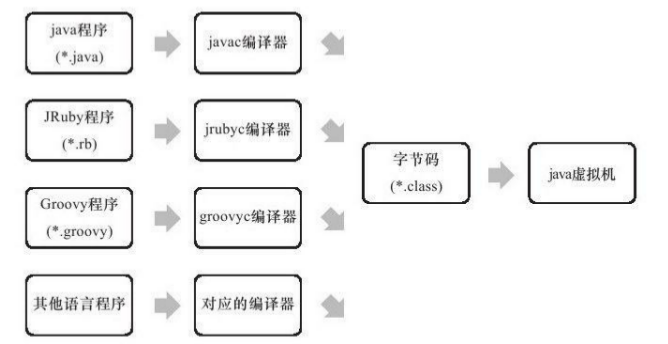
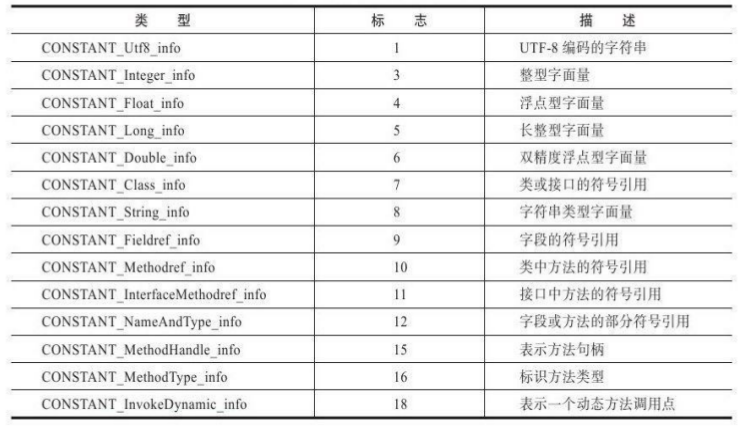
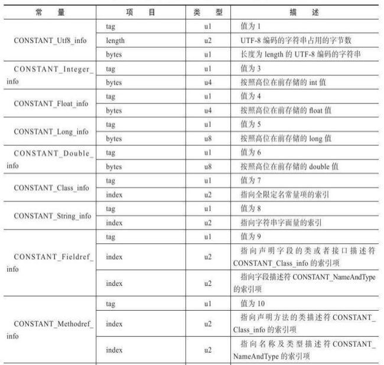
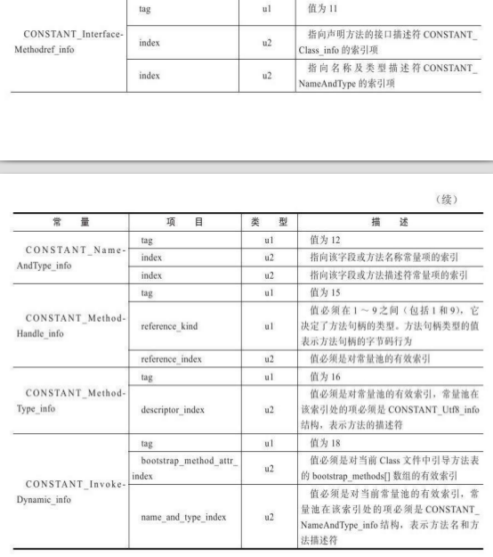
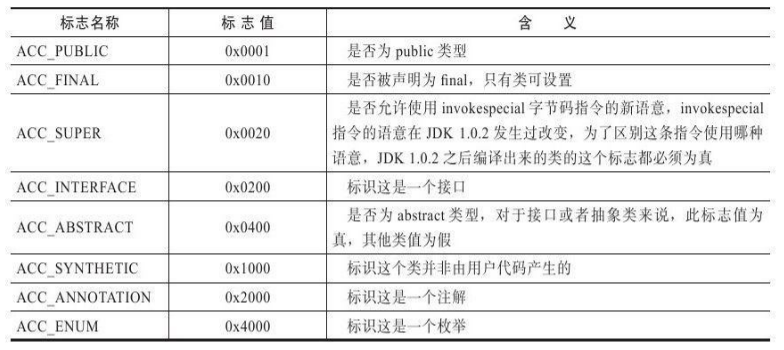
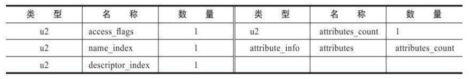
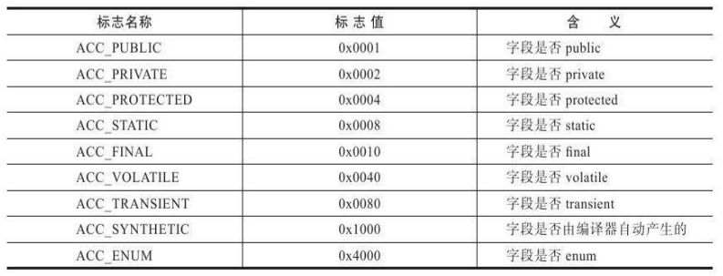
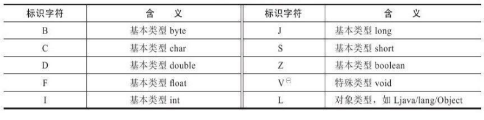
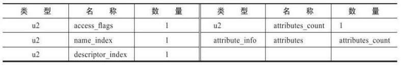
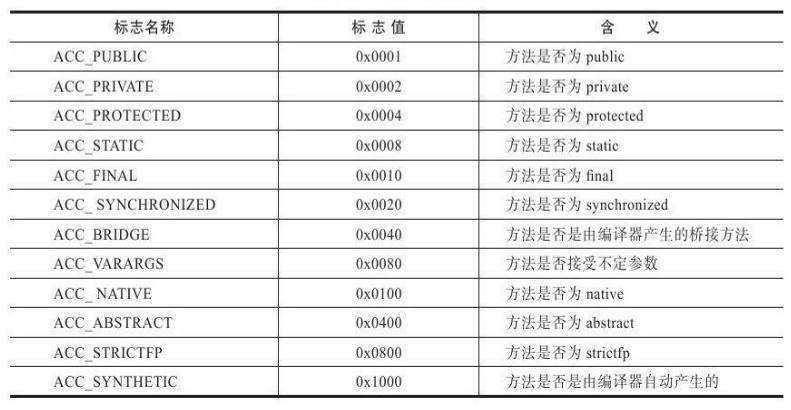

### 什么是JVM的“无关性”？  
Java具有**平台无关性**，也就是任何操作系统都能运行Java代码。之所以能实现这一点，是因为Java运行在Java虚拟机之上，不同的操作系统都拥有各自的Java虚拟机，这些虚拟机都可以载入和执行同一种平台无关的字节码(ByteCode)，因此Java能实现“一次编写，处处运行”。  
而JVM不仅具有平台无关性，还具有**语言无关性**。平台无关性是指任何操作系统都能运行Java代码，而语言无关性是指Java虚拟机能运行除Java以外的代码！  
实现语言无关性的基础仍然是虚拟机和字节码存储格式。Java虚拟机不和包括Java在内的任何语言绑定，它只与“Class文件”这种特定的二进制文件格式所关联，Class文件中包含了Java虚拟机指令集和符号表以及若干其他辅助信息。基于安全方面的考虑，Java虚拟机规范要求在Class文件中使用许多强制性的语法和结构化约束，但任一门功能性语言都可以表示为一个能被Java虚拟机所接受的有效的Class文件。作为一个通用的、机器无关的执行平台，任何其他语言的实现者都可以将Java虚拟机作为语言的产品交付媒介。  
**简而言之，JVM只认识class文件，它并不管何种语言生成了class文件，只要class文件符合JVM的规范就能运行。**因此目前已经有Clojure、Groovy、JRuby、Jython、Scala等语言能够在JVM上运行。它们有各自的语法规则，不过它们的编译器都能将各自的源码编译成符合JVM规范的class文件，从而能够借助JVM运行它们。  
  

### 纵观Class文件结构  
class文件是二进制文件，它的内容具有严格的规范，文件中没有任何空格，全是连续的0和1。class文件中的所有内容被分为两种类型：**无符号数**和**表**。  
**无符号数：**它表示class文件中的值，**这些值没有任何类型，但有不同的长度**。根据这些值长度的不同分为：u1、u2、u4、u8，分别代表1字节的无符号数、2字节的无符号数、4字节的无符号数、8字节的无符号数。无符号数可以用来描述数字、索引引用、数量值或者按照UTF-8编码构成字符串值。  
**表：**表是由**多个无符号数或者其他表**作为数据项构成的**复合数据类型**，所有表都习惯性地以`_info`结尾。表用于描述有层次关系的复合结构的数据，整个Class文件本质上就是一张表。

### class文件的组织结构  
1、魔数  
2、本文件的版本信息  
3、常量池  
4、访问标志  
5、类索引  
6、父类索引  
7、接口索引集合  
8、字段表集合  
9、方法表集合  

#### 魔数  
每个Class文件的头4个字节称为魔数(Magic Number),它的唯一作用是**确定这个文件是否为一个能被虚拟机接受的Class文件**。  
魔数的作用就相当于文件扩展名，使用魔数而不是扩展名来进行识别主要是基于安全方面的考虑，因为文件扩展名可以随意地改动，不安全，因此在class文件中标示文件类型比较合适。  
class文件的魔数是16进制的 0xCAFEBABE (咖啡宝贝)，非常具有浪漫主义色彩。  

#### 版本信息  
紧接着魔数的4个字节是版本号。它表示该class中使用的是哪个版本的JDK。  
在高版本的JVM上能够运行低版本的class文件，但在低版本的JVM上无法运行高版本的class文件，即使该class文件中没有用到任何高版本JDK的特性也无法运行！  

#### 常量池  
##### 什么是常量池？  
紧接着版本号之后的就是常量池。常量池中存放两种类型的常量。    
**字面量：**字面量比较接近于Java语言层面的常量概念，如文本字符串、声明为final的常量值等。  
**符号引用：**符号引用是我们定义的各种名字，包括了下面三类常量：  
1、类和接口的全限定名(Fully Qualified Name)  
2、字段的名称和描述符(Descriptor)  
3、方法的名称和描述符

##### 常量池的特点  
* **常量池长度不固定：**常量池的大小是不固定的，因此常量池开头放置一个u2类型的无符号数，用来存储当前常量池的容量。JVM根据这个值就知道常量池的头尾。注：这个值是从1开始的，若为5表示池中有4个常量。  
* **常量池中的常量用表来表示：**常量池开头有个常量池容量计数器，接下来就全是一个个常量了，**只不过常量都是由一张张二维表构成，除了记录常量的值以外，还记录当前常量的相关信息**。  
* **常量池是class文件的资源仓库**  
* **常量池是与该class中其它部分关联最多的部分**  
* **常量池是class文件中空间占用最大的部分之一**  

##### 常量池中常量的类型   
常量池中的常量大体上分为：**字面量** 和 **符号引用**。在此基础上，根据常量的数据类型不同，又可以被细分为14种常量类型。这14种常量类型都有各自的二维表示结构。每种常量类型的头1个字节都是tag，用于表示当前常量属于14种类型中的哪一个。  
     
   
 

#### 访问标志  
在常量池之后是2字节的访问标志。访问标志是用来表示这个class文件是类还是接口、是否被public修饰、是否被abstract修饰、是否被final修饰等。由于这些标志都由是/否表示，因此可以用0/1表示。访问标志为2字节，可以表示16位标志，但JVM目前只定义了8种，未定义的直接写0。  
   

#### 类索引、父类索引、接口索引集合  
类索引、父类索引、接口索引集合是用来表示当前class文件所表示类的名字、父类名字、接口的名字。它们按照顺序依次排列，类索引和父类索引各自使用一个u2类型的无符号常量，这个常量指向CONSTANT_Class_info类型的常量，该常量的bytes字段记录了本类、父类的全限定名。由于一个类的接口可能有好多个，因此需要用一个集合来表示接口索引，它在类索引和父类索引之后。这个集合开头入口的第一项是一个u2类型的数据，即接口计数器(interfaces_count)，表示索引表的容量。如果该类没有实现任何接口，则该计数器值为0,后面接口的索引表不再占用任何字节。否则，接下来就是接口的名字索引。  

#### 字段表的集合  
##### 什么是字段表集合？  
字段表(field_info)用于描述接口或者类中声明的变量。字段(field)包括类级变量以及实例级变量，但不包括在方法内部声明的局部变量。我们可以想一想在Java中描述一个字段可以包含什么信息？可以包括的信息有：字段的作用域(public、private、protected修饰符)、是实例变量还是类变量(static修饰符)、可变性(final)、并发可见性(volatile修饰符，是否强制从主内存读写)、可否被序列化(transient修饰符)、字段数据类型(基本类型、对象、数组)、字段名称。上述这些信息中,各个修饰符都是布尔值,要么有某个修饰符，要么没有，很适合使用标志位来表示。而字段叫什么名字、字段被定义为什么数据类
型，这些都是无法固定的，只能引用常量池中的常量来描述。 
##### 字段表结构的定义  
    
* access_flags：字段的访问标志。在Java中，每个成员变量都有一系列的修饰符，和上述class文件的访问标志的作用一样，只不过成员变量的访问标志与类的访问标志稍有区别。  
* name_index：本字段名字的索引。指向一个CONSTANT_Class_info类型的常量，这里面存储了本字段的名字等信息。  
* descriptor_index：描述符。用于描述本字段在Java中的数据类型等信息（下面详细介绍）。  
* attributes_count：属性表集合的长度。  
* attributes：属性表集合。到descriptor_index为止是字段表的固定信息，光有上述信息可能无法完整地描述一个字段，因此用属性表集合来存放额外的信息，比如一个字段的值（下面会详细介绍）。  
    
很明显,在实际情况中,ACC_PUBLIC、ACC_PRIVATE、ACC_PROTECTED三个标志最多只能选择其一，ACC_FINAL、ACC_VOLATILE不能同时选择。接口之中的字段必须有ACC_PUBLIC、ACC_STATIC、ACC_FINAL标志，这些都是由Java本身的语言规则所决定的。
##### 什么是描述符？  
成员变量（包括静态成员变量和实例变量）和 方法都有各自的描述符。 对于字段而言，描述符用于描述字段的数据类型； 对于方法而言，描述符用于描述字段的数据类型、参数列表、返回值。  
在描述符中，基本数据类型用大写字母表示，对象类型用“L对象类型的全限定名”表示。  
对于数组类型，每一维度将使用一个前置的“[”字符来描述，如一个定义为“java.lang.String[][]”类型的二维数组，将被记录为:“[[Ljava/lang/String”，一个整型数组“int[]”将被记录为“[I”。  
用描述符来描述方法时，按照先参数列表，后返回值的顺序描述，参数列表按照参数的严格顺序放在一组小括号“()”之内。如方法void inc()的描述符为“()V”，方法java.lang.String toString()的描述符为“()Ljava/lang/String”，方法int
indexOf(char[]source，int sourceOffset，int sourceCount，char[]target，int targetOffset，int targetCount，int fromIndex)的描述符为“([CII[CIII)I”。  
    
##### 字段表集合的注意点  
1、一个class文件的字段表集合中不能出现从父类/接口继承而来字段  
2、一个class文件的字段表集合中可能会出现没有人为定义的字段。如编译器会自动地在内部类的class文件的字段表集合中添加外部类对象的成员变量，供内部类访问外部类。  
3、Java中只要两个字段名字相同就无法通过编译。但在JVM规范中，允许两个字段的名字相同但描述符不同的情况，并且认为它们是两个不同的字段。

#### 方法表集合    
##### 什么是方法表集合？
Class文件存储格式中对方法的描述与对字段的描述几乎采用了完全一致的方式，方法表的结构如同字段表一样，依次包括了访问标志(access_flags)、名称索引(name_index)、描述符索引(descriptor_index)、属性表集合(attributes)等。  
    
因为volatile关键字和transient关键字不能修饰方法，所以方法表的访问标志中没有了ACC_VOLATILE标志和ACC_TRANSIENT标志。与之相对的，synchronized、native、strictfp和abstract关键字可以修饰方法，所以方法表的访问标志中增加了ACC_SYNCHRONIZED、ACC_NATIVE、ACC_STRICTFP和ACC_ABSTRACT标志。  
      
##### 方法表集合的注意点  
1、如果本class没有重写父类的方法，那么本class文件的方法表集合中是不会出现父类/父接口的方法表  
2、本class的方法表集合可能出现没有人为定义的方法 编译器在编译时会在class文件的方法表集合中加入类构造器`<Clinit>`和实例构造器`<init>`。  
3、重载一个方法需要有相同的简单名称和不同的特征签名。JVM的特征签名和Java的特征签名有所不同：  
Java特征签名：方法参数在常量池中的字段符号引用的集合  
JVM特征签名：方法参数 + 返回值。 

