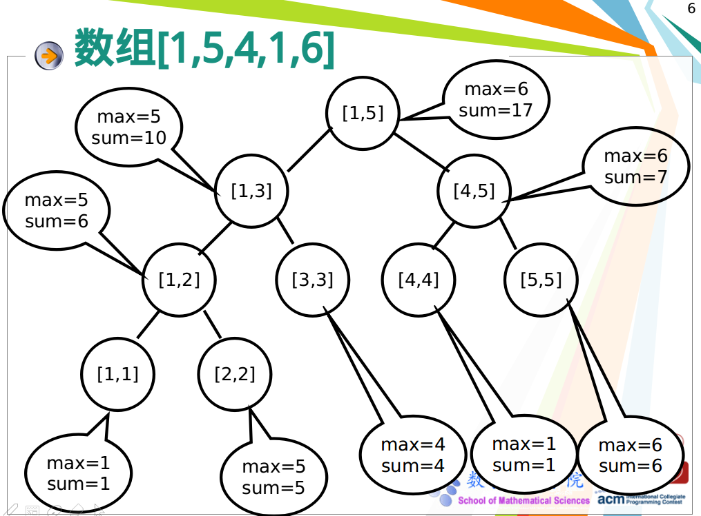

最近重温了一下线段树，发现暑假学得太囫囵吞枣，某些细节没有真正理解，学算法还是要脚踏实地啊(日常鸡汤)！下面来总结一下线段树。  
### 线段树是什么？有什么用？  
线段树类似区间树，它在各个节点保存一条线段(数组中的一段子数组)，主要用于高效解决连续区间的动态查询问题，由于二叉结构的特性，它基本能保持每个操作的复杂度为O(logn)。  
你可能会问：查询区间和可以用O(n)的复杂度预处理一个前缀和数组，然后就可以O(1)地查询某段区间和;查询区间最值，也就是RMQ问题，也可以用O(nlogn)的复杂度预处理ST表，然后O(1)地查询区间最值。那么为什么要使用线段树呢？  
线段树的精髓就在于它能在支持**区间动态修改**的前提下保持每个操作O(logn)的复杂度，这是其他两者做不到的。  
线段树能进行的操作主要有：1)单点更新，区间查询  2)区间更新，区间查询 3)区间更新，单点查询  
除了上述操作，线段树还可以解决区间染色和矩形面积交、面积并等问题。  
### 线段树基本知识  
线段树的结构：
  

建立一个线段树的示意图(可以维护区间和或最值)：  
  

单点修改后重新调整线段树：  
  

区间查询区间最值：  
  

线段树的结点关系:  
  

### 线段树的代码实现  
下面给出建立线段树和进行各种操作的模板，关键点在代码的注释中有解释：  
```cpp
/*node：区间结点号	begin：该node的区间左边界	end：该node的区间右边界		
  left：查询区间的左边界	right：查询区间的右边界		pos：查询区间的点*/ 
  
/*线段树:求和或最值 
单点更新,区间查询
区间更新,单点查询(lazy标记表示本节点的信息已经根据标记更新过了，但是本节点的子节点仍需要进行更新。lazy初始为0,区间加上k给该区间管理的结点的lazy加k,push_down给子节点加(end-begin+1)*k)
区间更新,区间查询 
lson 2*node
rson 2*node+1
[begin,end]
[begin,mid] [mid+1,end] 其中mid为(begin+end)/2 */ 

#define lson (node<<1)
#define rson ((node<<1)|1)
#define mid ((begin+end)>>1) 
int segTree[maxn*4];
int lazy[maxn*4];

void pushUp(int node){//pushUp自底向上更新区间和与最值 
	segTree[node]=segTree[lson]+segTree[rson];//segTree[node]=max(segTree[lson],segTree[rson]) 
}

void pushDown(int node,int begin,int end){//pushDown自顶向下更新lazy数组和给结点加上lazy数组的值 
	if(!lazy[node]) return;//lazy[node]为0直接return 
	segTree[lson]+=(mid-begin+1)*lazy[node];
	segTree[rson]+=(end-mid)*lazy[node]; 
	lazy[lson]+=lazy[node]; 
	lazy[rson]+=lazy[node];//给左右孩子传递lazy,是+=不是=，因为孩子节点可能被多次延迟标记又没有向下传递 
	lazy[node]=0;//把父节点的lazy置为0 
}
void build(int node,int begin,int end){//建树 
	lazy[node]=0;
	if(begin==end){//begin==end表示管理的是结点 
		scanf("%d",&segTree[node]);//按照顺序输入结点，由于建树类似于树的先根遍历，所以建立的线段树的叶子结点从左到右的值就是输入的顺序 
		//segTree[node]=a[begin] 用于任意顺序输入,先将输入存入a数组,下标从1开始，begin = end = index 
		return;//输入完成后要return，否则会继续访问左右孩子，可能越界
	}
	build(lson,begin,mid);
	build(rson,mid+1,end);
	pushUp(node);
}

void update(int node,int begin,int end,int pos,int k){//单点更新 
	if(pos<begin||pos>end) return;//管理的区间不包含pos,直接return 
	if(begin==end){
		segTree[node]+=k;
		return;
	} 
	update(lson,begin,mid,pos,k);
	update(rson,mid+1,end,pos,k);
	pushUp(node);
} 

int query(int node,int begin,int end,int left,int right){//区间查询 
	if(left>end||right<begin) return 0;//查询结点和区间没有公共点 
	if(left<=begin&&right>=end) return segTree[node];//查询区间包含查询结点 
	pushDown(node,begin,end);
	int sum=0;//int maxx=-1
	sum+=query(lson,begin,mid,left,right);//maxx=max(maxx,query(lson,begin,mid,left,right))
	sum+=query(rson,mid+1,end,left,right);//maxx=max(maxx,query(rson,mid+1,end,left,right))
	return sum;
}

void update(int node,int begin,int end,int left,int right,int k){//区间更新 
	if(left>end||right<begin) return;//结点和更新区间没有公共点 
	if(left<=begin&&right>=end){//更新区间包含结点 
		segTree[node]+=(end-begin+1)*k;
		lazy[node]+=k;
		return;
	}
	pushDown(node,begin,end);
	update(lson,begin,mid,left,right,k);
	update(rson,mid+1,end,left,right,k);
	pushUp(node);
}
```
### 例题  
#### 一、单点更新，区间查询  

HDU1166 敌兵布阵  
题目链接:<http://acm.split.hdu.edu.cn/showproblem.php?pid=1166>    
代码：  
```cpp
#include<bits/stdc++.h>
#define maxn 50005
#define lson (node<<1)
#define rson ((node<<1)|1)
#define mid ((begin+end)>>1)
using namespace std;
int segTree[maxn*4];
int T,N,a,b;
char command[10];
void pushUp(int node){
	segTree[node]=segTree[lson]+segTree[rson];
}
void build(int node,int begin,int end){
	if(begin==end){
		scanf("%d",&segTree[node]);
		return;
	}
	build(lson,begin,mid);
	build(rson,mid+1,end);
	pushUp(node);
}

void update(int node,int begin,int end,int pos,int k){
	if(pos<begin||pos>end) return;
	if(begin==end){
		segTree[node]+=k;
		return;
	}
	update(lson,begin,mid,pos,k);
	update(rson,mid+1,end,pos,k);
	pushUp(node);
}

int query(int node,int begin,int end,int left,int right){
	if(left>end||right<begin) return 0;
	if(left<=begin&&right>=end) return segTree[node];
        int sum=0;
	sum+=query(lson,begin,mid,left,right);
	sum+=query(rson,mid+1,end,left,right);
	return sum;
}

int main(){
	scanf("%d",&T);
	int cas=1;
	while(T--){
		scanf("%d",&N);
		build(1,1,N);
		printf("Case %d:\n",cas++);
		while(scanf("%s",command)!=EOF){
			if(command[0]=='E') break;
			scanf("%d%d",&a,&b);
			if(command[0]=='Q')
			cout<<query(1,1,N,a,b)<<endl;
			else if(command[0]=='A')
			update(1,1,N,a,b);
			else if(command[0]=='S')
			update(1,1,N,a,-b);
		}
	}
}
```

HDU 1754 I Hate It  
题目链接：<http://acm.split.hdu.edu.cn/showproblem.php?pid=1754>  
代码:  
```cpp
#include<bits/stdc++.h>
#define maxn 200005
#define lson (node<<1)
#define rson ((node<<1)|1)
#define mid ((begin+end)>>1)
using namespace std;
int segTree[4*maxn];
int N,M,A,B;
char C[3];

void pushUp(int node){
	segTree[node]=max(segTree[lson],segTree[rson]);
}

void build(int node,int begin,int end){
	if(begin==end){
		scanf("%d",&segTree[node]);
		return;
	}
	build(lson,begin,mid);
	build(rson,mid+1,end);
	pushUp(node);
}

void update(int node,int begin,int end,int pos,int k){
	if(pos<begin||pos>end) return;
	if(begin==end){
		segTree[node]=k;//直接修改
		return;
	}
	update(lson,begin,mid,pos,k);
	update(rson,mid+1,end,pos,k);
	pushUp(node);
}

int query(int node,int begin,int end,int left,int right){
	if(left>end||right<begin) return 0;
	if(left<=begin&&right>=end) return segTree[node];
	int maxx=0;
	maxx=max(maxx,query(lson,begin,mid,left,right));
	maxx=max(maxx,query(rson,mid+1,end,left,right));
	return maxx;
}
int main(){
	while(scanf("%d%d",&N,&M)!=EOF){
		 build(1,1,N);
		 while(M--){
	        scanf("%s%d%d",C,&A,&B);
			if(C[0]=='Q'){
				printf("%d\n",query(1,1,N,A,B));
			}
			else{
				update(1,1,N,A,B);
			}
		 }
	}

}

```
### 二、区间更新，区间查询  
POJ 3468 A Simple Problem with Integers   
题目链接:<http://poj.org/problem?id=3468>  
代码：  
```cpp
#include<cstdio>
#define maxn 100005
#define lson (node<<1)
#define rson ((node<<1)|1)
#define mid ((begin+end)>>1)
using namespace std;
typedef long long ll;
ll segTree[4*maxn];
ll lazy[4*maxn];
ll N,Q,A,B,C;
char command[3];
void pushUp(ll node){
	segTree[node]=segTree[lson]+segTree[rson];
}

void pushDown(ll node,ll begin,ll end){
	if(!lazy[node]) return;
	segTree[lson]+=(mid-begin+1)*lazy[node];
	segTree[rson]+=(end-mid)*lazy[node];
	lazy[lson]+=lazy[node];
	lazy[rson]+=lazy[node];
	lazy[node]=0;
}

void build(ll node,ll begin,ll end){
	lazy[node]=0;
	if(begin==end){
		scanf("%lld",&segTree[node]);
		return;
	}
	build(lson,begin,mid);
	build(rson,mid+1,end);
	pushUp(node);	
}

ll query(ll node,ll begin,ll end,ll left,ll right){
	if(left>end||right<begin) return 0;
	if(left<=begin&&right>=end) return segTree[node];
	pushDown(node,begin,end);
	ll sum=0;
	sum+=query(lson,begin,mid,left,right);
	sum+=query(rson,mid+1,end,left,right);
	return sum;
}

void update(ll node,ll begin,ll end,ll left,ll right,ll k){
	if(left>end||right<begin) return;
	if(left<=begin&&right>=end){
		segTree[node]+=(end-begin+1)*k;
		lazy[node]+=k;
		return;
	}
	pushDown(node,begin,end);
	update(lson,begin,mid,left,right,k);
	update(rson,mid+1,end,left,right,k);
	pushUp(node);
}

int main(){
	scanf("%lld%lld",&N,&Q);
	build(1,1,N);
	while(Q--){
		scanf("%s",command);
		if(command[0]=='Q'){
			scanf("%lld%lld",&A,&B);
			printf("%lld\n",query(1,1,N,A,B));
		}
		else{
			scanf("%lld%lld%lld",&A,&B,&C);
			update(1,1,N,A,B,C);
		}
	}
} 
```

HDU 1698 Just A Hook  
题目链接：<http://acm.split.hdu.edu.cn/showproblem.php?pid=1698>  
代码：  
```cpp
#include<bits/stdc++.h>
#define maxn 100005
#define lson (node<<1)
#define rson ((node<<1)|1)
#define mid ((begin+end)>>1)
using namespace std;
int segTree[4*maxn];
int lazy[4*maxn];
int T,N,Q,X,Y,Z;
void pushUp(int node){
	segTree[node]=segTree[lson]+segTree[rson];
}

void build(int node,int begin,int end){
	lazy[node]=0;
	if(begin==end){
		segTree[node]=1;
		return;
	}
	build(lson,begin,mid);
	build(rson,mid+1,end);
	pushUp(node);
}

void pushDown(int node,int begin,int end){
	if(!lazy[node]) return;
	segTree[lson]=(mid-begin+1)*lazy[node];//+=改成=,直接更新到底部
	segTree[rson]=(end-mid)*lazy[node];
	lazy[lson]=lazy[node];
	lazy[rson]=lazy[node];
	lazy[node]=0;
}

void update(int node,int begin,int end,int left,int right,int k){
	if(left>end||right<begin) return;
	if(left<=begin&&right>=end){
		segTree[node]=(end-begin+1)*k;//+=改成=,直接更新到底部
		lazy[node]=k;//+=改成=,因为此时lazy即使没有下传也不叠加
		return;
	}
	pushDown(node,begin,end);
	update(lson,begin,mid,left,right,k);
	update(rson,mid+1,end,left,right,k);
	pushUp(node);
}

int query(int node,int begin,int end,int left,int right){
	if(left>end||right<begin) return 0;
	if(left<=begin&&right>=end) return segTree[node];
	pushDown(node,begin,end);
	int sum=0;
	sum+=query(lson,begin,mid,left,right);
	sum+=query(rson,mid+1,end,left,right);
	return sum;
}
int main(){
	scanf("%d",&T);
	int cas=1;
	while(T--){
		scanf("%d%d",&N,&Q);
		build(1,1,N);
		while(Q--){
			scanf("%d%d%d",&X,&Y,&Z);
			update(1,1,N,X,Y,Z);
		}
		printf("Case %d: The total value of the hook is %d.\n",cas++,query(1,1,N,1,N));
	}
}
```

### 三、区间染色问题  
ZOJ 1610 Count the Colors  
题目链接:<https://vjudge.net/problem/11553/origin>  
代码：
```cpp
#include<bits/stdc++.h>
#define lson (node<<1)
#define rson ((node<<1)|1)
#define mid ((begin+end)>>1)
#define maxn 8005
using namespace std;
int col[maxn*4];//col[node]表示node管辖的区间的颜色 
int sum[maxn];//表示某点的颜色 
int res[maxn];

void pushDown(int node){
	col[lson]=col[rson]=col[node];
	col[node]=-1;
}

void update(int node,int begin,int end,int left,int right,int k){
	if(left>end||right<begin) return;
	if(left<=begin&&right>=end){
		col[node]=k;
		return;
	}
	if(col[node]!=-1) pushDown(node);
	update(lson,begin,mid,left,right,k);
	update(rson,mid+1,end,left,right,k);
}
//不用建树,直接在query里存储颜色即可，因为染色不用求区间和或者最值 
void query(int node,int begin,int end,int left,int right){
	if(begin==end){
		sum[begin]=col[node];//存储每个点的颜色 
		return;
	}
	if (col[node] != -1) pushDown(node);
    query(lson,begin,mid,left,right);
    query(rson,mid+1,end,left,right);
}
int main(){
	int n,x1,x2,c;
	while(scanf("%d",&n)!=EOF){
		memset(col,-1,sizeof(col));
		memset(sum,-1,sizeof(sum));
		memset(res,0,sizeof(res));
		for(int i=0;i<n;i++){
			scanf("%d%d%d",&x1,&x2,&c);
			if(x1==x2) continue;//为了保证R-1>=L 
			update(1,0,maxn-1,x1,x2-1,c);//为防止重叠,更新区间[L,R-1]
		/*注意begin=0 end=maxn-1 而不是begin=1 end=n 因为只是涂n次,不一定在1-n范围内涂 */	 
		}
		query(1,0,maxn-1,0,maxn-1);
		for(int i=0; i<maxn; i++) {
            while(i!=0&&sum[i]!=-1&&sum[i]==sum[i-1])//涂过同一颜色也加1 
            i++;
            res[sum[i]]++;
        }
        for(int i=0; i<maxn; i++)
		if(res[i])
			printf("%d %d\n",i,res[i]);
        printf("\n");
	}
	return 0;
} 
```

POJ 2528 Mayor's posters  
题目链接:<http://poj.org/problem?id=2528>  
代码:  
```cpp
/*解法：离散化，如下面的例子（题目的样例），因为单位1是一个单位长度，将下面的
      1   2   3   4  6   7   8   10
      —   —   —   —  —   —   —   —
      1   2   3   4  5   6   7   8
离散化  X[1] = 1; X[2] = 2; X[3] = 3; X[4] = 4; X[5] = 6; X[7] = 8; X[8] = 10
于是将一个很大的区间映射到一个较小的区间之中了，然后再对每一张海报依次更新在宽度为1~8的墙上(用线段树），最后统计不同颜色的段数。
但是只是这样简单的离散化是错误的，
如三张海报为：1~10 1~4 6~10
离散化时 X[ 1 ] = 1, X[ 2 ] = 4, X[ 3 ] = 6, X[ 4 ] = 10
第一张海报时：墙的1~4被染为1；
第二张海报时：墙的1~2被染为2，3~4仍为1；
第三张海报时：墙的3~4被染为3，1~2仍为2。
最终，第一张海报就显示被完全覆盖了，于是输出2，但实际上明显不是这样，正确输出为3。
新的离散方法为：在相差大于1的数间加一个数，例如在上面1 4 6 10中间加5（算法中实际上1，4之间，6，10之间都新增了数的）
X[ 1 ] = 1, X[ 2 ] = 4, X[ 3 ] = 5, X[ 4 ] = 6， X[ 5 ] = 10
这样之后，第一次是1~5被染成1；第二次1~2被染成2；第三次4~5被染成3
最终，1~2为2，3为1，4~5为3，于是输出正确结果3。*/ 
#include<cstdio> 
#include<cstring>
#include<algorithm>
#define lson (node<<1)
#define rson ((node<<1)|1)
#define mid ((begin+end)>>1)
using namespace std;

#define maxn 10005
//不用建树,直接在query里记录hash即可，因为染色不用求区间和或者最值，也不用pushUp 
int m, li[maxn], ri[maxn];
int poster[maxn<<3], col[maxn<<4], ans; //col记录当前该位置最上面一层的海报种类,即染色问题的颜色 
//poster记录海报位置 
bool hash[maxn];//hash用于标记某种种类的海报是否计算过,若已计算过标记为true,不再重复计算 

void pushDown(int node) {
     col[lson] = col[rson] = col[node];//类似lazy标记，向下传递后清空
     col[node] = -1;
}

void update(int node,int begin, int end,int left, int right, int k) {
	if(left>end||right<begin) return;
    if (begin >= left && end <= right) {
         col[node] = k;
         return;
     }
    if(col[node] != -1) pushDown(node);
    update(lson,begin,mid,left,right,k);
    update(rson,mid+1,end,left,right,k);
}

void query(int node,int begin,int end) {
    if (begin == end) {
        if (!hash[col[node]]) {
        ans++;
        hash[col[node]] = true;
       }
       return;
    }
    if (col[node] != -1) pushDown(node);
    query(lson,begin,mid);
    query(rson,mid+1,end);
}

int binarySearch(int ll, int hh, int xx) {
    int mm;
    while (ll <= hh) {
        mm = (ll + hh) >> 1;
        if (poster[mm] == xx) return mm;
        else if (poster[mm] > xx)  hh = mm - 1;
        else ll = mm + 1;
    }
    return -1;
}

int main()
{
    int t, n, i;
    scanf ("%d", &t);
    while (t--) {
        memset(col, -1, sizeof (col));//-1表示没有染色
        memset (hash, false, sizeof (hash));/*因为本题墙的长度为10000000,
直接做会超时,而实际海报数量只有10000,考虑把每张海报左右两端的两段映射到小范围计算，
所以考虑离散化,但传统离散化会出错,要如果有两个位置相邻的数字数值不相邻,考虑在中间
插入一个比大的数小1的数*/
        int cnt = 0;
        scanf ("%d", &n);
        for (i = 1; i <= n; i++) {
             scanf ("%d %d", &li[i], &ri[i]);
             poster[++cnt] = li[i];
             poster[++cnt] = ri[i];
        }
        sort(poster+1, poster+cnt+1);
        m = 1;
        for (i = 2; i <= cnt; i++) {
             if (poster[i] != poster[i-1]) poster[++m] = poster[i];//去重 
        }
        for (i = m; i > 1; i--) {
            if (poster[i] - poster[i-1] > 1) poster[++m] = poster[i] - 1;//在末尾加入要增加的点 
        }
        sort(poster+1, poster+m+1);//重新排序 
        for (i = 1; i <= n; i++) {
            int l = binarySearch(1, m, li[i]);//在离散化后的poster数组里二分查找每一组的左右端点
            int r = binarySearch(1, m, ri[i]);
            update(1,1,m,l,r,i);
        }
        ans = 0;
        query(1, 1, m);
        printf("%d\n", ans);
    }
    return 0;
}
```

### 四、矩形面积交/面积并 

HDU 1542 Atlantis(矩形面积并)  
题目链接：<http://acm.split.hdu.edu.cn/showproblem.php?pid=1542>  
代码:  
```cpp
#include<bits/stdc++.h> 
#define lson (rt<<1)
#define rson ((rt<<1)|1)
#define mid ((l+r)>>1)
#define maxn 2005
using namespace std;

int n;
double y[maxn];
//沿x轴扫描,沿y轴建树,线段树的结点是纵向的线段,最下面一层结点以排序后相邻的y1,y2为边界 
struct LINE     //  存储线段信息；
{
    double x;   //  该线段的x坐标；
    double y_up,y_down;     //  竖向线段的上下端点；
    int flag;//矩形的左边界为1,右边界为-1 
}line[maxn];
struct node//线段树的结点,不再是单个点,是一个区间 
{
    double l,r;		//	区间的左右边界,即某段扫描线的上下端点 
    double x;       //  记录上一个横坐标位置，用于求面积；
    int cover;      //  记录覆盖的线段数;即同一方向的线段数;由flag累加 
    bool flag;      //  标记只有一个区间的节点,即在线段树最底层的结点,我们将一个个连续的区间离散化成一个结点；
}node[maxn<<2];
bool cmp(LINE a,LINE b)
{
    return a.x<b.x;
}
void build(int rt,int l,int r)      //  建树；
{
    node[rt].l=y[l];    //  维护区间；
    node[rt].r=y[r];
    node[rt].x=-1;
    node[rt].flag=false;
    node[rt].cover=0;
    if(l+1==r){             //  区间是连续的;
        node[rt].flag=true; //  标记为结点; 
        return;
    }
    build(lson,l,mid);
    build(rson,mid,r);   //  因为将一个个连续区间离散成点，所以此处mid不需要+1；
}
double Insert_query(int rt,double x,double l,double r,int flag) 
/*查询+更新x处（l,r）区间面积，l和r代表的是区间查询区间的边界，node[rt].l和node[rt].r代表的是结点边界*/
{
    if(l>=node[rt].r||r<=node[rt].l) return 0;  //  该方向结点不包含所要查询的区间；
    if(node[rt].flag){  //  找到只有一个区间的叶子结点；
        if(node[rt].cover>0){
            double pre=node[rt].x;
            double ans=(x-pre)*(node[rt].r-node[rt].l); //  计算面积；
            node[rt].x=x;       //  更新定位x位置，便于下次计算面积；
            node[rt].cover+=flag;   //  更新覆盖的线段数；
            return ans;
        }
		else{
            node[rt].x=x;
            node[rt].cover+=flag;
            return 0;//没有产生面积并也要return 0 
        }
    }
    double ans1,ans2;
    ans1=Insert_query(lson,x,l,r,flag);    
    ans2=Insert_query(rson,x,l,r,flag); 
    return ans1+ans2;
}
int main()
{
    int Case=0;
    double x1,x2,y1,y2;
    while(~scanf("%d",&n)&&n){
        int cnt=0;
        for(int i=0;i<n;i++){
            scanf("%lf%lf%lf%lf",&x1,&y1,&x2,&y2);
            y[cnt]=y1;
            line[cnt].x=x1;
            line[cnt].y_down=y1;
            line[cnt].y_up=y2;
            line[cnt++].flag=1;   //  表示左边线段；
            y[cnt]=y2;
            line[cnt].x=x2;
            line[cnt].y_down=y1;
            line[cnt].y_up=y2;
            line[cnt++].flag=-1;  //  表示右边线段；
        }
        sort(y,y+cnt);        //  将所有高度由小到大排序，将区间建树表示
        sort(line,line+cnt,cmp);      //  因为扫描线从左到右扫描，所以按照横坐标从小到大排序后逐一插入线段树
        build(1,0,cnt-1);
        double area=0;
        for(int i=0;i<cnt;i++){
            area+=Insert_query(1,line[i].x,line[i].y_down,line[i].y_up,line[i].flag);
        }
        printf("Test case #%d\nTotal explored area: %.2lf\n\n",++Case,area);
    }
    return 0;
}
```

HDU 1255 覆盖的面积(矩形面积交)  
题目链接:<http://acm.split.hdu.edu.cn/showproblem.php?pid=1255>  
代码:  
```cpp
#include<bits/stdc++.h>
#define lson (rt<<1)
#define rson ((rt<<1)|1)
#define mid ((l+r)>>1)
#define maxn 2005
using namespace std;
int T,N;


double y[maxn];

struct LINE{
	double x;
	double y_up,y_down;
	int flag;
}line[maxn];

struct node{
	double l,r;
	double x;
	int cover;
	bool flag;
}node[maxn<<2];


bool cmp(LINE a,LINE b){
	return a.x<b.x;
}

void build(int rt,int l,int r){
	node[rt].l=y[l];
	node[rt].r=y[r];
	node[rt].x=-1;
	node[rt].flag=false;
	node[rt].cover=0;
	if(l+1==r){
		node[rt].flag=true;
		return;
	}
	build(lson,l,mid);
	build(rson,mid,r);
}

double Insert_query(int rt,double x,double l,double r,int flag){
	if(l>=node[rt].r||r<=node[rt].l) return 0;
	if(node[rt].flag){
		if(node[rt].cover>1){
			double pre=node[rt].x;
			double ans=(x-pre)*(node[rt].r-node[rt].l);
			node[rt].x=x;
			node[rt].cover+=flag;
			return ans;
		}
		else{
			node[rt].x=x;
			node[rt].cover+=flag;
			return 0; 
		}
	}
	double ans1,ans2;
	ans1=Insert_query(lson,x,l,r,flag);
	ans2=Insert_query(rson,x,l,r,flag);
	return ans1+ans2;
}
int main(){
	scanf("%d",&T);
	while(T--){
		int cnt=0;
		scanf("%d",&N);
		while(N--){
			double x1,y1,x2,y2;
			scanf("%lf%lf%lf%lf",&x1,&y1,&x2,&y2);
			y[cnt]=y1;
			line[cnt].x=x1;
			line[cnt].y_down=y1;
			line[cnt].y_up=y2;
			line[cnt++].flag=1;
			y[cnt]=y2;
			line[cnt].x=x2;
			line[cnt].y_down=y1;
			line[cnt].y_up=y2;
			line[cnt++].flag=-1;
		}
		sort(y,y+cnt);
		sort(line,line+cnt,cmp);
		build(1,0,cnt-1);
		double area=0;
		for(int i=0;i<cnt;i++){
			area+=Insert_query(1,line[i].x,line[i].y_down,line[i].y_up,line[i].flag);
		}
		printf("%.2lf\n",area);
		
	}
}
```

